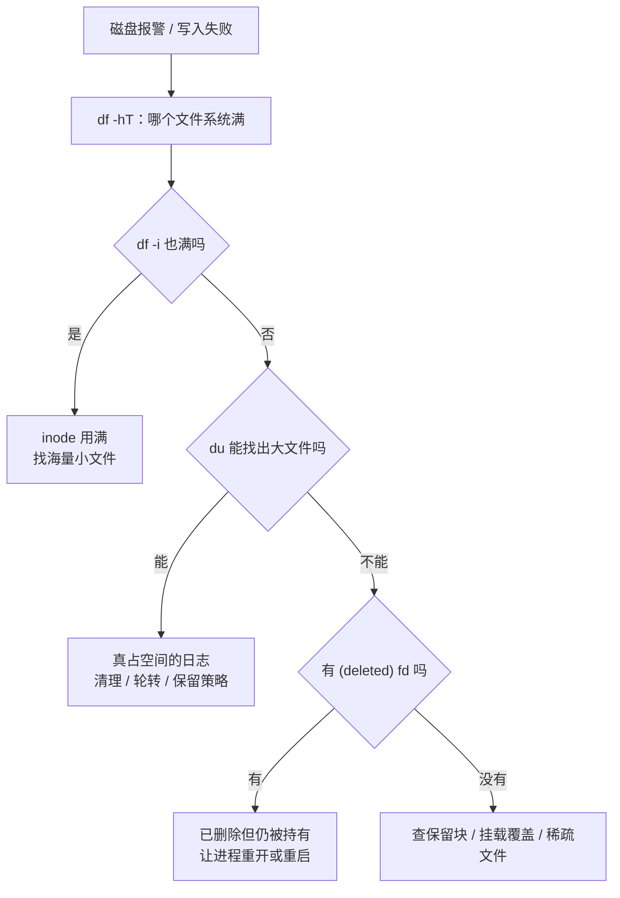

---
tags:
  - Linux
  - 可观测性
  - 日志
  - 磁盘容量
  - 故障处置
created: 2026-09-19
---

# 日志的退役：容量治理与磁盘写满

> [!cite] 参考资料
> `man 1 df`、`man 1 du`、`man 1 lsof`、`man 5 journald.conf`（`SystemMaxUse=`/`SystemKeepFree=`/`MaxRetentionSec=`）、`man 8 logrotate`、`man 8 mke2fs`（`-m` 保留块百分比）；发行版自带的 `/etc/mke2fs.conf`。
>
> 实测输出来自 Ubuntu 24.04.4（WSL2）/ systemd 255 / 非 root：容量实验在 `/tmp` 下用临时文件完成（实验后已删除），未触碰系统日志文件；`journalctl --disk-usage` 的数值在同一环境写作过程中实测为 578.0M–598.8M。

> **这篇讲什么**：日志这条线的终点——**被删掉、被回收**。重点是「磁盘被日志写满」这个最高频故障的四类原因、判断顺序，以及一套能防住它的三层保留策略。
>
> **必须先读什么**：[[Linux/09_日志与监控/06_日志的轮转_logrotate的两种切法|06 日志的轮转：logrotate 的两种切法]]（轮转是「退休流程」，本篇讲「退休之后」）。
>
> **读完能回答**：① 「日志写满」有哪四类原因，各自的判据是什么？② 为什么 `rm` 掉大文件后空间不释放，`df` 和 `du` 会差出几百 MiB？③ 三层保留策略分别是什么？④ 处置顺序为什么是「先止血、再治本、最后加防线」？
>
> 所属：[[Linux/09_日志与监控/00_导读与知识地图|09 日志、监控与可观测性]] 的「一条日志的一生」第 5 站 · 主要练 **S3 轮转配置与磁盘满处置**

## 0. 30 秒速览

> [!abstract] 这一篇只要记住六句话
> - **「日志写满」有四类原因：真文件、已删除但仍被持有、inode 用满、保留块/挂载覆盖。**
>   - 怎么验证：四条命令对应四类判据——`df -hT`、`du -xsh`、`df -i`、`lsof +L1`（判据不同，处置完全不同）。
> - **`df` 高而 `du` 找不到，就是「已删除但仍被持有」的典型判据。**
>   - 证据：本机实测 `rm` 掉一个仍被持有的 200MiB 文件后，`df` 已用从 `18682220544` 涨到 `18891939840`，而 `du -sh /tmp` 只有 48K。
> - **空间只有等持有者关闭 fd 才会释放，再删一次没有任何用。**
>   - 证据：实测关掉 fd 后 `df` 立刻回落到 `18682224640`。
> - **`/proc/<pid>/fd` 里的 `(deleted)` 就是证据。**
>   - 证据：本机实测 `l-wx------ … /proc/743/fd/4 -> /tmp/lab-held2.bin (deleted)`。
> - **保留要三层同时配，缺一层都可能被打穿。**
>   - 怎么验证：应用层（按级别输出）+ journald（`SystemMaxUse=`/`MaxRetentionSec=`）+ logrotate（`rotate`/`size`/`compress`）各写出一条实际配置。
> - **处置顺序：先止血（清最老的、让它重开）→ 再治本（改保留策略）→ 最后加防线（分盘 + 容量告警）。**
>   - 怎么验证：把处置写成「止血 / 治本 / 防线」三段，而不是一串删除命令。

## 1. 四类原因与判据

「磁盘满了」只是现象，**第一件事是分清是哪一类**——因为四类的处置方式互不通用。

| 类型 | 判据 | 处理方向 |
| --- | --- | --- |
| 真占空间的日志 | `df -hT` 高，且 `du -xsh /var/log/*` 能找出大文件 | 调保留策略/压缩/分盘；先清最老的可删数据 |
| 已删除但仍被进程持有 | `df` 高、`du` 找不到；`/proc/<pid>/fd` 或 `lsof +L1` 里有 `(deleted)` | 让持有者重开文件或重启服务（`rm` 无效） |
| inode 用满 | `df -i` 高而 `df -h` 不高 | 找海量小文件（`find` 加 `wc -l` 计数），治「谁在写」而不是删大文件 |
| 保留块 / 挂载覆盖 | `df` 与 `du` 差一个固定量级；或挂载点覆盖了目录 | 查 `mke2fs -m` 的保留块设置、`findmnt` 是否覆盖目录 |



### 1.1 「保留块」这一类为什么也要记

ext4 默认会给 root 保留 5% 的块（`mke2fs` 的 `-m` 参数）。它会造成两个看起来矛盾的现象：

```text
$ df -hT / | tail -1
/dev/sdd       ext4 1007G   18G  939G   2% /
```

1007G 的盘子，已用 18G、可用 939G，**18 + 939 = 957 G，比 1007 G 少了约 50 G（≈5%）**——这部分就是保留块。于是会出现「`df` 显示快满了，root 还能写；普通用户已经写不进去」的现象。**排障时如果 `df` 的百分比与可用空间对不上，先想想保留块。**

## 2. 实测：删了文件，空间为什么不释放

```bash
df -B1 /tmp | tail -1 | awk "{print \$3}"        # 删之前
exec 4>/tmp/lab-held2.bin
dd if=/dev/zero of=/tmp/lab-held2.bin bs=1M count=200 2>/dev/null
rm -f /tmp/lab-held2.bin
ls -l /proc/$$/fd/4 | sed "s/.*-> //"            # 验证：显示 (deleted)
df -B1 /tmp | tail -1 | awk "{print \$3}"        # 验证：空间没释放
du -sh /tmp | cut -f1                            # 验证：du 看不到
exec 4>&-; sleep 1
df -B1 /tmp | tail -1 | awk "{print \$3}"        # 验证：关闭 fd 后立刻回收
```

本机实测：

```text
$ df -B1 /tmp | tail -1 | awk "{print \$3}"
18682220544
$ ls -l /proc/743/fd/4
l-wx------ 1 realtyz realtyz 64 Sep 19 12:37 /proc/743/fd/4 -> /tmp/lab-held2.bin (deleted)
$ df -B1 /tmp | tail -1 | awk "{print \$3}"
18891939840                 # 涨了 209719296 字节 ≈ 200 MiB
$ du -sh /tmp | cut -f1
48K                         # du 完全看不到那 200MiB
$ exec 4>&-; sleep 1; df -B1 /tmp | tail -1 | awk "{print \$3}"
18682224640                 # 回到原来的水平
```

三个关键结论：

1. **`rm` 只是删掉了目录项**，inode 与数据块要等最后一个持有者关闭 fd 才回收。
2. **`du` 走目录树**，看不到「没有名字但仍然存在」的 inode；所以 `df` 与 `du` 的差值就是这类「幽灵文件」的大小。
3. **唯一有效的处置是让持有者重开或退出**：对日志而言就是 `systemctl reload/restart`（子笔记 06 的 `postrotate` 讲的就是这件事）。

> [!warning] 第一反应不要是 `rm -rf /var/log/*`
> 这有三个问题：① 正在被写的文件空间不会释放（上面实测）；② 可能删掉审计/合规要求保留的记录；③ 删完之后故障复盘没有证据。**正确顺序是：先分清四类原因 → 再动最老、最没价值的那部分 → 最后补上防线。**

## 3. 治理顺序：止血 → 治本 → 加防线

1. **止血（分钟级）**：确认不是业务数据后，清最老/最大的日志，或让它立刻轮转（`logrotate -f` 只在这一刻值得用）；对持有已删除文件的进程，用 `systemctl reload/restart` 让它重开日志——**不要直接 `kill -9` 业务进程**。
2. **治本（小时级）**：三层保留策略同时配（见下一节）；`/var/log` 与业务数据分盘或分挂载点。
3. **加防线（天级）**：日志目录容量告警；`logrotate`/`systemd-tmpfiles` 的执行结果纳入监控；定期在实验机演练一次「写满 → 定位 → 恢复」。

## 4. 三层保留策略

| 层 | 手段 | 典型配置 | 失效表现 |
| --- | --- | --- | --- |
| 应用层 | 按级别输出，生产不开 debug；高频无关日志降级 | 日志级别配置 | 一天写几百 GiB，任何保留策略都救不回来 |
| 采集层（journald） | `SystemMaxUse=`、`SystemKeepFree=`、`MaxRetentionSec=` | 显式给出容量上限与保留时间 | 默认只按「文件系统 10%、上限 4 GiB」控制，可能过大或不够 |
| 文件层（logrotate / tmpfiles） | `rotate N` + `size`/`daily` + `compress` | 份数 × 单份大小 = 该日志的真实上限 | 归档文件无限增长（尤其 `create` 未生效时，见子笔记 06） |

**三层缺一不可**：应用层管「产生速率」，采集层管「系统日志的总量」，文件层管「自建日志文件的份数与压缩」。只配其中一层，就等着从另外两层打穿。

## 5. 生产动作：日志容量与保留核查

这是一段只读核查（产出是基线卡里的「容量与保留」一节），生产机上可以做：

```bash
df -hT; df -i                                          # 验证：哪个文件系统吃紧、是空间还是 inode
du -xsh /var/log/* 2>/dev/null | sort -h | tail -10     # 验证：目录树里谁最大
find /var/log -xdev -type f -size +100M -printf "%s %p\n" | sort -n | tail
lsof +L1 2>/dev/null | head                             # 验证：已删除但仍被持有
journalctl --disk-usage                                 # 验证：journal 占了多少
systemd-analyze cat-config systemd/journald.conf | grep -E "^# /|^(SystemMaxUse|SystemKeepFree|MaxRetentionSec)"
grep -vE "^\s*(#|$)" /etc/logrotate.conf; ls /etc/logrotate.d/
```

本机实测样张：

```text
/dev/sdd ext4 1007G，已用 18G、可用 939G、2%（差额约 50G 是 ext4 保留块）
inode：67108864 总量、已用 311637（1%）
journald：合计 578.0M（写作过程中增长到 598.8M）
/var/log/syslog：640 syslog:adm，707517 字节
logrotate：`rotate 4` / `weekly` / `compress` / `delaycompress` / `sharedscripts`（rsyslog 自带规则）
```

> [!example]- 实验 4：造一次「删了不释放」并观察回收
> 目标：亲手看到 `df` 与 `du` 的差值，以及「关闭 fd」才是回收条件。
> ```bash
> df -B1 /tmp | tail -1 | awk "{print \$3}"          # 基线
> exec 4>/tmp/lab-held.bin
> dd if=/dev/zero of=/tmp/lab-held.bin bs=1M count=200 2>/dev/null
> rm -f /tmp/lab-held.bin
> ls -l /proc/$$/fd/4 | sed "s/.*-> //"              # 验证：(deleted)
> df -B1 /tmp | tail -1 | awk "{print \$3}"          # 验证：涨了约 200MiB
> du -sh /tmp | cut -f1                              # 验证：du 看不到
> exec 4>&-; sleep 1
> df -B1 /tmp | tail -1 | awk "{print \$3}"          # 验证：回收
> ```
> **预期**：`df` 的已用量在 `rm` 后上升约 200MiB（本机实测 `18682220544 → 18891939840`），`du -sh /tmp` 只显示几十 KB，关闭 fd 后 `df` 回落（实测 `18682224640`）。
> **风险**：低（在 `/tmp` 下用临时文件，200MiB 的量级不会影响生产；但在磁盘已经紧张的机器上要换小文件）。
> **回滚**：`exec 4>&-` 关闭 fd，`rm -f` 清理文件；本实验没有残留。
> **耗时**：10 分钟。
>
> 环境：Ubuntu 24.04.4（WSL2）/ 非 root。**生产机上只做只读部分（`df`/`du`/`lsof`），破坏性步骤只在实验机做。**

## 常见坑

| 常见做法或说法 | 后果或事实 |
| --- | --- |
| 「`rm` 掉大日志就有空间了」 | 进程还持有 fd 时空间不释放（实测 `df` 差 200MiB、`du` 只有 48K），必须让它重开或重启 |
| 「`du` 找不到大文件，所以没满」 | `du` 看不到已删除但仍被持有的 inode；`df` 与 `du` 的差值就是线索 |
| 「`df -h` 没满就不用管 inode」 | inode 用满时 `df -h` 可能仍有余量，但已无法创建新文件；必须看 `df -i` |
| 「`df` 显示 100% 但 root 还能写」 | ext4 默认保留 5% 给 root（本机实测 1007G 的盘差约 50G），普通用户先用完 |
| 「只配 logrotate 就够了」 | 应用层不控量、journald 不设上限，仍然会被打穿 |
| 「删之前先清干净再说」 | 删掉最近一段就丢掉了复盘证据；删之前要保留「最近一段 + 最大贡献者」 |
| 「分盘太麻烦，先把日志塞在根分区」 | 日志写满根分区会让整机故障（journald、sshd、审计都写不进去），代价远高于分区 |

## 决策练习

**场景**：早上告警「根分区使用率 96%」。你登录后发现：`du -xsh /var/log/*` 加起来只有 2G，`find /var/log -size +100M` 什么都没有，`df -h` 显示 `/` 用了 190G（共 200G）。服务仍能正常响应。

**A. 直接 `systemctl restart` 所有可疑服务，把文件释放掉**
**B. `lsof +L1`（或遍历 `/proc/*/fd`）找出持有已删除文件的进程，结合影响面再决定是 `reload` 还是 `restart`**
**C. 把 `/var/log` 清空，反正 `du` 说它只占 2G**

**为什么选 B**：`du` 找不到、`df` 却高了 188G，这正是「已删除但仍被持有」的典型图形（本机实测的 200MiB 版本放大了 1000 倍）。先找到持有者——**它通常是某个还在写日志的服务**——再根据业务影响面选择最小代价的重开方式（`reload` 优于 `restart`）。

**为什么不选 A**：一次性重启所有可疑服务是「用大面积停机换一个可以定向解决的问题」；而且重启的瞬间你会丢掉现场（进程的 fd 列表、连接状态）。

**为什么不选 C**：`du` 已经告诉你 `/var/log` 只占 2G，清空它既释放不了 188G，又会丢掉排查线索，还可能违反保留要求。

## 要点自测

> [!question]- 「磁盘被日志写满」的四类原因和判据分别是什么？
> - **真占空间**：`df` 高且 `du` 能找到大文件 → 治理保留策略。
> - **已删除但仍被持有**：`df` 高、`du` 找不到，`/proc/<pid>/fd` 或 `lsof +L1` 有 `(deleted)` → 让进程重开/重启。
> - **inode 用满**：`df -i` 高而 `df -h` 不高 → 找海量小文件，治「谁在写」。
> - **保留块/挂载覆盖**：`df` 与 `du` 差固定量级（本机实测 1007G 的盘约 50G）→ 查 `mke2fs -m` 与 `findmnt`。
> - **第一反应不要是什么**：不要不分类型就 `rm -rf /var/log/*`。

> [!question]- 为什么 `df` 和 `du` 会差出几百 MiB？
> - **`df`** 统计文件系统层面的已用块，包含「没有目录项但 inode 仍存在」的文件。
> - **`du`** 只统计目录树里**可见的文件名**，看不到已删除但被打开的文件。
> - **实测**：`rm` 掉被持有的 200MiB 文件后，`df` 多出 `209719296` 字节，而 `du -sh /tmp` 只有 48K；关闭 fd 后 `df` 立刻回落。
> - **处置**：`lsof +L1` 找持有者，用 `reload`/`restart` 让它重开文件。
> - **第一反应不要是什么**：不要继续 `rm`，也不要 `kill -9` 业务进程。

> [!question]- 三层保留策略分别是什么？为什么缺一层都不行？
> - **应用层**：按级别输出，生产不开 debug——控制**产生速率**。
> - **采集层（journald）**：`SystemMaxUse=`/`SystemKeepFree=`/`MaxRetentionSec=`——控制**系统日志总量**。
> - **文件层（logrotate/tmpfiles）**：`rotate`/`size`/`compress`——控制**自建日志文件的份数与压缩**。
> - **缺一层的结果**：应用不控量则一天写几百 GiB；journald 不设上限则默认 10%/4 GiB 可能不合预期；文件层不配则归档无限增长。
> - **第一反应不要是什么**：不要以为配了 `logrotate` 就万事大吉。

> 上一篇：[[Linux/09_日志与监控/07_日志的集中_远程syslog与采集器|07 日志的集中：远程 syslog 与采集器]] ｜ 下一篇：[[Linux/09_日志与监控/09_指标的计量_node_exporter与指标语义|09 指标的计量：exporter 与指标语义]]
