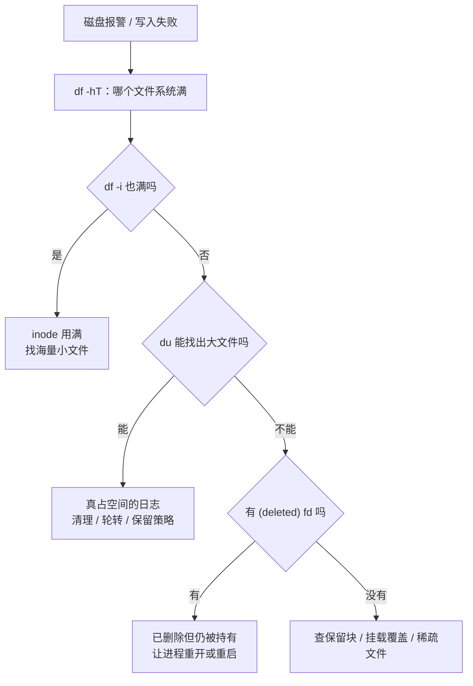

---
tags:
  - Linux
  - 可观测性
  - 日志
  - 磁盘容量
  - 故障处置
created: 2026-09-19
---

# 日志的退役：容量治理与磁盘写满

> [!cite] 参考资料
> `man 1 df`、`man 1 du`、`man 1 lsof`、`man 5 journald.conf`（`SystemMaxUse=`/`SystemKeepFree=`/`MaxRetentionSec=`）、`man 8 logrotate`、`man 8 mke2fs`（`-m` 保留块百分比）；发行版自带的 `/etc/mke2fs.conf`。
>
> **实测环境：Ubuntu 24.04.5 LTS（VMware 虚拟机）/ 内核 `6.8.0-139-generic` / systemd 255（`255.4-1ubuntu8.17`）/ root 可用。** 容量实验分三组：① 「删了不释放」与「写满」都放在**临时 loop 文件系统**里做（`truncate` 建小镜像 → `mkfs.ext4` → `mount -o loop`），**全程没有碰根分区、没有碰 `/dev/sda` 分区表**；② inode 用满用 `mkfs.ext4 -N 512` 的一个小镜像复现；③ `journalctl --vacuum-size` / `--vacuum-time` 因为是持久化 journal，**有 root 就能真做**，本次用 `--vacuum-size=15M` 与 `--vacuum-time=30min` 各做了一次。
>
> 做完的清理：镜像文件、挂载点、`/tmp/09a-*` 全部删除，`losetup -a | grep 09a` 无输出，`findmnt | grep 09a` 无输出，根分区使用率回到 20%。`/var/log` 下没有留下实验文件。**唯一的不可逆影响是那次 journal vacuum 删掉的旧 journal 归档（下面第 6 节如实列出）。**

> **这篇讲什么**：日志这条线的终点——**被删掉、被回收**。重点是「磁盘被日志写满」这个最高频故障的四类原因、判断顺序，以及一套能防住它的三层保留策略。
>
> **必须先读什么**：[[Linux/09_日志与监控/06_日志的轮转_logrotate的两种切法|06 日志的轮转：logrotate 的两种切法]]（轮转是「退休流程」，本篇讲「退休之后」）。
>
> **读完能回答**：① 「日志写满」有哪四类原因，各自的判据是什么？② 为什么 `rm` 掉大文件后空间不释放，`df` 和 `du` 会差出 10 MiB？③ 三层保留策略分别是什么？④ 处置顺序为什么是「先止血、再治本、最后加防线」？
>
> 所属：[[Linux/09_日志与监控/00_导读与知识地图|09 日志、监控与可观测性]] 的「一条日志的一生」第 5 站 · 主要练 **S3 轮转配置与磁盘满处置**

## 0. 30 秒速览

> [!abstract] 这一篇只要记住六句话
> - **「日志写满」有四类原因：真文件、已删除但仍被持有、inode 用满、保留块/挂载覆盖。**
>   - 怎么验证：四条命令对应四类判据——`df -hT`、`du -xsh`、`df -i`、`lsof +L1`（判据不同，处置完全不同）。本机把**四类里的三类都复现了一遍**（真文件、已删除仍被持有、inode 用满）。
> - **`df` 高而 `du` 找不到，就是「已删除但仍被持有」的典型判据。**
>   - 证据：在 64MiB 的临时 loop 文件系统上实测——`rm` 掉一个仍被持有的 10MiB 文件后，`df` 已用从 `24576` 涨到 `10510336` 字节，而 `du -sh` 只看到 20K。
> - **空间只有等持有者关闭 fd 才会释放；`/proc/<pid>/fd` 里的 `(deleted)` 就是证据。**
>   - 证据：实测 `ls -l /proc/$$/fd/4` → `fd4 -> /tmp/09a-fill/mnt/held.bin (deleted)`；关掉 fd 后 `df` 立刻从 `10510336` 回落到 `24576`。**`rm` 第二次没有任何用。**
> - **inode 用满时 `df -h` 可能还很空，"满"的是另一本账。**
>   - 证据：在 `mkfs.ext4 -N 512` 的 32MiB 镜像里创建 501 个空文件后，`df -i` 变成 `512 512 0 100%`，而 `df -hT` 显示 `28M 32K 26M 1%`——空间几乎没用，却再也建不了文件。
> - **`journalctl --vacuum-size` 是 journal 的止血阀，但它删的是历史、不可恢复。**
>   - 证据：本机实测 `journalctl --disk-usage` 从 `20.7M` 经 `--vacuum-size=15M` 降到 `16.0M`（删掉一个 4.6M 的 archived 文件），`journalctl --list-boots` 的 `FIRST ENTRY` 从 `07:08:34` 退到 `07:55:24`。
> - **保留要三层同时配，缺一层都可能被打穿。**
>   - 怎么验证：应用层（按级别输出）+ journald（`SystemMaxUse=`/`MaxRetentionSec=`）+ logrotate（`rotate`/`size`/`compress`）各写出一条实际配置。

## 1. 四类原因与判据

「磁盘满了」只是现象，**第一件事是分清是哪一类**——因为四类的处置方式互不通用。

| 类型 | 判据 | 处理方向 |
| --- | --- | --- |
| 真占空间的日志 | `df -hT` 高，且 `du -xsh /var/log/*` 能找出大文件 | 调保留策略/压缩/分盘；先清最老的可删数据 |
| 已删除但仍被进程持有 | `df` 高、`du` 找不到；`/proc/<pid>/fd` 或 `lsof +L1` 里有 `(deleted)` | 让持有者重开文件或重启服务（`rm` 无效） |
| inode 用满 | `df -i` 高而 `df -h` 不高 | 找海量小文件（`find` 加 `wc -l` 计数），治「谁在写」而不是删大文件 |
| 保留块（ext4 默认 5%） | `df -h` 显示「已用 + 可用 < 总量」，非 root 写数据报 ENOSPC 而 root 能写 | 查 `tune2fs -l` 的 `Reserved block count` / `mke2fs -m`。注意它**不是** `df`/`du` 差值来源 |
| 挂载覆盖 | `df` 大、`du` 小（挂载点遮住了下层目录） | `findmnt` 看是否覆盖了目录 |



### 1.1 「保留块」这一类为什么也要记

ext4 默认会给 root 保留 5% 的块（`mke2fs` 的 `-m` 参数）。本机的根分区就是这个情况：

```text
$ df -hT / | tail -1
/dev/mapper/ubuntu--vg-ubuntu--lv ext4   47G  8.6G   36G  20% /
$ dumpe2fs -h /dev/mapper/ubuntu--vg-ubuntu--lv | grep -iE "^Block count|^Reserved block count|^Free blocks|^Block size"
Block count:              12581888
Reserved block count:     629094
Free blocks:              10504366
Block size:               4096
```

算一下：总量 `12581888 × 4096 = 48.0 GiB`（`df` 显示 `47G`），其中保留块 `629094 × 4096 = 2.4 GiB`，正好是 **5.0%**。这解释了 `df` 那一行的算术：

- `8.6G`（已用）+ `36G`（普通用户可用）= `44.6 G`，比 `47 G` 少了 **2.4 G**；
- 少的这部分就是保留块——**root 仍然能写进去，普通用户已经写不进去了**。

于是会出现「`df` 显示快满了，root 还能写；普通用户已经写不进去」的现象。**排障时如果 `df` 的百分比与可用空间对不上，先想想保留块。** 顺带一个实测推论：**写满之后，root 的空文件创建仍可能成功**（本机在写满的 loop 文件系统上 `touch` 退出码是 `0`）——但要注意**空文件本身不占数据块**，能否创建取决于「还有没有空闲 inode、目录里还放不放得下目录项」；**保留块真正保的是数据写入**：可用为 0 时，普通用户写数据报 ENOSPC，而 root 仍可占用那 5% 继续写。

## 2. 实测：删了文件，空间为什么不释放

在**临时 loop 文件系统**里做这个实验，判据和根分区完全一样，但不会让别人误以为整机磁盘满了（这也是 BASELINE 要求的做法）：

```bash
rm -rf /tmp/09a-fill; mkdir -p /tmp/09a-fill/mnt
truncate -s 64M /tmp/09a-fill/disk.img              # 用文件模拟一块"小盘"，不动根分区
mkfs.ext4 -q -F /tmp/09a-fill/disk.img
mount -o loop /tmp/09a-fill/disk.img /tmp/09a-fill/mnt
df -B1 /tmp/09a-fill/mnt | tail -1 | awk "{print \$3}"        # rm 之前
exec 4>/tmp/09a-fill/mnt/held.bin
dd if=/dev/zero of=/tmp/09a-fill/mnt/held.bin bs=1M count=10 2>/dev/null
rm -f /tmp/09a-fill/mnt/held.bin
ls -l /proc/$$/fd/4 | sed "s/.*-> /fd4 -> /"          # 验证：显示 (deleted)
df -B1 /tmp/09a-fill/mnt | tail -1 | awk "{print \$3}"        # 验证：空间没释放
du -sh /tmp/09a-fill/mnt | cut -f1                     # 验证：du 看不到
exec 4>&-; sleep 1
df -B1 /tmp/09a-fill/mnt | tail -1 | awk "{print \$3}"        # 验证：关闭 fd 后立刻回收
```

本机实测：

```text
rm 前已用字节: 24576
fd4 -> /tmp/09a-fill/mnt/held.bin (deleted)
rm 后已用字节: 10510336
du -sh 看到: 20K
关闭 fd 后已用字节: 24576
```

三个关键结论：

1. **`rm` 只是删掉了目录项**，inode 与数据块要等最后一个持有者关闭 fd 才回收。
2. **`du` 走目录树**，看不到「没有名字但仍然存在」的 inode；所以 `df` 与 `du` 的差值就是这类「幽灵文件」的大小（本机实测差 `10485760` 字节 = 10 MiB）。
3. **唯一有效的处置是让持有者重开或退出**：对日志而言就是 `systemctl reload/restart`（子笔记 06 的 `postrotate` 讲的就是这件事）。

> [!warning] 第一反应不要是 `rm -rf /var/log/*`
> 这有三个问题：① 正在被写的文件空间不会释放（上面实测）；② 可能删掉审计/合规要求保留的记录；③ 删完之后故障复盘没有证据。**正确顺序是：先分清四类原因 → 再动最老、最没价值的那部分 → 最后补上防线。**

## 3. 治理顺序：止血 → 治本 → 加防线

1. **止血（分钟级）**：确认不是业务数据后，清最老/最大的日志，或让它立刻轮转（`logrotate -f` 只在这一刻值得用）；对持有已删除文件的进程，用 `systemctl reload/restart` 让它重开日志——**不要直接 `kill -9` 业务进程**。
2. **治本（小时级）**：三层保留策略同时配（见下一节）；`/var/log` 与业务数据分盘或分挂载点。
3. **加防线（天级）**：日志目录容量告警；`logrotate`/`systemd-tmpfiles` 的执行结果纳入监控；定期在实验机演练一次「写满 → 定位 → 恢复」。

## 4. 三层保留策略

| 层 | 手段 | 典型配置 | 失效表现 |
| --- | --- | --- | --- |
| 应用层 | 按级别输出，生产不开 debug；高频无关日志降级 | 日志级别配置 | 一天写几百 GiB，任何保留策略都救不回来 |
| 采集层（journald） | `SystemMaxUse=`、`SystemKeepFree=`、`MaxRetentionSec=` | 显式给出容量上限与保留时间 | 默认只按「文件系统 10%、上限 4 GiB」控制，可能过大或不够 |
| 文件层（logrotate / tmpfiles） | `rotate N` + `size`/`daily` + `compress` | 份数 × 单份大小 = 该日志的真实上限 | 归档文件无限增长（尤其 `create` 未生效时，见子笔记 06） |

**三层缺一不可**：应用层管「产生速率」，采集层管「系统日志的总量」，文件层管「自建日志文件的份数与压缩」。只配其中一层，就等着从另外两层打穿。

## 5. 生产动作：日志容量与保留核查

这是一段只读核查（产出是基线卡里的「容量与保留」一节），生产机上可以做：

```bash
df -hT; df -i                                          # 验证：哪个文件系统吃紧、是空间还是 inode
du -xsh /var/log/* 2>/dev/null | sort -h | tail -10     # 验证：目录树里谁最大
find /var/log -xdev -type f -size +100M -printf "%s %p\n" | sort -n | tail
lsof +L1 2>/dev/null | head                             # 验证：已删除但仍被持有
journalctl --disk-usage                                 # 验证：journal 占了多少
systemd-analyze cat-config systemd/journald.conf | grep -E "^# /|^(SystemMaxUse|SystemKeepFree|MaxRetentionSec)"
grep -vE "^\s*(#|$)" /etc/logrotate.conf; ls /etc/logrotate.d/
```

本机实测样张：

```text
/dev/mapper/ubuntu--vg-ubuntu--lv ext4 47G，已用 8.6G、可用 36G、20%（差额 2.4G 是 ext4 保留块）
inode：3145728 总量、已用 159766（6%）
journald：合计 20.7M（vacuum 后 16.0M）；journal 是持久化的（/var/log/journal 存在）
/var/log/syslog：640 syslog:adm，1272007 字节；/var/log/auth.log 170756 字节
logrotate：`rotate 4` / `weekly` / `compress` / `delaycompress` / `sharedscripts`（rsyslog 自带规则）
          注意 logrotate.service 在本次开机内没有执行记录（ExecMainStartTimestamp 为空、journal 无条目）；原因是 daily timer 当天的触发点还没到，不是被 ConditionACPower 挡住的（该条件实测成立，见子笔记 06 第 1.1 节）
```

> [!example]- 实验 4：造一次「删了不释放」并观察回收
> 目标：亲手看到 `df` 与 `du` 的差值，以及「关闭 fd」才是回收条件。**在一个临时 loop 文件系统里做，不打满根分区。**
> ```bash
> rm -rf /tmp/09a-fill; mkdir -p /tmp/09a-fill/mnt
> truncate -s 64M /tmp/09a-fill/disk.img                 # 用文件模拟一块"小盘"
> mkfs.ext4 -q -F /tmp/09a-fill/disk.img
> mount -o loop /tmp/09a-fill/disk.img /tmp/09a-fill/mnt
> df -B1 /tmp/09a-fill/mnt | tail -1 | awk "{print \$3}"  # 基线
> exec 4>/tmp/09a-fill/mnt/held.bin
> dd if=/dev/zero of=/tmp/09a-fill/mnt/held.bin bs=1M count=10 2>/dev/null
> rm -f /tmp/09a-fill/mnt/held.bin
> ls -l /proc/$$/fd/4 | sed "s/.*-> /fd4 -> /"            # 验证：(deleted)
> df -B1 /tmp/09a-fill/mnt | tail -1 | awk "{print \$3}"  # 验证：涨了 10MiB
> du -sh /tmp/09a-fill/mnt | cut -f1                      # 验证：du 看不到
> exec 4>&-; sleep 1
> df -B1 /tmp/09a-fill/mnt | tail -1 | awk "{print \$3}"  # 验证：回收
> umount /tmp/09a-fill/mnt; rm -rf /tmp/09a-fill          # 清理：卸载并删镜像
> ```
> **预期**：`df` 的已用量在 `rm` 后上升 10 MiB（本机实测 `24576 → 10510336` 字节），`du -sh` 只显示 20K，关闭 fd 后 `df` 回落（实测 `24576`）。
> **风险**：低（全部发生在临时 loop 文件系统里；**根分区完全不受影响**，实测实验前后 `/` 都停在 20%）。
> **回滚**：`umount` + `rm -rf /tmp/09a-fill`；本机实测 `losetup -a | grep 09a` 无输出、`findmnt | grep 09a` 无输出。
> **耗时**：10 分钟。
>
> 环境：Ubuntu 24.04.5（VMware 虚拟机）/ 内核 6.8.0-139-generic / root 可用。**生产机上只做只读部分（`df`/`du`/`lsof`），破坏性步骤只在实验机做。**

## 6. 实验 5 / 6：写满一个文件系统，以及回收 journal

这一节的实验在本机是**真做出来的**（有 root），不是纸面推演。两个实验都遵守同一条纪律：**只打满临时 loop 文件系统，绝不打满根分区。**

> [!example]- 实验 5：把一个小文件系统写到 `No space left on device`，并复现 inode 用满
> 目标：亲眼看到「空间满」与「inode 满」这两种完全不同的满，以及内核给出的报错原文。
> ```bash
> rm -rf /tmp/09a-fill2; mkdir -p /tmp/09a-fill2/mnt
> truncate -s 32M /tmp/09a-fill2/disk.img
> mkfs.ext4 -q -F /tmp/09a-fill2/disk.img
> mount -o loop /tmp/09a-fill2/disk.img /tmp/09a-fill2/mnt
> df -hT /tmp/09a-fill2/mnt | tail -1
> dd if=/dev/zero of=/tmp/09a-fill2/mnt/fill.bin bs=1M count=100 2>&1 | grep -iE "No space|records out|copied"
> echo "dd 退出码=${PIPESTATUS[0]}"
> df -hT /tmp/09a-fill2/mnt | tail -1; df -i /tmp/09a-fill2/mnt | tail -1
> umount /tmp/09a-fill2/mnt
> truncate -s 32M /tmp/09a-fill2/inode.img
> mkfs.ext4 -q -F -N 512 /tmp/09a-fill2/inode.img        # 故意只给 512 个 inode
> mount -o loop /tmp/09a-fill2/inode.img /tmp/09a-fill2/mnt
> df -i /tmp/09a-fill2/mnt | tail -1
> i=0; while [ $i -lt 700 ]; do : > /tmp/09a-fill2/mnt/f$i 2>/dev/null || break; i=$((i+1)); done
> echo "创建了 $i 个空文件后失败"
> df -i /tmp/09a-fill2/mnt | tail -1; df -hT /tmp/09a-fill2/mnt | tail -1
> umount /tmp/09a-fill2/mnt; rm -rf /tmp/09a-fill2       # 清理
> ```
> 本机实测输出：
> ```text
> --- 空间满 ---
> /dev/loop0     ext4   26M   24K   24M   1% /tmp/09a-fill2/mnt
> dd: error writing '/tmp/09a-fill2/mnt/fill.bin': No space left on device
> 25+0 records out
> 26542080 bytes (27 MB, 25 MiB) copied, 0.0301838 s, 879 MB/s
> dd 退出码=1
> /dev/loop0     ext4   26M   26M     0 100% /tmp/09a-fill2/mnt
> /dev/loop0        8192    12  8180    1% /tmp/09a-fill2/mnt
> --- inode 满 ---
> /dev/loop0         512    11   501    3% /tmp/09a-fill2/mnt
> 创建了 501 个空文件后失败
> /dev/loop0         512   512     0  100% /tmp/09a-fill2/mnt
> /dev/loop0     ext4   28M   32K   26M   1% /tmp/09a-fill2/mnt
> --- 清理核对 ---
> (无残留 loop)
> ls: cannot access '/tmp/09a-fill2': No such file or directory
> (镜像已删)
> /dev/mapper/ubuntu--vg-ubuntu--lv ext4   47G  8.8G   36G  20% /
> ```
> 两个对照非常干净：
> - **空间满**：`df -hT` 显示 `26M / 已用 26M / 可用 0 / 100%`，内核原文是 `dd: error writing '…': No space left on device`，`dd` 退出码 `1`；而 `df -i` 只用了 12 个 inode——**空间账空了，inode 账还很空**。
> - **inode 满**：创建 501 个空文件后 `df -i` 变成 `512 512 0 100%`，而 `df -hT` 显示 `28M 32K 26M 1%`——**28M 的盘只用了 32K，却再也建不了文件**。这就是「`df -h` 没满不代表没满」的直接证据。
>
> **风险**：低（只影响临时 loop 文件系统；本机实测根分区实验前后都是 20%）。
> **回滚**：`umount` + `rm -rf /tmp/09a-fill2`；实测无残留 loop 设备。
> **耗时**：15 分钟。

> [!example]- 实验 6：用 `journalctl --vacuum-*` 回收持久化 journal（有 root 才能做）
> 目标：看到 journal 的容量确实可以被显式回收、以及**代价是历史日志被删掉**。
> ```bash
> journalctl --disk-usage                                     # 验证：先记录现状
> journalctl --list-boots | tail -2                           # 验证：当前最老的 boot / 最早一条
> journalctl --vacuum-size=15M                                # 验证：按容量回收（只作用于 archived 文件）
> journalctl --disk-usage
> journalctl --vacuum-time=30min                              # 验证：按时间回收
> journalctl --disk-usage
> journalctl --list-boots | tail -2                           # 验证：最早一条是否被推后
> ```
> 本机实测：
> ```text
> === journal 现状 ===
> Archived and active journals take up 20.7M in the file system.
>   0 decad510b934454f9d61aef2aa2893fd Sat 2026-09-19 07:08:34 UTC Sat 2026-09-19 08:08:26 UTC
> === vacuum-size=15M ===
> Vacuuming done, freed 0B of archived journals from /run/log/journal.
> Deleted archived journal /var/log/journal/bd821ce75df94970ad5b6d63b6a8f812/system@4b208d899f2b4c13b57929c865de75d5-00000000000028ab-00065bd0af63ef5f.journal (4.6M).
> Vacuuming done, freed 4.6M of archived journals from /var/log/journal/bd821ce75df94970ad5b6d63b6a8f812.
> Archived and active journals take up 16.0M in the file system.
> === vacuum-time=30min ===
> Vacuuming done, freed 0B of archived journals from /var/log/journal.
> Archived and active journals take up 16.0M in the file system.
>   0 decad510b934454f9d61aef2aa2893fd Sat 2026-09-19 07:55:24 UTC Sat 2026-09-19 08:08:26 UTC
> ```
> 四个必须读出来的点：
> 1. **它确实有效**：`20.7M → 16.0M`，日志里点名删掉了一个 4.6M 的 `system@…journal` 文件。
> 2. **它只回收 `ARCHIVED` 文件**：`--vacuum-size` 的输出里专门写了 `from /run/log/journal` 是 `0B`、正式目录才是 `4.6M`；当前正在写的那个 active 文件不参与。所以把 `SystemMaxUse` 设得再小，也不会立刻缩到那个值。
> 3. **它会真的删历史**：`--list-boots` 的 `FIRST ENTRY` 从 `07:08:34` 被推到 `07:55:24`——**这 47 分钟的日志永久消失，无法恢复**。第二句 `--vacuum-time=30min` 之所以 `freed 0B`，正是因为上一步已经把 30 分钟以前的数据删光了。
> 4. **它不影响 `/var/log/*.log`**：`--vacuum-*` 只管 journal；rsyslog 落盘的文件由 `logrotate` 管，两条账要分别算。
>
> **风险**：中（**这是本节唯一不可逆的操作**——删掉的历史日志拿不回来）。在真实机器上执行前，先确认没有正在做的排障需要这段历史，并优先用 `--vacuum-size`（按容量）而不是 `--vacuum-time=1s` 这类激进参数。
> **回滚**：**无法回滚**。journal 会随系统活动重新增长，但被删掉的记录不会回来。
> **耗时**：10 分钟。
>
> 环境：Ubuntu 24.04.5（VMware 虚拟机）/ root 可用；journal 持久化在 `/var/log/journal`。**非 root 环境下这条命令会被拒绝**（需要 `systemd-journal` 组或 root 权限）——这也是本机与旧笔记的一个重要差别。

## 常见坑

| 常见做法或说法 | 后果或事实 |
| --- | --- |
| 「`rm` 掉大日志就有空间了」 | 进程还持有 fd 时空间不释放（本机 loop 文件系统实测 `df` 差 10 MiB、`du` 只有 20K），必须让它重开或重启 |
| 「`du` 找不到大文件，所以没满」 | `du` 看不到已删除但仍被持有的 inode；`df` 与 `du` 的差值就是线索 |
| 「`df -h` 没满就不用管 inode」 | 本机实测反例：`df -i` 已 `512/512 100%` 时，`df -hT` 还显示 `28M 32K 26M 1%`——空间几乎没用，却再也建不了文件 |
| 「`df` 显示 100% 但 root 还能写」 | ext4 默认保留 5% 给 root（本机 `629094 / 12581888` 个块 = 2.4 GiB ≈ 5.0%），普通用户先用完；**root 连空文件都还能建** |
| 「journal 占的那点空间不值得管」 | 本机 journal 是**持久化**的，默认上限是所在文件系统的 10%（上限 4 GiB）；该管的是「保留多久」而不是「现在多大」 |
| 「`journalctl --vacuum` 是安全的清理」 | 它**不可逆**：本机实测 `--vacuum-size=15M` 把 `list-boots` 的 `FIRST ENTRY` 从 `07:08:34` 推到 `07:55:24`，那 47 分钟的日志永久消失 |
| 「只配 logrotate 就够了」 | 应用层不控量、journald 不设上限，仍然会被打穿 |
| 「删之前先清干净再说」 | 删掉最近一段就丢掉了复盘证据；删之前要保留「最近一段 + 最大贡献者」 |
| 「分盘太麻烦，先把日志塞在根分区」 | 日志写满根分区会让整机故障（journald、sshd、审计都写不进去），代价远高于分区 |

## 决策练习

**场景**：早上告警「根分区使用率 96%」。你登录后发现：`du -xsh /var/log/*` 加起来只有 2G，`find /var/log -size +100M` 什么都没有，`df -h` 显示 `/` 用了 190G（共 200G）。服务仍能正常响应。

**A. 直接 `systemctl restart` 所有可疑服务，把文件释放掉**
**B. `lsof +L1`（或遍历 `/proc/*/fd`）找出持有已删除文件的进程，结合影响面再决定是 `reload` 还是 `restart`**
**C. 把 `/var/log` 清空，反正 `du` 说它只占 2G**

**为什么选 B**：`du` 找不到、`df` 却高了 188G，这正是「已删除但仍被持有」的典型图形（本机在 64MiB 的 loop 文件系统上实测过它的 10MiB 版本：`df` 多出 `10485760` 字节而 `du` 只看到 20K，见实验 4）。先找到持有者——**它通常是某个还在写日志的服务**——再根据业务影响面选择最小代价的重开方式（`reload` 优于 `restart`）。

**为什么不选 A**：一次性重启所有可疑服务是「用大面积停机换一个可以定向解决的问题」；而且重启的瞬间你会丢掉现场（进程的 fd 列表、连接状态）。

**为什么不选 C**：`du` 已经告诉你 `/var/log` 只占 2G，清空它既释放不了 188G，又会丢掉排查线索，还可能违反保留要求。

## 要点自测

> [!question]- 「磁盘被日志写满」的四类原因和判据分别是什么？
> - **真占空间**：`df` 高且 `du` 能找到大文件 → 治理保留策略。
> - **已删除但仍被持有**：`df` 高、`du` 找不到，`/proc/<pid>/fd` 或 `lsof +L1` 有 `(deleted)` → 让进程重开/重启。
> - **inode 用满**：`df -i` 高而 `df -h` 不高 → 找海量小文件，治「谁在写」。
> - **保留块**：`df` 的「已用 + 可用 < 总量」差额就是保留块（本机根文件系统 `12581888` 块 × 4096 B = **48.0 GiB**，其中 `Reserved block count 629094` × 4096 B = **2457.4 MiB，正好 5.00%**，即 ext4 默认留给 root 的那一份）→ 查 `dumpe2fs -h`/`mke2fs -m`；**挂载覆盖**则是 `df` 大、`du` 小（挂载点遮住了下层目录）→ 查 `findmnt`。
> - **第一反应不要是什么**：不要不分类型就 `rm -rf /var/log/*`。

> [!question]- 为什么 `df` 和 `du` 会差出 10 MiB？
> - **`df`** 统计文件系统层面的已用块，包含「没有目录项但 inode 仍存在」的文件。
> - **`du`** 只统计目录树里**可见的文件名**，看不到已删除但被打开的文件。
> - **实测**：在 64MiB 的临时 loop 文件系统上 `rm` 掉被持有的 10MiB 文件后，`df` 已用多出 `10485760` 字节，而 `du -sh` 只有 20K；关闭 fd 后 `df` 立刻回落。**差值就是那个「幽灵文件」的大小。**
> - **处置**：`lsof +L1` 找持有者，用 `reload`/`restart` 让它重开文件。
> - **第一反应不要是什么**：不要继续 `rm`，也不要 `kill -9` 业务进程。

> [!question]- 三层保留策略分别是什么？为什么缺一层都不行？
> - **应用层**：按级别输出，生产不开 debug——控制**产生速率**。
> - **采集层（journald）**：`SystemMaxUse=`/`SystemKeepFree=`/`MaxRetentionSec=`——控制**系统日志总量**。
> - **文件层（logrotate/tmpfiles）**：`rotate`/`size`/`compress`——控制**自建日志文件的份数与压缩**。
> - **缺一层的结果**：应用不控量则一天写几百 GiB；journald 不设上限则默认 10%/4 GiB 可能不合预期；文件层不配则归档无限增长。
> - **第一反应不要是什么**：不要以为配了 `logrotate` 就万事大吉。

> 上一篇：[[Linux/09_日志与监控/07_日志的集中_远程syslog与采集器|07 日志的集中：远程 syslog 与采集器]] ｜ 下一篇：[[Linux/09_日志与监控/09_指标的计量_node_exporter与指标语义|09 指标的计量：exporter 与指标语义]]
