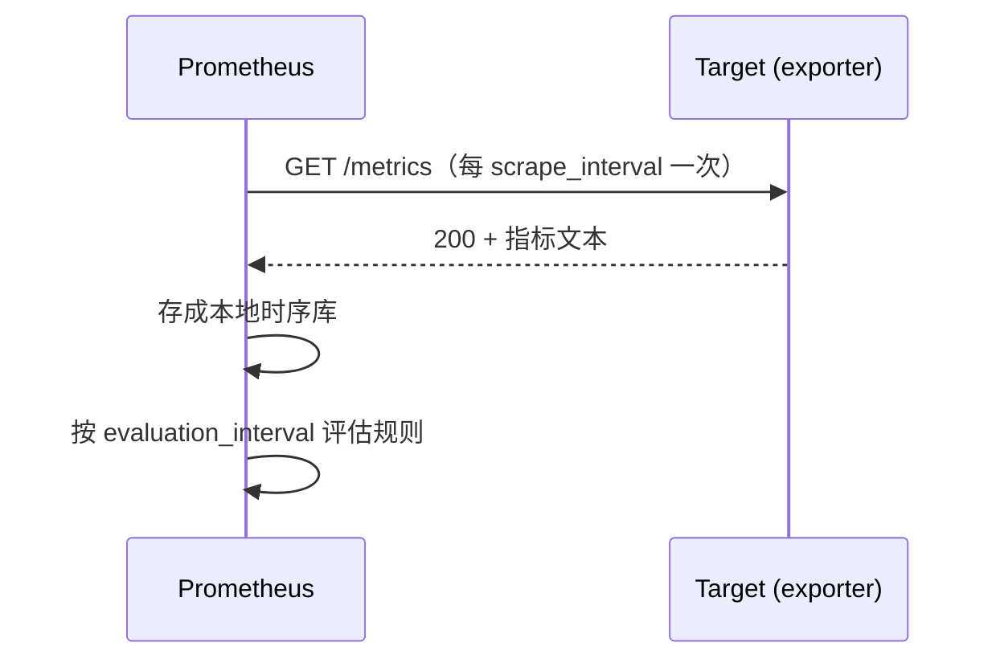

---
tags:
  - Linux
  - 可观测性
  - 监控
  - 指标
  - node_exporter
created: 2026-09-19
---

# 指标的计量：exporter 与指标语义

> [!cite] 参考资料
> Prometheus 官方文档的「Data model」「Metric types」「Instrumentation」「Exporters and integrations」；`node_exporter` 的「Collectors」与 README；`man 5 proc_pid_pressure`（PSI）、`man 8 ss`、`man 1 vmstat`。
>
> 实测输出来自 Ubuntu 24.04.4（WSL2）/ systemd 255 / 非 root：`prometheus-node-exporter` 以 `apt-get download` + `dpkg-deb -x` **解包运行**（版本 `1.7.0-1ubuntu0.3`），监听 `127.0.0.1:19100`，实验后已清理。

> **这篇讲什么**：指标从哪来、长什么样、怎么读。重点是把「指标名」翻译成「能回答什么问题」，以及三个最容易踩的边界：counter 与 gauge 用错、`up` 与自监控被忽略、label 基数失控。
>
> **必须先读什么**：[[Linux/09_日志与监控/01_前置_可观测性世界观与三条链路|01 前置：可观测性世界观与三条链路]]（最小维度集）、[[Linux/09_日志与监控/04_日志的诞生_格式与落点选择|04 日志的诞生：格式与落点选择]]（为什么业务指标不该从日志里解析）。
>
> **读完能回答**：① pull 模型和 push 模型差在哪？② `node_*` 里哪些指标是真正要看的，各自什么语义？③ counter 和 gauge 分别该怎么用？④ USE 方法怎么把「资源检查表」补齐？⑤ 什么时候该自建 exporter、什么时候不该？
>
> 所属：[[Linux/09_日志与监控/00_导读与知识地图|09 日志、监控与可观测性]] 的「一次告警的一生」第 1 站 · 主要练 **S5 指标采集与语义**

## 0. 30 秒速览

> [!abstract] 这一篇只要记住六句话
> - **Prometheus 用 pull 模型：Prometheus 按周期主动抓目标的 `/metrics`。**
>   - 证据：实测 `curl -o /dev/null -w "%{http_code} %{content_type}"` 返回 `200 text/plain; version=0.0.4; charset=utf-8`。
> - **一次抓取的数据量比想象中大，这就是「基数就是成本」的直观感受。**
>   - 证据：实测 node_exporter 一次抓取 **1756 行**指标（含不同 label 组合）。
> - **关键指标的含义比名字重要。**
>   - 证据：实测 `node_load1=0.07`、`node_memory_MemAvailable_bytes=1.595e10`（约 14.9 GiB）、`node_filesystem_avail_bytes{mountpoint="/"}=1.007e12`、`node_filefd_allocated=1488`、`node_sockstat_TCP_inuse=6`。
> - **counter 必须用 `rate()` 看，裸值没有意义。**
>   - 证据：`node_cpu_seconds_total{cpu="0",mode="idle"} 390.42` 只是累计秒数，要算「每秒增长了多少」再看比例。
> - **exporter 自己也要被监控，采集慢/超时先看它。**
>   - 证据：实测 `node_scrape_collector_duration_seconds{collector="cpu"}` 一类指标给出每个采集器的耗时。
> - **能复用就复用：真正该自建的是业务指标。**
>   - 怎么验证：先查有没有官方 exporter（操作系统/容器/中间件）；只有「只有你知道怎么算」的指标才自己埋点。

## 1. pull 模型：谁抓谁



实测（解包运行 node_exporter）：

```bash
ne/usr/bin/prometheus-node-exporter --web.listen-address=127.0.0.1:19100 --log.level=error &
curl -s -o /dev/null -w "%{http_code} %{content_type}\n" http://127.0.0.1:19100/metrics
curl -s http://127.0.0.1:19100/metrics | grep -vc "^#"
```

```text
200 text/plain; version=0.0.4; charset=utf-8; escaping=values
1756
```

pull 模型带来三个不同于「自己推数据」的特性，也是理解后面所有内容的前提：

1. **抓得到抓不到本身就是指标**：`up`（1/0）是最基础的可用性信号，抓取失败也会被记录。
2. **目标清单（service discovery）是运维对象**：目标从哪来、有没有被移除，直接决定有没有数据。
3. **抓取是主动的、周期性的**：所以「短脉冲」会被周期性抓取漏掉（子笔记 13）。

## 2. 关键指标族与语义

实测的一组 `node_*` 指标（解包运行，`127.0.0.1:19100`）：

```text
node_boot_time_seconds 1.789792651e+09
node_filefd_allocated 1488
node_filesystem_avail_bytes{device="/dev/sdd",fstype="ext4",mountpoint="/"} 1.00738502656e+12
node_filesystem_size_bytes{device="/dev/sdd",fstype="ext4",mountpoint="/"} 1.081101176832e+12
node_load1 0.07
node_memory_MemAvailable_bytes 1.5951147008e+10
node_procs_running 1
node_sockstat_TCP_inuse 6
node_cpu_seconds_total{cpu="0",mode="idle"} 390.42
node_network_receive_bytes_total{device="eth0"} 5.1292607e+07
node_disk_read_bytes_total{device="sda"} 7.5981824e+07
node_scrape_collector_duration_seconds{collector="arp"} 4.9933e-05
node_scrape_collector_duration_seconds{collector="btrfs"} 6.2756e-05
```

| 指标（前缀） | 类型 | 用途与注意点 |
| --- | --- | --- |
| `node_cpu_seconds_total` | counter | 按 `mode` 分（idle/user/system/iowait…）；**必须 `rate()` 后再看比例**，裸值无意义 |
| `node_memory_MemAvailable_bytes` | gauge | 「应用还能拿到多少」；别用 `MemFree` 判断可用内存 |
| `node_filesystem_avail_bytes` | gauge | 按 `mountpoint`/`fstype`；与 `size_bytes` 一起算使用率 |
| `node_disk_*_seconds_total` / `node_disk_*_bytes_total` | counter | IO 延迟/吞吐；与 `iostat` 的 `await`/`aqu-sz` 对应 |
| `node_network_*_total` | counter | 收发字节/错误/丢包；`device` 维度必看 |
| `node_sockstat_TCP_inuse` / `node_filefd_allocated` | gauge | 连接数与句柄水位；句柄打满会表现为「偶发失败」 |
| `node_load1` / `5` / `15` | gauge | **与核数比较才有意义**；load 高不等于 CPU 忙（D 状态也算） |
| `node_boot_time_seconds` | gauge | 判断「这台机器是不是刚重启过」 |
| `node_procs_running` | gauge | 可运行进程数，与 `vmstat` 的 `r` 对应 |
| `node_scrape_collector_duration_seconds` | gauge | **exporter 自己的开销**：采集慢/超时要先看它 |
| `up`（Prometheus 侧） | gauge | 抓取是否成功（1/0），最容易做的可用性告警 |

### 2.1 counter 与 gauge：用法不能混

| 类型 | 特征 | 正确用法 | 典型错误 |
| --- | --- | --- | --- |
| counter | 只增不减（进程重启会归零） | `rate()` / `increase()`，并在重启点容忍跳变 | 直接看裸值、对裸值做平均 |
| gauge | 可升可降的瞬时值 | 直接看值、比较阈值 | 对 gauge 做 `rate()` |

> [!important] 实测数字只说明「现在是这个值」，不说明「趋势」
> `node_load1=0.07` 是在某个具体时刻、某台具体机器上的读数。**任何指标的结论都要带「时间 + 机器 + 口径」三要素**——这也是子笔记 13 反复强调的纪律。

## 3. USE：不要漏资源的检查表

USE（Utilization / Saturation / Errors）是一张「按资源问三个问题」的检查表，用来保证指标覆盖不缺项：

| 资源 | Utilization（用了多少） | Saturation（排队/等待） | Errors |
| --- | --- | --- | --- |
| CPU | `node_cpu_seconds_total`（rate 后按 mode）、`vmstat` 的 `us+sy`、`st`（被虚拟化偷走的时间） | `vmstat` 的 `r`、`/proc/pressure/cpu` | `dmesg` 的 MCE、`edac` 记录 |
| 内存 | `MemAvailable`、PSI memory | `vmstat` 的 `si/so`、major fault、OOM 计数 | ECC/`edac`、OOM Killer 记录 |
| 磁盘 IO | `node_disk_*`、`iostat -x` 的 `%util`、`await` | `aqu-sz`、PSI io、队列长度 | SMART 介质错误、dmesg 的 IO error |
| 网络 | `node_network_*`、`sar -n DEV` 带宽 | `ss -s` 的队列/重传、conntrack 使用率 | `nstat` 丢包/错误、`ip -s link` |
| 句柄/连接 | `filefd_allocated`、`TCP_inuse` | 接近上限时的排队/拒绝 | 新建连接失败日志 |

本机实测的三类「水位」信号：

```text
$ grep -H . /proc/pressure/io
/proc/pressure/io:some avg10=0.72 avg60=0.13 avg300=0.02 total=179842
/proc/pressure/io:full avg10=0.72 avg60=0.13 avg300=0.02 total=178856
$ cat /proc/sys/fs/file-nr
1344	0	9223372036854775807
$ ss -s | head -2
Total: 188
TCP:   3 (estab 0, closed 0, orphaned 0, timewait 0)
```

PSI 的 `some/full` 要分清：**`some` = 至少有一个任务被卡**（局部抖动），**`full` = 所有任务都被卡**（全面停顿）。内存/IO 的 `full` 长期非 0，即使平均值看着还行，延迟也已经受影响了。

## 4. exporter 自己也要被监控

采集链路本身出问题时，最常见的结果是**「面板上什么都没有」**，而不是报错。所以要监控的对象包括：

| 对象 | 指标 |
| --- | --- |
| 目标可达性 | `up`（每个 target） |
| 抓取耗时 | `scrape_duration_seconds`、`node_scrape_collector_duration_seconds` |
| 抓取数据量 | `scrape_samples_scraped`、`scrape_series_added` |
| 目标数量 | 配置或 `up` 的聚合计数 |
| Prometheus 自身 | 内存、磁盘（TSDB 目录）、WAL 重放时间 |
| 日志采集器 | 队列长度、丢弃计数、发送失败次数 |

## 5. 自建采集的边界

| 该不该自建 | 判断依据 | 例子 |
| --- | --- | --- |
| **不该** | 已有成熟 exporter，且指标口径与你需要的接近 | 操作系统 → node_exporter；容器 → cAdvisor/kubelet；MySQL/Redis/Nginx → 官方或社区 exporter |
| **该** | 是业务语义、只有你知道怎么算 | 请求数、错误数、延迟直方图、队列深度、业务事件计数 |
| **要谨慎** | 高基数信息 | `user_id`、`request_id`、完整 URL 路径、时间戳当 label |

四条成本纪律（子笔记 14 展开）：

1. **控制 cardinality**：label 组合数决定时序数量；高基数信息应进日志或追踪。
2. **采集频率是成本**：`scrape_interval` 从 15s 提到 1s，成本接近线性增长，而多数告警不需要秒级。
3. **用 recording rule 预聚合、用 histogram 代替原始分布明细**。
4. **exporter 自身要有监控**：`up`、抓取耗时、`scrape_samples_scraped`、目标数量。

## 6. 生产动作：产出一张指标检查表

> [!example]- 实验 5：抓一次真实 `/metrics`，产出一张可评审的检查表
> 目标：把「这台机器有没有指标、指标能不能回答 USE 三个问题」变成一份清单。
> ```bash
> D=$(mktemp -d /tmp/ne-lab.XXXXXX); cd "$D"
> apt-get download prometheus-node-exporter >/dev/null 2>&1
> mkdir ne; dpkg-deb -x prometheus-node-exporter_*.deb ne
> ne/usr/bin/prometheus-node-exporter --web.listen-address=127.0.0.1:19100 --log.level=error & NE=$!
> sleep 2
> curl -s -o /dev/null -w "%{http_code} %{content_type}\n" http://127.0.0.1:19100/metrics
> curl -s http://127.0.0.1:19100/metrics | grep -vc "^#"                # 验证：指标行数
> curl -s http://127.0.0.1:19100/metrics | grep -E "^node_(load1|memory_MemAvailable_bytes|sockstat_TCP_inuse|filefd_allocated|boot_time_seconds|procs_running) "
> curl -s http://127.0.0.1:19100/metrics | grep -E '^node_filesystem_(avail|size)_bytes\{[^}]*mountpoint="/"'
> curl -s http://127.0.0.1:19100/metrics | grep "^node_scrape_collector_duration_seconds" | head -4
> kill $NE; cd /; rm -rf "$D"
> ```
> **预期**：`200 text/plain; version=0.0.4`；指标行数在千级（本机实测 1756）；能取到 `load1`/`MemAvailable`/`filesystem_avail_bytes`/`TCP_inuse`/`filefd_allocated` 与采集器耗时。
> **风险**：低（解包运行、只监听本机高位端口）。
> **回滚**：`kill` 进程、删除临时目录；不写系统目录。
> **耗时**：15 分钟。
>
> 环境：Ubuntu 24.04.4（WSL2）/ 非 root。**生产上这一步只做只读部分**：`curl -s -o /dev/null -w "%{http_code}" http://<target>:9100/metrics`。

## 常见坑

| 常见做法或说法 | 后果或事实 |
| --- | --- |
| 「指标越多越好」 | 高基数 label 会让时序数量与成本爆炸；实测一次抓取就有 1756 行 |
| 「直接看 `node_cpu_seconds_total` 就知道 CPU 忙不忙」 | 它是 counter，裸值只是累计秒数；要 `rate()` 后按 mode 求比例 |
| 「`MemFree` 低说明内存不够」 | 要看 `MemAvailable`；`MemFree` 不包含可回收的缓存 |
| 「load 高就是 CPU 忙」 | load 包含 D 状态（不可中断睡眠）进程；IO 阻塞同样推高 load |
| 「装了 exporter 就有监控了」 | 采集链路（`up`/抓取耗时/目标数）与告警规则也要配；exporter 自己也会挂 |
| 「用日志解析代替业务指标」 | 口径与格式强耦合，且成本高；业务指标应在应用内埋点 |
| 「`up=1` 就说明服务正常」 | 只说明 `/metrics` 抓得到；业务是否可用要看黑盒探测与业务指标 |

## 决策练习

**场景**：你要为一个新上线的自研服务搭监控。它已经有 `/metrics` 端点（暴露了请求数、错误数、延迟直方图），宿主机上还没有任何采集。团队问：「要不要再给这个服务写一个 exporter，把进程的 CPU、内存都暴露出来？」

**A. 写，业务进程的资源占用必须由业务 exporter 提供**
**B. 不写：宿主机装 node_exporter 覆盖进程/系统级指标，容器场景用 cAdvisor/kubelet；业务指标用服务自己的 `/metrics`**
**C. 干脆两个都不装，先用日志分析**

**为什么选 B**：进程级 CPU/内存这类指标**已经有成熟的采集路径**（宿主机 cgroup 视图或容器运行时），自己写等于重复造轮子且口径难以对齐。服务自己的 `/metrics` 已经承担了「只有你知道怎么算」的业务指标——这正是自建的正确位置。

**为什么不选 A**：自建 exporter 的成本不在第一版，而在长期维护（版本、字段、口径、基数）。系统级指标用系统级工具，是分工的基本原则。

**为什么不选 C**：用日志分析代替指标，等于放弃了趋势与告警能力（子笔记 04 已说明为什么这条线不该越）。

## 要点自测

> [!question]- pull 模型和 push 模型有什么本质区别？
> - **pull**：Prometheus 主动按周期抓 `/metrics`；**抓取成功/失败本身是数据**（`up`），目标清单是运维对象。
> - **push**：被监控端主动推给网关；适合短生命周期任务（批处理作业），但「没推」和「推失败」难以区分。
> - **实测**：解包运行 node_exporter 后 `curl /metrics` 返回 `200 text/plain; version=0.0.4`，一次抓取 1756 行。
> - **推论**：周期性抓取必然漏掉短脉冲——这是分位数与 PSI 累计值存在的理由（子笔记 13）。
> - **第一反应不要是什么**：不要把 pull 模型理解成「监控端随时能拿到任意时刻的数据」。

> [!question]- `node_*` 里最值得先看的几个指标是什么？
> - **可用性**：`up`（Prometheus 侧）。
> - **CPU**：`node_cpu_seconds_total`（按 mode，`rate()` 后看比例）。
> - **内存**：`node_memory_MemAvailable_bytes`（不是 `MemFree`）。
> - **磁盘**：`node_filesystem_avail_bytes{size_bytes}` 算使用率、`node_disk_*` 看延迟与吞吐。
> - **水位**：`node_sockstat_TCP_inuse`、`node_filefd_allocated`。
> - **自监控**：`node_scrape_collector_duration_seconds`。
> - **第一反应不要是什么**：不要只看 CPU 和内存，就以为覆盖了「这台机器健康」。

> [!question]- counter 和 gauge 该怎么用？
> - **counter**：只增不减，用 `rate()`/`increase()`；进程重启会归零，要容忍跳变。实测 `node_cpu_seconds_total{cpu="0",mode="idle"} 390.42` 是累计秒数，裸值无意义。
> - **gauge**：可升可降，直接看值与阈值。实测 `node_load1 0.07`、`node_memory_MemAvailable_bytes 1.5951147008e+10` 都是 gauge。
> - **混用的后果**：对 counter 求平均会掩盖趋势；对 gauge 求 `rate()` 会得到无意义的「变化速率」。
> - **第一反应不要是什么**：不要凭指标名猜类型，看它是不是只增。

> 上一篇：[[Linux/09_日志与监控/08_日志的退役_容量治理与磁盘写满|08 日志的退役：容量治理与磁盘写满]] ｜ 下一篇：[[Linux/09_日志与监控/10_指标的判定_PromQL与告警规则|10 指标的判定：PromQL 与告警规则]]
