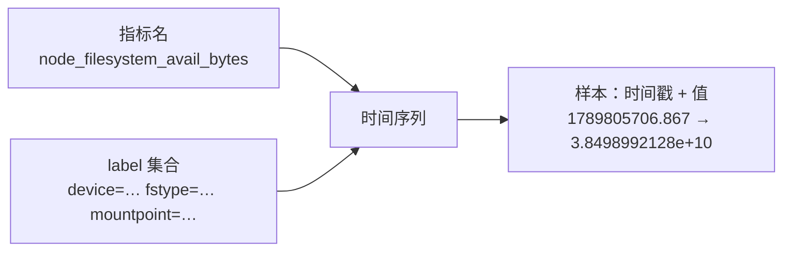

---
tags:
  - Linux
  - 可观测性
  - 监控
  - Prometheus
  - PromQL
  - 告警
created: 2026-09-19
---

# 指标的判定：PromQL 与告警规则

> [!cite] 参考资料
> Prometheus 官方文档的「Data model」「Querying basics」「Operators」「Alerting rules」「Recording rules」「Configuration」；`promtool check rules` 的用法。
>
> 实测状态：**实测环境：Ubuntu 24.04.5 LTS（VMware 虚拟机）/ 内核 `6.8.0-139-generic` / systemd 255（`255.4-1ubuntu8.17`）/ cgroup2fs（v2）/ 4 vCPU / `MemTotal` 7894 MiB / root 可用。**
> 本篇输出已在**本实验机**上本次重跑并粘贴，替换了原 WSL2 输出。`prometheus` 仍以 `apt-get download` + `dpkg-deb -x` **解包运行**，抓取同样解包运行的 node_exporter（`127.0.0.1:20700`），自身 HTTP API 在 `127.0.0.1:20701`；规则文件用 `promtool check rules` / `test rules` 实跑校验，并用 `/api/v1/rules` 与 `ALERTS` 观察真实求值。实验后进程与临时目录已清理（无残留进程、无监听端口）。
> **解包运行是「装不了包」的绕行手法，不是 Linux 常态**——本机有 root、有 `apt`，正常做法是 `apt-get install prometheus`；保持解包只为不给共用的实验机留下常驻服务（判断标准见子笔记 09 第 6 节）。

> **这篇讲什么**：从「采到数据」到「判定出事了」。包括 Prometheus 的数据模型、四类最常用的 PromQL 写法、记录规则与告警规则的分工，以及怎么**在不依赖通知渠道**的前提下验证一条告警规则是否真的生效。
>
> **必须先读什么**：[[Linux/09_日志与监控/09_指标的计量_node_exporter与指标语义|09 指标的计量：exporter 与指标语义]]（先有指标，再谈表达式）。
>
> **读完能回答**：① 时间序列由什么唯一确定？② `rate()` 的窗口该怎么取值、为什么不能用裸 counter？③ 记录规则和告警规则各解决什么问题？④ 怎么证明「告警规则真的算出来了」？⑤ `for` 设成 `0s` 有什么问题？
>
> 所属：[[Linux/09_日志与监控/00_导读与知识地图|09 日志、监控与可观测性]] 的「一次告警的一生」第 2 站 · 主要练 **S6 规则与告警编写**

## 0. 30 秒速览

> [!abstract] 这一篇只要记住六句话
> - **数据模型是「指标名 + label 集合 → 时间序列」，label 变了就是另一条时序。**
>   - 怎么验证：查一次 `up`，看返回里的 `__name__` + `instance` + `job` 三个 label 才唯一确定一条序列；这也是基数决定成本的原因。
> - **counter 必须用 `rate()`，裸值只是累计秒数。**
>   - 证据：`node_cpu_seconds_total{cpu="0",mode="idle"} 3906.51`。
> - **窗口要 ≥ 2×`scrape_interval`，否则 `rate()` 会得到空值或剧烈抖动。**
>   - 证据：本机实验用 `scrape_interval: 5s` 配 `[1m]` 窗口（12 倍关系）算 CPU 使用率得到 `0.0385000000000012`（约 3.85%）；窗口缩到与抓取间隔同量级就会抖或为空。
> - **规则文件要像代码一样进版本管理并在 CI 里校验。**
>   - 证据：实测 `promtool check rules /tmp/09b-good.yml` → `SUCCESS: 4 rules found`（rc=0）；故意写坏的三份规则分别报 `unclosed left parenthesis`、`field 'expr' must be set in rule`、`unknown unit " minutes" in duration "5 minutes"`（rc=1）。
> - **告警算没算出来，看 `ALERTS` 这条特殊时序，不用等通知渠道。**
>   - 证据：实测一条恒真告警规则触发后 `ALERTS{alertname="AlwaysFiringDemo",alertstate="firing",severity="info"} = 1`；`/api/v1/rules` 里记录规则 `instance:node_cpu_utilisation:rate5m` 的 `health` 为 `ok`（在评但阈值没到）。另一次自洽实测中记录规则 `lab:node_cpu_utilisation:rate1m` 查询直接返回 `0.8255288125000102`——**记录规则的结果是可以像普通指标一样被查询的**。
> - **`for: 0s` 会让抖动直接变成通知。**
>   - 怎么验证：本文用 `for: 0s` 只是为了让实验立刻出结果；生产上按告警类型给几分钟，并配合分位数/持续窗口过滤毛刺。

## 1. 数据模型：一条时序由什么确定



（上面的时间戳与该值取自**同一次抓取**：`node_time_seconds 1.7898057068670387e+09` 与 `node_filesystem_avail_bytes{...} 3.8498992128e+10` 都在那一份 `/metrics` 输出里。）

三条必须记住的推论：

1. **label 变了就是另一条时序**：加一个 `mountpoint`，时序数量就乘以挂载点个数。
2. **同样的指标名可以有完全不同的 label 组合**：写查询时永远先想「我要按什么维度聚合」。
3. **时间戳来自抓取时刻**：所以「短脉冲」可能被两次抓取之间漏掉（子笔记 13）。

## 2. PromQL：四类最常用的写法

| 目的 | 写法 | 注意 |
| --- | --- | --- |
| 速率 | `rate(node_network_receive_bytes_total[5m])` | 窗口 ≥ 2×`scrape_interval`；只能用于 counter |
| 比例/使用率 | `100 - avg(rate(node_cpu_seconds_total{mode="idle"}[5m])) * 100` | 先按 instance 保留维度，再聚合 |
| 聚合与分组 | `sum by (instance) (rate(http_requests_total[5m]))` | `by` 决定输出维度；`without` 相反 |
| 告警表达式 | `up == 0`、`rate(errors[5m]) / rate(total[5m]) > 0.01` | 先算比率再判断，避免绝对值受流量影响 |

实测：解包运行 Prometheus（`scrape_interval: 1m`、`evaluation_interval: 1m`）抓解包运行的 node_exporter（`127.0.0.1:20700`），用 HTTP API 查询（Prometheus 自身在 `127.0.0.1:20701`）：

```bash
curl -s --get --data-urlencode "query=up" localhost:20701/api/v1/query
curl -s --get --data-urlencode "query=instance:node_cpu_utilisation:rate5m" localhost:20701/api/v1/query
curl -s --get --data-urlencode "query=ALERTS" localhost:20701/api/v1/query
curl -s --get --data-urlencode "query=1 - avg by (instance) (rate(node_cpu_seconds_total{mode=\"idle\"}[1m]))" \
    localhost:20701/api/v1/query
```

```text
--- up
{'__name__': 'up', 'instance': '127.0.0.1:20700', 'job': 'node'} 1
--- count(up)
{} 1
--- 1 - avg by (instance) (rate(node_cpu_seconds_total{mode="idle"}[1m]))
{'instance': '127.0.0.1:20700'} 0.0385000000000012
--- ALERTS（阈值未触发时为空）
(空)
--- node_filesystem_avail_bytes{mountpoint="/"} / node_filesystem_size_bytes{mountpoint="/"}
0.765624323223307
```

四条查询分别验证了：**目标抓得到（`up=1`）→ 表达式算得出真实使用率（CPU 3.85%、磁盘剩余 76.6%）→ 阈值没到则 `ALERTS` 为空（不误报）**。这套顺序就是「告警链路自检」的最小闭环。

`/api/v1/rules` 接口同时给出规则的求值健康度（下面这段说明记录规则与告警规则**都在被评估**，只是没触发）：

```text
"name": "instance:node_cpu_utilisation:rate5m", "health": "ok",  "type": "recording"
"name": "NodeCpuHigh",  "state": "inactive", "health": "ok", "duration": 600, "type": "alerting"
"name": "NodeMemoryLow", "state": "inactive", "health": "ok", "duration": 300, "type": "alerting"
```

**注意 `ALERTS` 为空是正确结果，不是故障**——它说明规则在评、只是条件不成立。要验证「告警真能进 firing」，得另造一条必然为真的规则（见第 3 节与实验 6）。

## 3. 记录规则与告警规则

| 类型 | 作用 | 例子 | 什么时候用 |
| --- | --- | --- | --- |
| recording rule | 预计算并保存表达式结果，固化口径、降低查询成本 | `record: job:http_error_ratio:5m` | 复杂表达式被反复查询、或被告警规则/面板共用 |
| alerting rule | 表达式为真时产生告警 | `alert: NodeDown` / `expr: up == 0` | 需要让人做动作的条件 |

本机实测用到的规则文件（一条记录规则 + 三条告警规则，实测校验通过 4 条）：

```yaml
groups:
  - name: node-basics
    interval: 30s
    rules:
      - record: instance:node_cpu_utilisation:rate5m
        expr: 1 - avg by (instance) (rate(node_cpu_seconds_total{mode="idle"}[5m]))
      - alert: NodeCpuHigh
        expr: instance:node_cpu_utilisation:rate5m > 0.8
        for: 10m
        labels: {severity: warning}
        annotations:
          summary: "实例 {{ $labels.instance }} CPU 使用率持续 10 分钟高于 80%"
          description: "当前值 {{ $value | humanizePercentage }}"
      - alert: NodeMemoryLow
        expr: node_memory_MemAvailable_bytes / node_memory_MemTotal_bytes < 0.1
        for: 5m
        labels: {severity: critical}
        annotations: {summary: "可用内存低于 10%"}
      - alert: FilesystemAlmostFull
        expr: node_filesystem_avail_bytes{fstype!~"tmpfs|overlay"} / node_filesystem_size_bytes < 0.15
        for: 15m
        labels: {severity: warning}
        annotations: {summary: "{{ $labels.device }} ({{ $labels.mountpoint }}) 剩余空间不足 15%"}
```

```bash
promtool check rules /tmp/09b-good.yml
```

```text
Checking /tmp/09b-good.yml
  SUCCESS: 4 rules found
```

**故意写坏的三份也要能看到报错**（这才是把校验放进 CI 的意义）：

```text
/tmp/09b-bad1.yml: 5:15: group "broken", rule 1, "Bad": could not parse expression: 1:32: parse error: unclosed left parenthesis
/tmp/09b-bad2.yml: 0:0: group "broken2", rule 1, "NoExpr": field 'expr' must be set in rule
/tmp/09b-bad3.yml: unknown unit " minutes" in duration "5 minutes"
```

### 3.0 `promtool test rules`：把 PromQL 也写成单元测试

`check rules` 只验语法，**不验「算得对不对」**。`promtool test rules` 用合成序列喂给规则文件，断言表达式求值结果与告警是否触发：

```yaml
rule_files:
  - /tmp/09b-good.yml
evaluation_interval: 1m
tests:
  - interval: 1m
    input_series:
      - series: 'node_cpu_seconds_total{cpu="0",mode="idle",instance="linux-lab:9100"}'
        values: '0+45x20'
      - series: 'node_cpu_seconds_total{cpu="0",mode="user",instance="linux-lab:9100"}'
        values: '0+15x20'
    promql_expr_test:
      - expr: 1 - avg by (instance) (rate(node_cpu_seconds_total{mode="idle"}[5m]))
        eval_time: 10m
        exp_samples:
          - labels: '{instance="linux-lab:9100"}'
            value: 0.25
    alert_rule_test:
      - eval_time: 15m
        alertname: NodeCpuHigh
        exp_alerts: []
```

第一次把 idle 写成了 `0+60x20`（等于 `rate()` 后 idle 占 100%），断言 `0.5` 与实算 `0` 不符而失败；改成 `0+45x20`（idle 占 75%，即使用率 25%）后 `SUCCESS`。再把 user 拉到 `0+54x30`，`NodeCpuHigh` 就在 `eval_time: 16m` 真的触发了——**整套告警规则可以在不连任何真实目标的情况下被验证**。

```text
Unit Testing:  /tmp/09b-tests.yml
  FAILED:
    expr: "1 - avg by (instance) (rate(node_cpu_seconds_total{mode=\"idle\"}[5m]))", time: 10m,
        exp: {instance="linux-lab:9100"} 5E-01
        got: {instance="linux-lab:9100"} 0E+00
rc=1
Unit Testing:  /tmp/09b-tests2.yml
  SUCCESS
rc=0
Unit Testing:  /tmp/09b-tests3.yml
  SUCCESS
rc=0
```

三条工程习惯：

1. **规则文件纳入版本管理**，`promtool check rules` 进 CI——语法错误应该在合并前被发现。
2. **告警表达式建立在记录规则或清晰表达式之上**，不要把一个十行表达式直接塞进告警。
3. **`labels` 里必须有 `severity`**，否则后面的路由、抑制、通知分级都无从谈起（子笔记 11、12）。

### 3.1 `ALERTS`：告警状态本身也是时序

任何 alerting rule 触发后，Prometheus 都会生成一条特殊时序：

```text
ALERTS{alertname="…", alertstate="pending|firing", severity="…"} = 0 或 1
```

它带来两个非常实用的能力：

- **验证规则**：`ALERTS{alertname="X"}` 有值就说明规则算出来了，**不需要等通知渠道**。本机加了一条恒真规则 `AlwaysFiringDemo`（`expr: vector(1) > 0`，没有 `for`），实测在 `evaluation_interval: 5s` 下第二轮就进入 `firing`：

```text
{'__name__': 'ALERTS', 'alertname': 'AlwaysFiringDemo', 'alertstate': 'firing', 'severity': 'info'} 1
{'__name__': 'ALERTS_FOR_STATE', 'alertname': 'AlwaysFiringDemo', 'severity': 'info'} 1789805362
```

- **排查「告警不响」**：先看 `ALERTS`，再看 `/api/v1/rules` 的 `state` 与 `lastEvaluation`，最后才查 Alertmanager 与通知渠道（子笔记 17）。本机同一时刻 `/api/v1/rules` 里 `NodeCpuHigh` 是 `state: inactive` 而 `AlwaysFiringDemo` 已 firing——**「规则在评」与「条件成立」是两件事，用这两个视图就能区分**。

### 3.2 `for`：过滤毛刺的那道闸

```yaml
- alert: HighErrorRatio
  expr: sum(rate(http_requests_total{code=~"5.."}[5m])) / sum(rate(http_requests_total[5m])) > 0.01
  for: 10m
  labels: {severity: critical}
```

`for` 的含义是「表达式持续为真这么久，才从 `pending` 变成 `firing`」。**实测里那条恒真规则故意不写 `for`，就是为了让验证立刻成功**；生产上不写 `for`（等价 `for: 0s`）意味着任何一次抖动都会直接通知人。反过来，本机的 `NodeCpuHigh` 带 `for: 10m`，在 `evaluation_interval: 5s` 下一直是 `state: inactive`——**`for` 越长，越不容易响，也越容易漏掉真正的短故障**。

| `for` 取值 | 效果 | 适用 |
| --- | --- | --- |
| `0s` | 立刻触发 | 只适合实验室验证，或「必须立刻知道」的硬故障（如 `up == 0` 持续 1 分钟） |
| 几分钟 | 过滤瞬时毛刺 | 大多数水位类告警 |
| 十几分钟以上 | 只报持续性问题 | 与 SLO 挂钩的慢速消耗（子笔记 12） |

## 4. 生产动作：把规则写好、验好、管好

> [!example]- 实验 6：写一组规则，用 `promtool` 校验 + 用 `ALERTS` 验证
> 目标：在本地跑通「抓取 → 规则评估 → 告警 firing」全链路，不依赖任何外部系统。
> ```bash
> D=/tmp/09b-prometheus; mkdir -p "$D"; cd /tmp/09b-probe
> ne/usr/bin/prometheus-node-exporter --web.listen-address=127.0.0.1:20700 --log.level=error & NE=$!
> cat > "$D/rules-good.yml" <<'EOF'                       # 记录规则 + 三条告警规则
> groups:
>   - name: node-basics
>     interval: 30s
>     rules:
>       - record: instance:node_cpu_utilisation:rate5m
>         expr: 1 - avg by (instance) (rate(node_cpu_seconds_total{mode="idle"}[5m]))
>       - alert: NodeCpuHigh
>         expr: instance:node_cpu_utilisation:rate5m > 0.8
>         for: 10m
>         labels: {severity: warning}
>         annotations: {summary: "实例 {{ $labels.instance }} CPU 使用率持续 10 分钟高于 80%"}
>       - alert: NodeMemoryLow
>         expr: node_memory_MemAvailable_bytes / node_memory_MemTotal_bytes < 0.1
>         for: 5m
>         labels: {severity: critical}
>         annotations: {summary: "可用内存低于 10%"}
>       - alert: FilesystemAlmostFull
>         expr: node_filesystem_avail_bytes{fstype!~"tmpfs|overlay"} / node_filesystem_size_bytes < 0.15
>         for: 15m
>         labels: {severity: warning}
>         annotations: {summary: "{{ $labels.device }} ({{ $labels.mountpoint }}) 剩余空间不足 15%"}
> EOF
> xprom/usr/bin/promtool check rules "$D/rules-good.yml"    # 验证：SUCCESS: 4 rules found
> cat > "$D/prometheus.yml" <<'EOF'
> global:
>   scrape_interval: 5s
>   evaluation_interval: 5s
> rule_files:
>   - /tmp/09b-prometheus/rules-good.yml
>   - /tmp/09b-prometheus/fire.yml
> scrape_configs:
>   - job_name: node
>     static_configs:
>       - targets: ['127.0.0.1:20700']
> EOF
> cat > "$D/fire.yml" <<'EOF'                              # 恒真规则：用来看到 firing 长什么样
> groups:
>   - name: demo-firing
>     interval: 5s
>     rules:
>       - alert: AlwaysFiringDemo
>         expr: vector(1) > 0
>         labels: {severity: info}
>         annotations: {summary: "演示：表达式恒为真，用于观察 pending -> firing"}
> EOF
> xprom/usr/bin/prometheus --config.file="$D/prometheus.yml" --storage.tsdb.path="$D/data" \
>   --web.listen-address=127.0.0.1:20701 --storage.tsdb.retention.time=1h --log.level=error & PR=$!
> sleep 12
> curl -s --get --data-urlencode 'query=up' localhost:20701/api/v1/query
> curl -s --get --data-urlencode 'query=ALERTS' localhost:20701/api/v1/query        # 验证：alertstate=firing
> curl -s localhost:20701/api/v1/rules
> kill $PR $NE; rm -rf "$D"
> ```
> **预期**：`up` 的值为 `1`；`ALERTS` 里出现 `alertname="AlwaysFiringDemo", alertstate="firing"`（本机实测值为 `1`）；`/api/v1/rules` 里 `NodeCpuHigh` 是 `state: inactive`（阈值没到）。
> **风险**：低（解包运行、只监听本章端口区间内的高位端口、数据落在临时目录）。
> **回滚**：`kill` 两个进程并删除临时目录。
> **耗时**：20 分钟。
>
> 环境：Ubuntu 24.04.5 LTS（VMware 虚拟机）/ root 可用。**生产环境请用发行版包正常安装**（`apt-get install prometheus prometheus-node-exporter`），并给 Prometheus 配好数据目录权限与自启；这里解包运行只是为了不留常驻服务。

## 常见坑

| 常见做法或说法 | 后果或事实 |
| --- | --- |
| 直接对 counter 求平均或比大小 | 累计值只会越来越大，结论无意义；必须 `rate()`/`increase()` |
| `rate(...[1m])` 配 1 分钟抓取间隔 | 窗口里只有一两个样本，结果抖动或为空；窗口应 ≥ 2×`scrape_interval` |
| 告警表达式写绝对值阈值 | 流量变化时误报/漏报；错误率类告警要先算比率 |
| `for: 0s` 图快 | 抖动直接变成通知，长期下来没人再认真看告警 |
| 规则改了不校验就上线 | 语法错误会让整组规则加载失败；用 `promtool check rules` 进 CI（实测三份坏规则都能被点名到行号） |
| 只用 `check rules` 验语法 | 语法过 ≠ 算得对；用 `promtool test rules` 配合成序列做单元测试 |
| 用「通知收到没」判断告警是否工作 | 通知链路上还有路由、分组、抑制、静默；先看 `ALERTS` |
| 把复杂表达式直接写进告警规则 | 可读性与复用性都差；先做 recording rule，再做告警 |

## 决策练习

**场景**：你写了一条告警「磁盘使用率 > 85%」，上线后发现**夜里总有几分钟会触发**，白天不触发，但每次登录查看时磁盘使用率都正常。同一条规则还经常在业务发布后 1 分钟内触发一次。

**A. 把阈值从 85% 调到 95%**
**B. 保留阈值，加 `for: 10m`，并改用「连续窗口内最大值」判定；同时确认是什么在夜里周期性写盘**
**C. 把这条告警关掉，改成每天巡检一次**

**为什么选 B**：现象是「短暂冲高后恢复」，属于**瞬时毛刺**，正确的工程手段是加持续时间要求（`for`）并让表达式对尖峰更稳健（例如用持续窗口而非瞬时值），同时把「谁在夜里写盘」当成一个真实问题去查——它可能正是备份、日志轮转或批处理。

**为什么不选 A**：调阈值等于降低灵敏度——毛刺过滤掉了，真正的「持续 90%」也被放过了，将来真出事时你不会收到告警。

**为什么不选 C**：取消告警是拿掉了防线；磁盘写满的后果（整机故障）与每天巡检一次的时间粒度完全不对等。

## 要点自测

> [!question]- Prometheus 的数据模型是什么？为什么 label 会影响成本？
> - **模型**：指标名 + label 集合唯一确定一条时间序列；一次抓取产生一个样本（时间戳 + 值）。
> - **成本**：label 的每个不同取值组合都是一条独立时序，存储与查询成本随时序数量增长（cardinality）。
> - **推论**：`user_id`、`request_id` 这类高基数信息不能做 label，应进日志或追踪。
> - **第一反应不要是什么**：不要为了「维度更全」往 label 里塞高基数字段。

> [!question]- 怎么在不依赖通知渠道的情况下验证一条告警规则？
> - **第一步 `promtool check rules`**：语法正确（本机实测 `SUCCESS: 4 rules found`）。
> - **第二步 `promtool test rules`**：用合成序列断言表达式求值与告警是否触发（本机实测改对合成序列后 `SUCCESS`，`eval_time: 16m` 时 `NodeCpuHigh` 如期触发）。
> - **第三步看 `ALERTS`**：`ALERTS{alertname="…",alertstate="firing"}` 出现即说明规则触发（本机实测恒真规则值为 `1`）。
> - **第四步看 `/api/v1/rules`**：确认 `state` 与 `lastEvaluation`，判断是没算出来还是没触发（本机实测 `NodeCpuHigh` 为 `state: inactive`）。
> - **之后再查 Alertmanager**：路由、分组、抑制、静默（子笔记 11）。
> - **第一反应不要是什么**：不要一上来就怀疑邮箱/钉钉/webhook。

> [!question]- `for` 参数解决什么问题？该怎么取值？
> - **作用**：表达式持续为真达到 `for` 的时长，告警才从 `pending` 进入 `firing`，用来过滤瞬时毛刺。
> - **取值**：水位类告警常用几分钟；硬故障（`up == 0`）可以短一些；与 SLO 挂钩的慢速消耗可以更长（子笔记 12）。
> - **实测提醒**：本文为了验证链路用了一条**不写 `for`** 的恒真规则，这是**实验手段**，不是生产配置；真实规则（如 `NodeCpuHigh`）带 `for: 10m`，实测一直停在 `inactive`。
> - **第一反应不要是什么**：不要用「调高阈值」代替「加持续时间」。

> 上一篇：[[Linux/09_日志与监控/09_指标的计量_node_exporter与指标语义|09 指标的计量：exporter 与指标语义]] ｜ 下一篇：[[Linux/09_日志与监控/11_告警的降噪_路由分组抑制与探测|11 告警的降噪：路由、分组、抑制与探测]]
