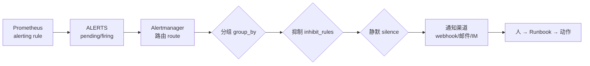

---
tags:
  - Linux
  - 可观测性
  - 监控
  - 告警
  - Alertmanager
  - blackbox
created: 2026-09-19
---

# 告警的降噪：路由、分组、抑制与探测

> [!cite] 参考资料
> Alertmanager 官方文档的「Configuration」「Routing tree」「Inhibition」「Silences」「Notification template reference」；`amtool` 的 `check-config`/`config routes test`/`alert query`/`silence` 子命令；`blackbox_exporter` 的「Configuration」与「Metrics」。
>
> 实测状态：**实测环境：Ubuntu 24.04.5 LTS（VMware 虚拟机）/ 内核 `6.8.0-139-generic` / systemd 255（`255.4-1ubuntu8.17`）/ cgroup2fs（v2）/ 4 vCPU / `MemTotal` 7894 MiB / root 可用。**
> 本篇输出已在**本实验机**上本次重跑并粘贴，替换了原 WSL2 输出。`prometheus-alertmanager`（`0.26.0+ds`）与 `prometheus-blackbox-exporter` 仍以 `apt-get download` + `dpkg-deb -x` **解包运行**（Alertmanager `127.0.0.1:20703`、blackbox `127.0.0.1:20702`、webhook sink `127.0.0.1:20704`、探测目标 `127.0.0.1:20705`）。Debian 包把默认模板编译成绝对路径 `/usr/share/prometheus/alertmanager/*.tmpl`，**本机有 root，直接把包内那两个 `.tmpl` 放到该路径即可（等价于 `apt install` 的效果），实验后删除**——不再需要 `unshare -U -r -m` + tmpfs 那套绕法（旧的用户命名空间绕法在 Ubuntu 24.04 上已被 AppArmor 禁掉，实测报 `Operation not permitted`，见第 5 节）。实验后进程与临时目录已清理（无残留进程、无监听端口）。
> **解包运行是「装不了包」的绕行手法，不是 Linux 常态**——本机有 root、有 `apt`，生产环境应正常安装（子笔记 09 第 6 节）。

> **这篇讲什么**：「告警响了」到「有人收到一条能干活的通知」之间的全部加工：路由、分组、抑制、静默，以及**用户视角的可用性探测**（含证书到期）。这一篇的核心不是配置语法，而是**降噪的先后顺序**。
>
> **必须先读什么**：[[Linux/09_日志与监控/10_指标的判定_PromQL与告警规则|10 指标的判定：PromQL 与告警规则]]（先有 `ALERTS`，才谈得上路由）。
>
> **读完能回答**：① 分组、抑制、静默分别在解决什么问题，顺序为什么不能反？② 怎么用 `silencedBy`/`inhibitedBy` 判断一条告警被什么压住了？③ `probe_success` 和 `up` 有什么区别？④ 证书到期告警怎么写？
>
> 所属：[[Linux/09_日志与监控/00_导读与知识地图|09 日志、监控与可观测性]] 的「一次告警的一生」第 3 站 · 主要练 **S7 告警降噪与可用性探测**

## 0. 30 秒速览

> [!abstract] 这一篇只要记住六句话
> - **告警链路是「规则 → 路由 → 分组/抑制/静默 → 通知渠道 → 人」，每一段都能独立验证。**
>   - 怎么验证：`curl .../query?query=ALERTS` 看规则、`amtool config routes test` 看路由、`/api/v2/alerts` 看压制、最后才查渠道。
> - **分组让一次故障只发一条通知。**
>   - 证据：实测把同 `alertname+service` 的两条 warning 发进去，webhook 收到的是一个分组 `groupKey={}/{severity="warning"}:{alertname="NodeCpuHigh", service="web"}`，内含 `linux-lab` 与 `linux-lab2` 两条。
> - **静默是有期限的临时压制。**
>   - 证据：实测建 silence 后，对应告警变成 `suppressed`、`silencedBy=['a23478de-5b79-41f4-aa83-5ee6c70dc0c5']`。
> - **抑制是配置层的因果关系，匹配范围决定它压谁。**
>   - 证据：实测给同一 `alertname+service` 发 `critical` 后，两条 `service="web"` 的 warning 变成 `suppressed`、`inhibitedBy=['0c65b10c93ac87dc']`；而 `service="db"` 的 warning 仍是 `active`——因为抑制规则带了 `equal: ['alertname','service']`。
> - **`up` 和 `probe_success` 不是一回事：前者是「指标抓得到吗」，后者是「用户视角能用吗」。**
>   - 证据：实测 blackbox 对本地目标返回 `probe_success=1`、`probe_http_status_code=200`、`probe_duration_seconds=0.001531452`；对无人监听的端口返回 `probe_success=0`。
> - **证书到期必须配探测告警。**
>   - 证据：同一天同一台机器上，`https://www.example.com` 的 `probe_ssl_earliest_cert_expiry=1.793139441e+09`（剩余 38.6 天），`https://mirrors.aliyun.com` 是 `1.803656795e+09`（剩余 160.3 天）——**必须按域名分组**，否则一个阈值测不出两种现实。

## 1. 告警链路全景



**排查「告警不响」时，就沿这条链一段一段走**：`ALERTS` 有没有 → 路由匹配到哪个 receiver → 是否被抑制/静默 → 渠道是否可用。跳过前面几段直接查渠道，是最常见的低效排查。

## 2. 路由与分组

```yaml
route:
  receiver: null-sink
  group_by: ["alertname", "service"]       # 按这两个 label 分组
  group_wait: 3s                           # 首次通知前等待，让同组告警一起发
  group_interval: 10s                      # 同组新增告警后多久再发
  repeat_interval: 1m                      # 未恢复时多久重复提醒
  routes:
    - matchers: ['severity="critical"']
      receiver: pager
    - matchers: ['severity="warning"']
      receiver: team-mail
receivers:
  - name: null-sink
  - name: pager
    webhook_configs:
      - url: http://127.0.0.1:20704/sink
  - name: team-mail
    webhook_configs:
      - url: http://127.0.0.1:20704/sink
```

```bash
amtool check-config /tmp/09b-am/final.yml
amtool config routes test --config.file=/tmp/09b-am/final.yml severity=warning service=web
amtool config routes test --config.file=/tmp/09b-am/final.yml severity=critical service=web
amtool config routes test --config.file=/tmp/09b-am/final.yml severity=info service=db
```

```text
Checking '/tmp/09b-am/final.yml'  SUCCESS
Found:
 - global config
 - route
 - 1 inhibit rules
 - 3 receivers
 - 1 templates
  SUCCESS

  warning service=web  -> team-mail
  critical service=web -> pager
  info service=db      -> null-sink
```

`amtool config routes test` 的价值在于**离线判断「这条告警会被送到哪个 receiver」**，不需要真的把告警发出去——上面三条一次跑完，路由树的三个分支都被覆盖到了。

### 2.1 实测：三条告警进来，webhook 收到几组

把三条告警 POST 进 Alertmanager（`service=web` 的两条 warning + `service=db` 的一条 warning）：

```bash
curl -s -XPOST -H 'Content-Type: application/json' -d '[
 {"labels":{"alertname":"NodeCpuHigh","severity":"warning","service":"web","instance":"linux-lab"},"annotations":{"summary":"web CPU 高"},"startsAt":"2026-09-19T08:00:00Z"},
 {"labels":{"alertname":"NodeCpuHigh","severity":"warning","service":"web","instance":"linux-lab2"},"annotations":{"summary":"web CPU 高"},"startsAt":"2026-09-19T08:00:00Z"},
 {"labels":{"alertname":"NodeCpuHigh","severity":"warning","service":"db","instance":"linux-lab"},"annotations":{"summary":"db CPU 高"},"startsAt":"2026-09-19T08:00:00Z"}
]' localhost:20703/api/v2/alerts
```

webhook 侧收到的实际分组（每条通知的 `groupKey` 与内含告警）：

```text
[2026-09-19T08:15:01+00:00] POST /sink alerts=2  receiver=team-mail
  groupKey={}/{severity="warning"}:{alertname="NodeCpuHigh", service="web"}
  {"alertname": "NodeCpuHigh", "instance": "linux-lab",  "service": "web", "severity": "warning"} firing
  {"alertname": "NodeCpuHigh", "instance": "linux-lab2", "service": "web", "severity": "warning"} firing
[2026-09-19T08:15:01+00:00] POST /sink alerts=1  receiver=team-mail
  groupKey={}/{severity="warning"}:{alertname="NodeCpuHigh", service="db"}
  {"alertname": "NodeCpuHigh", "instance": "linux-lab", "service": "db", "severity": "warning"} firing
```

**两条同组告警合并成一次通知**（`instance` 不在 `group_by` 里，所以 `linux-lab` 与 `linux-lab2` 被并到一起），`service=db` 那条单独一组——`group_by` 里的 label 组合决定「什么算同一个故障」。

> [!note] 上面这些输出的出处（便于复核）
> 这段样张与第 3.2 节的抑制样张来自**同一次** Alertmanager 实验：`group_by: ['alertname','service']`、`inhibit_rules` 带 `equal: ['alertname','service']`，POST 进去的是**三条 warning（2 条 `service=web` + 1 条 `service=db`）+ 之后 1 条同 `alertname+service` 的 critical**。两个视图相互印证：`/api/v2/alerts` 的 `state`/`inhibitedBy` 字段，以及 webhook sink 实际收到的 `groupKey` 与告警 JSON。**`service=db` 这条既出现在告警状态里（`state=active`），也出现在 sink 的分组通知里（单独一个 `groupKey`）**——两处都能对上，不是推断。

| 参数 | 作用 | 常见错误 |
| --- | --- | --- |
| `group_by` | 按哪些 label 聚合 | 不含 `alertname` 会把无关告警合并；含高基数 label（如 `pod`）会让分组失效 |
| `group_wait` | 首次通知前等多久 | 设太短会失去聚合效果；设太长会延迟报警 |
| `group_interval` | 同组有新告警时的再发间隔 | 设太短会造成通知轰炸 |
| `repeat_interval` | 未恢复时重复提醒间隔 | 设太短会让人麻木；设太长会漏掉长时间未处理的故障 |

## 3. 静默与抑制：解决两个不同的问题

### 3.1 静默（silence）：临时、有期限、操作层

```bash
amtool silence add alertname=NodeCpuHigh \
  --alertmanager.url=http://127.0.0.1:20703 --duration=10m --comment="实验：维护窗口"
```

```text
a23478de-5b79-41f4-aa83-5ee6c70dc0c5
```

查询当前告警状态，可以看到静默的生效方式（`critical` 那条被静默，同时它的 `inhibitedBy` 变空）：

```text
 severity=critical service=web instance=linux-lab  state=suppressed silencedBy=['a23478de-5b79-41f4-aa83-5ee6c70dc0c5'] inhibitedBy=[]
 severity=warning  service=web instance=linux-lab  state=suppressed silencedBy=['a23478de-5b79-41f4-aa83-5ee6c70dc0c5'] inhibitedBy=['0c65b10c93ac87dc']
```

用 `amtool silence query` 复查「还有哪些静默挂着」：

```text
ID                                    Matchers                 Ends At                  Created By  Comment
a23478de-5b79-41f4-aa83-5ee6c70dc0c5  alertname="NodeCpuHigh"  2026-09-19 08:26:37 UTC  root        实验：维护窗口
```

**静默只影响通知，不影响告警状态**——告警依然存在于 Alertmanager 里，只是不再推给人。它适合：维护窗口、已知问题的临时压制。**必须带期限、原因、创建人**，维护窗口结束后要复查有没有遗留 silence。

### 3.2 抑制（inhibition）：配置层、表达因果

```yaml
inhibit_rules:
  - source_matchers: [severity="critical"]      # 谁去压别人
    target_matchers: [severity="warning"]       # 压谁
    equal: ["alertname", "service"]             # 同一个对象（同一种告警、同一个服务）
```

实测：在两条 `service=web` 的 warning 之后，再发一条同 `alertname+service` 的 `critical`：

```text
 severity=critical service=web instance=linux-lab   state=active     inhibitedBy=[]
 severity=warning  service=web instance=linux-lab2  state=suppressed inhibitedBy=['0c65b10c93ac87dc']
 severity=warning  service=db  instance=linux-lab   state=active     inhibitedBy=[]
 severity=warning  service=web instance=linux-lab   state=suppressed inhibitedBy=['0c65b10c93ac87dc']
```

三个细节值得注意：

1. **抑制是「用高优先级压低优先级」**：机器已经宕机时，不必再报「磁盘使用率高」。
2. **`service=db` 那条没有被压掉**：`equal: ["alertname","service"]` 限定了因果关系的作用范围。**抑制的匹配范围决定它压谁**，写窄了会漏掉噪声，写宽了会压掉真故障。
3. **必须用 `equal` 限定对象**：不写 `equal` 就变成「任何 critical 压掉任何 warning」，这是典型的过度抑制。本机实测里 `service=web` 的两条被压、`service=db` 的不被压，就是 `equal` 在起作用。

### 3.3 降噪顺序：分组 → 抑制 → 静默 → 最后才是调阈值

| 顺序 | 手段 | 层次 | 什么时候做 |
| --- | --- | --- | --- |
| 1 | 分组（`group_by`） | 配置，事前 | 同一故障天生会产生多条告警时 |
| 2 | 抑制（`inhibit_rules`） | 配置，事前 | 存在确定因果关系时（宕机 ⇒ 其他指标异常） |
| 3 | 静默（silence） | 操作，有期限 | 维护窗口、已知问题 |
| 4 | 调阈值 / 延长 `for` | 降低灵敏度 | **必须复盘后再做**，且要评估漏报风险 |

**顺序反了会漏掉真故障**：一遇风暴就调阈值，等于把灵敏度整体下调，将来的真故障也一起被过滤掉。

## 4. blackbox：用户视角的可用性

Prometheus 抓的是「目标能否返回指标」，blackbox 探的是**用户视角的可用性**（HTTP/TCP/ICMP/DNS）与 TLS 证书。

```bash
bb/usr/bin/prometheus-blackbox-exporter --config.file=bb.yml --web.listen-address=127.0.0.1:20702 &
python3 -m http.server 20705 --bind 127.0.0.1 &                     # 一个本地探测目标
curl -s "http://127.0.0.1:20702/probe?module=http_2xx&target=http://127.0.0.1:20705/" \
  | grep -E "^(probe_success|probe_http_status_code|probe_duration_seconds) "
curl -s "http://127.0.0.1:20702/probe?module=tcp_connect&target=127.0.0.1:20705" | grep "^probe_success "
curl -s "http://127.0.0.1:20702/probe?module=tcp_connect&target=127.0.0.1:20699" | grep "^probe_success "
curl -s "http://127.0.0.1:20702/probe?module=icmp&target=127.0.0.1" | grep -E "^(probe_success|probe_icmp_reply_hop_limit) "
```

本机实测：

```text
probe_duration_seconds 0.001531452
probe_http_status_code 200
probe_success 1
probe_success 1                      # TCP 探测（目标在监听）
probe_success 0                      # TCP 探测（20699 无人监听）
probe_success 1                      # ICMP 探测（root 可用，非 root 常被 CAP_NET_RAW 挡住）
probe_icmp_reply_hop_limit 64
probe_ssl_earliest_cert_expiry 1.793139441e+09     # https://www.example.com
```

**ICMP 探测是 root 解锁项**：blackbox 的 `icmp` 模块需要原始套接字（`CAP_NET_RAW`），本机有 root 所以能测出 `probe_success=1` 与 `probe_icmp_reply_hop_limit`；非 root 环境通常只能跳过 ICMP、改用 `tcp_connect`。另外探测一个**不存在的 module** 会直接报 `http=400`、`Unknown module "nope"`——这是配置写错时最容易排查的一种失败。

常用指标：

| 指标 | 含义 | 用途 |
| --- | --- | --- |
| `probe_success` | 0/1 | 可用性告警的判据 |
| `probe_duration_seconds` | 探测总耗时 | 用户视角的延迟 |
| `probe_http_status_code` | HTTP 状态码 | 区分「连不上」和「返回 500」 |
| `probe_ssl_earliest_cert_expiry` | 证书最早到期时间（Unix 时间戳） | 证书到期告警 |
| `probe_dns_lookup_time_seconds` | DNS 解析耗时 | 解析慢导致的「偶发慢」 |

证书告警表达式（**注意 `time()` 也是 Unix 时间戳，单位是秒**）：

```text
probe_ssl_earliest_cert_expiry - time() < 14 * 86400
```

实测把上面的时间戳换算成天数：

```bash
python3 -c "import time; e=1.803656795e9; print('剩余 %.1f 天' % ((e-time.time())/86400))"   # 验证：输出「剩余 160.3 天」
```

> [!warning] 探测结果是「路径」的结论，不是「目标」的结论
> 本机实测把这条边界跑得很清楚：探测**在监听的**本地端口 → `probe_success=1`、`probe_http_status_code=200`；探测**没人监听的** `127.0.0.1:20699` → `probe_success=0`、`probe_http_status_code=0`；探测外网站点 → `probe_success=1`。也就是说 `probe_success=0` 只说明「从**这个探测点**到目标**这条路**不通」，可能是目标挂了、也可能是本机到目标之间的网络/防火墙/证书问题。部署 blackbox 时要两件事：① 用真实探测源与真实路径验证；② 把 `probe_success` 与 `probe_http_status_code`、`probe_duration_seconds` 一起看，区分「连不上」和「返回 5xx」。
>
> 同理，**证书到期也要按域名分开看**：同一天同一台机器上，`https://www.example.com` 的 `probe_ssl_earliest_cert_expiry=1.793139441e+09`（剩余 38.6 天），而 `https://mirrors.aliyun.com` 是 `1.803656795e+09`（剩余 160.3 天）。一个全局阈值测不出两种现实。

## 5. 生产动作：把告警规范与路由配出来

> [!example]- 实验 7：分组、抑制、静默各验证一次（含 Debian 包模板路径的补法）
> 目标：看到 `groupKey`、`silencedBy`、`inhibitedBy` 三种真实输出。
> ```bash
> D=$(mktemp -d /tmp/09c-am.XXXXXX); cd "$D"
> apt-get download prometheus-alertmanager >/dev/null 2>&1
> mkdir am; dpkg-deb -x prometheus-alertmanager_*.deb am
> # 一个把 POST body 追加到文件的 webhook，监听 127.0.0.1:20604
> printf "%s\n" "from http.server import BaseHTTPRequestHandler, HTTPServer" "import sys" \
>   "class H(BaseHTTPRequestHandler):" "    def do_POST(self):" \
>   "        n=int(self.headers.get(\"Content-Length\",\"0\"))" \
>   "        open(sys.argv[2],\"ab\").write(self.rfile.read(n)+b\"\n\")" \
>   "        self.send_response(200); self.end_headers()" \
>   "    def log_message(self,*a): pass" \
>   "HTTPServer((\"127.0.0.1\",int(sys.argv[1])),H).serve_forever()" > w.py
> python3 w.py 20604 "$D/webhook.log" & WH=$!
> # am.yml 用第 2 节那段 YAML：receiver 改成 null-sink，两个 webhook 都指向 127.0.0.1:20604
> am/usr/bin/amtool check-config am.yml                          # 验证：SUCCESS
> am/usr/bin/amtool config routes test --config.file=am.yml severity=warning service=web
> # 第一次启动：不补编译期模板路径，看真实报错长什么样
> am/usr/bin/prometheus-alertmanager --config.file=am.yml --storage.path=$D/data \
>   --web.listen-address=127.0.0.1:20603 --cluster.listen-address= 2>&1 | head -3
> # root 直接把包自带的两个模板放到编译期常量路径，等价于 apt install 的效果
> mkdir -p /usr/share/prometheus/alertmanager
> cp -a am/usr/share/prometheus/alertmanager/default.tmpl am/usr/share/prometheus/alertmanager/email.tmpl \
>   /usr/share/prometheus/alertmanager/
> # 第二次启动：不再报模板错，正常监听 20603（集群端口 20610）
> am/usr/bin/prometheus-alertmanager --config.file=am.yml --storage.path=$D/data \
>   --web.listen-address=127.0.0.1:20603 --log.level=error & AM=$!
> sleep 5; curl -s -o /dev/null -w "health=%{http_code}\n" http://127.0.0.1:20603/-/healthy
> # 发三条告警 → 看分组；再发 critical → 看抑制；建 silence → 看静默
> curl -s -XPOST -H 'Content-Type: application/json' -d '[{"labels":{"alertname":"NodeCpuHigh","severity":"warning","service":"web","instance":"linux-lab"}},{"labels":{"alertname":"NodeCpuHigh","severity":"warning","service":"web","instance":"linux-lab2"}}]' \
>   localhost:20603/api/v2/alerts
> curl -s localhost:20603/api/v2/alerts | python3 -c "import sys,json; [print(a['labels']['severity'], a['labels']['service'], a['status']['state'], a['status']['inhibitedBy'], a['status']['silencedBy']) for a in json.load(sys.stdin)]"
> am/usr/bin/amtool silence add alertname=NodeCpuHigh --alertmanager.url=http://127.0.0.1:20603 \
>   --duration=10m --comment="实验：维护窗口"
> am/usr/bin/amtool silence query --alertmanager.url=http://127.0.0.1:20603
> kill $AM $WH
> rm -rf /usr/share/prometheus                                  # 清理：删掉临时补上的模板目录
> cd /; rm -rf "$D"
> ```
> **预期**：第一次启动报 `failed to parse templates: open /usr/share/prometheus/alertmanager/default.tmpl: no such file or directory`；补上模板后 `health=200`；`amtool config routes test` 给出 receiver 名；webhook 收到按 `groupKey` 合并的分组；建 silence 后对应告警 `silencedBy=[id]`；同 `alertname+service` 的 critical 让 warning `inhibitedBy=[fingerprint]`（本机实测值分别见第 2、3 节）。
> **风险**：中（会在 `/usr/share/prometheus/` 下临时创建两个模板文件——**这是本节唯一写系统目录的动作**，做完必须删掉并复核；解包运行本身不写 `/etc`、不留 unit）。
> **回滚**：`kill` 两个进程、`rm -rf /usr/share/prometheus`、删除临时目录。本机实测清理后 `ls /usr/share/prometheus` 返回 `No such file or directory`。
> **耗时**：30 分钟。
>
> 环境：Ubuntu 24.04.5 LTS（VMware 虚拟机）/ root 可用。**生产环境请正常安装 Alertmanager**（`apt-get install prometheus-alertmanager`），并按第 5 节的告警规范配路由——正常安装时 `/usr/share/prometheus/alertmanager/*.tmpl` 由包本身提供，不会有下面这个坑。

> [!important] 旧笔记里的 `unshare -U -r -m` 绕法在本机**已经不成立**
> 老版笔记为了补上面那两个模板文件，用的是「非特权用户命名空间 + tmpfs 覆盖 `/usr/share`」：
> ```text
> $ unshare -U -r -m id
> unshare: write failed /proc/self/uid_map: Operation not permitted        # exit=1
> ```
> 原因是 Ubuntu 24.04 的默认安全策略：`kernel.apparmor_restrict_unprivileged_userns = 1`（AppArmor 限制非特权 user namespace）。**本机有 root，正确做法就是直接用 root 把两个模板文件放到位**（上面实验 7 的写法），根本不需要命名空间花招。**「非 root + userns 绕过」是旧环境特有的处境；在真 Ubuntu 24.04 上，正确路径是 `sudo`，而不是绕。**

## 常见坑

| 常见做法或说法 | 后果或事实 |
| --- | --- |
| 一遇告警风暴就调高阈值 | 灵敏度整体下降，真故障也被过滤；正确顺序是分组 → 抑制 → 静默 |
| `group_by` 里放高基数 label | 每个 `pod`/`request_id` 各自成组，分组等于没用 |
| 不写 `equal` 就做抑制 | 「任何 critical 压掉任何 warning」，真故障被压掉 |
| 用静默「永久解决」噪声 | 静默有期限，到期会恢复；真正的噪声要靠修规则/改阈值并复盘 |
| 认为 `up == 1` 就等于服务可用 | `up` 只表示指标抓得到；用户视角可用性要靠 blackbox 探测 |
| 证书告警只在到期前一天配 | 续期与验证需要时间；通常提前 14~30 天告警 |
| 没验证过探测路径就上线 | 探测结果取决于「探测点 → 目标」这条路径；本机实测探测在监听的端口 `probe_success=1`、探测无人监听的 `127.0.0.1:20699` 就是 `0` |

## 决策练习

**场景**：一次机架断电导致 20 台机器同时不可达。由于这些机器上跑着相同的服务，告警系统在 1 分钟内推了 300 条通知，值班同事把群消息屏蔽了，结果两天后另一台机器的磁盘告警没人看到。

**A. 给所有告警加 `group_wait: 5m`，让通知少一点**
**B. 把同一服务的同类告警按 `group_by` 合并，并加「机器不可达（critical）抑制同一实例的其他告警」的规则；同时把「磁盘水位」这类基础设施告警路由到独立的 receiver**
**C. 把所有告警的 `severity` 降到 `info`，避免打扰值班**

**为什么选 B**：这次事件暴露了两个问题——**同一故障产生大量同质告警**（用分组解决）、**因果关系导致的连带告警**（用抑制解决）。把基础设施类告警单独路由，则保证它们在「服务故障刷屏」时仍然能被看见。这三条都是配置层的事前手段。

**为什么不选 A**：延长 `group_wait` 只是让通知晚到几分钟，数量没有本质变化；而且会延迟真正需要立刻响应的告警。

**为什么不选 C**：把所有告警降级等于「取消告警」——问题从「被打扰」变成了「不知道」，这正是事件最后造成后果的原因。

## 要点自测

> [!question]- 分组、抑制、静默分别在解决什么问题？顺序为什么不能反？
> - **分组**：同一故障产生的多条告警合并成一条通知（配置层，事前）。
> - **抑制**：存在确定因果关系时，用高优先级压掉低优先级（配置层，事前）。
> - **静默**：维护窗口或已知问题的**有期限**压制（操作层）。
> - **顺序**：配置层的事先解决大多数噪声；静默是临时手段；调阈值属于降低灵敏度，必须复盘后做。
> - **第一反应不要是什么**：不要在风暴时先改阈值。

> [!question]- 怎么知道一条告警被什么压住了？
> - **查 `/api/v2/alerts` 的 `status` 字段**：`state` 为 `active`/`suppressed`，并给出 `silencedBy` 与 `inhibitedBy`。
> - **实测**：silence 后 `silencedBy=['a23478de-5b79-41f4-aa83-5ee6c70dc0c5']`；同 `alertname+service` 的 critical 让 warning `inhibitedBy=['0c65b10c93ac87dc']`，而 `service="db"` 那条仍是 `active`。
> - **用 `amtool silence query`** 看有哪些静默还挂着，避免维护窗口后遗留。
> - **第一反应不要是什么**：不要去翻规则文件猜，状态字段里有答案。

> [!question]- `up` 和 `probe_success` 有什么区别？证书到期告警怎么写？
> - **`up`**：Prometheus 能否抓到目标的 `/metrics`，是「监控链路」的健康度。
> - **`probe_success`**：blackbox 从探测点能否按预期访问目标（HTTP/TCP/ICMP/DNS），更接近用户视角。
> - **证书**：`probe_ssl_earliest_cert_expiry - time() < 14 * 86400`；实测 `https://mirrors.aliyun.com` 该指标值为 `1.803656795e+09`（换算剩余 160.3 天），同一天 `https://www.example.com` 只有 `1.793139441e+09`（剩余 38.6 天）——**必须按域名分组，不能用同一个阈值**。
> - **注意**：探测结果依赖探测路径，上线前必须用真实探测源验证。
> - **第一反应不要是什么**：不要把 `up=1` 当成「服务对用户可用」。

> 上一篇：[[Linux/09_日志与监控/10_指标的判定_PromQL与告警规则|10 指标的判定：PromQL 与告警规则]] ｜ 下一篇：[[Linux/09_日志与监控/12_告警的问责_SLI_SLO与错误预算|12 告警的问责：SLI/SLO 与错误预算]]
