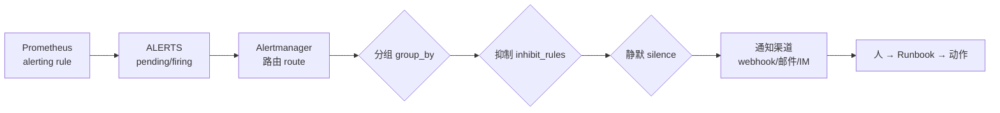

---
tags:
  - Linux
  - 可观测性
  - 监控
  - 告警
  - Alertmanager
  - blackbox
created: 2026-09-19
---

# 告警的降噪：路由、分组、抑制与探测

> [!cite] 参考资料
> Alertmanager 官方文档的「Configuration」「Routing tree」「Inhibition」「Silences」「Notification template reference」；`amtool` 的 `check-config`/`config routes test`/`alert query`/`silence` 子命令；`blackbox_exporter` 的「Configuration」与「Metrics」。
>
> 实测输出来自 Ubuntu 24.04.4（WSL2）/ systemd 255 / 非 root：`prometheus-alertmanager` 与 `prometheus-blackbox-exporter` 以 `apt-get download` + `dpkg-deb -x` **解包运行**；Alertmanager 因 Debian 包把默认模板编译成 `/usr/share/prometheus/alertmanager/*.tmpl` 的绝对路径，用 `unshare -U -r -m` + tmpfs 覆盖 `/usr/share` 的方式绕过（步骤见实验 7）。实验后进程与临时目录已清理。

> **这篇讲什么**：「告警响了」到「有人收到一条能干活的通知」之间的全部加工：路由、分组、抑制、静默，以及**用户视角的可用性探测**（含证书到期）。这一篇的核心不是配置语法，而是**降噪的先后顺序**。
>
> **必须先读什么**：[[Linux/09_日志与监控/10_指标的判定_PromQL与告警规则|10 指标的判定：PromQL 与告警规则]]（先有 `ALERTS`，才谈得上路由）。
>
> **读完能回答**：① 分组、抑制、静默分别在解决什么问题，顺序为什么不能反？② 怎么用 `silencedBy`/`inhibitedBy` 判断一条告警被什么压住了？③ `probe_success` 和 `up` 有什么区别？④ 证书到期告警怎么写？
>
> 所属：[[Linux/09_日志与监控/00_导读与知识地图|09 日志、监控与可观测性]] 的「一次告警的一生」第 3 站 · 主要练 **S7 告警降噪与可用性探测**

## 0. 30 秒速览

> [!abstract] 这一篇只要记住六句话
> - **告警链路是「规则 → 路由 → 分组/抑制/静默 → 通知渠道 → 人」，每一段都能独立验证。**
>   - 怎么验证：`curl .../query?query=ALERTS` 看规则、`amtool config routes test` 看路由、`/api/v2/alerts` 看压制、最后才查渠道。
> - **分组让一次故障只发一条通知。**
>   - 证据：实测把同 `alertname+instance` 的两条告警发进去，webhook 收到的是一个分组 `groupKey: {}:{alertname="LabGrouped", instance="host1"}`，内含 info + warning 两条。
> - **静默是有期限的临时压制。**
>   - 证据：实测建 silence 后，对应告警变成 `suppressed`、`silencedBy=['a0c7b285-c8b1-4276-81e3-e994ff607089']`。
> - **抑制是配置层的因果关系，匹配范围决定它压谁。**
>   - 证据：实测给同一 instance 发 `critical` 后，`warning` 变成 `suppressed`、`inhibitedBy=['31beaa4cad9c8016']`；而 `info` 仍是 `active`——因为抑制规则只匹配 `severity="warning"`。
> - **`up` 和 `probe_success` 不是一回事：前者是「指标抓得到吗」，后者是「用户视角能用吗」。**
>   - 证据：实测 blackbox 对本地目标返回 `probe_success=1`、`probe_http_status_code=200`、`probe_duration_seconds=0.000621696`。
> - **证书到期必须配探测告警。**
>   - 证据：实测 `probe_ssl_earliest_cert_expiry=1.803656795e+09`，换算成「剩余 160.5 天」；告警表达式 `probe_ssl_earliest_cert_expiry - time() < 14*86400`。

## 1. 告警链路全景



**排查「告警不响」时，就沿这条链一段一段走**：`ALERTS` 有没有 → 路由匹配到哪个 receiver → 是否被抑制/静默 → 渠道是否可用。跳过前面几段直接查渠道，是最常见的低效排查。

## 2. 路由与分组

```yaml
route:
  receiver: webhook
  group_by: ["alertname", "instance"]     # 按这两个 label 分组
  group_wait: 1s                          # 首次通知前等待，让同组告警一起发
  group_interval: 5s                      # 同组新增告警后多久再发
  repeat_interval: 1h                     # 未恢复时多久重复提醒
receivers:
  - name: webhook
    webhook_configs:
      - url: http://127.0.0.1:18080/alerts
```

```bash
amtool check-config am.yml
amtool config routes test --config.file=am.yml severity=warning alertname=LabGrouped instance=host1
```

```text
Checking 'am.yml'  SUCCESS
Found:
 - global config
 - route
 - 1 inhibit rules
 - 1 receivers
 - 0 templates
webhook
```

`amtool config routes test` 的价值在于**离线判断「这条告警会被送到哪个 receiver」**，不需要真的把告警发出去。

### 2.1 实测：三条告警进来，webhook 收到几组

把三条告警 POST 进 Alertmanager（同一组的 info + warning，以及另一组的 warning）：

```text
groupKey: {}:{alertname="LabGrouped", instance="host1"} | alerts: [('LabGrouped', 'info'), ('LabGrouped', 'warning')]
groupKey: {}:{alertname="LabOther", instance="host2"}   | alerts: [('LabOther', 'warning')]
```

**两条同组告警合并成一次通知**，另一组单独一条——`group_by` 里的 label 组合决定「什么算同一个故障」。

| 参数 | 作用 | 常见错误 |
| --- | --- | --- |
| `group_by` | 按哪些 label 聚合 | 不含 `alertname` 会把无关告警合并；含高基数 label（如 `pod`）会让分组失效 |
| `group_wait` | 首次通知前等多久 | 设太短会失去聚合效果；设太长会延迟报警 |
| `group_interval` | 同组有新告警时的再发间隔 | 设太短会造成通知轰炸 |
| `repeat_interval` | 未恢复时重复提醒间隔 | 设太短会让人麻木；设太长会漏掉长时间未处理的故障 |

## 3. 静默与抑制：解决两个不同的问题

### 3.1 静默（silence）：临时、有期限、操作层

```bash
amtool silence add alertname=LabOther \
  --alertmanager.url=http://127.0.0.1:19093 --duration=10m --comment="实验：维护窗口"
```

```text
a0c7b285-c8b1-4276-81e3-e994ff607089
```

查询当前告警状态，可以看到静默的生效方式：

```text
LabOther     host2  warning   suppressed inhibitedBy=[] silencedBy=['a0c7b285-c8b1-4276-81e3-e994ff607089']
```

**静默只影响通知，不影响告警状态**——告警依然存在于 Alertmanager 里，只是不再推给人。它适合：维护窗口、已知问题的临时压制。**必须带期限、原因、创建人**，维护窗口结束后要复查有没有遗留 silence。

### 3.2 抑制（inhibition）：配置层、表达因果

```yaml
inhibit_rules:
  - source_matchers: [severity="critical"]     # 谁去压别人
    target_matchers: [severity="warning"]      # 压谁
    equal: ["instance"]                        # 同一个对象
```

实测：给同一 instance 再发一条 `critical` 之后：

```text
LabInhibit   host1  critical  active     inhibitedBy=[] silencedBy=[]
LabGrouped   host1  warning   suppressed inhibitedBy=['31beaa4cad9c8016'] silencedBy=[]
LabGrouped   host1  info      active     inhibitedBy=[] silencedBy=[]
```

三个细节值得注意：

1. **抑制是「用高优先级压低优先级」**：机器已经宕机时，不必再报「磁盘使用率高」。
2. **`info` 没有被压掉**：因为 `target_matchers` 只写了 `severity="warning"`。**抑制的匹配范围决定它压谁**，写窄了会漏掉噪声，写宽了会压掉真故障。
3. **必须用 `equal` 限定对象**：不写 `equal` 就变成「任何 critical 压掉任何 warning」，这是典型的过度抑制。

### 3.3 降噪顺序：分组 → 抑制 → 静默 → 最后才是调阈值

| 顺序 | 手段 | 层次 | 什么时候做 |
| --- | --- | --- | --- |
| 1 | 分组（`group_by`） | 配置，事前 | 同一故障天生会产生多条告警时 |
| 2 | 抑制（`inhibit_rules`） | 配置，事前 | 存在确定因果关系时（宕机 ⇒ 其他指标异常） |
| 3 | 静默（silence） | 操作，有期限 | 维护窗口、已知问题 |
| 4 | 调阈值 / 延长 `for` | 降低灵敏度 | **必须复盘后再做**，且要评估漏报风险 |

**顺序反了会漏掉真故障**：一遇风暴就调阈值，等于把灵敏度整体下调，将来的真故障也一起被过滤掉。

## 4. blackbox：用户视角的可用性

Prometheus 抓的是「目标能否返回指标」，blackbox 探的是**用户视角的可用性**（HTTP/TCP/ICMP/DNS）与 TLS 证书。

```bash
bb/usr/bin/prometheus-blackbox-exporter --config.file=bb.yml --web.listen-address=127.0.0.1:19115 &
curl -s "http://127.0.0.1:19115/probe?module=http_2xx&target=http://127.0.0.1:19115/-/healthy" \
  | grep -E "^(probe_success|probe_http_status_code|probe_duration_seconds) "
curl -s "http://127.0.0.1:19115/probe?module=tcp_connect&target=127.0.0.1:19115" | grep "^probe_success "
curl -s "http://127.0.0.1:19115/probe?module=http_2xx&target=https://mirrors.aliyun.com" \
  | grep -E "^(probe_success|probe_ssl_earliest_cert_expiry) "
```

本机实测：

```text
probe_duration_seconds 0.000621696
probe_http_status_code 200
probe_success 1
probe_success 1                      # TCP 探测
probe_ssl_earliest_cert_expiry 1.803656795e+09
```

常用指标：

| 指标 | 含义 | 用途 |
| --- | --- | --- |
| `probe_success` | 0/1 | 可用性告警的判据 |
| `probe_duration_seconds` | 探测总耗时 | 用户视角的延迟 |
| `probe_http_status_code` | HTTP 状态码 | 区分「连不上」和「返回 500」 |
| `probe_ssl_earliest_cert_expiry` | 证书最早到期时间（Unix 时间戳） | 证书到期告警 |
| `probe_dns_lookup_time_seconds` | DNS 解析耗时 | 解析慢导致的「偶发慢」 |

证书告警表达式（**注意 `time()` 也是 Unix 时间戳，单位是秒**）：

```text
probe_ssl_earliest_cert_expiry - time() < 14 * 86400
```

实测把上面的时间戳换算成天数：

```bash
python3 -c "import time; e=1.803656795e9; print('剩余 %.1f 天' % ((e-time.time())/86400))"   # 验证：输出「剩余 160.5 天」
```

> [!warning] 探测对「路径」敏感，上线前要用真实路径验证
> 本机同一环境下探测两个站点时，一个返回 `probe_success=1`，另一个返回 `probe_success=0`（该站点在本机 WSL2 网络路径下探测失败）。这说明**探测结果是「从探测点到目标」这条路径的结论**，不是「目标一定挂了」。部署 blackbox 时要做两件事：① 用真实探测源验证；② 把 `probe_success==0` 与 `probe_http_status_code` 一起看，避免把网络路径问题当成服务故障。

## 5. 生产动作：把告警规范与路由配出来

> [!example]- 实验 7：分组、抑制、静默各验证一次（含模板路径的绕法）
> 目标：看到 `groupKey`、`silencedBy`、`inhibitedBy` 三种真实输出。
> ```bash
> D=$(mktemp -d /tmp/am-lab.XXXXXX); cd "$D"
> apt-get download prometheus-alertmanager >/dev/null 2>&1
> mkdir am; dpkg-deb -x prometheus-alertmanager_*.deb am
> # 一个把 POST body 追加到文件的 webhook
> printf "%s\n" "from http.server import BaseHTTPRequestHandler, HTTPServer" "import sys" \
>   "class H(BaseHTTPRequestHandler):" "    def do_POST(self):" \
>   "        n=int(self.headers.get(\"Content-Length\",\"0\"))" \
>   "        open(sys.argv[2],\"ab\").write(self.rfile.read(n)+b\"\n\")" \
>   "        self.send_response(200); self.end_headers()" \
>   "    def log_message(self,*a): pass" \
>   "HTTPServer((\"127.0.0.1\",int(sys.argv[1])),H).serve_forever()" > w.py
> python3 w.py 18080 "$D/webhook.log" & WH=$!
> am/usr/bin/amtool check-config am.yml                          # 验证：SUCCESS（配置见上文两段 YAML）
> am/usr/bin/amtool config routes test --config.file=am.yml severity=warning alertname=LabGrouped instance=host1
> # Debian 包缺 /usr/share/prometheus/alertmanager/*.tmpl：用用户命名空间 + tmpfs 临时补上
> unshare -U -r -m bash -c "mount -t tmpfs tmpfs /usr/share && mkdir -p /usr/share/prometheus && \
>   cp -a $D/am/usr/share/prometheus/alertmanager /usr/share/prometheus/ && \
>   exec $D/am/usr/bin/prometheus-alertmanager --config.file=$D/am.yml --storage.path=$D/data \
>     --web.listen-address=127.0.0.1:19093 --cluster.listen-address= --log.level=error" & AM=$!
> sleep 5; curl -s -o /dev/null -w "health=%{http_code}\n" http://127.0.0.1:19093/-/healthy
> # 发三条告警 → 看分组；再发 critical → 看抑制；建 silence → 看静默
> kill $AM $WH; cd /; rm -rf "$D"
> ```
> **预期**：webhook 收到两个 `groupKey`；建 silence 后对应告警 `silencedBy=[id]`；同 instance 的 critical 让 warning `inhibitedBy=[fingerprint]`（本机实测值分别见第 2、3 节）。
> **风险**：中（`unshare -U -r -m` 会在用户命名空间内临时覆盖 `/usr/share`，仅在该进程树内有效；解包运行不写系统目录）。
> **回滚**：`kill` 两个进程、删除临时目录；命名空间内的挂载随进程退出自动消失。
> **耗时**：30 分钟。
>
> 环境：Ubuntu 24.04.4（WSL2）/ 非 root。**生产环境请正常安装 Alertmanager**，并按第 5 节的告警规范配路由。

## 常见坑

| 常见做法或说法 | 后果或事实 |
| --- | --- |
| 一遇告警风暴就调高阈值 | 灵敏度整体下降，真故障也被过滤；正确顺序是分组 → 抑制 → 静默 |
| `group_by` 里放高基数 label | 每个 `pod`/`request_id` 各自成组，分组等于没用 |
| 不写 `equal` 就做抑制 | 「任何 critical 压掉任何 warning」，真故障被压掉 |
| 用静默「永久解决」噪声 | 静默有期限，到期会恢复；真正的噪声要靠修规则/改阈值并复盘 |
| 认为 `up == 1` 就等于服务可用 | `up` 只表示指标抓得到；用户视角可用性要靠 blackbox 探测 |
| 证书告警只在到期前一天配 | 续期与验证需要时间；通常提前 14~30 天告警 |
| 没验证过探测路径就上线 | 探测结果取决于「探测点 → 目标」这条路径；本机实测同环境下两个站点结果就不同 |

## 决策练习

**场景**：一次机架断电导致 20 台机器同时不可达。由于这些机器上跑着相同的服务，告警系统在 1 分钟内推了 300 条通知，值班同事把群消息屏蔽了，结果两天后另一台机器的磁盘告警没人看到。

**A. 给所有告警加 `group_wait: 5m`，让通知少一点**
**B. 把同一服务的同类告警按 `group_by` 合并，并加「机器不可达（critical）抑制同一实例的其他告警」的规则；同时把「磁盘水位」这类基础设施告警路由到独立的 receiver**
**C. 把所有告警的 `severity` 降到 `info`，避免打扰值班**

**为什么选 B**：这次事件暴露了两个问题——**同一故障产生大量同质告警**（用分组解决）、**因果关系导致的连带告警**（用抑制解决）。把基础设施类告警单独路由，则保证它们在「服务故障刷屏」时仍然能被看见。这三条都是配置层的事前手段。

**为什么不选 A**：延长 `group_wait` 只是让通知晚到几分钟，数量没有本质变化；而且会延迟真正需要立刻响应的告警。

**为什么不选 C**：把所有告警降级等于「取消告警」——问题从「被打扰」变成了「不知道」，这正是事件最后造成后果的原因。

## 要点自测

> [!question]- 分组、抑制、静默分别在解决什么问题？顺序为什么不能反？
> - **分组**：同一故障产生的多条告警合并成一条通知（配置层，事前）。
> - **抑制**：存在确定因果关系时，用高优先级压掉低优先级（配置层，事前）。
> - **静默**：维护窗口或已知问题的**有期限**压制（操作层）。
> - **顺序**：配置层的事先解决大多数噪声；静默是临时手段；调阈值属于降低灵敏度，必须复盘后做。
> - **第一反应不要是什么**：不要在风暴时先改阈值。

> [!question]- 怎么知道一条告警被什么压住了？
> - **查 `/api/v2/alerts` 的 `status` 字段**：`state` 为 `active`/`suppressed`，并给出 `silencedBy` 与 `inhibitedBy`。
> - **实测**：silence 后 `silencedBy=['a0c7b285-c8b1-4276-81e3-e994ff607089']`；同 instance 的 critical 让 warning `inhibitedBy=['31beaa4cad9c8016']`。
> - **用 `amtool silence query`** 看有哪些静默还挂着，避免维护窗口后遗留。
> - **第一反应不要是什么**：不要去翻规则文件猜，状态字段里有答案。

> [!question]- `up` 和 `probe_success` 有什么区别？证书到期告警怎么写？
> - **`up`**：Prometheus 能否抓到目标的 `/metrics`，是「监控链路」的健康度。
> - **`probe_success`**：blackbox 从探测点能否按预期访问目标（HTTP/TCP/ICMP/DNS），更接近用户视角。
> - **证书**：`probe_ssl_earliest_cert_expiry - time() < 14 * 86400`；实测该指标值为 `1.803656795e+09`（换算剩余 160.5 天）。
> - **注意**：探测结果依赖探测路径，上线前必须用真实探测源验证。
> - **第一反应不要是什么**：不要把 `up=1` 当成「服务对用户可用」。

> 上一篇：[[Linux/09_日志与监控/10_指标的判定_PromQL与告警规则|10 指标的判定：PromQL 与告警规则]] ｜ 下一篇：[[Linux/09_日志与监控/12_告警的问责_SLI_SLO与错误预算|12 告警的问责：SLI/SLO 与错误预算]]
