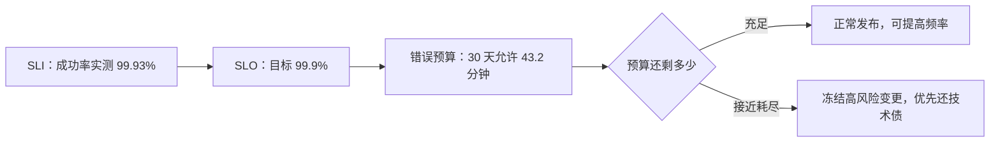

---
tags:
  - Linux
  - 可观测性
  - 监控
  - 告警
  - SLO
created: 2026-09-19
---

# 告警的问责：SLI/SLO 与错误预算

> [!cite] 参考资料
> Google SRE Book 的「Service Level Objectives」「Embracing Risk」「Monitoring Distributed Systems」；SRE Workbook 的「Alerting on SLOs」（多窗口、多消耗速率的 burn-rate 告警）；Prometheus 官方文档的「Alerting practices」。
>
> **实测环境：Ubuntu 24.04.5 LTS（VMware 虚拟机）/ 内核 `6.8.0-139-generic` / systemd 255（`255.4-1ubuntu8.17`）/ cgroup2fs（v2）/ 4 vCPU / `MemTotal` 7894 MiB / root 可用。**
>
> 本篇的换算表已在本实验机上用 **Python 3.12.3** 重新算过一遍并粘贴，可完全复现。**注意：换算表是「给定 30 天窗口的算术推演」，不是对某台机器实测出来的停机时间**；SLO 的**组织落地**（谁来定目标、谁来批发布冻结）属于流程问题，本实验机无法实测，本篇只给可计算的部分。

> **这篇讲什么**：告警的最后一站——**谁来负责、凭什么决定优先级**。核心结论是：没有 SLO，「哪些告警立刻处理」就只能靠嗓门；有了 SLO 与错误预算，优先级就变成可以算的东西。
>
> **必须先读什么**：[[Linux/09_日志与监控/11_告警的降噪_路由分组抑制与探测|11 告警的降噪：路由、分组、抑制与探测]]。
>
> **读完能回答**：① SLI、SLO、错误预算分别是什么？② 99.9% 在 30 天里等于多少停机时间？③ 怎么用错误预算决定「能不能发版」？④ 告警分层的三种手段是什么？⑤ 一条合格的告警应该包含什么内容？
>
> 所属：[[Linux/09_日志与监控/00_导读与知识地图|09 日志、监控与可观测性]] 的「一次告警的一生」第 4 站 · 主要练 **S8 SLO 与错误预算**

## 0. 30 秒速览

> [!abstract] 这一篇只要记住六句话
> - **三个定义先分清：SLI 是实际测量值，SLO 是对它的目标，错误预算是 `1 - SLO` 的允许额度。**
>   - 怎么验证：给一个服务写出「SLI 用哪条表达式、SLO 目标多少、窗口多长」三句话，写不出就说明目标还没定义。
> - **99.9% 听起来很高，折算成时间只有 43.2 分钟/30 天。**
>   - 证据：本机实测换算表里 99% → 432.00 分钟、99.9% → 43.20 分钟、99.99% → 4.32 分钟、99.999% → 25.9 秒。
> - **SLO 是决策工具，不是考核工具。**
>   - 怎么验证：用错误预算回答「这个月还能不能发版」；答不上来说明它还没被用起来。
> - **告警分层靠三个手段：预算消耗速率、基础设施水位、单点抖动过滤。**
>   - 怎么验证：抽查一条告警，能说清它属于哪一层、对应什么动作。
> - **不要用「平均值」定义 SLO。**
>   - 怎么验证：SLI 用「成功请求比例」或分位数，并写清窗口（如 30 天滚动）与口径（哪些请求算、哪些不算）；本机实测数据证明平均值会掩盖长尾（平均 33.5ms、最大 2000ms，见子笔记 13）。
> - **每条告警都要能对应动作。**
>   - 怎么验证：抽查告警的 `summary`/`description` 里有没有 Runbook 链接与负责人；没有就该删掉或降级。

## 1. 三个定义

| 概念 | 是什么 | 例子 |
| --- | --- | --- |
| SLI（Indicator） | 实际测量值 | HTTP 成功率、p99 延迟、可用性、耗时中位数 |
| SLO（Objective） | 对 SLI 设的目标 | 「30 天滚动窗口内成功率 ≥ 99.9%」 |
| 错误预算（Error Budget） | `1 - SLO` 对应的允许额度 | 99.9% → 30 天里允许 43.2 分钟不达标 |



## 2. 换算表：几个 9 到底是多少时间

本机实测（Python 3.12.3 计算，30 天窗口 = 2592000 秒）：

```text
      SLO%              秒               分钟      平均每天(秒)
       99%       25920.0 秒 (   432.00 分钟)      864.00 秒
     99.5%       12960.0 秒 (   216.00 分钟)      432.00 秒
     99.9%        2592.0 秒 (    43.20 分钟)       86.40 秒
    99.95%        1296.0 秒 (    21.60 分钟)       43.20 秒
    99.99%         259.2 秒 (     4.32 分钟)        8.64 秒
   99.999%          25.9 秒 (     0.43 分钟)        0.86 秒
```

复现方式（只用标准库，任何装了 `python3` 的机器都能算出同一张表）：

```bash
python3 -c "
w = 30*24*3600
print('%10s %14s %16s %12s' % ('SLO%','秒','分钟','平均每天(秒)'))
for slo in [99, 99.5, 99.9, 99.95, 99.99, 99.999]:
    down = w*(1-slo/100)
    print('%9s%% %13.1f 秒 (%9.2f 分钟) %11.2f 秒' % (slo, down, down/60, down/(30)))
"
```

这张表的用法有两个方向：

- **定目标时**：把「几个 9」翻译成「每月允许多久不达标」，再问团队「这个预算我们守得住吗」。99.99% 意味着一个月只能不可用 4.32 分钟——包括发布、演练、依赖抖动。
- **复盘时**：把实际中断时间加总，与预算对比，用数字讨论而不是用感觉。

> [!important] 「几个 9」的说法
> 99% = 2 个 9、99.9% = 3 个 9、99.99% = 4 个 9。**多一个 9，允许中断时间就少一个数量级**——这也是为什么「我们目标 99.99%」这句话必须和架构投入一起评估。

> [!warning] 这张表是算术推演，不是某台机器的实测停机时间
> 表里的秒数是 `窗口长度 × (1 - SLO)` 直接算出来的，与任何机器无关。真正的「本月已经不可用了多久」要靠 SLI 的时序数据算——**别把这张表当成实测的可用性**。

## 3. 用错误预算做决策

| 预算状态 | 建议动作 | 判断依据 |
| --- | --- | --- |
| 充足 | 正常发布、可以做风险较高的变更 | 消耗速率低于预算可承受的水平 |
| 接近耗尽 | 冻结高风险变更、优先修稳定性问题 | 消耗速率明显高于预算 |
| 已耗尽 | 只做修复与回滚，暂停功能发布 | 预算为负 |

**注意 SLO 的适用范围**：它约束的是「用户体验」，不是「某台机器的资源水位」。CPU 打满但用户没受影响，不消耗错误预算；反过来，资源看起来正常但请求成功率下降，就在消耗预算。这就是为什么错误预算必须建立在**用户视角的 SLI**（成功率、延迟）上。

> [!tip] 机器水位告警与 SLO 告警的分工
> 本机实测的 node_exporter 指标（`node_load1=0.18`、`node_filesystem_avail_bytes{mountpoint="/"}=3.8498992128e+10`、`node_memory_MemAvailable_bytes=7.495938048e+09`）都只说明**机器此刻的状态**，说明不了用户是否受影响。它们属于「基础设施水位」那一层，**不能拿来当 SLO 的 SLI**。

### 3.1 告警分层：三种手段

| 层次 | 手段 | 适用 |
| --- | --- | --- |
| 预算消耗速率（burn rate） | 短窗口 + 长窗口同时超过阈值（例如「1 小时消耗掉 2% 预算」） | 快速恶化：立刻处理 |
| 慢速消耗 | 更长窗口的消耗速率告警 | 长期劣化：排期处理 |
| 基础设施水位 | 磁盘/内存/句柄/证书/`up`，按影响面分级 | 有明确处置动作的确定性风险 |
| 单点抖动 | `for` + 分位数 + 持续窗口过滤 | 避免误报 |

**为什么要有「快烧」和「慢烧」两档**：只看瞬时错误率会在小流量时疯狂误报，只看 30 天平均又会把「今天已经烧掉一半预算」这种情况漏掉。多窗口 + 多消耗速率是业界通行的折中。

## 4. 告警规范：让告警「可执行」

| 项目 | 要求 | 反例 |
| --- | --- | --- |
| 命名 | `<级别>-<对象>-<现象>`，如 `critical-node-disk-full` | `Alert_1` |
| `severity` | 统一取值：`critical`/`warning`/`info` | 自定义一堆级别 |
| `summary` | 一句话说清「什么坏了、影响什么」 | 「指标异常」 |
| `description` | 关键数值 + Runbook 链接 | 只有规则表达式 |
| 路由 | 按服务/团队路由到不同 receiver | 全部塞进一个群 |
| 抑制 | 只表达确定的因果关系，必须写 `equal` | 「critical 压所有 warning」 |
| 静默 | 带期限、原因、创建人；到期复查 | 永久静默 |
| 复盘 | 误报/漏报都要复盘（阈值、`for`、窗口、采集间隔） | 只在出事故时复盘 |

> [!tip] 「每条告警都要能对应动作」这条纪律怎么落地
> 具体做法是给每条告警配一个 Runbook 链接，里面写清「第一步跑什么命令、看哪个面板、找谁」。**做不到这一点的告警，要么删掉，要么降级成面板上的指标**——留着只会消耗值班同学的注意力，而注意力是最稀缺的资源。

## 5. 生产动作：写一份 SLO 定义卡

> [!example]- 实验 8：给一个服务定义 SLI/SLO，并算出错误预算
> 目标：产出一份可以被追问、可以被计算的 SLO 卡。
> ```text
> 服务：order-api
> SLI-1（可用性）：成功请求数 / 总请求数   （成功 = HTTP 非 5xx 且非超时）
> SLI-2（延迟）  ：p99 处理耗时
> 统计窗口：30 天滚动
> 口径：只统计来自网关的真实用户请求，不含健康检查、内部心跳、压测流量
> SLO-1：30 天可用性 ≥ 99.9%   → 错误预算 2592 秒（43.2 分钟）
> SLO-2：30 天 p99 ≤ 800ms     → 用直方图统计，口径与 SLI-2 一致
> 告警：1 小时窗口消耗超过 2% 预算 → critical（立刻处理）
>       6 小时窗口消耗超过 5% 预算 → warning（当天处理）
> 责任人：<服务 owner>；Runbook：<链接>
> ```
> **验证**：用同样的表达式在 Prometheus 里算一次当周的实际成功率，看与面板、与日志抽样是否一致；错误预算的秒数用第 2 节的 Python 片段复算一遍。
> **风险**：无（纯纸面 + 只读查询）。
> **耗时**：30 分钟。
>
> 环境：任意。**计算部分已在本实验机（Ubuntu 24.04.5 LTS / Python 3.12.3）上用脚本验证**（见第 2 节换算表），可原样复现；**组织流程部分（谁定 SLO、谁批准发布冻结）未实测**，属于团队约定。

## 常见坑

| 常见做法或说法 | 后果或事实 |
| --- | --- |
| 用平均值定义 SLO | 「平均延迟 200ms」可能掩盖 1% 用户等 2 秒；SLO 要用成功率或分位数 |
| 不写口径 | 每个团队的「99.9%」都不一样；必须写清哪些请求算、窗口多长 |
| 把 SLO 当 KPI 考核 | 会让团队隐藏问题、压低目标；SLO 是决策工具 |
| 把换算表当成实测可用性 | 表里是 `窗口 × (1-SLO)` 的算术结果；真实可用性要靠 SLI 时序算 |
| 只配阈值告警不配消耗速率告警 | 小流量时误报、大故障时漏报；多窗口 burn-rate 是更稳的做法 |
| 半夜叫醒人的告警不是「用户受影响」 | 应当分级：只有影响用户的告警才允许打扰休息时间 |
| 只有 `summary` 没有 Runbook | 收到告警的人还得从零开始排查，响应时间被浪费 |
| 误报只调阈值不复盘 | 真正原因可能是采集间隔、窗口、口径；不复盘就会反复发生 |

## 决策练习

**场景**：一个核心服务的 SLO 是「30 天可用性 ≥ 99.9%」。本月刚过 10 天，可用性已经掉到 99.93%，同时下周有一个计划中的大版本发布。

**A. 照常发布，反正现在还是达标的**
**B. 先算出已消耗的预算比例与消耗速率，评估大版本的风险，再决定「发布、延后、或拆分灰度」**
**C. 把 SLO 改成 99.8%，这样就不算超预算了**

**为什么选 B**：99.9% 的预算是 43.2 分钟（本机换算表实测值）；10 天就掉到 99.93% 意味着消耗速度明显高于预算允许的水平。这种情况下的正确动作是**用数字评估风险**：剩余预算还能承受多长的不可用？大版本的复杂度与回滚方案是否可控？据此决定节奏。

**为什么不选 A**：「现在仍然达标」是静态视角；预算消耗有速率，照当前速度下去本月会超支。发布决策要看的是速率与剩余额度，不是当前值。

**为什么不选 C**：修改 SLO 以规避超支，等于取消了这个指标的意义。SLO 可以调整，但必须是基于「用户预期变化」的重新评估，而不是事后找台阶。

## 要点自测

> [!question]- SLI、SLO、错误预算分别是什么？各自回答什么问题？
> - **SLI**：实际测量值（成功率、p99、可用性）——「现在到底怎么样」。
> - **SLO**：对 SLI 的目标（如 30 天 ≥ 99.9%）——「我们希望到什么程度」。
> - **错误预算**：`1 - SLO` 的允许额度（99.9% → 30 天 43.20 分钟）——「还能折腾多久」。
> - **第一反应不要是什么**：不要把 SLO 当成考核指标，它约束的是用户体验，不是机器水位。

> [!question]- 为什么不能用平均值定义 SLO？
> - **平均值掩盖长尾**：1% 的请求慢 100 倍，平均值只涨几毫秒，但体验已经崩了。
> - **正确做法**：用「成功请求比例」或分位数，并写清窗口与口径。
> - **实测参考**：30 天窗口下 99.9% 只允许 43.20 分钟不达标（本机 Python 换算表）；同一份 1000 个样本的数据里平均 33.5ms、最大 2000ms，p95 按四种口径是 20.0/24.0/96.0/100.0 ms（子笔记 13）。
> - **第一反应不要是什么**：不要用「平均响应时间达标」证明服务体验没问题。

> [!question]- 告警分层有哪三种手段？
> - **SLO 消耗速率**：快烧（1 小时烧掉 2% 预算）→ 立刻处理；慢烧（6 小时烧掉 5%）→ 排期。
> - **基础设施水位**：磁盘/内存/句柄/证书/`up`，按影响面分级。
> - **单点抖动过滤**：`for` + 分位数 + 持续窗口，避免瞬时毛刺变成通知。
> - **第一反应不要是什么**：不要所有告警都用同一个 `severity` 和同一个通知渠道。

> 上一篇：[[Linux/09_日志与监控/11_告警的降噪_路由分组抑制与探测|11 告警的降噪：路由、分组、抑制与探测]] ｜ 下一篇：[[Linux/09_日志与监控/13_统计口径_平均分位数与采样偏差|13 统计口径：平均、分位数与采样偏差]]
