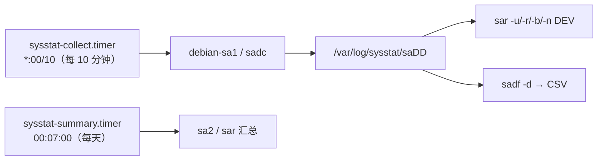

---
tags:
  - Linux
  - 可观测性
  - 监控
  - sysstat
  - 历史指标
created: 2026-09-19
---

# 历史指标与事后复盘：sysstat

> [!cite] 参考资料
> `man 1 sar`、`man 1 sadc`、`man 1 sadf`、`man 5 sysstat`、发行版自带的 `/etc/sysstat/sysstat`（Ubuntu 24.04）、`/etc/cron.d/sysstat`、`sysstat-collect.timer`/`sysstat-summary.timer`。RHEL 系的 `/etc/sysconfig/sysstat` 与 `ENABLED=` **未在本机实测**。
>
> **实测环境：Ubuntu 24.04.5 LTS（VMware 虚拟机）/ 内核 `6.8.0-139-generic` / systemd 255（`255.4-1ubuntu8.17`）/ cgroup2fs（v2）/ 4 vCPU / `MemTotal` 7894 MiB / root 可用。**
>
> **⚠️ 本篇的案例方向与旧版笔记完全相反：`sysstat` 在本机是「已安装且正在采」的状态。** `sysstat 12.6.1-2` 已在系统里，`sar`/`iostat`/`mpstat`/`pidstat`/`sadf` 都在 `/usr/bin/` 下，`sysstat-collect.timer` 与 `sysstat-summary.timer` 都是 `enabled`，**`/var/log/sysstat/sa19` 真实存在（23096 字节，当天数据）**。所以本篇的教训不是「本机没装、所以没有历史」，而是——**「先确认有数据，再读数据」**。下面所有 `sar`/`sadf` 输出都是从 `/var/log/sysstat/sa19` 真读出来的；只有一次「手工采样到 `/tmp` 再读回」的演示是写临时文件，实验后已清理。

> **这篇讲什么**：每台机器**自带一份可回溯的历史**，而且不依赖监控平台的可用性。sysstat 用 `sadc` 周期采样、`sar` 读取、`sadf` 导出；本篇讲清楚机制、默认保留期，以及「事故之后才发现它根本没在采」这类翻车怎么防。
>
> **必须先读什么**：[[Linux/09_日志与监控/02_前置_证据的时间与格式基线|02 前置：证据的时间与格式基线]]（`sadf` 导出的是 UTC，最容易踩）。
>
> **读完能回答**：① `sadc`/`sar`/`sadf` 各做什么？② 数据存在哪、默认留几天、谁在触发采样？③ 怎么复盘「昨晚 3 点系统变慢」？④ 为什么 `sar` 有时会「没有数据」，怎么提前发现？
>
> 所属：[[Linux/09_日志与监控/00_导读与知识地图|09 日志、监控与可观测性]] 的「历史指标」横切线 · 主要练 **S1 可观测性基线盘点**、**S9 历史复盘与成本基线**

## 0. 30 秒速览

> [!abstract] 这一篇只要记住五句话
> - **三种角色的分工：`sadc` 采样、`sar` 读取、`sadf` 导出 CSV。**
>   - 证据：本机实测 `sadc` 在 `/usr/lib/sysstat/sadc`（不在 `PATH` 里），`sar`/`sadf` 在 `/usr/bin/`；`/usr/lib/sysstat/` 下还有 `debian-sa1`/`sa1`/`sa2` 这三个包装脚本。
> - **复盘的第一步永远是「先确认有数据」。**
>   - 证据：本机实测 `ls -l /var/log/sysstat/` 给出 `-rw-r--r-- 1 root root 23096 Sep 19 08:00 sa19`；`systemctl is-enabled sysstat-collect.timer sysstat-summary.timer` 两行都是 `enabled`；`sysstat-collect.timer` 的 `LAST` 是 `08:00:12 UTC`。**有数据，才谈得上分析。**
> - **机制可复现：采样 → 读回 → 导出，三段都能真跑。**
>   - 证据：实测 `sadc 1 3 /tmp/…/sa-lab` 采 3 个样本后，`sar -u -f` 读出 `08:06:18`、`08:06:19` 两个采样点与 `Average:`，`-r`/`-n DEV` 也正常，`sadf -d` 导出对应 CSV。
> - **默认只保留 7 天，要留两周必须显式改并验证。**
>   - 证据：实测 `/etc/sysstat/sysstat` 里 `HISTORY=7`、`COMPRESSAFTER=10`、`SADC_OPTIONS="-S DISK"`、`SA_DIR=/var/log/sysstat`、`ZIP="xz"`；采集由 `sysstat-collect.timer`（`OnCalendar=*:00/10`）驱动，**包内还保留了一套 `/etc/cron.d/sysstat` 计划**。
> - **时间口径要先对：本机时区是 `Etc/UTC`，所以 `sar` 的「本地时间」与 `sadf -d` 的 UTC 完全一致（差 0）；换成非 UTC 机器就会差一个时区。**
>   - 证据：本机实测同一采样点在 `sar -u -f /var/log/sysstat/sa19` 里是 `08:00:12 AM`，在 `sadf -d … -- -u` 里是 `2026-09-19 08:00:12 UTC`——**没有差值**；而给 `TZ=Asia/Shanghai` 后同一时刻会显示成 `16:08:53+08:00`（子笔记 02 的 TZ 演示）。

## 1. 机制：谁在采样、谁在读



本机实测（先确认有数据，再手工采样一次到 `/tmp` 并读回）：

```bash
ls -l /var/log/sysstat/                                  # 验证：有当天的 saDD 文件
systemctl is-enabled sysstat-collect.timer sysstat-summary.timer
command -v sadc; ls -l /usr/lib/sysstat/                 # 验证：sadc 不在 PATH，在 /usr/lib/sysstat
rm -rf /tmp/09c-sysstat && mkdir -p /tmp/09c-sysstat
nice -n 19 /usr/lib/sysstat/sadc 1 3 /tmp/09c-sysstat/sa-lab     # 采样：1 秒一次、共 3 次
LC_ALL=C sar -u -f /tmp/09c-sysstat/sa-lab
LC_ALL=C sar -r -f /tmp/09c-sysstat/sa-lab | tail -2
LC_ALL=C sar -n DEV -f /tmp/09c-sysstat/sa-lab | tail -2
LC_ALL=C sadf -d /tmp/09c-sysstat/sa-lab -- -u
rm -rf /tmp/09c-sysstat                                  # 清理：手工采样的数据不留在系统里
```

```text
-rw-r--r-- 1 root root 23096 Sep 19 08:00 sa19
enabled
enabled
/usr/lib/sysstat/debian-sa1
/usr/lib/sysstat/sa1
/usr/lib/sysstat/sa2
/usr/lib/sysstat/sadc

Linux 6.8.0-139-generic (linux-lab) 	09/19/26 	_x86_64_	(4 CPU)

08:06:17        CPU     %user     %nice   %system   %iowait    %steal     %idle
08:06:18        all     11.93      0.00      9.90      0.00      0.00     78.17
08:06:19        all      0.25      0.00      0.25      0.00      0.00     99.50
Average:        all      6.05      0.00      5.04      0.00      0.00     88.92
08:06:19      4969656   7464404    197700      2.45    175680   2321772    333332      2.71    335056   2213332      1420
Average:      4965966   7460714    201268      2.49    175680   2321770    335154      2.73    336354   2213332      1412
Average:           lo      0.00      0.00      0.00      0.00      0.00      0.00      0.00      0.00
Average:        ens33     23.50     33.50      3.76      6.48      0.00      0.00      0.00      0.01
linux-lab;1;2026-09-19 08:06:18 UTC;-1;11.93;0.00;9.90;0.00;0.00;78.17
linux-lab;1;2026-09-19 08:06:19 UTC;-1;0.25;0.00;0.25;0.00;0.00;99.50
```

三点读法：

1. **`sar -u` 的表头第二行是「时刻」，`Average:` 是整段窗口的平均**——和其他工具一样，「平均」与「瞬时」要分清。上例里第一个采样点 `%user=11.93` 是 `sadc` 自己刚启动那一下的开销，第二个点 `0.25` 才是稳态。
2. **`-n DEV` 的输出是有列名的**（`IFACE rxpck/s txpck/s rxkB/s txkB/s …`）；之所以容易以为「没有列名」，是因为示例常用 `tail -2` 看尾部、把表头截掉了——去掉 `tail` 或先 `head -3` 就能看到。**别把「命令截断的产物」当成工具行为。**
3. **`sadf -d` 的第一行是以 `#` 开头的列名行**，并且数据行的时间戳带 `UTC`。本机 `TZ=Etc/UTC`，所以它和 `sar` 显示的本地时间**一模一样**——别因此以为「在任何机器上都一样」。

## 2. 常用用法

```bash
ls -l /var/log/sysstat/                                    # 验证：到底有没有在采（第一步）
sar -u -s 07:30:00 -e 08:00:00                             # 验证：指定窗口的 CPU
sar -r -s 07:30:00 -e 08:00:00                             # 内存
sar -b                                                     # IO 总体
sar -d                                                     # 每块盘的 IO
sar -n DEV                                                 # 网卡
sar -q                                                     # 负载与运行队列
sadf -d /var/log/sysstat/sa<DD> -- -u | head               # 导出 CSV（UTC！）
```

**时间窗参数按本地时区解释**（`-s`/`-e` 的格式是 `HH:MM:SS`），但导出的 CSV 是 UTC。本机实测窗口过滤真的可用：

```text
$ LC_ALL=C sar -u -s 07:30:00 -e 08:00:00
Linux 6.8.0-139-generic (linux-lab) 	09/19/26 	_x86_64_	(4 CPU)

07:30:16        CPU     %user     %nice   %system   %iowait    %steal     %idle
07:40:16        all      0.09      0.00      0.06      0.00      0.00     99.85
07:50:16        all      1.51      0.00      0.74      0.01      0.00     97.74
Average:        all      0.80      0.00      0.40      0.01      0.00     98.80
```

**注意 07:50 那一行 `%user=1.51`**：整个 30 分钟窗口的平均只有 `0.80`，而单个 10 分钟采样点是它的近两倍。**这就是「用窗口平均做结论会稀释尖峰」的活例**——也正是子笔记 13 讲的采样偏差。

## 3. 默认保留期与采集计划

实测从发行版包里读到的配置（`/etc/sysstat/sysstat`）：

```text
HISTORY=7                  # 历史保留 7 天
COMPRESSAFTER=10           # 10 天前的数据压缩（配合 HISTORY 使用）
SADC_OPTIONS="-S DISK"     # 额外采集磁盘统计
SA_DIR=/var/log/sysstat
ZIP="xz"
DELAY_RANGE=0
UMASK=0022
```

采集计划（**两套并存，systemd timer 是当前主力**）：

```text
$ grep OnCalendar /usr/lib/systemd/system/sysstat-collect.timer /usr/lib/systemd/system/sysstat-summary.timer
/usr/lib/systemd/system/sysstat-collect.timer:OnCalendar=*:00/10       # 每 10 分钟
/usr/lib/systemd/system/sysstat-summary.timer:OnCalendar=00:07:00      # 每天 00:07 汇总
$ grep -vE "^\s*(#|$)" /etc/cron.d/sysstat
PATH=/usr/lib/sysstat:/usr/sbin:/usr/sbin:/usr/bin:/sbin:/bin
5-55/10 * * * * root command -v debian-sa1 > /dev/null && debian-sa1 1 1
59 23 * * * root command -v debian-sa1 > /dev/null && debian-sa1 60 2
$ systemctl list-timers sysstat-collect.timer sysstat-summary.timer --no-pager
NEXT                            LEFT LAST                          PASSED UNIT                  ACTIVATES
Sat 2026-09-19 08:10:00 UTC 3min 34s Sat 2026-09-19 08:00:12 UTC 6min ago sysstat-collect.timer sysstat-collect.service
Sun 2026-09-20 00:07:00 UTC      16h -                                  - sysstat-summary.timer sysstat-summary.service
```

> [!warning] 「至少留两周」是一条要写进基线的验收项
> 默认只有 7 天（`HISTORY=7`）。如果你的故障复盘窗口是「两周内」，必须显式改成 14 或更长——**而且要在磁盘容量上留出空间**（子笔记 14；本机根文件系统只有 48.0 GiB）。RHEL 系的配置在 `/etc/sysconfig/sysstat`（`HISTORY=` 与 `ENABLED=`），**未在本机实测**。

## 4. 什么情况下 `sar` 会「没有数据」

**本机是有数据的**，所以这一节讲的是「怎么提前发现没有数据」——用真实的反例输出演示失败长什么样：

```text
$ LC_ALL=C sar -u -f /var/log/sysstat/sa32
Cannot open /var/log/sysstat/sa32: No such file or directory          # rc=2
$ LC_ALL=C sar -u -f /nonexistent
Cannot open /nonexistent: No such file or directory                   # rc=2
```

（`sa32` 对应 32 号，本机当天是 19 号，所以这个文件当然不存在——**`saDD` 的 `DD` 是「日」，不是序号**；跨月时要小心，旧笔记里的 `sa19` 就是「19 号」。）

会「没有数据」的原因有三种：

1. **sysstat 没装或没启用**：`sysstat-collect.timer` 不 enabled、旧版本用 `/etc/default/sysstat` 里的 `ENABLED="false"`。**本机不属于这一种**——两个 timer 都 `enabled`，`sa19` 也在。
2. **装了但采集失败**：`SA_DIR` 权限不对、磁盘满、timer 被 mask。这时 `saDD` 文件会缺失或大小停滞。
3. **历史被轮转/压缩了**：`HISTORY` 太小、或者数据被清理任务删掉。本机 `HISTORY=7`，所以 7 天前的数据已经不在。

> [!tip] 复盘的第一步永远是「确认有数据」
> 与 Prometheus 的 `up` 一样，历史采集本身也要被监控：**每天检查一次 `/var/log/sysstat/` 里有没有当天的 `sa<DD>` 文件、大小有没有在长**。这件事成本极低（一条 `ls -l`），却决定了事故发生后你到底有没有历史可看。
>
> 本机实测的完整验收判据就三条：① `ls -l /var/log/sysstat/` 有当天的 `saDD`；② `systemctl is-enabled sysstat-collect.timer` 是 `enabled`；③ `systemctl list-timers sysstat-collect.timer` 的 `LAST` 是最近的整十分。

## 5. 生产动作：用 `sar` 复盘一个时间窗

> [!example]- 实验 10：确认有数据 → 窗口过滤 → 导出 CSV
> 目标：把「昨晚 3 点系统变慢」变成一个可执行的复盘流程，并亲手看到 UTC 与本地时间的关系。
> ```bash
> ls -l /var/log/sysstat/                                   # 第一步：确认有数据
> systemctl is-enabled sysstat-collect.timer sysstat-summary.timer
> LC_ALL=C sar -u -s 07:30:00 -e 08:00:00                   # 窗口过滤（按本地时区解释）
> LC_ALL=C sar -r -s 07:30:00 -e 08:00:00                   # 内存
> LC_ALL=C sar -b                                           # IO 总体
> LC_ALL=C sar -d | tail -3                                 # 每块盘
> LC_ALL=C sar -n DEV | tail -4                             # 网卡
> LC_ALL=C sar -q | tail -3                                 # 负载与队列
> LC_ALL=C sadf -d /var/log/sysstat/sa19 -- -u | head -6     # 导出 CSV（UTC）
> grep -vE "^\s*(#|$)" /etc/sysstat/sysstat                  # 验证：HISTORY=7 等默认值
> grep OnCalendar /usr/lib/systemd/system/sysstat-collect.timer
> grep -vE "^\s*(#|$)" /etc/cron.d/sysstat                   # 验证：包内仍保留 cron 版计划
> ```
> **预期**：`ls -l` 有当天的 `sa19`（本机 23096 字节）；`sar -u -s/-e` 只输出窗口内的采样点（本机 07:30:16 / 07:40:16 / 07:50:16，`Average` 0.80）；`sadf -d` 第一行是 `# hostname;interval;timestamp;…`，时间戳为 UTC；配置里看到 `HISTORY=7`；timer 为 `*:00/10`。
> **风险**：低（**全程只读**，不写 `/var/log/sysstat`、不改配置；手工采样的演示另写在 `/tmp` 并删除）。
> **回滚**：无需回滚（只读）；若做了手工采样，`rm -rf /tmp/09c-sysstat` 即可。
> **耗时**：20 分钟。
>
> 环境：Ubuntu 24.04.5 LTS（VMware 虚拟机）/ root 可用。**真机上要验证的是三件事**：`ls -l /var/log/sysstat/` 有没有当天数据、`HISTORY` 是否满足复盘窗口、`timedatectl` 的时区是什么（决定 `sar` 与 `sadf -d` 差几个小时）。

## 常见坑

| 常见做法或说法 | 后果或事实 |
| --- | --- |
| 「这台机器肯定没在采」 | **先查再说**：本机 `sysstat` 已安装、两个 timer `enabled`、`/var/log/sysstat/sa19` 有 23096 字节的当天数据——**「没装」是需要验证的假设，不是默认结论** |
| 「`sar` 默认就在采，不用管」 | 默认行为因发行版与安装选项而异；本机是 enabled，但**采集失败（权限/磁盘满/timer 被 mask）时 `saDD` 会静默缺失**，所以要有巡检 |
| 「默认会留很久」 | 默认 `HISTORY=7`（本机实测），只留 7 天；复盘窗口更长就要显式改 |
| 拿 `sadf -d` 的 CSV 直接和本地日志比时间 | 导出的是 UTC。**本机 `TZ=Etc/UTC` 所以差值恰好是 0，容易被误认为「永远一致」**；换到 `Asia/Shanghai` 就差 8 小时（子笔记 02 有 TZ 演示） |
| 用 `sar -u` 的 `Average:` 判断瞬时峰值 | 平均会稀释尖峰；本机实测同一窗口里有单点 `%user=1.51` 而 `Average` 只有 `0.80` |
| 只看当前 `top` 就下结论 | 即时工具看不到过去；事后复盘必须靠历史采集 |
| 以为 `sar -n DEV` 没有列名 | 它有表头（`IFACE rxpck/s …`）；只看 `tail -2` 会把表头截掉，别把「命令截断的产物」当成工具行为 |
| 把 `saDD` 的 `DD` 当成序号 | `DD` 是「日」；本机当天是 19 号 → `sa19`，查 `sa32` 只会得到 `Cannot open …: No such file or directory`（rc=2） |
| 换了发行版还用同一套路径 | RHEL 系是 `/etc/sysconfig/sysstat`；Ubuntu 24.04 是 `/etc/sysstat/sysstat`（**RHEL 路径未实测**） |

## 决策练习

**场景**：业务反馈「昨晚 3 点左右系统变慢」。你登录机器后执行 `sar -u -s 03:00:00 -e 04:00:00`，得到的是空输出，`ls -l /var/log/sysstat/` 里只有今天的 `sa<今天>`。此时故障已经恢复。

**A. 用 `top` 和 `vmstat` 看现在的状态，据此推断昨晚的情况**
**B. 先确认这台机器是不是根本没在采（timer/服务/权限），再从别的证据源找那个时间窗：同机的日志、上游监控的历史指标、下游依赖的延迟记录**
**C. 直接把这台机器重启，看看问题是不是会复现**

**为什么选 B**：历史数据缺失是**事实**，不能靠即时工具弥补。此时正确的动作有两步：① 查清「为什么没采」——本机的验收判据是 `ls -l /var/log/sysstat/`、`systemctl is-enabled sysstat-collect.timer`、`systemctl list-timers` 三条；② 用其它存在的时间窗证据交叉印证（日志里的慢请求、上游/下游的记录、变更时间线）。**注意 `sar` 的默认输入是「当天」的 `sa<DD>`，`-f` 不指定日期的话看不到昨天。**

**为什么不选 A**：`top`/`vmstat` 反映的是此刻；用此刻的状态解释昨晚的现象，是本篇反复强调的典型错误。

**为什么不选 C**：重启会破坏现场（进程、连接、缓存状态），而且故障可能不再出现——你就永远不知道根因。

## 要点自测

> [!question]- `sadc`、`sar`、`sadf` 各做什么？
> - **`sadc`**：采样器，把样本写进 `SA_DIR`（本机 `/var/log/sysstat/saDD`）；**它在 `/usr/lib/sysstat/` 而不在 `PATH` 里**，实测 `command -v sadc` 无输出。
> - **`sar`**：读取器，按维度看 CPU/内存/IO/网卡/负载（`-u`/`-r`/`-b`/`-d`/`-n DEV`/`-q`）。
> - **`sadf`**：导出器，`sadf -d` 输出 CSV，**时间戳是 UTC**。
> - **触发方**：`sysstat-collect.timer`（实测 `*:00/10`，`enabled`）与 `sysstat-summary.timer`（实测 `00:07:00`，`enabled`），另外 `/etc/cron.d/sysstat` 里还留了一套 cron 版计划。
> - **第一反应不要是什么**：不要以为采样一定在跑——但也**不要以为它一定没跑**；先 `ls -l /var/log/sysstat/`。

> [!question]- 怎么用 `sar` 复盘「昨晚 3 点系统变慢」？
> - **前提**：先 `ls -l /var/log/sysstat/` 确认有对应日期的数据；没有数据就只能找别的证据源。
> - **窗口过滤**：`sar -u -s 03:00:00 -e 04:00:00`，再看 `-r`（内存）、`-b`/`-d`（IO）、`-n DEV`（网络）、`-q`（负载）。窗口参数按**本地时区**解释。
> - **交叉对照**：CPU 低但 `%iowait` 高、内存 `kbmemfree` 掉且 `si/so` 起、网络 `txkB/s` 冲高——不同组合指向不同资源。本机实测 `sar -r` 的尾部有 `kbdirty=52`、`%commit=2.73`，`sar -b` 的 `Average` 是 `tps 3.28 / rtps 1.70 / wtps 1.58`，都是可以拿来对照的量。
> - **导出对比**：`sadf -d /var/log/sysstat/sa<DD> -- -u` 出 CSV（**注意 UTC**）。
> - **第一反应不要是什么**：不要只凭现在的 `top` 下结论。

> [!question]- 为什么 sysstat 有时会「没有数据」？怎么防？
> - **原因**：没装/没启用（timer 未 enable）、采集失败（权限、磁盘满、timer 被 mask）、历史被清（`HISTORY` 太小，本机默认 7 天）。
> - **失败长什么样**：`sar -u -f /var/log/sysstat/sa32` → `Cannot open /var/log/sysstat/sa32: No such file or directory`（rc=2）。
> - **本机实测的正面案例**：`sysstat` 已安装、两个 timer 都 `enabled`、`sa19` 存在且 `LAST=08:00:12 UTC`——**这才是「有历史」的样子**。
> - **预防**：把「`/var/log/sysstat/` 有当天文件且大小在增长」纳入日常巡检，并把 `HISTORY` 按复盘窗口调整。
> - **第一反应不要是什么**：不要在没有历史数据的机器上做「事后复盘」，也不要在有数据的机器上凭印象说「没有历史」。

> 上一篇：[[Linux/09_日志与监控/14_成本与容量纪律_保留期基数与采样率|14 成本与容量纪律]] ｜ 下一篇：[[Linux/09_日志与监控/16_分布式追踪_trace与span|16 分布式追踪：trace 与 span]]
