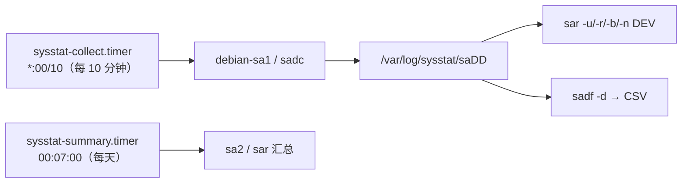

---
tags:
  - Linux
  - 可观测性
  - 监控
  - sysstat
  - 历史指标
created: 2026-09-19
---

# 历史指标与事后复盘：sysstat

> [!cite] 参考资料
> `man 1 sar`、`man 1 sadc`、`man 1 sadf`、`man 5 sysstat`、发行版自带的 `/etc/sysstat/sysstat`（Ubuntu 24.04）、`/etc/cron.d/sysstat`、`sysstat-collect.timer`/`sysstat-summary.timer`。RHEL 系的 `/etc/sysconfig/sysstat` 与 `ENABLED=` 未在本机实测。
>
> 实测输出来自 Ubuntu 24.04.4（WSL2）/ systemd 255 / 非 root：`sysstat` 以 `apt-get download` + `dpkg-deb -x` **解包运行**；采样写入 `/tmp` 下的临时文件，实验后已清理。**本机系统里并未安装 sysstat**——`/var/log/sysstat` 不存在，这一点本身就是本篇最有用的案例。

> **这篇讲什么**：每台机器**自带一份可回溯的历史**，而且不依赖监控平台的可用性。sysstat 用 `sadc` 周期采样、`sar` 读取、`sadf` 导出；本篇讲清楚机制、默认保留期，以及「为什么事故之后才发现它根本没在采」。
>
> **必须先读什么**：[[Linux/09_日志与监控/02_前置_证据的时间与格式基线|02 前置：证据的时间与格式基线]]（`sadf` 导出的是 UTC，最容易踩）。
>
> **读完能回答**：① `sadc`/`sar`/`sadf` 各做什么？② 数据存在哪、默认留几天、谁在触发采样？③ 怎么复盘「昨晚 3 点系统变慢」？④ 为什么 `sar` 常常「没有数据」？
>
> 所属：[[Linux/09_日志与监控/00_导读与知识地图|09 日志、监控与可观测性]] 的「历史指标」横切线 · 主要练 **S1 可观测性基线盘点**、**S9 历史复盘与成本基线**

## 0. 30 秒速览

> [!abstract] 这一篇只要记住五句话
> - **三种角色的分工：`sadc` 采样、`sar` 读取、`sadf` 导出 CSV。**
>   - 怎么验证：`sadc 1 3 <file>` 采样，再 `sar -u -f <file>` 读回——本机实测可直接复现。
> - **机制可复现，读回来的就是逐时刻的值。**
>   - 证据：实测时间列是 `12:38:25`、`12:38:26`、`Average:` 三行，`-u`/`-r`/`-n DEV` 都正常。
> - **`sadf -d` 导出的是 UTC，直接和日志比会差一个时区。**
>   - 证据：同一采样点本地是 `12:38:26`，导出成 `2026-09-19 04:38:26 UTC`。
> - **默认只保留 7 天，要留两周必须显式改并验证。**
>   - 证据：实测 `/etc/sysstat/sysstat` 里 `HISTORY=7`、`COMPRESSAFTER=10`、`SA_DIR=/var/log/sysstat`、`ZIP="xz"`；采集由 `sysstat-collect.timer`（`*:00/10`）驱动。
> - **`sar` 默认不是「开箱就在采」。**
>   - 证据：本机执行 `sar` 直接报 `Cannot open /var/log/sysstat/sa19: No such file or directory / Please check if data collecting is enabled`——交付前必须实测有没有数据。

## 1. 机制：谁在采样、谁在读



实测（解包运行，采样 3 个 1 秒样本）：

```bash
ss/usr/lib/sysstat/sadc 1 3 /tmp/ss-lab/sa-lab     # 采样：1 秒一次、共 3 次
ss/usr/bin/sar.sysstat -u -f /tmp/ss-lab/sa-lab | head -5
ss/usr/bin/sar.sysstat -r -f /tmp/ss-lab/sa-lab | tail -1
ss/usr/bin/sar.sysstat -n DEV -f /tmp/ss-lab/sa-lab | tail -2
ss/usr/bin/sadf -d /tmp/ss-lab/sa-lab -- -u | head -2
```

```text
Linux 6.6.87.2-microsoft-standard-WSL2 (realtyz) 	09/19/26 	_x86_64_	(24 CPU)

12:38:25        CPU     %user     %nice   %system   %iowait    %steal     %idle
12:38:26        all      0.00      0.00      0.00      0.00      0.00    100.00
12:38:27        all      0.25      0.00      0.21      0.08      0.00     99.46
Average:     15048332 15583454    355998      2.19     55236    653602    742256      3.64    225022    556080    137854
Average:           lo     25.00     25.00      4.37      4.37      0.00      0.00      0.00      0.00
Average:         eth0      0.50      0.50      0.03      0.03      0.00      0.00      0.00      0.00
realtyz;1;2026-09-19 04:38:26 UTC;-1;0.00;0.00;0.00;0.00;0.00;100.00
```

三点读法：

1. **`sar -u` 的表头第二行是「时刻」，`Average:` 是整段窗口的平均**——和其他工具一样，「平均」与「瞬时」要分清。
2. **`-n DEV` 的输出没有列名**，列顺序按 `man sar` 的定义（`rxpck/s txpck/s rxkB/s txkB/s …`），看之前先确认字段含义。
3. **`sadf -d` 的第一行是以 `#` 开头的列名行**（上面的输出里省略了），并且数据行的时间戳是 **UTC**。

## 2. 常用用法

```bash
ls /var/log/sysstat/                                       # 验证：到底有没有在采
sar -u -s 03:00:00 -e 04:00:00                             # 验证：指定窗口的 CPU
sar -r -s 03:00:00 -e 04:00:00                             # 内存
sar -b                                                     # IO 总体
sar -d                                                     # 每块盘的 IO
sar -n DEV                                                 # 网卡
sar -q                                                     # 负载与运行队列
sadf -d /var/log/sysstat/sa<DD> -- -u | head               # 导出 CSV（UTC！）
```

**时间窗参数按本地时间解释**（`-s`/`-e` 的格式是 `HH:MM:SS`），但导出的 CSV 是 UTC——这一点在子笔记 02 已经强调过，这里再落到具体命令上。

## 3. 默认保留期与采集计划

实测从发行版包里读到的配置（`/etc/sysstat/sysstat`）：

```text
HISTORY=7                  # 历史保留 7 天
COMPRESSAFTER=10           # 10 天前的数据压缩（配合 HISTORY 使用）
SADC_OPTIONS="-S DISK"     # 额外采集磁盘统计
SA_DIR=/var/log/sysstat
ZIP="xz"
DELAY_RANGE=0
UMASK=0022
```

采集计划（两套并存，systemd timer 是当前主力）：

```text
$ grep OnCalendar ss/usr/lib/systemd/system/sysstat-collect.timer ss/usr/lib/systemd/system/sysstat-summary.timer
ss/usr/lib/systemd/system/sysstat-collect.timer:OnCalendar=*:00/10     # 每 10 分钟
ss/usr/lib/systemd/system/sysstat-summary.timer:OnCalendar=00:07:00    # 每天 00:07 汇总
$ grep -vE "^\s*(#|$)" ss/etc/cron.d/sysstat
PATH=/usr/lib/sysstat:/usr/sbin:/usr/sbin:/usr/bin:/sbin:/bin
5-55/10 * * * * root command -v debian-sa1 > /dev/null && debian-sa1 1 1
59 23 * * * root command -v debian-sa1 > /dev/null && debian-sa1 60 2
```

> [!warning] 「至少留两周」是一条要写进基线的验收项
> 默认只有 7 天（`HISTORY=7`）。如果你的故障复盘窗口是「两周内」，必须显式改成 14 或更长——**而且要在磁盘容量上留出空间**（子笔记 14）。RHEL 系的配置在 `/etc/sysconfig/sysstat`（`HISTORY=` 与 `ENABLED=`），**未在本机实测**。

## 4. 为什么 `sar` 常常「没有数据」

本机实测的两种失败形态：

```text
$ ls /var/log/sysstat/
ls: cannot access '/var/log/sysstat': No such file or directory
$ ss/usr/bin/sar.sysstat -u
Cannot open /var/log/sysstat/sa19: No such file or directory
Please check if data collecting is enabled
```

原因是三种之一：

1. **sysstat 没装或没启用**：`sysstat-collect.timer` 不 enabled、旧版本用 `/etc/default/sysstat` 里的 `ENABLED="false"`。
2. **装了但采集失败**：`SA_DIR` 权限不对、磁盘满、timer 被 mask。
3. **历史被轮转/压缩了**：`HISTORY` 太小，或者数据被 cron/tmpfiles 清掉。

> [!tip] 复盘的第一步永远是「确认有数据」
> 与 Prometheus 的 `up` 一样，历史采集本身也要被监控：**每天检查一次 `/var/log/sysstat/` 里有没有当天的文件**。这件事成本极低，却决定了事故发生后你到底有没有历史可看。

## 5. 生产动作：用 `sar` 复盘一个时间窗

> [!example]- 实验 10：采样 → 读回 → 导出 CSV
> 目标：不装系统包也能把 sysstat 的机制跑通，并亲手看到 UTC 的时间戳差异。
> ```bash
> D=$(mktemp -d /tmp/sysstat-lab.XXXXXX); cd "$D"
> apt-get download sysstat >/dev/null 2>&1
> mkdir ss; dpkg-deb -x sysstat_*.deb ss
> S="$PWD/ss/usr/bin/sar.sysstat"                 # Debian 的二进制名是 sar.sysstat
> ss/usr/lib/sysstat/sadc 1 3 "$D/sa-lab"         # 采 3 个样本
> "$S" -u -f "$D/sa-lab" | head -6                # CPU
> "$S" -r -f "$D/sa-lab" | tail -2                # 内存
> "$S" -n DEV -f "$D/sa-lab" | tail -2            # 网卡
> ss/usr/bin/sadf -d "$D/sa-lab" -- -u | head -3  # 导出 CSV（注意 UTC）
> grep -vE "^\s*(#|$)" ss/etc/sysstat/sysstat     # 验证：HISTORY=7 等默认值
> grep OnCalendar ss/usr/lib/systemd/system/sysstat-collect.timer
> grep -vE "^\s*(#|$)" ss/etc/cron.d/sysstat      # 验证：包内仍保留 cron 版计划
> cd /; rm -rf "$D"
> ```
> **预期**：能读回三段采样；CSV 第一行是 `# hostname;interval;timestamp;…`，时间戳为 UTC；配置里看到 `HISTORY=7`；timer 为 `*:00/10`。
> **风险**：低（解包运行、数据写临时目录）。
> **回滚**：删除临时目录。
> **耗时**：20 分钟。
>
> 环境：Ubuntu 24.04.4（WSL2）/ 非 root。**真机上要验证的是另一件事**：`ls /var/log/sysstat/` 有没有当天数据、`HISTORY` 是否满足复盘窗口。

## 常见坑

| 常见做法或说法 | 后果或事实 |
| --- | --- |
| 「`sar` 默认就在采」 | 本机实测 `sar` 报 `Please check if data collecting is enabled`，`/var/log/sysstat` 不存在 |
| 「默认会留很久」 | 默认 `HISTORY=7`（本机实测），只留 7 天 |
| 拿 `sadf -d` 的 CSV 直接和本地日志比时间 | 导出的是 UTC，实测同一时刻差 8 小时 |
| 用 `sar -u` 的 `Average:` 判断瞬时峰值 | 平均会稀释尖峰；要看逐行时刻或最大值 |
| 只看当前 `top` 就下结论 | 即时工具看不到过去；事后复盘必须靠历史采集 |
| 假设 `sar -n DEV` 的输出有列名 | 默认没有列名，字段顺序要查 `man sar` |
| 换了发行版还用同一套路径 | RHEL 系是 `/etc/sysconfig/sysstat`；Ubuntu 24.04 是 `/etc/sysstat/sysstat` |

## 决策练习

**场景**：业务反馈「昨晚 3 点左右系统变慢」。你登录机器后执行 `sar -u`，得到 `Cannot open /var/log/sysstat/sa19: No such file or directory / Please check if data collecting is enabled`。此时故障已经恢复。

**A. 用 `top` 和 `vmstat` 看现在的状态，据此推断昨晚的情况**
**B. 先确认这台机器是不是根本没在采（timer/服务/权限），再从别的证据源找那个时间窗：同机的日志、上游监控的历史指标、下游依赖的延迟记录**
**C. 直接把这台机器重启，看看问题是不是会复现**

**为什么选 B**：历史数据缺失是**事实**，不能靠即时工具弥补。此时正确的动作有两步：① 查清「为什么没采」（这是要修的稳定性问题）；② 用其它存在的时间窗证据交叉印证（日志里的慢请求、上游/下游的记录、变更时间线）。

**为什么不选 A**：`top`/`vmstat` 反映的是此刻；用此刻的状态解释昨晚的现象，是本篇反复强调的典型错误。

**为什么不选 C**：重启会破坏现场（进程、连接、缓存状态），而且故障可能不再出现——你就永远不知道根因。

## 要点自测

> [!question]- `sadc`、`sar`、`sadf` 各做什么？
> - **`sadc`**：采样器，把样本写进 `/var/log/sysstat/saDD`（本机实测 `sadc 1 3 <file>` 可指定文件）。
> - **`sar`**：读取器，按维度看 CPU/内存/IO/网卡/负载（`-u`/`-r`/`-b`/`-n DEV`/`-q`）。
> - **`sadf`**：导出器，`sadf -d` 输出 CSV，**时间戳是 UTC**。
> - **触发方**：`sysstat-collect.timer`（实测 `*:00/10`）与 `sysstat-summary.timer`（实测 `00:07:00`），包内也保留了 cron 版计划。
> - **第一反应不要是什么**：不要以为采样一定在跑。

> [!question]- 怎么用 `sar` 复盘「昨晚 3 点系统变慢」？
> - **前提**：先 `ls /var/log/sysstat/` 确认有数据；没有数据就只能找别的证据源。
> - **窗口过滤**：`sar -u -s 03:00:00 -e 04:00:00`，再看 `-r`（内存）、`-b`/`-d`（IO）、`-n DEV`（网络）、`-q`（负载）。
> - **交叉对照**：CPU 低但 `%iowait` 高、内存 `kbmemfree` 掉且 `si/so` 起、网络 `txkB/s` 冲高——不同组合指向不同资源。
> - **导出对比**：`sadf -d <file> -- -u` 出 CSV（**注意 UTC**）。
> - **第一反应不要是什么**：不要只凭现在的 `top` 下结论。

> [!question]- 为什么 sysstat 常常「没有数据」？怎么防？
> - **原因**：没装/没启用（timer 未 enable）、采集失败（权限、磁盘满）、历史被清（`HISTORY` 太小）。
> - **本机实测现象**：`sar` 报 `Cannot open /var/log/sysstat/sa19: No such file or directory / Please check if data collecting is enabled`。
> - **预防**：把「`/var/log/sysstat/` 有当天文件」纳入日常巡检，并把 `HISTORY` 按复盘窗口调整（默认 7 天）。
> - **第一反应不要是什么**：不要在没有历史数据的机器上做「事后复盘」。

> 上一篇：[[Linux/09_日志与监控/14_成本与容量纪律_保留期基数与采样率|14 成本与容量纪律]] ｜ 下一篇：[[Linux/09_日志与监控/16_分布式追踪_trace与span|16 分布式追踪：trace 与 span]]
