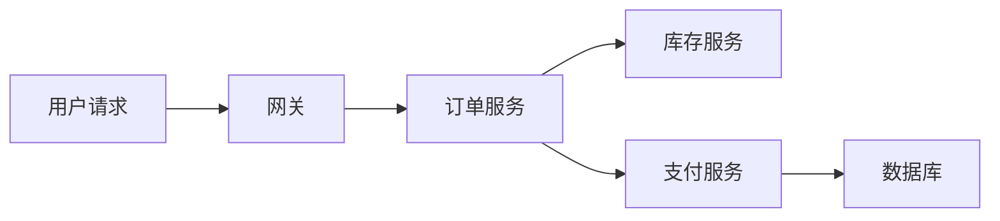

---
tags:
  - Linux
  - 可观测性
  - 追踪
  - OpenTelemetry
created: 2026-09-19
---

# 分布式追踪：trace 与 span

> [!cite] 参考资料
> W3C Trace Context 规范（`traceparent`/`tracestate`）；OpenTelemetry 的「Signals」「Context propagation」「Sampling」文档；Jaeger/Tempo 的官方概念说明。
>
> **实测环境：Ubuntu 24.04.5 LTS（VMware 虚拟机）/ 内核 `6.8.0-139-generic` / systemd 255（`255.4-1ubuntu8.17`）/ cgroup2fs（v2）/ 4 vCPU / `MemTotal` 7894 MiB / root 可用。**
>
> 本篇输出已在**本实验机**上本次重跑并粘贴，替换了原 WSL2 输出：`traceparent` 的生成、父子 span 的 `trace_id` 共享、以及 7 类非法头部的拒绝行为，全部用 **Python 3.12.3** 在 `/tmp` 下的临时脚本完成（可完全复现，脚本已删）。**追踪后端（OpenTelemetry Collector、Jaeger/Tempo）未在本机部署，属未实测**；本篇只验证数据模型与上下文透传这一层。

> **这篇讲什么**：一次请求跨多个服务时，日志与指标都拼不出「这一次请求慢在哪一段」。追踪补的就是这一段。本篇讲数据模型（trace/span）、上下文透传（W3C `traceparent`）与采样策略，并给出**成本最低的落地方案**。
>
> **必须先读什么**：[[Linux/09_日志与监控/04_日志的诞生_格式与落点选择|04 日志的诞生：格式与落点选择]]（`request_id`/`trace_id` 写进日志）。
>
> **读完能回答**：① trace 和 span 是什么关系？② `traceparent` 里的每一段是什么？③ 头部采样与尾部采样怎么选？④ 不部署追踪后端，能先做什么？⑤ 什么时候该想到追踪？
>
> 所属：[[Linux/09_日志与监控/00_导读与知识地图|09 日志、监控与可观测性]] 的「取用顺序」横切线 · 主要练 **S5 指标采集与语义** · 难度：**进阶**（第一遍只需知道有这条路）

## 0. 30 秒速览

> [!abstract] 这一篇只要记住五句话
> - **一次请求跨多个服务时，日志拼不出「这一次请求慢在哪一段」——追踪补的就是这段。**
>   - 怎么验证：找一个跨服务的慢请求，看能不能用日志算出「哪个下游花了多少时间」；算不出来就是缺追踪。
> - **数据模型是两个概念：`trace` 是一次完整调用，`span` 是其中一段。**
>   - 证据：本机实测在同一 `trace_id` 下生成入口与下游两个 span，两者 `trace_id` 相同（`b62974f7d235e7af7f15e50ba76b4121`），下游的 `parent_span_id` 正好等于入口的 `span_id`（`30931907edc3dcf8`）。
> - **跨服务传递靠 HTTP 头，格式是「版本-`trace_id`-父 `span_id`-标志位」，四段缺一不可。**
>   - 证据：本机实测生成的合法头为 `00-3fa03269c9ca9544f21003009cbf188c-82e38b7a157275d3-01`（32 位十六进制 `trace_id`、16 位 `span_id`）；只有 3 段的头一律被拒（`必须是 4 段`）。
> - **标志位最后一个字节的 `01` 表示已采样，采样决策要随头透传。**
>   - 证据：本机实测把 last byte 换成 `00` 后解析出 `sampled=False`；`03` 这种带保留位的值被拒（`保留位必须为 0，得到 '03'`）。
> - **最小落地只要两步，采样与后端可以后置。**
>   - 怎么验证：能不能从一条错误日志里的 `trace_id` 跳到同一次请求的全部日志；能跳，说明第一步已经做到。

## 1. 为什么需要追踪



上面这条链路上，如果用户抱怨「下单很慢」：

- **指标**能告诉你「订单服务的 p99 变差了」——但不知道差在哪一段。
- **日志**能告诉你「每个服务各自做了什么」——但**没有一个字段把这次请求串起来**。
- **追踪**能直接给出这一次请求的 span 树：网关 20ms、订单 1.2s、库存 30ms、支付 1.1s、数据库 900ms。

## 2. 数据模型：trace 与 span

| 概念 | 含义 | 关键标识 |
| --- | --- | --- |
| trace | 一次完整调用 | `trace_id`（全局唯一） |
| span | 其中一段（一次 RPC、一次 DB 查询、一次缓存访问） | `span_id` + `parent_span_id` |

本机实测（生成一个父 span 与一个子 span，验证两者共享同一个 `trace_id` 且父 ID 正确）：

```text
traceparent: 00-b62974f7d235e7af7f15e50ba76b4121-30931907edc3dcf8-01
version=00 trace_id=b62974f7d235e7af7f15e50ba76b4121(32 hex) parent_id=30931907edc3dcf8(16 hex) sampled=1

入口 span  trace_id=b62974f7d235e7af7f15e50ba76b4121 span_id=30931907edc3dcf8
下游 span  trace_id=b62974f7d235e7af7f15e50ba76b4121 span_id=cab3552d09c64724 parent_span_id=30931907edc3dcf8
两者 trace_id 相同: True
```

字段含义：

| 段 | 长度 | 作用 |
| --- | --- | --- |
| `version` | 2 位十六进制 | 协议版本，当前是 `00` |
| `trace_id` | 32 位十六进制（16 字节） | 贯穿整条链路的标识 |
| `parent_id` | 16 位十六进制（8 字节） | 调用方的 span id，下游以它为父创建自己的 span |
| `flags` | 2 位十六进制 | 最低位表示「是否被采样」（`01` = 采样，`00` = 不采样）；**其余位是保留位，必须为 0** |

### 2.1 实测：一个按规范校验的解析器会拒绝什么

本机用一个严格按 W3C Trace Context 写的解析器跑了 7 个反例（输出里的输入串被截断显示到 40 字符）：

```text
traceparent: 00-3fa03269c9ca9544f21003009cbf188c-82e38b7a157275d3-01
version=00 trace_id=3fa03269c9ca9544f21003009cbf188c(32 hex) parent_id=82e38b7a157275d3(16 hex) sampled=1

-- 合法但未采样的头部 --
  00-d3fa58acff28490596708400adea7787-7fa21f9c3360dc0e-00 -> sampled=False

-- 非法头部一律拒绝 --
  00-00000000000000000000000000000000-57b5 拒绝 -> trace_id 不能全零（规范禁止）      [trace_id 全零]
  00-8db16ff331e47859ebb79a8980d91e10-0000 拒绝 -> parent_id 不能全零（规范禁止）     [parent_id 全零]
  00-8b45146f5a334f04-80b3c5c21ba12b0c-01  拒绝 -> trace_id 必须是 32 位小写十六进制，得到 16 位   [trace_id 只有 16 位]
  00-41966522743af20fb41d7614553cb34c-0e32 拒绝 -> parent_id 必须是 16 位小写十六进制，得到 8 位   [parent_id 只有 8 位]
  00-43512f43d842430abe3a36b4e3e30828-863d 拒绝 -> 保留位必须为 0，得到 '03'         [保留位非 0]
  ff-a565ebee79c88541721462b6f39e6168-8fbb 拒绝 -> version 必须是 00，得到 'ff'       [version 非 00]
  00-957c9d6209ffe10eae0d2325c1fba45f-9a85 拒绝 -> 必须是 4 段                       [只有 3 段]
```

**这七条的反面就是生产上最常见的四种错误**：`trace_id`/`span_id` 长度写错、全零 ID、保留位非 0、以及**把 `traceparent` 截断成 3 段**（很多自研 SDK 只传 `trace_id` 与 `span_id`，忘了 `version` 或 `flags`）。**实现或对接上下文透传时，先拿这七条做一轮单测。**

> [!important] 为什么采样标志要透传
> 如果每个服务各自决定「要不要采样」，就会出现链路断片：上游采了、下游没采，中间的耗时永远算不出来。**把采样决策放在入口做一次，然后随 `traceparent` 一路传下去**，是保证链路完整性的最小成本方案。

> [!warning] 时钟不同步会毁掉 span 树
> 跨机 span 的先后关系依赖**各机器的墙上时钟**。时钟漂移会让父子顺序错乱、耗时算成负数——这也是子笔记 02 那份「时间基线卡」对追踪同样重要的原因。本机实测 `timedatectl` 是 `Time zone: Etc/UTC`、`System clock synchronized: no`（`NTP service: active`）——**同步状态都是「否」，跨机做追踪前必须先把这个前提修好**。

## 3. 采样策略：头部 vs 尾部

| 策略 | 在哪里决定 | 优点 | 代价 |
| --- | --- | --- | --- |
| 头部采样（head-based） | 入口服务按比例决定 | 实现简单、下游一致、开销低 | 决策时不知道结果，可能丢掉所有错误请求（除非按错误强制采） |
| 尾部采样（tail-based） | 收集端看完整 trace 后决定 | 能保证「错误/慢请求必采」 | 需要收集端缓存与更高资源 |

实践中常见的组合：

1. **入口按比例头部采样**（例如 10%），覆盖大部分正常流量。
2. **关键路径与错误强制采样**（例如错误全部采、支付链路 100%）。
3. **高流量场景再加尾部采样**，只保留「慢/错/特定用户」的 trace。

## 4. 最小落地：先做什么、后做什么

| 阶段 | 做什么 | 成本 | 收益 |
| --- | --- | --- | --- |
| 第一步 | 上下文透传（HTTP 头）+ 把 `trace_id` 写进日志 | 低 | 日志可以按一次请求串起来，**不依赖追踪后端** |
| 第二步 | 接入 OpenTelemetry SDK，上报 span 到后端 | 中 | 能看到 span 树与耗时分布 |
| 第三步 | 配置采样策略与保留期，纳入成本基线 | 中高 | 控制成本并保证「慢/错必采」 |

**第一步是性价比最高的一步**：只要日志里带上 `trace_id`，排障时就能从一条错误日志跳到同一次请求的所有日志。这一点与子笔记 04 的「请求 ID 是日志必备字段」是同一件事。

## 5. 「服务慢但资源都空闲」——追踪的主场

这类问题的现象是「CPU/内存/IO 都不高，但延迟飙升」。指标能缩小范围，最终答案通常在**依赖、锁或串行化**上：

1. **先用指标确认「确实不忙」**：`us/sy/wa/si`、PSI、`iostat`、`ss -ti`（重传、`app_limited`）。本机实测 `/proc/pressure/io:some total=4908689` 与 `io:full total=4106769` 同量级，`vmstat 1 3` 的 `wa=0~1`、`id=93~98`——**这就是「资源看起来不忙」的现场样本**。
2. **看请求维度**：错误率与延迟分位数（哪个接口、哪个实例、从几点开始）、下游依赖的成功率与延迟。
3. **用追踪看一次请求**：耗时落在哪个 span；有没有重试、串行调用、长尾依赖。
4. **常见根因**：锁竞争、GC/解释器停世界、DNS 解析慢、下游限流与重试风暴、日志同步落盘、单核打满（整机 CPU 不高）。

> [!tip] 追踪与日志的联动
> 有了 `trace_id`，排障路径变成：**指标发现异常 → 找一个慢/错 trace → 用 `trace_id` 去日志系统捞出这次请求的全部日志**。这比在日志里按时间窗盲搜快一个数量级。本机验证透传这一层用的 `trace_id`（如 `3fa03269c9ca9544f21003009cbf188c`）就是这样一个可以贴进日志、也可以贴进 `traceparent` 的值。

## 常见坑

| 常见做法或说法 | 后果或事实 |
| --- | --- |
| 「追踪是门户网站才需要的」 | 只要一次请求跨多个服务/依赖，「资源空闲但慢」基本只能靠追踪定位 |
| 每个服务各自决定采样 | 链路断片，中间耗时算不出来；采样标志要随 `traceparent` 透传 |
| 自研 SDK 只传 `trace_id` + `span_id` | 本机实测 3 段的头部会被规范解析器直接拒绝（`必须是 4 段`） |
| 把 `trace_id` 写成 16 位 | 规范要求 32 位小写十六进制；本机实测 16 位会被拒（`得到 16 位`） |
| 用全零 ID 当「占位」 | 规范禁止全零 `trace_id`/`parent_id`，严格实现对全零直接报错 |
| 日志里不带 `trace_id` | 拿到了慢 trace 也没法回到日志细节，两条链路对不上 |
| 100% 采样 + 长期保留 | 成本被 trace 吃掉；应按比例采样 + 错误强制采样 |
| 忽略时钟同步 | 跨机 span 顺序错乱、耗时出现负数；本机实测 `System clock synchronized: no`，做追踪前要先修 |
| 先买后端再考虑落地 | 成本最低的一步是「上下文透传 + `trace_id` 写日志」，可以先做 |

## 决策练习

**场景**：一个下单接口 P99 从 300ms 涨到 2s，但订单服务自身的 CPU、内存、GC 时间都很正常；它的下游有库存、支付、风控三个服务，其中支付的 P99 也只是从 200ms 涨到 250ms。团队决定下一步排查方向。

**A. 继续在订单服务里加更细的指标（方法级耗时）**
**B. 用追踪看一批慢请求的 span 树，找出耗时集中在哪个 span、是否有重试或串行调用**
**C. 把所有下游服务的调用超时都调大，避免订单服务超时**

**为什么选 B**：现象是「自己没有变慢，但整体变慢」，而下游各自的 P99 涨幅都不足以解释 1.7s 的差距——**答案很可能在调用模式里**（串行化、重试、超时等待、连接建立开销）。这类问题只有 span 树能直接显示出来。

**为什么不选 A**：加更细的指标要改代码、重新上线，而且指标本身也是聚合视角，仍然回答不了「这一次请求是哪一段慢」。

**为什么不选 C**：调大超时会让请求等得更久，通常使问题更严重；而且它既没有定位根因，也增加了资源占用。

## 要点自测

> [!question]- trace 和 span 是什么关系？
> - **trace**：一次完整调用，有全局唯一的 `trace_id`。
> - **span**：其中一段（RPC、DB 查询、缓存访问等），有 `span_id` 与 `parent_span_id`，带开始时间与耗时。
> - **关系**：同一 trace 内的 span 通过父子关系组成一棵树，根 span 代表入口。
> - **实测**：本机生成的 `traceparent` 为 `00-3fa03269c9ca9544f21003009cbf188c-82e38b7a157275d3-01`（`trace_id` 32 位、父 `span_id` 16 位、标志位 `01`）；同一 trace 下入口 span `30931907edc3dcf8` 与下游 span `cab3552d09c64724` 的 `trace_id` 相同、`parent_span_id` 正确指回入口。
> - **第一反应不要是什么**：不要把 span 当成「日志的一条」，它是带耗时与父子关系的结构化数据。

> [!question]- 头部采样与尾部采样怎么选？
> - **头部采样**：入口按比例决定，简单、下游一致、开销低；缺点是不知结果，可能丢掉错误请求（可用「错误强制采」弥补）。
> - **尾部采样**：收集端看完整 trace 后决定，能保证「错误/慢请求必采」；代价是收集端要有缓存与资源。
> - **常见组合**：入口按比例 + 错误强制采样；高流量再加尾部采样。
> - **第一反应不要是什么**：不要让每个服务各自决定采样——那会造成链路断片。

> [!question]- 不部署追踪后端，可以先做什么？
> - **上下文透传**：接受并传递 `traceparent`（或至少传递 `request_id`）；本机实测的规范校验里，长度/全零/保留位/段数四类错误都能在单测阶段被抓住。
> - **把 `trace_id` 写进日志**：这一步就能让日志按一次请求串起来。
> - **收益**：排障时可以从一条错误日志跳到同一次请求的全部日志，**不依赖后端**。
> - **后续**：再接入 SDK、上报 span、配置采样与保留。
> - **第一反应不要是什么**：不要因为「还没上后端」就完全不做上下文透传。

> 上一篇：[[Linux/09_日志与监控/15_历史指标与事后复盘_sysstat|15 历史指标与事后复盘：sysstat]] ｜ 下一篇：[[Linux/09_日志与监控/17_可观测性故障处置手册|17 可观测性故障处置手册]]
