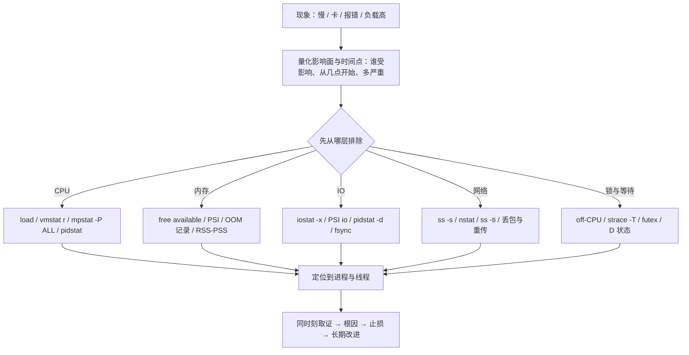
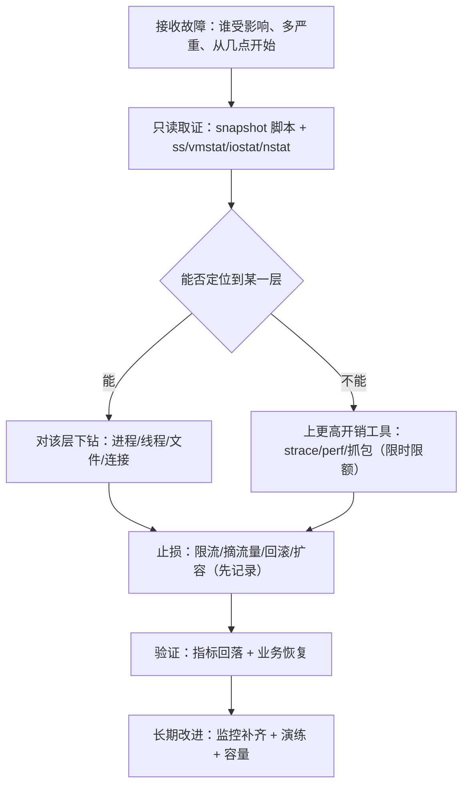

---
tags:
  - Linux
  - 性能分析
  - 故障排查
  - 方法论
  - 运维面试
created: 2026-09-17
---

# 性能分析与故障排查

> 本笔记对应 [[Linux/00_简介|Linux 大纲]] 的「阶段 10：性能分析与故障排查 ★（核心区）」。目标：把「CPU/内存/IO/网络/锁」五层资源讲成**一套可复用的排除法**——先量化影响面与时间点，再用工具取同时刻的证据，逐层排除后给出根因、止损与长期改进；并练到「10 分钟内把一个故障定位到具体资源与具体进程」。
>
> 关联复习：[[03_进程与信号]]（D 状态为什么杀不掉、自愿/非自愿切换、句柄上限）、[[04_内存管理与OOM]]（`available` 口径、Page Cache、OOM 判定、PSI）、[[05_存储与文件系统]]（`iostat` 各列、`df`/`du`、NFS 卡死）、[[06_网络协议栈与排障]]（TCP 状态机、`ss -ti`、`nstat`、抓包）、[[08_systemd与服务管理]]（cgroup 与 unit 资源限制、`systemd-cgtop`）、[[09_日志与监控]]（三条链路、USE 方法、分位数与告警）、[[11_生产运维与高可用]]（变更窗口与回滚）、[[12_复习与自测]]，以及 AI 基础设施主题域的 [[AI-Infra/09_XID与硬件故障处理|XID 与硬件故障]]、[[AI-Infra/06_NCCL排障|NCCL 排障]]（GPU/高速网卡的下钻方法不在本文展开）。
>
> 说明：结论以 man 页（`perf(1)`、`strace(1)`、`mpstat(1)`、`pidstat(1)`、`iostat(1)`、`sar(1)`、`proc(5)`、`ss(8)`、`nstat(8)`）与《Systems Performance》（Brendan Gregg）及内核文档为准。**本文的数字默认来自 Ubuntu 24.04.4 LTS / 内核 `6.6.87.2-microsoft-standard-WSL2` / 24 vCPU（i7-14650HX）/ 15.8 GiB 内存的实测**；`mpstat`/`pidstat`/`iostat`/`strace`/`perf` 都是 `apt-get download` + `dpkg-deb -x` 解包运行的（未安装、未改系统），换环境要重新取一遍。

> [!info] 读之前：实验条件与读法
> 1. **本机没有 root，也没有硬件 PMU**：`perf` 的 `cycles/instructions/cache-misses` 在 WSL 里是 `<not supported>`，只能用软件事件（`task-clock`/`context-switches`/`page-faults`）与采样；`bpftrace`/bcc 需要 root 与 `CAP_BPF`（本机 `kernel.unprivileged_bpf_disabled=2`），未实测；`fio`/`stress-ng` 解包后因缺共享库未能运行（本机用 Python/`dd` 造负载代替）。**这些限制本身也是结论**：真实云主机/容器里同样可能没有 PMU 或用不了 eBPF，排障方案要准备好降级路径。
> 2. **所有实验都在 `/tmp` 的临时目录里做、都有明确的上限**（CPU 12 秒、内存 3GiB、IO 2GiB、连接 3000 条），跑完即清理；本文只做「制造负载并观测」，不做破坏性操作。
> 3. **读法**：第一遍读 1.1（方法论）+ 1.2（load 与 CPU 五分支）+ 3.1～3.4，这是面试与日常最高频的部分；第二遍读 1.3～1.6（切换与中断、内存、IO、网络）+ 3.5～3.8；第三遍读 1.7～1.10（进程级深挖、容器视角、杀手场景、取证纪律）与第 4 节实验。

## 0. 30 秒速览

> [!abstract] 这一页只要记住六句话
> 首学读不懂很正常：先跳过这一节，读完第 1、3 节再回来逐条验证——每一条都是「结论 + 一句可复现的证据」。
> - **方法论先行：先量化影响面，再分层排除**。任何故障都按「现象与影响面 → 时间点 → 分层（CPU/内存/IO/网络/锁）→ 同时刻取证 → 根因 → 止损 → 长期改进」走；本机实测一个反直觉点：**负载只有 0.29、整机 `%usr` 只有 4.17%，但 CPU 2 已经是 100%**（`mpstat -P ALL`）——**整机平均值会掩盖单核打满**。
> - **「整机不忙但延迟高」的最短判定路径是分位数 + 单核视角**：同一个延迟探针固定在 CPU 3，无竞争时 `p50=7.31ms p95=8.01ms p99=8.16ms`，同核加入一个 spinner 后变成 `p50=17.66ms p95=21.95ms p99=22.22ms`，而期间整机 `%usr` 仍只有 **4.19%**。**先看 p99、再看每核、最后才看平均值。**
> - **CPU 的五个分支要用「谁在花时间」区分**：实测纯计算进程 `perf stat` 得到 `12.05s elapsed / 11.77s user / 0.000s sys`（`us` 型）；频繁系统调用的进程得到 `0.235s elapsed / 0.103s user / 0.131s sys`（`sy` 型）；而一个 socket ping-pong 进程实测 **自愿切换 26.9 万次/秒、非自愿切换 5.1 万次/秒**——`cs` 高但 CPU 空，多半是切换/阻塞而不是计算。
> - **内存要看「压力」而不是「用了多少」**：实测一个进程分配并触碰 3GiB 后 `VmRSS=3155904kB`、`smaps_rollup` 的 `Rss/Pss/Anonymous` 都是 3.15GB，但**可用内存还有 12GB，PSI 的 memory some/full 全是 0**；反过来，PSI 一旦长期非 0，即使 `free` 看着有余量也已经在伤延迟。
> - **IO 的三个指标不会一起走**：写 2GB 时实测 `w/s=1261`、`wkB/s≈1.47GB/s`、`w_await≈137.6ms`、`aqu-sz≈173.7`、`%util≈47.8`——**`%util` 没到 100% 不代表没有排队**；而 `fsync` 的 p50 是 **4.63ms**，纯缓冲写只有 **0.0011ms**（约 4000 倍），**同步落盘的日志是延迟杀手**。
> - **观测本身有代价，工具不可用时要有降级路径**：同一份 2 万次系统调用的 workload，直接跑 `0.03s`，套上 `strace` 后 `2.37s`（约 **79 倍**）；`perf` 在 WSL 里没有硬件计数器（`cycles` 显示 `<not supported>`），但 `task-clock` 采样仍能定位热点（`perf report` 显示 `_PyEval_EvalFrameDefault` 占 20.81%）。**排障时先用低开销手段（`/proc`、`vmstat`、`pidstat`），需要下钻再上 `strace`/`perf`。**

## 1. 概念

> [!info]- 名词速查（读到哪里卡住，就回这里查）
> | 名词 | 一句话解释 | 在哪一节展开 |
> | --- | --- | --- |
> | USE | Utilization / Saturation / Errors：按资源检查「多忙、排多长、错多少」 | 1.1、1.4～1.6 |
> | load average | 可运行 + 不可中断（D）任务的平均数，**不等于 CPU 使用率** | 1.2 |
> | `us/sy/si/wa/st` | 用户态 / 内核态 / 软中断 / IO 等待 / 被虚拟化偷走 | 1.2 |
> | 自愿切换 | 进程主动让出 CPU（等 IO、等锁、`sleep`） | 1.3 |
> | 非自愿切换 | 被抢占（时间片用完、更高优先级就绪） | 1.3 |
> | softnet_stat | 每个 CPU 的收包统计（第 2 列是 dropped） | 1.3 |
> | RSS / PSS / USS | 常驻内存 / 按共享比例分摊 / 进程独占 | 1.4 |
> | PSI | 内存/IO/CPU 的压力信号（`some` 局部、`full` 全面停顿） | 1.4 |
> | direct reclaim | 分配内存时同步回收页缓存，表现为延迟尖刺 | 1.4、1.9 |
> | `await` / `aqu-sz` / `%util` | 平均等待 / 平均队列深度 / 设备忙的比例 | 1.5 |
> | `w_await` vs `%util` | 一个看「等多久」、一个看「忙不忙」，可以互不对应 | 1.5 |
> | off-CPU 分析 | 看进程「不在 CPU 上时在等什么」 | 1.7 |
> | cgroup v2 `cpu.stat` | `nr_throttled`/`throttled_usec`：被配额掐住的证据 | 1.8 |
> | 一次性取证 | 故障现场用一条脚本同时刻抓齐所有证据 | 1.10、实验 10 |
> | 六段报告 | 时间线 / 影响面 / 证据 / 根因 / 止损 / 长期改进 | 2.3 |



### 1.1 方法论：先量化，再分层，最后才动手【核心】

性能排障和「重启试试」的区别就在于**顺序**。固定骨架：

1. **量化影响面**：谁受影响（用户/接口/实例）、多严重（错误率、p99、吞吐下降多少）、从几点开始、是否还在持续。**没有量化的「慢」无法验证是否修好。**
2. **对齐时间点**：把「开始变慢的时间」与变更（发布、配置、内核、网络、数据量）对齐（[[09_日志与监控]]、[[11_生产运维与高可用]]）。先确认时钟一致。
3. **分层排除**：CPU → 内存 → IO → 网络 → 锁/等待。每一层都有「利用率/饱和度/错误」三个问题（USE），并且**要按「影响面最小、代价最低」的顺序取证**。
4. **取同时刻证据**：`top`/`vmstat`/`iostat`/`ss`/`nstat` 在同一时刻各取一组，**重启会毁掉现场**（[[01_实验环境与操作纪律]]）。
5. **结论 → 止损 → 长期改进**：止损（限流、扩容、回滚、摘流量）与根因可以分开；改进必须包含「补监控/告警」。

三个容易被忽略的原则：

- **观测本身有成本**：`strace` 会把被测 workload 拖慢近两个数量级（实测 0.03s → 2.37s），`perf` 高频采样、eBPF 挂点同样有开销。**生产上先用低开销手段缩小范围，再对「已经定位到的少量进程」下钻。**
- **采样有偏差**：1 秒一次的采样会漏掉 200ms 的尖刺；`top` 的第一次输出是自开机以来的平均（`top` 第一屏要按 `1` 或等第二屏）；`perf` 的采样只覆盖「正在 CPU 上跑」的时间，**等锁/等 IO 的时间要靠 off-CPU 分析**（1.7）。
- **单一指标会骗人**：负载高 ≠ CPU 忙（含 D 状态）；`%util` 高 ≠ 一定排队（虚拟设备可能并行）；平均值掩盖长尾；`free` 少 ≠ 内存不足（[[04_内存管理与OOM]]）。

### 1.2 负载与 CPU：先把「谁在花时间」拆开【核心】

#### load average 到底在数什么

`/proc/loadavg` 的前三个数是 1/5/15 分钟的**可运行 + 不可中断（D 状态）任务数**。本机空闲时：

```text
$ cat /proc/loadavg; nproc
0.00 0.00 0.00 1/331 8131
24
$ uptime
 22:04:55 up  1:27,  1 user,  load average: 0.00, 0.00, 0.00
```

**判断负载要看「除以核数」**：24 核上 load=24 才相当于「所有核都在排队」；而 load=1 也可能是「一个核满载 + 其它空闲」，也可能是「一个 D 状态进程卡住」。所以 load 只能作为「有没有积压」的粗信号，**必须配合 `vmstat` 的 `r`/`b` 与 `mpstat` 的每核数据**。

#### `vmstat` 每列的含义（本机空闲基线）

```text
$ vmstat 1 3
 r  b   swpd   free   buff  cache   si   so    bi    bo   in   cs us sy id wa st gu
 0  0      0 15134364   3656 594292    0    0  1922   657  974    0  0  0 100  0  0  0
 0  0      0 15146028   3656 594292    0    0     0     0  378  264  0  0 100  0  0  0
 0  0      0 15145664   3656 595124    0    0     0     0  189  322  0  0 100  0  0  0
```

| 列 | 含义 | 判据 |
| --- | --- | --- |
| `r` | 可运行队列长度 | 持续 > 核数 → CPU 不够用 |
| `b` | 不可中断睡眠（D）的任务数 | > 0 且持续 → IO/文件系统/网络阻塞 |
| `si`/`so` | 换入/换出（KB/s） | 长期非 0 → 内存压力，延迟必抖 |
| `bi`/`bo` | 块设备读/写（块/s） | 与 `iostat` 对照 |
| `in`/`cs` | 中断数/上下文切换 | `cs` 异常高 → 锁竞争/频繁唤醒 |
| `us`/`sy`/`id`/`wa`/`st` | CPU 时间分布 | 见下表的五分支 |

#### CPU 高的五个分支：`us` / `sy` / `si` / `wa` / `st`

| 分支 | 现象 | 实测/判据 | 第一落点 |
| --- | --- | --- | --- |
| `us` 高 | 用户态计算 | 实测 `perf stat`：`12.05s elapsed / 11.77s user / 0.000s sys` | `perf record` + 火焰图找热点函数 |
| `sy` 高 | 系统调用/锁/切换 | 实测 syscall 风暴：`0.103s user / 0.131s sys` | `strace -c` 看哪个调用最多 |
| `si` 高 | 软中断（多为网络） | `mpstat` 的 `%soft`、`/proc/net/softnet_stat` | 网卡多队列/RPS、`ethtool -S`（[[06_网络协议栈与排障]]） |
| `wa` 高 | IO 等待 | `mpstat` 的 `%iowait` + `iostat -x` 的 `await` | IO 层（1.5），注意 `wa` 高但设备不忙时要查 NFS/虚拟化 |
| `st` 高 | 被虚拟化偷走 | `mpstat` 的 `%steal` | 宿主机超卖；云上提工单或换规格 |

本机实测的 `us` 型与 `sy` 型对照（同一台机器、同样的 `perf stat` 软件事件）：

```text
# 纯计算（Python 自旋 12 秒，固定一个核）
      12.05 seconds time elapsed
      11.77 seconds user
       0.00 seconds sys
              1125      page-faults
                 0      context-switches
   <not supported>      cycles:u          # WSL 没有硬件 PMU

# 频繁系统调用（2 万次循环，每次 getpid + stat）
       0.235 seconds time elapsed
       0.104 seconds user
       0.131 seconds sys        # sys 已经超过 user
```

**「整机 CPU 不高」的陷阱**：单线程打满一个核，24 核机器的整机使用率只有 ~4%。实测：

```text
$ taskset -c 2 python3 spin12.py &        # 固定 CPU 2 自旋
$ mpstat -P ALL 1 3 | grep -E "^Average: +(all|2) "
Average:     all    4.17  ...  95.83      # 整机只有 4.17% us
Average:       2  100.00  ...   0.00      # 但 CPU 2 已经 100%
$ uptime
 22:06:34 up  1:28,  1 user,  load average: 0.29, 0.08, 0.02    # 负载也不高
$ pidstat -u -t -p <pid> 1 2
22:06:37     1000      8505         -  105.00 ...  105.00     2  python3
$ top -b -n1 -H -p <pid> | tail -2
   8505 realtyz   20   0   15352   9984   6336 R  99.9   0.1   0:08.67 python3
```

**排查动作**：`mpstat -P ALL 1`（找单核）→ `pidstat -u -t -p <pid>`（是哪个线程）→ `top -H -p <pid>`（线程名）→ `taskset -cp <pid>`（绑了哪个核）→ `perf record`（热点函数）。这也是「绑核用错」的典型现场：把两个高负载进程绑到同一个核，整机看起来很闲、延迟却翻倍。

#### 线程与进程的统计口径

- `ps -eLf` / `top -H` 看线程；`pidstat -t` 按线程拆分。
- `/proc/<pid>/task/<tid>/stat` 是线程级数据；`/proc/<pid>/stat` 是进程汇总（主线程的字段）。
- **`%CPU` 可以超过 100%**（多线程进程），本机单线程 Python 的 `%usr` 实测 105%（含解释器开销），别把 >100% 当异常。

### 1.3 上下文切换与中断：CPU 没满却在「换人」【核心】

#### 自愿 vs 非自愿

- **自愿切换（voluntary）**：进程自己让出 CPU——等 IO、等锁、`sleep`、阻塞的 `recv`。**每次阻塞式系统调用基本对应一次自愿切换。**
- **非自愿切换（nonvoluntary）**：被抢占——时间片用完或被更高优先级任务挤掉。**持续高说明 CPU 竞争激烈或优先级配置有问题。**

本机实测两种极端：

```text
# ① socket ping-pong：两端阻塞收发（自愿切换爆表）
$ pidstat -w -p <pid> 1 2
22:07:30     1000      8590 269369.00  50622.00  python3      # cswch/s=26.9 万，nvcswch/s=5.1 万
$ grep -E "^(voluntary|nonvoluntary)_ctxt_switches" /proc/<pid>/status
voluntary_ctxt_switches:	809364
nonvoluntary_ctxt_switches:	156663

# ② 纯计算自旋：几乎不切换
$ grep -E "^(voluntary|nonvoluntary)_ctxt_switches" /proc/<pid>/status
voluntary_ctxt_switches:	1
nonvoluntary_ctxt_switches:	2
$ grep -E "^(nr_switches|se.sum_exec_runtime)" /proc/<pid>/sched
nr_switches                                  :                   12
se.sum_exec_runtime                          :          8462.912697
```

一个反直觉的实测细节：**`os.sched_yield()` 在「同一 CPU 上没有竞争者」时不会产生切换**（本机实测该进程 `nvcswch/s` 只有 1 次/秒）——yield 只是「让出剩余时间片」，没人可让就继续跑。

切换开销的另一面是**缓存失效**：频繁切换会把工作集从 CPU 缓存里挤掉。所以「`cs` 很高 + `us` 不高 + 吞吐上不去」通常指向锁竞争或过度唤醒，而不是算力不足。

#### 中断与软中断

```text
$ head -5 /proc/interrupts
           CPU0       CPU1  ...   CPU23
  8:          0          0  ...       0   IO-APIC   8-edge      rtc0
  9:          2          0  ...       0   IO-APIC   9-fasteoi   acpi
 24:          0          1  ...       0  Hyper-V PCIe MSI ...  virtio0-config
 25:          0          0  ...       0  Hyper-V PCIe MSI ...  virtio0-virtqueues
$ awk "{s+=\$2} END{print \"softnet dropped:\", s}" /proc/net/softnet_stat
softnet dropped: 0
```

判读要点：**中断是否集中在少数 CPU**（单队列网卡 → 一个核被 `si` 打满）、`softnet_stat` 第 2 列是否增长（收包来不及处理会丢）、以及虚拟化环境里中断由谁投递（本机是 Hyper-V 的 MSI）。多队列（RSS）与软件分流（RPS/RFS）的细节在 [[06_网络协议栈与排障]]。

### 1.4 内存：看压力，不看「用了多少」【核心】

#### 四个口径

| 指标 | 含义 | 用错会怎样 |
| --- | --- | --- |
| `MemFree` | 完全空闲的内存 | 在 Linux 上通常很少，**不是**「可用内存」 |
| `MemAvailable` | 应用真正还能申请到的量（含可回收缓存） | 告警应该用它（[[04_内存管理与OOM]]） |
| RSS / PSS / USS | 常驻 / 按共享比例分摊 / 独占 | 用 RSS 求和会重复计算共享库 |
| PSI `some`/`full` | 至少一个任务被卡 / 所有任务被卡 | 只有在真正有压力时才动，**比水位更早** |

实测：一个进程分配并触碰 3GiB 前后（本机 15.8GiB 总量）：

```text
# 分配前
$ free -m | head -2
               total        used        free      shared  buff/cache   available
Mem:           15844         711       14850           3         527       15132
$ grep -H . /proc/pressure/memory
/proc/pressure/memory:some avg10=0.00 avg60=0.00 avg300=0.00 total=0
/proc/pressure/memory:full avg10=0.00 avg60=0.00 avg300=0.00 total=0

# 分配 3GiB 并逐页触碰后
$ free -m | head -2
Mem:           15844        3787       11773           3         529       12056
$ grep -H . /proc/pressure/memory
/proc/pressure/memory:some avg10=0.00 avg60=0.00 avg300=0.00 total=0
/proc/pressure/memory:full avg10=0.00 avg60=0.00 avg300=0.00 total=0
$ grep -E "^(VmRSS|VmHWM|VmSwap)" /proc/<pid>/status
VmRSS:	 3155904 kB
VmHWM:	 3155904 kB
VmSwap:	       0 kB
$ grep -E "^(Rss|Pss|Anonymous|Private_Dirty)" /proc/<pid>/smaps_rollup
Rss:             3156000 kB
Pss:             3154139 kB
Pss_Anon:        3149600 kB
Anonymous:       3149600 kB
Private_Dirty:   3149600 kB
$ pmap -x <pid> | tail -1
total kB         3161128 3156000 3149600
$ cat /sys/kernel/mm/transparent_hugepage/enabled
always [madvise] never
```

**关键在于 PSI 全程为 0**：还有 12GB 可用时，分配 3GB 只是把内存「用掉」，并没有造成「等内存」。所以：

- **告警看 `MemAvailable` + PSI，不看 `MemFree`**；`free` 少而 PSI 为 0 是正常状态。
- **确认泄漏要看趋势不看瞬时值**：按天/周取样 RSS/PSS，区分「真泄漏」「缓存增长」「业务自然增长」（[[04_内存管理与OOM]]）。
- **direct reclaim / THP 是延迟尖刺的常见来源**：内存接近水位时分配会同步回收页缓存（表现为 `%sy` 上升 + 延迟抖动）；THP 的合并/分裂会造成偶发卡顿。本机 THP 是 `madvise`（默认），要针对具体 workload 用 `madvise(MADV_HUGEPAGE)` 或调 `THP` 策略，而不是一刀切开 `always`。

#### 与进程/GC 的关系

Java/Python/Go 这类运行时有自己的堆与 GC：**RSS 高不一定是泄漏，GC 的「停世界」会表现为周期性的延迟尖刺**。判据是：RSS 长期单调上升（不是锯齿）、GC 日志/指标与延迟尖刺对齐、以及「堆上限设置是否合理」。这类问题单看 `free`/`top` 是看不出来的，要靠应用指标 + 追踪（[[09_日志与监控]]）。

### 1.5 IO：`await`、`aqu-sz`、`%util` 不是一回事【核心】

写 2GiB 的实测（`dd if=/dev/zero of=io.bin bs=1M count=2048 conv=fdatasync`，同时 `iostat -x 1` 采样）：

```text
$ dd ... ; # 2147483648 bytes copied, 1.52299 s, 1.4 GB/s
$ iostat -x 1 5   # sdd 在写入期间的采样行
Device  r/s    rkB/s  rrqm/s %rrqm r_await rareq-sz   w/s      wkB/s  wrqm/s %wrqm w_await wareq-sz  ...  aqu-sz  %util
sdd   13.89   96.30    0.00   0.00   15.67    6.93  1261.11  1472862.96  35.19  2.71  137.56   1167.91  ...  173.70  47.78
```

三个指标要分开读：

| 指标 | 含义 | 本机数值 | 怎么用 |
| --- | --- | --- | --- |
| `w_await` | 一次写请求从提交到完成的平均时间（含排队） | **137.56 ms** | 反映「应用感知到的等待」 |
| `aqu-sz` | 平均在途请求数（队列深度） | **173.70** | 与 Little's law 对照：`aqu-sz ≈ IOPS × await` |
| `%util` | 设备「至少有一个请求在途」的时间比例 | **47.78%** | **可并行设备（SSD/虚拟盘）上不能当饱和度看** |

**「`%util` 不到 100% 但延迟已爆」的现场**（本机就是这样）：`%util` 只有 47.78%，但 `aqu-sz` 已经 173.7、`w_await` 137ms——因为设备可以并行处理请求，`%util` 的定义只回答「忙不忙」，不回答「排多长」。**判断 IO 饱和度优先看 `await` 与 `aqu-sz`，`%util` 只作参考。**

#### 从设备下钻到进程与文件

```text
$ pidstat -d 1 3            # 进程级读写速率与 iodelay
22:10:22  1000  8698   kB_rd/s 56.00  kB_wr/s 16.00  kB_ccwr/s 0.00  iodelay 0  bash
```

本机这次 `pidstat -d` 只抓到 `bash`（`dd` 在 1.5 秒内就结束了，**采样窗口没覆盖到它**）——这也是「瞬时采样漏掉短脉冲」的实例。找「谁在写盘」的可靠顺序：

1. **看设备**：`iostat -x 1`（哪块盘、读还是写、await 多少）。
2. **看进程**：`pidstat -d 1`（有 `iodelay` 列）、`iotop -o`（需 root，本机未实测）。
3. **看文件与调用栈**：`lsof -p <pid>`、`/proc/<pid>/io` 的 `read_bytes`/`write_bytes`；再往下用 `blktrace`/`biosnoop` 关联到具体块与进程（**需要 root/eBPF，本机未实测**）。
4. **建立基线**：`fio` 的顺序/随机、读/写、块大小与队列深度四象限基线（**本机 fio 解包后缺共享库未能运行**；方法见 2.4）。没有基线就只能和「同一块盘的其它时段」比。

#### `fsync`：同步落盘的真实代价

日志类应用最常见的性能陷阱是「每写一行就 `fsync`」。实测同一块盘上 200 次 4KB 写：

```text
$ python3 fsync.py
fsync n=200 p50=4.627ms p95=5.617ms p99=6.467ms max=8.193ms  平均=4.892ms
$ python3 nowrite.py
write-only p50=0.0011ms p99=0.0111ms
```

**`fsync` 的 p50 是纯缓冲写的约 4200 倍**。所以：日志用「缓冲 + 定期刷盘」或异步追加；确需持久化的关键点（事务提交）才 `fsync`；把日志盘与数据盘分开（[[05_存储与文件系统]]）。顺序读的 Page Cache 效应也顺手测了：同 512MiB 文件 `iflag=direct` 读 3.5GB/s，普通读 15.8GB/s。

### 1.6 网络：先看计数器，再决定抓不抓包【核心】

网络排障的入口和判据在 [[06_网络协议栈与排障]]，这里只保留「性能视角」的三件事：

```text
$ ss -s | head -3
Total: 196
TCP:   3025 (estab 0, closed 3022, orphaned 0, timewait 3022)
$ nstat -az 2>/dev/null | grep -E "^(TcpRetransSegs|TcpExtListenOverflows|TcpExtTCPTimeouts|IpInReceives|TcpActiveOpens)"
TcpActiveOpens                    88                 0.0
TcpRetransSegs                    8                  0.0
TcpExtListenOverflows             9                  0.0
TcpExtTCPTimeouts                 7                  0.0
$ awk "{s+=\$2} END{print \"softnet dropped:\", s}" /proc/net/softnet_stat
softnet dropped: 0
```

1. **连接状态分布**：`ss -s` 一眼看清 `timewait`/`closed`/`orphaned` 哪个多（本机 3022 个 TIME_WAIT 是实验造成的，见 1.9）。
2. **协议栈计数器**：`nstat` 的重传/超时/队列溢出；**重传率 = `TcpRetransSegs / TcpOutSegs`**，超过 0.1%~1% 就要查链路（`ss -ti` 的 `rtt`/`minrtt`/`retrans`/`cwnd`）。
3. **收包侧丢弃**：`/proc/net/softnet_stat` 第 2 列、`ethtool -S` 的 `rx_*_errors`/`rx_dropped`——**主机计数器干净就没有必要抓包**。

#### 故障注入：用 `tc netem` 复现「延迟与丢包」

没有 root 也能做：在**用户+网络命名空间**里我们有该命名空间的 `CAP_NET_ADMIN`，注入只影响这个隔离网络，不会碰宿主（这是 [[01_实验环境与操作纪律]] 的隔离原则）。实测：

```text
$ unshare -U -r -n bash -c "ip link set lo up; tc qdisc add dev lo root netem delay 50ms; ping -c 3 -q 127.0.0.1 | tail -2"
3 packets transmitted, 3 received, 0% packet loss, time 2164ms
rtt min/avg/max/mdev = 100.194/100.230/100.270/0.031 ms      # 每方向 50ms，往返 ~100ms
$ tc -s qdisc show dev lo
qdisc netem 8001: root refcnt 2 limit 1000 delay 50ms
 Sent 0 bytes 0 pkt (dropped 0, overlimits 0 requeues 0)

# 再叠加 20% 丢包
$ tc qdisc change dev lo root netem loss 20%; ping -c 10 -q 127.0.0.1 | tail -3
10 packets transmitted, 7 received, 30% packet loss, time 9502ms
rtt min/avg/max/mdev = 0.022/0.042/0.088/0.023 ms
```

注意最后一条：**注入 20%、实测 30%**——10 个包的小样本波动很大，验证丢包率要用足够的样本量（`-c 1000` 或 `iperf3`）。故障演练的价值就在于「亲手做过一遍，知道指标长什么样」。

### 1.7 进程级深挖：`/proc`、`strace`、`perf` 三件套【核心】

#### `/proc/<pid>` 是被低估的证据源

实测一个正在 `sleep` 的进程：

```text
$ cat /proc/<pid>/wchan
hrtimer_nanosleep                     # 内核里阻塞在哪个函数（等什么）
$ cat /proc/<pid>/stack
head: error reading '/proc/<pid>/stack': Permission denied   # 需要 ptrace 权限/root
$ grep -E "^(State|voluntary|nonvoluntary)" /proc/<pid>/status
State:	S (sleeping)
voluntary_ctxt_switches:	1
nonvoluntary_ctxt_switches:	0
$ grep -E "^(nr_switches|se.sum_exec_runtime|se.wait_sum)" /proc/<pid>/sched
nr_switches                                  :                    1
se.sum_exec_runtime                          :             8.999367
$ cat /proc/<pid>/io
rchar: 314687
wchar: 0
syscr: 53
syscw: 0
read_bytes: 0          # 真正从块设备读的字节（不含缓存命中）
write_bytes: 0
cancelled_write_bytes: 0
```

配套的 `smaps_rollup`（1.4 实测）用来把内存拆成 `Rss/Pss/Anonymous/Private_Dirty`。**组合用法**：`wchan` 回答「在等什么」，`sched` 回答「切换了多少次、等了多久」，`io` 回答「真的读写了多少」，`smaps_rollup` 回答「内存花在哪」。

#### `strace`：把「系统调用画像」画出来

```text
$ strace -c -f python3 work.py
% time     seconds  usecs/call     calls    errors syscall
 28.78    0.002231          11       200           write
 15.62    0.001211          10       118        31 newfstatat
  9.48    0.000735          11        66           rt_sigaction
  6.86    0.000532          11        46         7 openat
  6.23    0.000483           7        63           fstat
  5.69    0.000441           8        52           read
  5.29    0.000410           7        53         3 lseek
  5.28    0.000409          15        27           mmap
  4.70    0.000364           9        39           close
  2.70    0.000209           7        29        28 ioctl
100.00    0.006844           8       778        93 total

$ strace -T -e trace=openat,write,clock_nanosleep python3 work.py
write(3, "line 0\n", 7)                 = 7 <0.000040>
write(3, "line 1\n", 7)                 = 7 <0.000022>     # -T 给出每次调用的耗时
```

用法要点：`-c` 看汇总（谁最耗时/最多）、`-T` 看单次耗时（找慢调用）、`-f` 跟线程/子进程、`-e trace=` 只跟关心的调用、`-p` 附加到运行中的进程（**需要 ptrace 权限；`yama.ptrace_scope=1` 时只能跟自己的子进程**）。

**观察者效应（实测）**：同一份 2 万次系统调用的 workload，

```text
$ /usr/bin/time -f "baseline wall=%e s" python3 sys20k.py
baseline wall=0.03 s
$ /usr/bin/time -f "strace wall=%e s" strace -c -f python3 sys20k.py
strace   wall=2.37 s          # 约 79 倍
$ strace -c -f python3 syscall_n.py    # 20 万次循环
100.00    4.022098          10    400571        92 total   # 40 万次调用被记录
```

所以 `strace` 只适合**短时间、小范围**的定位；生产上优先 `-c` + 限定时间窗，或改用 eBPF 类工具（低开销）。

#### `perf` 的三种用法与前提

| 用法 | 命令 | 回答什么 | 前提 |
| --- | --- | --- | --- |
| 事件计数 | `perf stat -e task-clock,context-switches,page-faults,cycles ./app` | 工作量、切换、缺页、IPC | 硬件事件需要 PMU；本机 `cycles/instructions/cache-misses` 显示 `<not supported>` |
| 采样热点 | `perf record -F 99 -g ./app` + `perf report` / 火焰图 | 热点函数与调用栈 | **`-g` 需要符号（`debuginfo` 或至少 `dynsym`）** |
| 调度/off-CPU | `perf sched record` / `perf sched latency`、`offcputime` | 「不在 CPU 上时在等什么」 | 内核符号；eBPF 版本需 root |

本机 `perf record` 实测（软件事件）：

```text
$ perf record -o /tmp/p.data -F 99 -- python3 spin12.py
[ perf record: Captured and wrote 0.056 MB /tmp/p.data (1K samples) ]
$ perf report -i /tmp/p.data --stdio --sort dso,sym | head -8
# Samples: 1K of event 'task-clock:upppH'
    20.81%  python3.12        [.] _PyEval_EvalFrameDefault
```

也就是：**没有硬件计数器时，`perf` 退化为「软件事件 + 采样」，但仍能定位热点函数**；`-g` 的调用栈需要符号支撑，否则只能看到「哪一层库/二进制」。WSL/虚拟机上 PMU 常被禁用，真实云主机也可能因为超卖或配置而不可用——**排障方案要有「没有 perf 就用 strace + /proc + 日志」的降级路径**（本机就是这条路径）。

#### eBPF 的门槛

`bpftrace`/bcc 能提供「一行脚本看延迟分布」的能力（`biolatency`、`execsnoop`、`tcpconnect`、`runqlat`），但：

- 需要 **root/CAP_BPF**（本机 `kernel.unprivileged_bpf_disabled=2`，非 root 无法使用；解包运行还缺 `libbcc`）；
- 需要内核支持与匹配的 BTF/头文件（**内核版本是硬门槛**，4.x 与 5.x/6.x 的可用工具集不同）；
- 挂点越多开销越大，生产上要按需、短时开启。

### 1.8 容器与宿主：同一现象的两个视角【进阶】

容器里的进程「慢」可能来自**宿主侧的资源约束**，而容器内的 `top`/`free` 看到的往往是整个宿主机的（除非有 lxcfs 之类的视图）。判据在 cgroup v2：

```text
# 容器/服务所属 cgroup 的 CPU 配额与节流证据（在宿主侧看更准）
$ cat /sys/fs/cgroup/<path>/cpu.max            # 例如 "10000 100000" = 10%
$ cat /sys/fs/cgroup/<path>/cpu.stat           # nr_throttled / throttled_usec 增长 = 被配额掐住
$ cat /sys/fs/cgroup/<path>/memory.max         # 上限
$ cat /sys/fs/cgroup/<path>/memory.current     # 当前
$ cat /sys/fs/cgroup/<path>/memory.events      # oom / oom_kill 计数
$ cat /sys/fs/cgroup/<path>/memory.stat        # 页缓存/匿名页拆分
$ systemd-cgtop                                # 按 cgroup 排序的资源占用（[[08_systemd与服务管理]]）
```

**CPU throttling 是容器里最常见、也最容易被误判的「性能问题」**：容器内 CPU 使用率不高、但延迟周期性抖动，宿主侧 `cpu.stat` 的 `nr_throttled` 在涨——这是配额被周期性用满后强制限流，不是应用本身慢。同理，`memory.events` 的 `oom_kill` 增长说明被杀过（[[04_内存管理与OOM]]、[[Kubernetes/03_调度_资源_QoS|Kubernetes 资源与 QoS]]）。

宿主与容器视角的对照表：

| 现象 | 宿主侧看 | 容器侧看 |
| --- | --- | --- |
| CPU 被限流 | `cpu.stat` 的 `nr_throttled`、`systemd-cgtop` | 容器内 `/sys/fs/cgroup/cpu.stat`（如果映射正确） |
| OOM | `dmesg`/`journalctl -k`（含 cgroup 路径）、`memory.events` | 容器内可能只看到「进程被杀」 |
| 磁盘 IO 慢 | `iostat -x`（物理设备） | 容器内看不到宿主设备，且可能被 `io.max` 限速 |
| 网络丢包 | `nstat`/`softnet_stat`/`ethtool -S` | 容器内 `ss`/`nstat` 只覆盖本 netns |

**纪律**：容器排障要**同时拿到宿主与容器两个视角**的证据；只看容器内 `top` 很容易得出错误结论（[[Kubernetes/03_调度_资源_QoS|Kubernetes 资源与 QoS]]）。

### 1.9 高频杀手场景：每个都给你「最短判定路径」【核心】

| 场景 | 指纹（现象 + 证据） | 最短判定路径 | 处置方向 |
| --- | --- | --- | --- |
| **单核打满** | 整机 CPU 不高、负载不高，延迟 p99 飙升 | `mpstat -P ALL 1` 找 100% 的核 → `pidstat -u -t` 找线程 → `top -H` | 拆线程/绑核修正/限流；实测有竞争时 p50 7.3→17.7ms、p99 8.2→22.2ms（整机仅 4.2%） |
| **锁竞争/过度唤醒** | `cs` 高、`us` 不高、吞吐上不去 | `pidstat -w`（cswch 高）、`strace -c`（futex）、off-CPU/`perf sched` | 找锁粒度/唤醒源；实测 ping-pong 26.9 万自愿切换/秒 |
| **D 状态堆积（IO/挂载卡死）** | load 高、CPU 空闲、进程杀不掉、`vmstat` 的 `b` > 0 | `ps -eo stat` 找 D → `wchan` → `mount`/NFS/后端盘 | 恢复后端/摘挂载；[[05_存储与文件系统]]、[[03_进程与信号]] |
| **direct reclaim / THP 抖动** | 延迟周期性尖刺、`%sy` 上升、`zone_reclaim` 类计数器变化 | PSI memory some/full、`/proc/vmstat` 的 `pgscan_direct`、THP 设置 | 降内存水位/调 THP 策略/加内存（[[04_内存管理与OOM]]） |
| **DNS 解析慢** | 请求耗时分布出现固定台阶、日志里连接前的等待 | `getent hosts` 计时、`ss -ti` 无异常、`resolvectl`/`dig` 对比 | 缓存/换解析链路；[[06_网络协议栈与排障]] |
| **日志同步落盘阻塞** | 写日志的路径变慢、`%wa`/`await` 上升 | 对比 `fsync` 与纯写延迟（实测 4.6ms vs 0.001ms）、`pidstat -d` | 缓冲区/异步/换盘（[[09_日志与监控]]） |
| **备份/批量任务抢占 IO** | 周期性 IO 峰值、`aqu-sz` 高 | `iostat -x 1` + `pidstat -d` + 任务计划表 | 限速（`ionice`/cgroup `io.max`）、错峰 |
| **端口耗尽（TIME_WAIT）** | 「偶发连接失败」、`ss -s` 的 timewait 暴涨 | 实测：端口范围 32768–60999（**28232 个**），3000 条连接 0.1s 后 TIME_WAIT 3023 个 | 长连接/连接池、扩端口范围、`tcp_tw_reuse`（[[06_网络协议栈与排障]]） |
| **句柄耗尽（EMFILE）** | 「Too many open files」、偶发失败 | `ulimit -n`、`/proc/<pid>/fd` 数量、`lsof -p` | 修泄漏/调 `LimitNOFILE`（[[03_进程与信号]]）；实测 ulimit 10240 时第 10236 个 fd 报 `Errno 24` |
| **GPU/高速网卡** | XID、掉卡、NCCL 通信静默降速 | `nvidia-smi dmon`、`rdma link`/`ibv_devinfo`、`ethtool -S` 的 pause/errors | 见 [[AI-Infra/09_XID与硬件故障处理|XID 与硬件故障]]、[[AI-Infra/06_NCCL排障|NCCL 排障]] |

「负载高但 CPU 空闲」的完整判定（自测题的标准答案）：

1. **确认负载确实高**：`cat /proc/loadavg` 并与核数比。
2. **看 CPU 是否真的闲**：`mpstat -P ALL 1`（`%idle`/`%iowait`/`%steal`）。
3. **看 D 状态**：`vmstat 1` 的 `b`、`ps -eo stat,pid,args | awk "$1 ~ /D/"`、`/proc/<pid>/wchan`。
4. **分三类结论**：`b` 高 → IO/挂载/网络存储阻塞；`%steal` 高 → 被虚拟化偷走；`r` 高但 `%idle` 也高 → 大量短任务/频繁唤醒（`cs` 高）。
5. **再下钻**：IO 看 `iostat -x`/`pidstat -d`；网络存储看 `mount` 与 NFS 状态；容器看 `cpu.stat` 的 throttling。

### 1.10 排障纪律与现场取证【核心】

#### 一次性取证（不要「看一眼再想看第二次」）

故障现场是**有时间窗**的：等你决定「再看一下」时，尖刺可能已经过去、进程可能已被重启。准备一个脚本，一条命令同时刻抓齐：

```text
#!/usr/bin/env bash
# 用法: ./snapshot.sh [输出目录]   —— 低开销、只读、可安全在生产执行
set -u
out=${1:-/tmp/perf-snapshot-$(date +%Y%m%d-%H%M%S)}; mkdir -p "$out"
{
  echo "=== identity ==="; date -Is; uptime; echo nproc=$(nproc); cat /proc/loadavg
  echo "=== vmstat ==="; vmstat 1 5
  echo "=== top cpu ==="; ps -eo pid,ppid,user,stat,etime,pcpu,pmem,args --sort=-pcpu | head -15
  echo "=== pressure ==="; grep -H . /proc/pressure/* 2>/dev/null
  echo "=== meminfo ==="; grep -E "^(MemTotal|MemAvailable|SwapTotal|SwapFree|Dirty|Writeback|Slab)" /proc/meminfo
  echo "=== sockets ==="; ss -s
  echo "=== nstat ==="; nstat -n 2>/dev/null | head -25
  echo "=== softnet ==="; awk '{s+=$2} END{print "dropped", s}' /proc/net/softnet_stat
  echo "=== kernel log ==="; dmesg -T 2>/dev/null | tail -20 || journalctl -k -n 20 --no-pager
} | tee "$out/snapshot.txt"
echo "已写入 $out/snapshot.txt"
```

实测运行一次输出 8130 字节，包含身份/负载/`vmstat`/进程排序/PSI/内存/套接字/`nstat`/softnet/内核日志；**`dmesg_restrict=0` 时非 root 也能读内核日志**（生产上若为 1，则需要 root 或改看 `journalctl -k`）。把 `iostat -x`、`pidstat -1`、`mpstat -P ALL` 按需加进去。

#### 三条纪律

1. **先取证，再动手**：重启/杀进程会毁掉现场（[[01_实验环境与操作纪律]]）；抢险动作与排查动作分开记录。
2. **记录命令与输出**：`script -f session.log`（全量留档）或 `命令 | tee`（关键证据），并写清时间与时区；跨机对比前先确认时钟同步（[[09_日志与监控]]）。
3. **最小影响优先**：先只读命令，再考虑限流/摘流量；**故障中不做高风险变更**（重启、改内核参数、动文件系统）。

> [!warning] 「第一反应不要是什么」清单
> - 不要「先重启看看」——现场没了，问题还会回来。
> - 不要用 `kill -9` 处理 D 状态进程——杀不掉，还会丢掉应用清理锁/临时文件的机会（[[03_进程与信号]]）。
> - 不要在生产上无参数 `strace -f`、`tcpdump -i any`、`perf record -a`——观测本身会把机器拖慢。
> - 不要把 `load` 直接当 CPU 使用率，也不要只看整机 `%usr` 就下结论。
> - 不要在没量化影响面之前就「优化」——无法证明改善的改动是新的风险来源。

## 2. 生产实践

### 2.1 性能基线与容量台账

**没有基线就没有「变慢了」**。每类机器至少要留五组基线（业务高峰与低谷各一份），并写清采集时间与负载条件：

| 组 | 采集内容 | 频率/保留 |
| --- | --- | --- |
| 身份与规模 | `nproc`、CPU 型号、内存总量、磁盘类型与数量、网卡速率 | 变更时更新 |
| CPU/负载 | 业务高峰的 `load`、`vmstat` 的 `r`/`us`/`sy`/`cs`、`mpstat -P ALL` 的每核分布 | 每周一次 + 变更后 |
| 内存 | `MemAvailable` 水位、PSI memory、swap 使用 | 每周一次 |
| IO | `iostat -x` 的 `await`/`aqu-sz`/`%util`、顺序/随机读写基线（`fio`） | 每周一次 + 换盘后 |
| 网络 | `ss -s` 的连接分布、`nstat` 重传/超时、`sar -n DEV` 带宽峰值 | 每周一次 |

历史指标靠 [[09_日志与监控]] 的三件套：`sar`（本机历史，**默认只留 7 天，要至少两周**）、Prometheus（趋势与告警）、业务自己的 SLI。**基线数字要和「当时在跑什么」一起存**，否则半年后无法解释。

### 2.2 排障行动顺序：影响面最小、代价最低



排序原则：**只读先于写入、应用层先于内核层、单机先于集群、限流先于重启**。每做一个动作就记录「时间 + 动作 + 结果」，这就是报告里的时间线。

### 2.3 六段排障报告（模板 + 实测示例）

面试里讲一次排障，按这六段说；事故复盘也按这六段写：

1. **时间线**：几点发现、几点定位、几点止损、几点恢复；关键动作与变更。
2. **影响面**：受影响的服务/实例/用户、错误率与延迟变化、持续时长。
3. **证据**：同时刻的命令与输出（含工具版本与环境）。
4. **根因**：直接原因 + 触发条件 + 为什么之前的防线没拦住。
5. **止损动作**：做了什么、为什么是它、有没有副作用。
6. **长期改进**：代码/配置/容量/监控告警/演练，各自有 owner 与期限。

用本笔记实测的「单核打满」场景填一份示例：

> **时间线**：22:06:33 在 CPU 2 启动自旋负载；22:06:36 观测到延迟尖刺；22:06:50 结束负载。
> **影响面**：绑定到同一核的延迟探针 `p99` 从 8.16ms 升到 22.22ms（约 2.7 倍），`p50` 从 7.31ms 升到 17.66ms；整机 `%usr` 仅 4.19%，`load` 仅 0.29，**监控大盘上看不出异常**。
> **证据**：`mpstat -P ALL 1 3`（`Average: 2 100.00 %usr`）；`pidstat -u -t -p <pid>`（`%usr 105.5`，CPU=2）；`top -H`（线程 99.9% R）；`/proc/<pid>/{status,sched}`（`voluntary=1`、`nonvoluntary=11`、`nr_switches=12`）。
> **根因**：单线程热点占满一个核，与延迟敏感进程共享同一 CPU；整机平均指标掩盖了单核饱和。
> **止损**：把延迟敏感进程与热点进程分离到不同核（`taskset`/cgroup CPU 隔离），或对热点限流/扩容副本。
> **长期改进**：告警补「每核使用率」与「p99 延迟」双指标；容量评估按「单核热点」而不是整机平均；把该场景加入故障演练。

### 2.4 故障演练：自己造一遍，才有资格排

| 目标 | 工具 | 本机可用性 | 观测点 |
| --- | --- | --- | --- |
| CPU 打满 | `stress-ng --cpu N` / 自旋脚本 | **stress-ng 解包后缺共享库未运行**；自旋脚本可用 | `mpstat -P ALL`、`vmstat` 的 `r`、每核分布 |
| 单核竞争 | `taskset -c X` 两个任务 | 可用（已实测） | 延迟分位数、`/proc/<pid>/sched` 的 `wait_sum` |
| 内存压力 | `stress-ng --vm` / Python 分配 | Python 分配可用（已实测 3GiB） | `MemAvailable`、PSI memory、`pgscan_direct` |
| IO 压力 | `fio` / `dd` | `dd` 可用（已实测 2GiB）；**fio 未运行** | `iostat -x`、`pidstat -d`、`await`/`aqu-sz` |
| 网络延迟/丢包 | `tc netem`（隔离命名空间） | 可用（已实测 50ms/20% loss） | `ping` RTT、`ss -ti`、`nstat` |
| 句柄/端口耗尽 | 打开 fd/短连接 | 可用（已实测 EMFILE 与 TIME_WAIT） | `ulimit -n`、`ss -s`、错误码 |
| 容器限流 | cgroup `cpu.max` | 需 root/容器环境，未实测 | `cpu.stat` 的 `nr_throttled` |

演练纪律：**在隔离环境/独立命名空间做**（本机用 `unshare -U -r -n` 注入网络故障）、**设定明确上限**（本文每个实验都有秒数/内存/连接数上限）、**跑完清理并复核**（无残留进程/端口/临时文件）。目标是练「10 分钟内把现象定位到具体资源与进程」，而不是把机器弄坏。

### 2.5 常见坑

| 常见做法或说法 | 后果或事实 |
| --- | --- |
| 「load 高就是 CPU 忙」 | load 包含 D 状态；实测 load 0.29 时已有一个核 100%。要配合 `vmstat` 的 `r`/`b` 与每核数据 |
| 「整机 CPU 只有 5%，肯定不是 CPU 问题」 | 24 核上一个核打满就是 4.2%；**必须看 `mpstat -P ALL`** |
| 「`%util` 没到 100% 说明磁盘不忙」 | `%util` 对可并行设备不可靠；实测 `%util` 47.8% 时 `aqu-sz` 已 173.7、`await` 137ms |
| 「`free` 少就是内存不够」 | 看 `MemAvailable` + PSI；实测分配 3GiB 后仍有 12GiB 可用、PSI 全 0 |
| 「RSS 涨了就是泄漏」 | 运行时有缓存/GC；看长期趋势 + PSS + 应用指标 |
| 「平均延迟正常就没问题」 | 长尾被平均掩盖；实测同核竞争让 p99 从 8.2ms 变 22.2ms，而平均值变化小得多 |
| 「`strace` 挂上去慢慢看」 | 实测将近 **79 倍** 的减速；生产上要限时限额、先 `-c` 后 `-T` |
| 「`perf` 一定能看热点」 | WSL/虚拟化常无 PMU（本机 `cycles` 为 `<not supported>`）；`-g` 还需要符号 |
| 「容器里 `top` 看着正常就是正常」 | 容器视图可能是宿主机的；CPU throttling / OOM / IO 限速要在宿主侧 cgroup 里看 |
| 「重启先恢复再说」 | 现场与证据一起消失；难复现的问题可能再也等不到第二次 |
| 「观测不影响业务」 | 抓包/`strace`/高频 `perf` 都有开销；先评估再上，且限时限范围 |

## 3. 排障速查

### 3.1 负载高但 CPU 空闲

> [!tip] 第一反应不要是「加 CPU」
> 先确认负载是否真的高、CPU 是否真的闲，再区分「D 状态堆积」「被虚拟化偷走」「大量短任务/唤醒」三类。

```text
cat /proc/loadavg; nproc; uptime
vmstat 1 5                     # 看 r / b / si / so / cs / us / sy / wa / st
mpstat -P ALL 1 3              # %idle / %iowait / %steal 的每核分布
ps -eo stat,pid,etime,wchan:20,args | awk "$1 ~ /D/"
cat /proc/<pid>/wchan          # 在等什么（NFS/块设备/锁）
mount | grep -E "nfs|cifs|fuse"   # 网络存储卡死是常见根因（[[05_存储与文件系统]]）
```

三类结论：`b` 高且 `wa` 高 → IO/挂载；`st` 高 → 宿主机超卖；`r` 高但 `cs` 极高、`id` 不低 → 过度唤醒/锁竞争。

### 3.2 整机 CPU 不高但延迟高

```text
mpstat -P ALL 1 3                       # ① 找 100% 的单核
pidstat -u -t 1 3                       # ② 找线程
top -b -n1 -H -p <pid> | tail -10       # ③ 看线程名与状态
taskset -cp <tid>                       # ④ 看绑核
cat /proc/<tid>/sched | grep -E "wait_sum|nr_switches"
```

实测指纹：整机 `%usr` 4.19%，目标核 100%；同核竞争使延迟探针 `p50` 7.31→17.66ms、`p99` 8.16→22.22ms。处置：把热点与延迟敏感进程分离（`taskset`/cgroup `cpuset`）、给热点加副本、或修掉单线程热点。

### 3.3 CPU 高：先分五支

```text
mpstat -P ALL 1 3        # 先看是 us / sy / si / wa / st 哪一支
pidstat -u -t 1 3        # 落到进程/线程
strace -c -f -p <pid>    # sy 高：哪个系统调用最多（限时）
perf record -F 99 -g -p <pid>   # us 高：热点函数（需要权限与符号）
nstat -az; cat /proc/net/softnet_stat   # si 高：网络侧
iostat -x 1 3            # wa 高：IO 侧
```

| 分支 | 处置方向 |
| --- | --- |
| `us` | 优化热点函数/算法、扩副本、限流 |
| `sy` | 减少系统调用/锁竞争、批量 IO、调 `sysctl` 前先定位 |
| `si` | 多队列/RPS、软中断分摊、网卡 offload（[[06_网络协议栈与排障]]） |
| `wa` | IO 层优化；注意 `wa` 高但 `iostat` 干净时要查 NFS/虚拟化（[[05_存储与文件系统]]） |
| `st` | 宿主机侧问题：提工单/换规格/迁移 |

### 3.4 内存问题

```text
free -h; grep -E "^(MemTotal|MemAvailable|SwapTotal|SwapFree|Dirty|Writeback)" /proc/meminfo
grep -H . /proc/pressure/memory
vmstat 1 5                 # si/so、pgscan 相关（/proc/vmstat）
dmesg -T | grep -i -E "oom|killed process"      # OOM 现场
ps -eo pid,rss,vsz,pmem,args --sort=-rss | head
grep -E "^(Rss|Pss|Anonymous|Private_Dirty)" /proc/<pid>/smaps_rollup
```

顺序：**确认是不是真的不够（available + PSI）→ 是不是被杀过（dmesg/cgroup `memory.events`）→ 谁占的（RSS/PSS）→ 是泄漏还是缓存/GC（趋势）**。细节与 OOM 评分见 [[04_内存管理与OOM]]。

### 3.5 IO 慢：从设备到文件

```text
iostat -x 1 3                                  # await / aqu-sz / %util / 队列
pidstat -d 1 3                                 # 哪个进程、iodelay
lsof -p <pid> | head                           # 打开的文件
cat /proc/<pid>/io                             # read_bytes/write_bytes 是否真在读写
mount | grep -E "nfs|cifs"                     # 网络存储
smartctl -a /dev/sdX | grep -E "Reallocated|Pending|Percentage_Used"   # 健康（[[05_存储与文件系统]]）
```

判据：`await` 高 + `aqu-sz` 高 → 真的排队；`await` 高而 `aqu-sz` 低 → 单请求慢（介质/远程存储）；`%util` 高但 `await` 低 → 设备忙但速度快（未必是问题）。**先决定「是不是 IO 问题」，再决定「谁的 IO」。**

### 3.6 网络慢 / 丢包 / 连接堆积

```text
ss -s; ss -lnt                                   # 连接分布与监听队列
ss -ti | head -40                                # rtt / minrtt / retrans / cwnd / app_limited
nstat -az | grep -E "Retrans|Timeouts|Overflow|Drops"
ip -s link; ethtool -S <dev> | grep -E "drop|error|pause"
tcpdump -i <dev> -c 200 -w /tmp/cap.pcap "host X and port Y"   # 限时限量（[[06_网络协议栈与排障]]）
```

判据：`ListenOverflows` 增长 → accept 队列溢出（应用没及时 accept）；`retrans` 增长 → 链路/对端问题；`softnet dropped` 增长 → 收包侧 CPU 不够；`app_limited` → 瓶颈在应用不在网络。

### 3.7 进程卡死 / D 状态

```text
ps -eo pid,ppid,stat,wchan:24,etime,args | awk "$3 ~ /D/"
cat /proc/<pid>/stack          # 内核栈（需要权限）
cat /proc/<pid>/wchan
ls -l /proc/<pid>/task/*/stat  # 线程级状态
mount | grep -E "nfs|cifs|fuse"
dmesg -T | tail -30            # 块设备/文件系统报错
```

**处置纪律**：D 状态的进程 `kill -9` 无效（信号要等它回到用户态才处理），先恢复它等待的资源（NFS 服务端、块设备、锁），必要时 `umount -f`/重启整机（[[03_进程与信号]]、[[05_存储与文件系统]]）。

### 3.8 句柄 / 连接 / 端口耗尽

```text
ulimit -n; cat /proc/<pid>/limits | grep -i "open files"
ls /proc/<pid>/fd | wc -l; lsof -p <pid> | awk "{print \$5}" | sort | uniq -c | sort -rn | head
ss -s; ss -tan state time-wait | wc -l
cat /proc/sys/net/ipv4/ip_local_port_range
```

实测模型：端口范围 32768–60999 共 **28232** 个；3000 条短连接在 0.1 秒内制造了 **3023 个 TIME_WAIT**（每个默认停留 60 秒），**因此单机对「同一目标端口」的短连接上限约为 28232/60 ≈ 470 条/秒**。句柄侧实测：`ulimit -n=10240` 时第 10236 个 fd 报 `Errno 24 Too many open files`。两者的表现都是「偶发失败」，不是「持续失败」（[[03_进程与信号]]、[[06_网络协议栈与排障]]）。

### 3.9 容器/服务被限流（宿主视角）

```text
cat /sys/fs/cgroup/<path>/cpu.max; cat /sys/fs/cgroup/<path>/cpu.stat     # nr_throttled / throttled_usec
cat /sys/fs/cgroup/<path>/memory.max /sys/fs/cgroup/<path>/memory.events
systemd-cgtop -m -1 | head -20          # 按 cgroup 排序
systemctl show <unit> -p CPUQuotaPerSecUSec -p MemoryMax -p LimitNOFILE   # [[08_systemd与服务管理]]
```

判据：`nr_throttled` 持续增长 + 容器内 CPU 不高 + 延迟周期性尖刺 = 配额限流；`memory.events` 的 `oom_kill` 增长 = 被杀过；`io.max` 限速会表现为「设备很快、容器内 IO 很慢」。

## 4. 动手验证

> [!info]- 实验环境与纪律（先读）
> - **实测环境**：Ubuntu 24.04.4 LTS（WSL2）/ 内核 `6.6.87.2-microsoft-standard-WSL2` / 24 vCPU（Intel i7-14650HX）/ 15.8 GiB 内存 / cgroup v2 / 非 root `uid=1000`。
> - **工具**：`vmstat`/`top`/`ps`/`lsof`/`ss`/`nstat`/`ethtool`/`tc`/`taskset`/`pmap`/`slabtop` 是系统自带；`mpstat`/`pidstat`/`iostat`（sysstat）、`strace`、`perf`（linux-tools）是 `apt-get download` + `dpkg-deb -x` **解包运行**；`fio`/`stress-ng` 因依赖共享库缺失**未能运行**，`bpftrace` 因 `kernel.unprivileged_bpf_disabled=2` 且缺 `libbcc` **未运行**。
> - **上限与清理**：CPU 负载 12 秒、内存 3 GiB、IO 2 GiB、连接 3000 条、`strace` 限时；全部在 `/tmp` 临时目录里做，实验结束已删除工具与数据目录，并复核「无残留进程、无监听端口、无临时目录」。
> - **本文没有 root**，所以与权限/内核相关的实验（PMU 事件、eBPF、cgroup 限流、块设备跟踪）在实验 11 列出，需在真机上补做。

### 实验 1：基线快照与一次性取证脚本

```text
# 同时刻抓一组低开销证据（脚本内容见 1.10）
$ ./snapshot.sh /tmp/perf-snap-lab
$ ls -l /tmp/perf-snap-lab/snapshot.txt
8130 字节
$ head -12 /tmp/perf-snap-lab/snapshot.txt
=== identity ===
2026-09-17T22:11:54+08:00
 22:11:54 up  1:33,  1 user,  load average: 0.49, 0.21, 0.10
nproc=24
0.49 0.21 0.10 1/345 8872
=== vmstat ===
 r  b   swpd   free   buff  cache   si   so    bi    bo   in   cs us sy id wa st gu
 0  0      0 15134364   3656 594292    0    0  1922   657  974    0  0  0 100  0  0  0
```

顺带记下环境事实（后续所有数字都在这台机器上取得）：`nproc=24`、`MemTotal≈15.8GiB`、`perf_event_paranoid=2`、`kernel.unprivileged_bpf_disabled=2`、`ip_local_port_range=32768 60999`、`ulimit -n=10240`、THP=`[madvise]`、cgroup v2。

### 实验 2：单核打满（整机不忙，延迟照样炸）

```text
$ taskset -c 2 python3 spin12.py &        # 12 秒自旋
$ mpstat -P ALL 1 3 | grep -E "^Average: +(all|2) "
Average:     all    4.17    0.00    0.00    0.00 ...  95.83
Average:       2  100.00    0.00    0.00    0.00 ...   0.00
$ uptime; vmstat 1 2 | tail -1
 22:06:34 up  1:28,  1 user,  load average: 0.29, 0.08, 0.02
 1  0  ...  1145  271  4  0 96  0  0  0        # r=1, us=4, id=96
$ pidstat -u -t -p <pid> 1 2 | tail -3
22:06:37  1000  8505  -  105.00 ...  105.00  2  python3
22:06:37  1000     -  8505  105.00 ...  105.00  2  |__python3
$ top -b -n1 -H -p <pid> | tail -2
   8505 realtyz   20   0   15352   9984   6336 R  99.9   0.1   0:08.67 python3
$ grep -E "^(voluntary|nonvoluntary)_ctxt_switches" /proc/<pid>/status
voluntary_ctxt_switches:	1
nonvoluntary_ctxt_switches:	11
$ grep -E "^(nr_switches|se.sum_exec_runtime|se.nr_migrations)" /proc/<pid>/sched
se.sum_exec_runtime                          :          8462.912697
se.nr_migrations                             :                    1
nr_switches                                  :                   12
```

**结论**：整机 4.17% ≠ 没有 CPU 问题。面试答题要点：先 `mpstat -P ALL` 看单核，再 `pidstat -u -t` 落到线程，最后 `top -H`/`perf` 找线程名与热点。

### 实验 3：单核竞争对延迟的影响（量化「差多少」）

```text
$ taskset -c 3 python3 latency.py        # 无竞争
n=300 p50=7.31ms p95=8.01ms p99=8.16ms max=8.24ms
$ taskset -c 3 python3 spin12.py &       # 同核加入自旋
$ taskset -c 3 python3 latency.py        # 有竞争
n=300 p50=17.66ms p95=21.95ms p99=22.22ms max=22.47ms
$ mpstat -P ALL 1 3 | grep -E "^Average: +(all|3) "
Average:     all    4.19  ...  95.79
Average:       3  100.00  ...   0.00
```

**结论**：同核竞争让 `p50` 变成 2.4 倍、`p99` 变成 2.7 倍，而整机 CPU 只有 4.19%。**「延迟敏感性」的容量评估必须按核算，不能按整机平均算。**

### 实验 4：`us` vs `sy` 与上下文切换

```text
# ① 纯计算（CPU 型）
$ perf stat -e task-clock,context-switches,page-faults,cycles -- python3 spin12.py
      12.05 seconds time elapsed
      11.77 seconds user
       0.00 seconds sys
              1125      page-faults
                 0      context-switches
   <not supported>      cycles:u

# ② 频繁系统调用（sy 型）
$ perf stat -e task-clock,context-switches,page-faults -- python3 syscall_n.py
       0.235 seconds time elapsed
       0.104 seconds user
       0.131 seconds sys

# ③ 阻塞式 ping-pong：自愿切换爆表
$ pidstat -w -p <pid> 1 2
22:07:30  1000  8590  269369.00  50622.00  python3     # cswch/s vs nvcswch/s
$ grep -E "^(voluntary|nonvoluntary)_ctxt_switches" /proc/<pid>/status
voluntary_ctxt_switches:	809364
nonvoluntary_ctxt_switches:	156663
```

**结论**：`us`/`sy` 的分界看 `perf stat` 的 `user` 与 `sys`；**`cs` 高但 CPU 不忙**的典型来源是阻塞与唤醒（自愿切换），不是算力不足。注意本机实测 `os.sched_yield()` 在没有同核竞争者时不产生切换。

### 实验 5：内存压力与大页

```text
$ free -m | head -2            # 分配前
Mem:           15844         711       14850           3         527       15132
$ grep -H . /proc/pressure/memory
/proc/pressure/memory:some avg10=0.00 avg60=0.00 avg300=0.00 total=0
# 分配并触碰 3GiB
$ free -m | head -2
Mem:           15844        3787       11773           3         529       12056
$ grep -H . /proc/pressure/memory
/proc/pressure/memory:some avg10=0.00 avg60=0.00 avg300=0.00 total=0
$ grep -E "^(VmRSS|VmHWM|VmSwap)" /proc/<pid>/status
VmRSS:	 3155904 kB     VmHWM: 3155904 kB     VmSwap: 0 kB
$ grep -E "^(Rss|Pss|Anonymous)" /proc/<pid>/smaps_rollup
Rss: 3156000 kB   Pss: 3154139 kB   Anonymous: 3149600 kB
$ pmap -x <pid> | tail -1
total kB         3161128 3156000 3149600
$ cat /sys/kernel/mm/transparent_hugepage/enabled
always [madvise] never
```

**结论**：有 12GiB 可用时 PSI 不动——**PSI 是「压力」不是「用量」**；RSS/PSS/Anonymous 的差别在共享库多时才会拉开（本机几乎全是私有匿名页，所以三者接近）。

### 实验 6：IO 延迟、同步落盘与缓存

```text
# ① 写 2GiB 并同时采样
$ dd if=/dev/zero of=io.bin bs=1M count=2048 conv=fdatasync
2147483648 bytes copied, 1.52299 s, 1.4 GB/s
$ iostat -x 1 5 | grep "^sdd" | head -1
sdd 13.89 96.30 0.00 0.00 15.67 6.93 1261.11 1472862.96 35.19 2.71 137.56 1167.91 ... 173.70 47.78
#         r/s  rkB/s rrqm %rrqm r_await rareq   w/s      wkB/s   wrqm %wrqm w_await wareq   ... aqu-sz %util

# ② fsync vs 纯写（4KB，200 次）
$ python3 fsync.py
fsync n=200 p50=4.627ms p95=5.617ms p99=6.467ms max=8.193ms  平均=4.892ms
$ python3 nowrite.py
write-only p50=0.0011ms p99=0.0111ms

# ③ 顺序读：direct vs Page Cache
$ dd if=seq.bin of=/dev/null bs=1M iflag=direct   → 3.5 GB/s
$ dd if=seq.bin of=/dev/null bs=1M                → 15.8 GB/s
```

**结论**：`%util` 47.78% ≠ 不忙（`aqu-sz` 173.7、`w_await` 137.6ms）；`fsync` 比缓冲写慢约 4200 倍；Page Cache 能把重复读放大 4 倍以上。**这三个数字都可以直接拿去回答面试题。**

### 实验 7：网络延迟/丢包注入与计数器

```text
$ unshare -U -r -n bash -c "ip link set lo up; tc qdisc add dev lo root netem delay 50ms; ping -c 3 -q 127.0.0.1 | tail -2"
rtt min/avg/max/mdev = 100.194/100.230/100.270/0.031 ms
$ unshare -U -r -n bash -c "... tc qdisc change dev lo root netem loss 20%; ping -c 10 -q 127.0.0.1 | tail -3"
10 packets transmitted, 7 received, 30% packet loss, time 9502ms
$ ss -s | head -3
TCP:   3025 (estab 0, closed 3022, orphaned 0, timewait 3022)
$ nstat -az | grep -E "^(TcpRetransSegs|TcpExtListenOverflows|TcpExtTCPTimeouts)"
TcpRetransSegs 8 / TcpExtListenOverflows 9 / TcpExtTCPTimeouts 7
$ awk "{s+=\$2} END{print s}" /proc/net/softnet_stat
0
```

**结论**：netem 可以精确注入延迟/丢包（每方向 50ms → RTT ≈ 100ms）；**10 个包样本测出的 30% 丢包率与配置的 20% 偏差很大**——验证丢包率要用足够的样本量。

### 实验 8：句柄与端口耗尽（「偶发失败」的形状）

```text
$ cat /proc/sys/net/ipv4/ip_local_port_range
32768	60999          # 共 28232 个端口
$ ss -tan state time-wait | wc -l        # 实验前
20
# 0.1 秒内建立并关闭 3000 条到同一目标端口的连接
$ ss -tan state time-wait | wc -l
3023
$ ss -s | head -3
TCP:   3025 (estab 0, closed 3022, orphaned 0, timewait 3022)

$ ulimit -n
10240
$ python3 -c "打开 fd 直到失败"
打开到第 10236 个 fd 时失败: [Errno 24] Too many open files
```

**结论**：短连接压测/健康检查过密会吃光临时端口（本机 0.1 秒就消耗了 3000/28232），表现为「偶发连接失败」；句柄耗尽的报错就是 `EMFILE`，两者都容易被误判为「网络抖动」。

### 实验 9：`strace` 的系统调用画像与观察者效应

```text
$ strace -c -f python3 work.py
 28.78  write(200 次) / 15.62 newfstatat / 9.48 rt_sigaction / 6.86 openat / 5.69 read ...
100.00    0.006844           8       778        93 total
$ strace -T -e trace=openat,write,clock_nanosleep python3 work.py
write(3, "line 0\n", 7)                 = 7 <0.000040>

$ /usr/bin/time -f "%e s" python3 sys20k.py           → 0.03 s
$ /usr/bin/time -f "%e s" strace -c -f python3 sys20k.py → 2.37 s     # ≈79 倍
```

**结论**：`-c` 给画像、`-T` 给单次耗时；**上 `strace` 前先想清楚代价**，生产上要限时限范围或用低开销工具替代。

### 实验 10：`perf` 的可用边界与热点定位

```text
$ perf stat -e cycles,instructions,cache-misses -- true
   <not supported>      cycles:u
   <not supported>      instructions:u
   <not supported>      cache-misses:u          # WSL 无硬件 PMU
$ perf record -o /tmp/p.data -F 99 -- python3 spin12.py
[ perf record: Captured and wrote 0.056 MB /tmp/p.data (1K samples) ]
$ perf report -i /tmp/p.data --stdio --sort dso,sym | head -6
    20.81%  python3.12        [.] _PyEval_EvalFrameDefault
```

**结论**：没有 PMU 时 `perf` 退化为软件事件 + 采样，仍能定位热点函数；`-g` 调用栈需要符号。**面试时要能说出「perf 不可用时怎么查」（`strace` + `/proc` + 应用日志 + 分位数指标）。**

### 实验 11：必须在真机/多机环境补做的部分

> [!example]- 需要 root 或真实硬件/容器的补做清单
> ```text
> # ① 硬件 PMU 与火焰图（物理机/裸金属）
> perf stat -e cycles,instructions,cache-misses,cache-references ./app
> perf record -F 99 -g -p <pid> -- sleep 30; perf script | stackcollapse-perf.pl | flamegraph.pl > fg.svg
>
> # ② eBPF：需要 root/CAP_BPF 与匹配内核
> bpftrace -e 'tracepoint:syscalls:sys_enter_openat { @[comm] = count(); }'
> execsnoop-bpfcc / biolatency-bpfcc / tcpconnect-bpfcc / runqlat-bpfcc
>
> # ③ fio / stress-ng 基线（本机缺依赖未运行）
> fio --name=randread --rw=randread --bs=4k --iodepth=32 --runtime=60 --filename=/data/fio.bin
> stress-ng --cpu 8 --vm 2 --vm-bytes 2G --timeout 120s --metrics
>
> # ④ 块层下钻（需要 root 或 debugfs/bpftrace）
> blktrace -d /dev/sdX -o - | blkparse -i -    # 或 biosnoop-bpfcc
>
> # ⑤ off-CPU 分析（需要内核符号）
> perf sched record -- sleep 10; perf sched latency
>
> # ⑥ 容器限流：在宿主侧造 cgroup 配额并观察节流
> systemd-run --scope -p CPUQuota=10% -p MemoryMax=64M <workload>
> cat /sys/fs/cgroup/<path>/cpu.stat; cat /sys/fs/cgroup/<path>/memory.events
>
> # ⑦ GPU/高速网卡入口（见 AI-Infra 大纲）
> nvidia-smi dmon -s pucvmet; rdma link; ibv_devinfo; ethtool -S <dev> | grep -E "pause|drop|error"
> ```
> 环境：至少一台可快照的物理机/云主机（有 PMU、可 root），以及一个可做 CPU/内存/IO 配额实验的容器环境。

## 5. 要点自测

> [!question]- 负载飙高但 CPU 空闲，可能是什么原因？怎么一步步验证？
> - **先量化**：`cat /proc/loadavg` 与 `nproc` 对比；`vmstat 1 5` 看 `r`（可运行）与 `b`（不可中断/D 状态）。
> - **三类原因**：① D 状态堆积（IO/NFS/块设备/锁）→ `ps -eo stat,pid,wchan,args | awk '$1~/D/'`、`/proc/<pid>/wchan`、`mount | grep nfs`；② 被虚拟化偷走（`%steal` 高）；③ 大量短任务/频繁唤醒（`cs` 极高但 `id` 不低）。
> - **实测对照**：本机 24 核上一个自旋进程让 `load` 只有 0.29、整机 `%usr` 4.17%，但单个核 100%（这是「掩盖」而不是「空闲」）。
> - **下一步**：确定类别后再下钻（IO 看 `iostat -x`/`pidstat -d`，网络存储看 `mount` 与 NFS 状态，容器看 `cpu.stat`）。
> - **第一反应不要是什么**：不要先加 CPU——先分清是「等」还是「算」。

> [!question]- `wa` 高、`%util` 高、`await` 高分别代表什么？为什么可能互不对应？
> - **`wa`（`%iowait`）**：CPU 处于空闲且至少有一个 IO 未完成的采样比例；它既不等于「设备忙」，也不等于「IO 慢」（可能只是 CPU 无事可做时的等待）。
> - **`%util`**：设备「至少有一个请求在途」的时间比例；**可并行设备（SSD/虚拟盘）即使排队很深也可能不到 100%**。
> - **`await`**：单个请求的平均完成时间（含排队），**最接近应用感知**。
> - **实测反例**：写 2GiB 时 `%util=47.78%`，但 `aqu-sz=173.70`、`w_await=137.56ms`——三者完全不同步。判饱和度优先 `await` + `aqu-sz`，`%util` 只作参考。
> - **第一反应不要是什么**：不要因为 `%util` 没满就排除 IO 问题，也不要只看 `wa` 就断定是磁盘。

> [!question]- 内存看起来还有空余，进程却一直在换页，怎么解释？
> - **`free` 的「空余」口径**：要看 `MemAvailable` 而不是 `MemFree`，还要看 PSI；`vmstat` 的 `si/so` 长期非 0 说明确实在换页（[[04_内存管理与OOM]]）。
> - **三类常见解释**：① cgroup 内存上限（宿主看还有内存，容器/服务已经被限）；② `vm.swappiness` 较高 + 内存压力 → 主动换出匿名页；③ tmpfs/`/dev/shm` 与内核 slab 占用（`free` 里不显眼）。
> - **证据**：`free -h`、`si/so`、PSI memory、`/proc/<pid>/status` 的 `VmSwap`、cgroup 的 `memory.current/memory.stat`。
> - **实测对照**：分配 3GiB 时 `MemAvailable` 从 15.1GiB 降到 12.0GiB、PSI 全 0——**有压力才会换页，用量本身不是判据**。
> - **第一反应不要是什么**：不要用 `drop_caches` 或调 `swappiness` 来「消除换页」——先找谁在制造压力。

> [!question]- 机器 IO 慢，怎么把范围从「某块盘」缩小到「某个进程的某个文件」？
> - **设备层**：`iostat -x 1` 找 `await`/`aqu-sz` 高的设备与方向（读/写）。
> - **进程层**：`pidstat -d 1`（含 `iodelay`）、`iotop -o`（需 root）；短脉冲要用更密的采样或 `perf`/eBPF。
> - **文件层**：`lsof -p <pid>`、`/proc/<pid>/fd`、`/proc/<pid>/io` 的 `read_bytes`/`write_bytes`。
> - **块层**：`blktrace`/`biosnoop` 关联到具体块与进程（需 root/eBPF）；`smartctl` 排除介质健康（[[05_存储与文件系统]]）。
> - **别忘了同步写**：实测 `fsync` p50 4.63ms vs 缓冲写 0.0011ms，很多「IO 慢」其实是「每条日志都同步落盘」。

> [!question]- 请把一次真实的排障讲给面试官听（六段式）
> - **用本笔记的实测场景作答**：时间线（22:06:33 加负载 → 22:06:36 观测到延迟尖刺 → 22:06:50 结束）→ 影响面（同核延迟探针 p99 8.16→22.22ms，整机 `%usr` 仅 4.19%）→ 证据（`mpstat -P ALL` 单核 100%、`pidstat -u -t`、`top -H`、`/proc/<pid>/sched`）→ 根因（单线程热点与延迟敏感进程同核）→ 止损（分离核/限流）→ 长期改进（补每核告警与 p99 监控、按核做容量评估、加入演练）。
> - **讲法要点**：先给结论再展开；每个结论后面跟一条命令或数字；最后一定要有「长期改进」。
> - **加分项**：说明「第一反应不要是什么」（不要先重启、不要先加 CPU）。

> [!question]- 整机 CPU 不高但延迟飙升，怎么验证是不是单核打满？
> - `mpstat -P ALL 1 3` 找 `%usr` 100% 的核（本机实测整机 4.17% 时 CPU 2 已经 100%）。
> - `pidstat -u -t 1 3` 落到线程；`top -H -p <pid>` 看线程名；`taskset -cp <tid>` 看绑核。
> - 看 `/proc/<tid>/sched` 的 `wait_sum`/`nr_switches`：等 CPU 的时间在涨说明在抢核。
> - 用「同核竞争」实验定量：无竞争 p50 7.31ms/p99 8.16ms → 有竞争 p50 17.66ms/p99 22.22ms。
> - **第一反应不要是什么**：不要看整机 `top` 的 4% 就排除 CPU。

> [!question]- CPU 高的五个分支（`us`/`sy`/`si`/`wa`/`st`）分别怎么判、怎么下钻？
> - 先 `mpstat -P ALL 1 3` 定分支，再 `pidstat -u -t` 落进程。
> - `us`：`perf record -F 99 -g` 找热点函数（本机 `perf report` 看到 `_PyEval_EvalFrameDefault` 20.81%）。
> - `sy`：`strace -c` 看调用画像（实测写出 28.78%、`newfstatat` 15.62%）。
> - `si`：`/proc/net/softnet_stat` + `ethtool -S` + 多队列/RPS（[[06_网络协议栈与排障]]）。
> - `wa`：`iostat -x` 的 `await`/`aqu-sz`；注意 NFS/虚拟化。
> - `st`：宿主机超卖，主机侧无解。
> - **第一反应不要是什么**：不要在没分清分支前就调 `sysctl` 或加机器。

> [!question]- `strace` 和 `perf` 各有什么代价与前提？工具不可用时怎么办？
> - **`strace`**：逐系统调用拦截，实测同一 workload 慢约 **79 倍**（0.03s→2.37s）；适合短时、小范围、找「哪个调用慢/多」。
> - **`perf`**：采样型，开销小得多，但硬件事件需要 PMU（本机 `cycles` 为 `<not supported>`）、调用栈需要符号、`perf sched`/off-CPU 需要内核符号。
> - **eBPF**：能力最强但需要 root/CAP_BPF 与内核支持（本机 `unprivileged_bpf_disabled=2`）。
> - **降级路径**：`/proc`（`wchan`/`sched`/`io`/`smaps_rollup`）+ `vmstat`/`pidstat`/`iostat` + 应用日志/指标 + 分位数；必要时在测试环境复现后再上重型工具。

> [!question]- 容器的 CPU/内存/IO 问题，为什么要在宿主侧看？
> - 容器内的 `top`/`free` 可能显示的是宿主机视图；配额、节流、OOM、IO 限速都发生在**宿主侧的 cgroup**。
> - 关键证据：`cpu.stat` 的 `nr_throttled`/`throttled_usec`（限流）、`memory.max`/`memory.events`（上限与 OOM）、`io.max`（IO 限速）、`systemd-cgtop`。
> - 指纹：容器内 CPU 不高 + 延迟周期性尖刺 + 宿主 `nr_throttled` 增长 = 配额被周期用满。
> - **第一反应不要是什么**：不要在容器里加线程/加内存——先看配额是不是瓶颈（[[Kubernetes/03_调度_资源_QoS|Kubernetes 资源与 QoS]]）。

> [!question]- 「偶发失败」类问题（连接/句柄/端口）怎么量化？
> - **端口**：`ip_local_port_range` 的可用端口数 ÷ TIME_WAIT 时长 ≈ 对同一目标端口的短连接上限；实测 28232 个端口、3000 条短连接 0.1s 后产生 3023 个 TIME_WAIT（约 **470 条/秒** 的量级）。
> - **句柄**：`ulimit -n`、`/proc/<pid>/fd` 数量、`lsof -p` 的 fd 类型分布；实测 `ulimit -n=10240` 时第 10236 个 fd 报 `EMFILE`。
> - **判据**：错误是间歇性而非持续性、失败率与流量/并发正相关、`ss -s` 的 timewait/closed 异常。
> - **处置**：长连接/连接池、扩端口范围与超时、修 fd 泄漏、必要时调 `LimitNOFILE`。

## 6. 回到路线图

完成本笔记后，回到 [[Linux/00_简介|00_简介]]：

- [ ] 能用「现象 → 影响面 → 分层 → 同时刻取证 → 根因 → 止损 → 长期改进」讲一次完整排障，并写出六段报告
- [ ] 能解释 load average 的构成（含 D 状态），并用 `vmstat`/`mpstat -P ALL`/`pidstat` 区分「整机忙」与「单核满」
- [ ] 能说出 CPU 高五个分支（`us`/`sy`/`si`/`wa`/`st`）的判据与下钻工具
- [ ] 能解释自愿/非自愿上下文切换，并用 `pidstat -w`/`/proc/<pid>/status` 给出实测证据
- [ ] 能用 `free`/`vmstat`/PSI/RSS/PSS/`smaps_rollup` 分析内存，并知道「有压力才换页」
- [ ] 能解读 `iostat -x` 的 `await`/`aqu-sz`/`%util`，并说清三者为什么可能互不对应
- [ ] 能用 `ss -s`/`nstat`/`ss -ti`/`softnet_stat` 判断网络侧瓶颈，并用 `tc netem` 复现延迟与丢包
- [ ] 能用 `/proc/<pid>/{wchan,sched,io,status,smaps_rollup}`、`strace -c/-T`、`perf stat/record` 做进程级深挖，并知道各自的代价与前提
- [ ] 能识别并量化五类「高频杀手」：单核打满、锁竞争/过度唤醒、D 状态堆积、direct reclaim/THP、日志 fsync/备份 IO
- [ ] 能用量化模型解释句柄/端口耗尽（`EMFILE`、TIME_WAIT 与端口数的关系）
- [ ] 能站在宿主与容器两个视角看 CPU throttling/OOM/IO 限速（cgroup v2 `cpu.stat`/`memory.events`）
- [ ] 能写出并实际使用一次性取证脚本，遵守「先取证再动手、记录命令与输出、时间统一」
- [ ] 能在这台实验机上复现：单核打满（整机 4%）、同核竞争导致 p99 翻倍、`us` vs `sy`、`fsync` vs 缓冲写、`await`/`aqu-sz`/`%util` 不同步、`strace` 的 79 倍开销
- [ ] 能在有 PMU/root 的真机上补做 `perf` 硬件事件与火焰图、eBPF、`fio`/`stress-ng` 基线与 `blktrace` 下钻

> 推荐扩展阅读：《Systems Performance》（Brendan Gregg）与 USE 方法、FlameGraph 项目；`man 1 perf`、`man 1 perf-stat`、`man 1 perf-record`、`man 1 strace`、`man 1 mpstat`、`man 1 pidstat`、`man 1 iostat`、`man 5 proc`；内核文档 `Documentation/admin-guide/perf-*`、`Documentation/accounting/psi.rst`；云厂商的「实例性能排查 / CPU 积分 / 突发性能」文档；以及 [[Kubernetes/03_调度_资源_QoS|Kubernetes 资源与 QoS]] 与 [[AI-Infra/00_简介|AI-Infra 大纲]] 中的 GPU/高速网卡章节。

## 验证进度

> [!success] 本篇的验证状态：单机 CPU/内存/IO/网络/耗尽类实验全部实测，PMU/eBPF/块层未实测
> **已在本机实测**（Ubuntu 24.04.4 LTS / 内核 `6.6.87.2-microsoft-standard-WSL2` / 24 vCPU / 15.8GiB / cgroup v2 / 非 root；sysstat、strace、perf 为解包运行；实验后已清理）：
>
> - 1.2/实验 2：24 核上单核自旋的 `mpstat -P ALL`（整机 4.17% vs CPU 2 100%）、`uptime` load 0.29、`vmstat`（r=1 us=4 id=96）、`pidstat -u -t`（%usr 105.5、CPU=2）、`top -H`（99.9% R）、`/proc/<pid>/{status,sched}`（voluntary=1/nonvoluntary=11、nr_switches=12、sum_exec_runtime=8462.9ms）；
> - 实验 3：同核竞争前后延迟探针的 p50/p95/p99（7.31/8.01/8.16ms → 17.66/21.95/22.22ms），期间整机 `%usr` 4.19%、目标核 100%；
> - 1.3/实验 4：`perf stat` 的纯计算（12.05s elapsed / 11.77s user / 0.000s sys / 1125 page-faults）与 syscall 负载（0.235s / 0.104s / 0.131s）对照；socket ping-pong 的 `pidstat -w`（26.9 万自愿切换/s、5.1 万非自愿切换/s）与 `/proc` 累计计数（809364/156663、812252/153773）；`sched_yield` 无竞争时不产生切换；
> - 1.4/实验 5：分配 3GiB 前后的 `free`（15132→12056 MiB available）、PSI memory（全程 0）、`VmRSS/VmHWM/VmSwap`、`smaps_rollup`（Rss/Pss/Anonymous 均约 3.15GB）、`pmap` 合计、THP=`[madvise]`；
> - 1.5/实验 6：`dd` 2GiB（1.4GB/s）与 `iostat -x` 采样行（`w/s=1261`、`wkB/s≈1.47GB/s`、`w_await=137.56ms`、`aqu-sz=173.70`、`%util=47.78`）；`pidstat -d`（只抓到 bash，说明采样窗口漏短任务）；`fsync` p50=4.627ms vs 纯写 p50=0.0011ms；顺序读 direct 3.5GB/s vs 缓存 15.8GB/s；
> - 1.6/实验 7：`unshare -U -r -n` 中的 `tc netem delay 50ms`（ping RTT 100.230ms）与 `loss 20%`（10 包收 7，30%）；`ss -s`、`nstat`（TcpRetransSegs 8、ListenOverflows 9、TCPTimeouts 7）、`softnet_stat` dropped=0；
> - 实验 8：端口范围 28232 个、3000 条短连接 0.1s 后 TIME_WAIT 3023；`ulimit -n=10240` 时第 10236 个 fd 报 `Errno 24`；
> - 1.7/实验 9：`strace -c -f` 的调用画像（write 28.78%、newfstatat 15.62%…共 778 次调用、93 个错误）、`-T` 的单次耗时；观察者效应 0.03s → 2.37s（约 79 倍）；
> - 1.7/实验 10：`perf stat` 的软件事件与硬件事件 `<not supported>`、`perf record`（1K samples）与 `perf report`（`_PyEval_EvalFrameDefault` 20.81%）；
> - 1.10/实验 1：一次性取证脚本的实际输出（8130 字节，含身份/负载/vmstat/进程/PSI/内存/套接字/nstat/softnet/内核日志）。
>
> **未在本机实测**（需要 root、真实硬件或容器环境；步骤见实验 11）：
>
> - **硬件 PMU 事件与火焰图**（本机 `cycles/instructions/cache-misses` 为 `<not supported>`）；`perf sched` 的 off-CPU 分析；
> - **eBPF/bcc/bpftrace**（非 root + `unprivileged_bpf_disabled=2` + 缺 `libbcc`）；
> - **`fio`/`stress-ng`**（解包后缺 `libibverbs`/`libsctp` 等共享库，未能运行，因此没有独立 IO 基线）；
> - **`blktrace`/`biosnoop`** 的块层下钻、`iotop`（需 root）；
> - **cgroup v2 的 CPU throttling/内存 OOM/IO 限速**实际现象（需容器或 root 配额环境）；
> - **GPU/高速网卡**的 `nvidia-smi dmon`/`rdma link`/`ethtool -S` 现场（见 AI-Infra 大纲）；
> - 云主机上「无 PMU」「CPU 积分/突发性能」等平台侧限制的实际表现。

## 自检清单

- [x] frontmatter 有 `tags` 和 `created`，全篇只有一个 `#` 标题
- [x] 速览卡 6 条，每条都是结论 + 可复现的证据（实测数字或命令）
- [x] 开篇有「读之前」的实验条件（无 root、无 PMU、fio/stress-ng/bpftrace 未运行）与「分三遍读」路径，1.x 小节按【核心】/【进阶】分级
- [x] 有「名词速查」表，USE、PSS、PSI、off-CPU、`cpu.stat` 等术语都能查到一句话解释与所在小节
- [x] 两张 Mermaid 图各自只回答一个问题（排障分层决策、行动顺序）
- [x] 每条命令都标注了「验证什么」与预期输出；实测数字都注明来自 Ubuntu 24.04.4 / 内核 6.6.87.2 / 24 vCPU / 15.8GiB 的 WSL2 环境
- [x] 涉及默认值、版本差异或环境差异的地方都标注了适用条件（WSL 无 PMU、`unprivileged_bpf_disabled=2`、虚拟磁盘的 `%util` 语义）
- [x] 数字都带单位（毫秒/秒/GB/s/次每秒/个）并注明测试条件（自旋 12 秒、2GiB 写、3000 条连接、`taskset` 绑核）
- [x] 破坏性或高开销操作（`strace -f`、`perf record`、内存/IO/连接压力）都设了上限、在 `/tmp` 隔离，并复核无残留
- [x] 涉及时间的地方写明时区与时钟前提（`date -Is`、`uptime`、跨机对齐、[[09_日志与监控]]）
- [x] 跨笔记引用都用 wikilink；跨目录引用用路径写法（[[Kubernetes/03_调度_资源_QoS|Kubernetes 资源与 QoS]]、[[AI-Infra/06_NCCL排障|NCCL 排障]]）；指向尚未创建的阶段笔记（[[11_生产运维与高可用]]）的链接与 [[Linux/00_简介|00_简介]] 的规划一致
- [x] [[Linux/00_简介|00_简介]] 的阶段 10 已有「对应笔记」链接与 checklist 条目，本次补齐了观测开销与采样偏差、一次性取证、六段报告模板、容器/宿主双视角、工具降级路径、端口/句柄量化模型等条目
- [x] 实验产生的工具目录、数据文件与进程已清理并复核（`/tmp/perf-*` 已删除、无监听端口、无遗留进程）
- [ ] 在真机/容器环境补做实验 11（PMU 与火焰图、eBPF、fio/stress-ng 基线、blktrace、off-CPU、cgroup 限流），并把输出回填到 1.5、1.7、1.8、1.9 与验证进度
- [ ] Mermaid 图在 Obsidian 里预览过，能正常渲染
