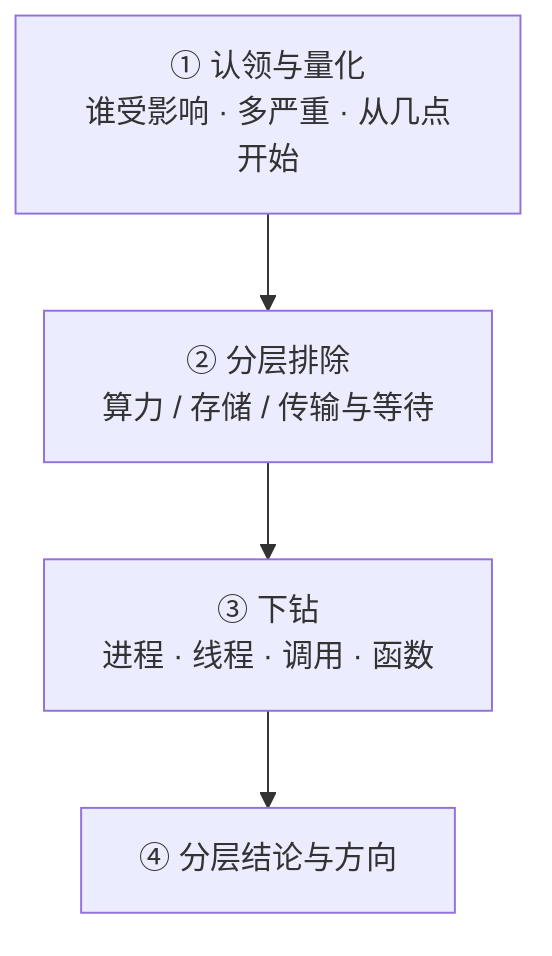
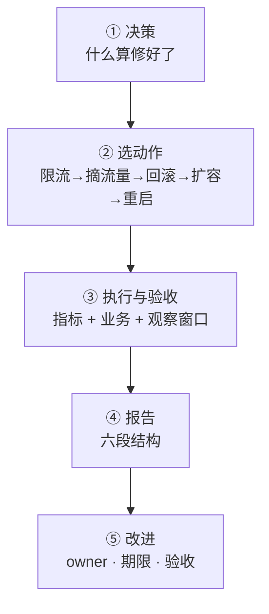

---
tags:
  - Linux
  - 性能分析
  - 故障排查
  - 方法论
  - 学习地图
created: 2026-09-21
---

# 性能分析与故障排查

## 知识地图

### 一次性能故障的处置：五站

时间主线跟着**一次性能故障**走：从有人喊"变慢了"，到能说出"是哪一层、哪个进程、为什么"，再到动手止损并让组织学会。前四站在这里，第五站是另一条线。

| # | 站点 | 这一站在回答什么 | 到这里要能说清 |
| --- | --- | --- | --- |
| 1 | 认领与量化 | 谁受影响、多严重、从几点开始、还在不在恶化、和什么比 | 没有比较对象就证明不了"异常"；"慢"的三种形态决定采样密度 |
| 2 | 分层排除 · 算力 | 是不是 CPU？整机忙还是单核满？时间花在哪一类 | 判据是**最热核**的余量，不是整机平均 |
| 3 | 分层排除 · 存储与传输 | 内存是"空间"问题还是"压力"问题？IO 是设备饱和还是单请求慢？网络还是"在等"？ | 内存看压力不看用量；IO 看排队不看忙闲；计数器优先于抓包 |
| 4 | 下钻 | 哪个进程、哪个线程、哪个系统调用、哪个函数 | 累计值必须差分；工具的能力边界要先验证（事件是否被支持） |
| 5 | 止损与复盘 | 做了什么、怎么证明修好了、组织怎么学到 | 见下一条主线 |

第 2、3 站在做同一件事的三次重复：**按 USE（利用率 / 饱和度 / 错误）扫一层，判定"像不像"，再决定要不要往下走**。省时间的从来不是命令，而是"先排除哪一层"的判断。

### 一次止损的闭环：五步

第二条线跟着**一次止损**走：从"决定动手"到"组织知道这件事、下次更早发现"。

| #   | 步骤    | 这一步在回答什么 | 到这里要能说清                                  |
| --- | ----- | -------- | ---------------------------------------- |
| 1   | 决策    | 什么算"修好了" | 指标回到基线 + 业务验收 + 观察窗口；"重启后好了"不算           |
| 2   | 选动作   | 用代价最小的手段 | 排序按影响面：能限流就不摘流量，能摘流量就不重启；一个动作只改一个变量      |
| 3   | 执行与验收 | 三层验证     | 配置生效值一致 + 内核侧文件一致 + 行为（指标）一致；回滚路径也要验收    |
| 4   | 报告    | 怎么让复盘可复核 | 时间线 / 影响面 / 证据 / 根因 / 止损 / 改进；"人为失误"不算根因 |
| 5   | 改进    | 下次怎么更早发现 | 监控、容量、隔离、流程四个方向，每条有 owner 与验收方式          |

两条线的分界在"找到根因"这一刻：前面是**判断**，后面是**交付**。

### 四条横切线

两条主线是时间线，但有几件事横穿每一步。新人常"每一层都看过，却串不起来"，就是没抓住这四条线。

| 横切线 | 贯穿内容 | 收口于 |
| --- | --- | --- |
| 观测代价与降级 | 插桩代价与事件次数成正比、采样盲区（亚窗口脉冲 / 首行语义 / off-CPU / 长尾）、无 root 与无 PMU 时的替代路径 | 一条"这个目标用什么、没有它退到哪"的降级阶梯 |
| 视角缩放 | 整机 → 单核 → 进程 → 线程 → cgroup；同一现象在不同视角下结论相反 | 按最热核 / 最慢实例 / cgroup 下结论 |
| 判据与口径 | 每个数字能回答什么、回答不了什么；累计量 vs 速率；`avg` vs `total` | 一张判据卡 |
| 基线与容量 | 没有基线就没有"变慢了"；采集条件不可比；容量按最热核与 p99 拐点算 | 一份带采集条件的性能基线卡 |

在这四条之外还有一条不是机制而是纪律：**先取证，再动手**。观测本身有代价，而重启、杀进程、改参数都会毁掉现场；性能问题的现场往往只出现一次。

## 术语速查

| 名词 | 一句话解释 | 在哪一篇展开 |
| --- | --- | --- |
| 延迟 / 吞吐 | 一次操作要等多久 / 单位时间完成多少次；两者常互相拉扯 | 原理：性能的语言与「看起来空闲」的那一层 |
| 利用率 / 饱和度 / 错误 | 资源有多长时间在忙 / 有多少工作在排队 / 失败了多少 | 同上 |
| USE | Utilization / Saturation / Errors：按资源问"多忙、排多长、错多少" | 原理：性能的语言与「看起来空闲」的那一层 · 体系：一次性能故障的处置 |
| 排队效应 | 利用率越高，队列与延迟非线性上涨；`R = S/(1−ρ)` | 原理：性能的语言与「看起来空闲」的那一层 |
| Little's law | `在途数 = 到达率 × 平均停留时间`；用来交叉校验 IO 指标（推导式，非 iostat 文档原文） | 原理：性能的语言与「看起来空闲」的那一层 |
| p50 / p95 / p99 / max | 分位数与最大值；平均值掩长尾，**中位数也会** | 原理：性能的语言与「看起来空闲」的那一层 |
| 坐标缺失 | 基准测试只在请求完成时记时，漏掉了被积压的请求，使延迟数字偏乐观（coordinated omission） | 原理：性能的语言与「看起来空闲」的那一层 |
| `load average` | 可运行 + 不可中断任务的平均数（1/5/15 分钟），**不是使用率** | 原理：争抢为什么不按比例缩放 |
| `us/sy/wa/st` | 用户态 / 内核态 / IO 等待 / 被虚拟化偷走 | 体系：一次性能故障的处置 |
| `%sys` 不含中断 | `mpstat` 明确 `%sys` 不包含硬/软中断的时间 | 原理：争抢为什么不按比例缩放 |
| CFS | Completely Fair Scheduler：Linux 默认调度器；唤醒时倾向抢占当前任务 | 原理：争抢为什么不按比例缩放 |
| Amdahl 定律 | 有比例 `p` 必须串行时，加速上限是 `1/p` | 原理：争抢为什么不按比例缩放 |
| 自愿 / 非自愿切换 | 主动让出 CPU（等 IO/锁）/ 被抢占（时间片用完） | 原理：争抢为什么不按比例缩放 |
| `wchan` | 进程此刻阻塞在内核的哪个函数（"在等什么"） | 原理：时间花在「等」上时看哪里 |
| off-CPU 分析 | 看进程"不在 CPU 上时在等什么"；CPU 采样看不到这段时间 | 原理：时间花在「等」上时看哪里 |
| `MemAvailable` | 应用真正还能申请到的内存（含可回收缓存） | 原理：资源「有」与任务「完成得了」之间的那道缝 |
| PSI | `/proc/pressure/*` 的压力信号，`some` 局部、`full` 全面停顿；**`avg*` 是百分比、`total` 是微秒** | 原理：资源「有」与任务「完成得了」之间的那道缝 |
| `cpu.pressure` 的 `full` | 系统级无定义，自 5.13 起固定打印 0 | 原理：资源「有」与任务「完成得了」之间的那道缝 |
| direct reclaim | 分配内存时同步回收页，表现为延迟尖刺；判据是 `pgscan_direct` 增长 | 原理：资源「有」与任务「完成得了」之间的那道缝 |
| THP | 透明大页；按 2 MiB 落地会放大内存，后台整理会带来停顿 | 原理：资源「有」与任务「完成得了」之间的那道缝 |
| `await` / `aqu-sz` / `%util` | 平均等待（含排队）/ 平均队列长度 / "有请求被发往设备"的时间占比 | 原理：资源「有」与任务「完成得了」之间的那道缝 |
| `svctm` | 旧版的"纯服务时间"列；已从 `iostat(1)` 文档与输出中移除 | 原理：资源「有」与任务「完成得了」之间的那道缝 |
| `iowait` 不可靠 | `man 5 proc` 明写该值不可靠：逐核难算、且可能下降 | 体系：一次性能故障的处置 · 判例：高频误判 |
| `ss -ti` | 单条 TCP 连接的内部状态：`rtt`/`minrtt`/`cwnd`/`retrans`/`app_limited` | 原理：时间花在「等」上时看哪里 |
| `app_limited` | 发送侧被应用限制住：瓶颈不在网络 | 原理：时间花在「等」上时看哪里 |
| `nstat` | 协议栈计数器的**累计值**；默认输出是两次读数之间的差值，`-a` 才是累计 | 体系：一次性能故障的处置 |
| `ListenOverflows` | 监听队列溢出次数：请求握了手但没人接 | 原理：时间花在「等」上时看哪里 |
| PMU | Performance Monitoring Unit：CPU 上做硬件计数的部件。本机设备节点齐全，但 VMware 未透传，`perf stat -e cycles` 是 `<not supported>` | 原理：观测的代价与降级路径 |
| 事件名被替换 | `perf record -e cycles` 在本机不报错，但录下来的事件名是 `task-clock` | 原理：观测的代价与降级路径 |
| 观测者效应 | 观测工具本身改变被测对象；`strace` 实测每次拦截约 55 µs | 原理：观测的代价与降级路径 |
| 采样盲区 | 亚窗口脉冲、首行语义、不在 CPU 上的时间、被聚合掉的长尾 | 原理：观测的代价与降级路径 |
| cgroup v2 `cpu.stat` | `nr_periods`/`nr_throttled`/`throttled_usec`：被配额掐住的证据 | 体系：一次止损的闭环 |
| `memory.events` | cgroup 的 `max`/`oom`/`oom_kill` 计数（累计值） | 体系：一次止损的闭环 |
| `memory.peak` | cgroup 内存历史峰值；用来定 `MemoryMax=` 的依据 | 治理：性能基线与排障治理 |
| `OOMPolicy=` | unit 内发生 cgroup OOM 后 systemd 是否停掉整个 unit（默认 `stop`，会让现场消失） | 体系：一次止损的闭环 |
| 一次性取证 | 故障现场用一屏只读命令同时刻抓齐证据 | 实操：观测与处置顺序 |
| 六段报告 | 时间线 / 影响面 / 证据 / 根因 / 止损 / 改进 | 体系：一次止损的闭环 · 治理：性能基线与排障治理 |

## 故障现场定位表

排障的第一问不是"怎么修"，而是"**这个数字能证明什么、我还缺哪一层**"。用这张表把现象定位到站点，再进对应篇目。

| 你看到的现象 | 属于哪一站 | 主读什么 | 第一反应不要做 | 去哪一篇 |
| --- | --- | --- | --- | --- |
| 用户说"变慢了"，但大盘看着正常 | 认领与量化 | 延迟分位数、错误率、变更时间线 | 不要先 `top` 一眼就下结论 | 05、08 |
| 整机 CPU 不高，延迟却翻倍 | 算力 · 单核 | `mpstat -P ALL` 的逐核行、`pidstat -u -t`、`taskset -cp` | 不要因为整机 25% 就排除 CPU | 03、09 |
| 负载高但 CPU 空闲 | 存储 / 等待 | `vmstat` 的 `r`/`b`、`ps -o stat,wchan`、`mount` 里的网络存储 | 不要先加 CPU、不要先重启 | 05、06、09 |
| CPU `sy` 高 | 算力 · 内核态 | `strace -c`、`%sys/(%usr+%sys)` 的比值 | 不要还没定位就调 `sysctl` | 06、08 |
| `free` 变少 / 进程在换页 | 存储 · 内存 | `MemAvailable`、PSI 的 `avg` 与 `total`、`VmSwap`、cgroup `memory.*` | 不要用 `drop_caches` 或调 `swappiness`"消除"现象 | 04、08 |
| 磁盘慢，不知道是谁在写 | 存储 · IO | `iostat -x`、`pidstat -d`、`/proc/<pid>/io`、`lsof -p` | 不要因为 `%util` 没满就排除 IO | 04、08、09 |
| 写入路径周期性变慢 | 存储 · 同步落盘 | `fsync` 与缓冲写的延迟对比、`pidstat -d`、备份任务计划 | 不要把它当"磁盘坏了" | 04、07 |
| 网络丢包 / 重传 / 连接堆积 | 传输 | `ss -s`、`ss -ti`、`nstat`、`softnet_stat` | 不要一上来就 `tcpdump -i any` | 05、08 |
| 进程卡死杀不掉（D 状态） | 等待 | `ps -eo stat,wchan`、`/proc/<pid>/wchan`、`/proc/<pid>/stack` | 不要 `kill -9`（对 D 状态无效），也不要先重启整机 | 05、07 |
| 服务"偶发失败"而不是持续失败 | 边界耗尽 | `ulimit -n`、`/proc/<pid>/fd`、`ss -s` 的 timewait、端口范围 | 不要当成网络抖动处理 | 08、09 |
| 容器内 CPU 不高但延迟周期性抖动 | 视角 · cgroup | 宿主侧 `cpu.stat` 的 `nr_throttled`、`cpu.max` | 不要在容器里加线程加内存 | 07、09 |
| 服务被 OOM 杀了 | 视角 · cgroup | `memory.events` 的 `oom_kill`、`memory.peak`、`dmesg` 的 `CONSTRAINT_MEMCG` | 不要只看 `free` | 07、09 |
| "昨晚 3 点变慢"要复盘 | 基线与历史 | `sar` 的历史数据、当时的基线卡、变更记录 | 不要只看现在的 `top` | 08、10 |
| 要证明"修好了" | 止损与验收 | 止损前后的同一组指标 + 业务验收 + 观察窗口 | 不要用"重启后好了"当结论 | 07、10 |
| 有人问"这台机器还能加多少负载" | 基线与容量 | 最热核余量、p99 拐点、采集条件 | 不要拿整机平均算余量 | 10 |

三个容易被忽略的边界：

- **"指标正常"不等于"用户正常"。** 指标是聚合视角，用户感受的是单次请求；资源空闲而用户喊慢时，答案通常在分位数、下游或队列里，而不在平均值里；
- **"机器很忙"不等于"你的进程很忙"。** 反过来也成立：机器很闲，你的进程可能正在排队等一颗被别人占满的核；
- **"容器里不高"不等于"没到配额"。** 配额是按 cgroup 算的硬上限，计数只在宿主侧。

## 篇目

| # | 篇目 | 一句话 |
| --- | --- | --- |
| 01 | [[Linux/10_性能分析与排障/01_原理_性能的语言与看起来空闲的那一层\|原理：性能的语言与「看起来空闲」的那一层]] | 延迟/吞吐/利用率/饱和度/错误五个量、排队效应、Little's law、分位数与视角 |
| 02 | [[Linux/10_性能分析与排障/02_原理_观测的代价与降级路径\|原理：观测的代价与降级路径]] | 观测为什么会改变被测对象、四个采样盲区、没有权限或没有硬件时往哪退 |
| 03 | [[Linux/10_性能分析与排障/03_原理_争抢为什么不按比例缩放\|原理：争抢为什么不按比例缩放]] | CPU 时间的分摊与非线性、`load` 在数什么、两种上下文切换、配额这条另一条路径 |
| 04 | [[Linux/10_性能分析与排障/04_原理_资源有与任务完成得了之间的那道缝\|原理：资源「有」与任务「完成得了」之间的那道缝]] | 内存的空间与压力、IO 的忙与排队、为什么"用得多/设备忙"都不是瓶颈判据 |
| 05 | [[Linux/10_性能分析与排障/05_原理_时间花在等上时看哪里\|原理：时间花在「等」上时看哪里]] | off-CPU 与 D 状态、网络延迟的四个来源、`ss -ti` 与计数器优先的顺序 |
| 06 | [[Linux/10_性能分析与排障/06_体系_一次性能故障的处置\|体系：一次性能故障的处置]] | 四站与四条横切线；每个字段的"是什么/单位/判据/与谁同看/转向哪一步" |
| 07 | [[Linux/10_性能分析与排障/07_体系_一次止损的闭环\|体系：一次止损的闭环]] | 什么算修好了、五种手段的排序与回滚、验收三层、六段报告、账本的寿命 |
| 08 | [[Linux/10_性能分析与排障/08_实操_观测与处置顺序\|实操：观测与处置顺序]] | 一个问题一把工具、读数字的固定动作、五个具象场景的排查顺序 |
| 09 | [[Linux/10_性能分析与排障/09_判例_高频误判\|判例：高频误判]] | 十八条四段式判例：现象 → 误判 → 判据 → 出处 |
| 10 | [[Linux/10_性能分析与排障/10_治理_性能基线与排障治理\|治理：性能基线与排障治理]] | 基线卡五组数据、容量拐点、四件产物模板、六个治理场景 |

**第一反应不要做什么**（这一章最容易被跳过、也最值钱的一条）：不要把"某个数字正常"当成"这一层没问题"；不要在量化影响面之前敲命令；不要在只读观测能定性时先改参数；不要把重启当修复；不要在没有采集条件的情况下比较两个数字。

本目录不下钻的相邻领域只给观测入口：加速器与高速网卡（`nvidia-smi dmon`、`rdma link`、`ibv_devinfo`、`ethtool -S` 的 pause 与错误计数）属于 AI 基础设施主题域，见 [[AI-Infra/00_简介|AI-Infra 大纲]]；容器编排层的资源与调度视角属于容器主题域（`Kubernetes/`），本目录不展开。

## 参考文档

- `man 1 perf` / `perf-stat` / `perf-record` / `perf-report` / `perf-sched`、`man 1 strace`、`man 1 mpstat` / `pidstat` / `iostat` / `sar` / `sadc` / `sadf`、`man 8 vmstat`、`man 1 top`、`man 1 free`、`man 1 ps`、`man 1 taskset`、`man 1 chrt`、`man 1 ionice`、`man 1 fio`、`man 1 stress-ng`、`man 8 blktrace`、`man 8 bpftrace`、`man 8 tcpdump`、`man 8 tc` 与 `man 8 tc-netem`、`man 1 unshare`、`man 1 timeout`。
- `man 5 proc`（`/proc/loadavg`、`/proc/meminfo`、`/proc/vmstat`、`/proc/pressure/*`、`/proc/interrupts`、`/proc/net/softnet_stat`、`/proc/diskstats`、`/proc/<pid>/*`）、`man 5 proc_stat`、`man 5 proc_loadavg`、`man 5 proc_pid_pressure`、`man 5 proc_pid_status`、`man 5 proc_pid_sched`、`man 5 proc_pid_io`、`man 5 proc_pid_wchan`、`man 5 proc_pid_stack`、`man 5 proc_pid_smaps`、`man 5 proc_sys_net_ipv4`、`man 8 ss`、`man 8 nstat`、`man 8 ip`、`man 8 ethtool`、`man 7 tcp`。
- `man 8 systemd-run`、`man 5 systemd.resource-control`、`man 5 systemd.kill`（`OOMPolicy=`）、`man 1 systemctl`、`man 1 systemd-cgtop`。
- 内核文档（按与目标机器同一主版本取，当前基线 6.x）：`Documentation/accounting/psi.rst`（`some`/`full`、`avg*` 与 `total` 的单位）、`Documentation/admin-guide/iostats.html`（`/proc/diskstats` 字段与 `%util` 的来源）、`Documentation/admin-guide/cgroup-v2.rst`（`cpu.max`/`cpu.stat`/`memory.*`）、`Documentation/admin-guide/sysctl/vm.rst`、`Documentation/admin-guide/mm/transhuge.rst`、`Documentation/admin-guide/perf-security.rst`、`Documentation/networking/snmp_counter.rst`、`Documentation/scheduler/sched-stats.rst`。
- 《Systems Performance》（Brendan Gregg）的方法论（USE、drill-down）与各资源章节；Brendan Gregg 的公开文章 `usemethod.html` 与 off-CPU 分析专页；FlameGraph 项目。
- `fio` 官方 HOWTO（`--ioengine`/`--iodepth`/`--direct`/`clat` 百分位）；`stress-ng` 手册；sysstat 官方 FAQ（`kB` 实为 KiB、`%util` 的历史问题）。
- 排队论与 Little's law 的标准表述（M/M/1 的 `R = S/(1−ρ)`；Little 1961 的原始论文）；Google SRE Book 与 Workbook 中关于事故响应、复盘文化与错误预算的章节。
