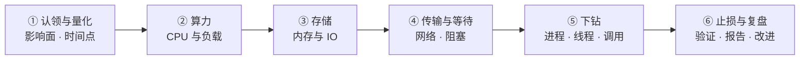

---
tags:
  - Linux
  - 性能分析
  - 故障排查
  - 方法论
  - 学习地图
created: 2026-09-19
---

# 性能分析与故障排查

> [!cite] 参考资料
> `man 1 perf` / `perf-stat` / `perf-record` / `perf-sched`、`man 1 strace`、`man 1 mpstat` / `pidstat` / `iostat` / `sar`（sysstat）、`man 5 proc`、`man 5 proc_pid_sched`、`man 5 proc_pid_pressure`、`man 8 ss`、`man 8 nstat`、`man 8 tc-netem`、`man 1 fio`、`man 8 systemd-run`、`man 5 systemd.resource-control`、`man 5 systemd.kill`（`OOMPolicy=`）；《Systems Performance》（Brendan Gregg）的 USE 方法与排队论章节、FlameGraph 项目、内核文档 `Documentation/accounting/psi.rst` 与 `Documentation/admin-guide/cgroup-v2.rst`、`fio` 官方 HOWTO、`stress-ng` 手册页。
>
> **实测状态**：实测环境为 **Ubuntu 24.04.5 LTS（VMware 虚拟机）/ 内核 `6.8.0-139-generic` / systemd 255（`255.4-1ubuntu8.17`）/ cgroup2fs（v2）/ 4 vCPU（Intel i7-14650HX，2 socket × 2 core × 1 thread）/ `MemTotal` 7894 MiB / swap 4095 MiB（`/swap.img`）/ 根分区 `/dev/mapper/ubuntu--vg-ubuntu--lv`（ext4 on LVM，46.9 G，`iostat` 里是 `dm-0`）/ `systemd-detect-virt` = `vmware` / 网卡 `ens33`（`e1000`）/ `ulimit -n` 软 1024、硬 1048576 / `ip_local_port_range = 32768 60999` / `kernel.perf_event_paranoid=4`、`kernel.dmesg_restrict=1`、`kernel.unprivileged_bpf_disabled=2`、`kernel.apparmor_restrict_unprivileged_userns=1`（**前两项 root 不受限**）/ 时区 `Etc/UTC (UTC, +0000)` 且 `System clock synchronized: no` / **root 可用**，另有 `realtyz`（uid=1000）**。
>
> 本目录全部子笔记的结论来自上述资料，**全部实测数字来自本次在实验机上的重跑**（原始输出存于 `.labvm/evidence/10_*.out.txt`）。`sysstat`（`mpstat`/`pidstat`/`iostat`/`sar`，12.6.1-2）、`strace`（6.8）、`perf`（6.8.12）、`fio`（3.36）、`stress-ng`（0.17.06）、`bpftrace`（v0.20.2）、`blktrace`（2.0.0）、`tcpdump`（4.99.4）、`iotop`、`smartctl`（7.4）、`numactl` **全部已安装、直接用系统包运行**，不需要 `apt-get download` + `dpkg-deb -x` 解包。需要 root 的部分（`ip netns` 注入、系统级 cgroup、`perf sched`、`bpftrace`、`blktrace`、抓包）在本机 root 下**已实测**；仍需换机器的部分（PMU 计数器透传、真实物理网卡多队列、第二台机器、FlameGraph 的 SVG 绘制脚本）在子笔记中显式标注「未实测」，并给出补做方式。

> 本页是子目录 `10_性能分析与排障/` 的 00 号导读，不是全部正文。知识脉络、生产技能地图、训练台阶、术语速查、故障现场定位表都在这一页；逐项深入的正文拆成子笔记，索引见第 7 节。
>
> **读者定位：刚入职的运维/SRE。** 假设你会基本 shell，用过 `top`、`free`、`df`，遇到「卡」的时候会先 `top` 看一眼；但没系统想过「为什么整机 CPU 只有 25% 服务还是慢」「`%util` 没到 100% 到底算不算磁盘瓶颈」「这张 `top` 的截图能证明什么、证明不了什么」。这一章补的正是这套判读框架：**先量化、再分层、最后才动手**。
>
> 相邻阶段的概念会在正文里以纯文本提到（例如阶段 3 的 D 状态与句柄上限、阶段 4 的可用内存口径与 PSI、阶段 5 的 `iostat` 各列与 NFS 卡死、阶段 6 的 TCP 状态机与 `ss -ti`、阶段 8 的 cgroup 与 unit 资源限制、阶段 9 的指标口径与告警），但**本目录内部只用本目录的 wikilink**；需要复习时回大纲页找对应章节。

> [!info] 读之前：先自检三条前提
> 1. **一台能让你只读观测的机器。** 第 3 节的 T1 全程只读，生产机上也可以做；T2 以上的动手内容需要一台可快照的实验机。本机 **root 可用**，所以 cgroup 实验用**系统级** `systemd-run --scope -p CPUQuota=` 做（子笔记 11 有实测步骤），网络故障注入用 **root + `ip netns`** 做（子笔记 07）——**本机 `kernel.apparmor_restrict_unprivileged_userns=1`，非 root 的 `unshare -U -r -n` 会被直接拒绝**。
> 2. **分得清「看得见」和「能交付」。** 这一章的验收不是记住 `mpstat` 的参数，而是能交出四样东西：一份性能基线卡、一份带回滚与验收标准的止损记录、一篇六段排障报告、一份演练记录。
> 3. **能接受「先问影响面，再看数据」。** 这一章真正要建立的是**取用顺序**：量化影响面 → 分层排除 → 下钻到进程 → 止损 → 复盘。顺序对了，工具差一点也能定位到根因；顺序错了，工具再全也只是在翻截图。

## 0. 30 秒速览

> [!abstract] 这一章只要记住六句话
> 首学读不懂很正常：先跳过这一节，读完第 1 节和子笔记 01、05 再回来逐条验证。全章按两条线组织——**一次性能故障的处置六站**（04–09）与四条横切线。
> - **方法论先行：先量化影响面，再分层排除，最后才动手。**
>   - 证据：实测单个自旋进程让 CPU 2 达到 `100.00%`，而整机 `%usr` 只有 **25.04%**、`load average` 只有 **0.34**（`mpstat -P ALL 1 3` / `uptime`）——不先量化，就不会知道「慢」发生在哪一层。
> - **整机平均会同时掩盖「单核饱和」和「长尾」，连中位数也会。**
>   - 证据：同一个 2 秒计数循环，独占一个核时跑 **26,473,519 次**；同核加 1 个竞争者降到 **12,461,811 次（−52.9%）**、加 4 个降到 **5,564,871 次（−79.0%）**；延迟探针的 `p50` 全程几乎不动（**8.13 → 8.06 ms**），而 `max` 从 **8.36 ms** 涨到 **40.87 ms**（4.9 倍），期间整机 `%usr` 始终是 **25%**。
> - **CPU 高要先分「谁在花时间」的五个分支。**
>   - 证据：纯计算 `perf stat` 是 `5.994 s user / 0.007 s sys`（`sys` 占 0.12%）；2 万次 `getpid+stat` 是 `0.0387 s user / 0.0122 s sys`（`sys` 占 **24.0%**）；socket ping-pong 实测**自愿切换 40,343.67 次/秒、非自愿 16.67 次/秒**。
> - **内存要看「压力」而不是「用了多少」——而且 PSI 的 `avg` 与 `total` 要一起读。**
>   - 证据：分配并逐页触碰 3 GiB 后 `MemAvailable` 从 **7224 MiB** 降到 **4145 MiB**，而 `/proc/pressure/memory` 的 `avg10/avg60/avg300` 全程 **0.00**、`pgscan_direct` 为 **0**；但 `some` 的 `total` 涨了 **9397 µs**——用掉了内存、没有持续压力，也不是「零压力」。
> - **IO 的 `await`、`aqu-sz`、`%util` 不是一回事，而且可以互相矛盾。**
>   - 证据：并发写窗口实测 `w/s=324`、`w_await=6.59 ms`、`aqu-sz=2.14`、`%util=80.10%`，其中 `324 × 0.00659 = 2.14` 与 `aqu-sz` **完全相等**；而深队列窗口 `%util=98.80%` 时 `aqu-sz` 只有 **3.15**、`w_await` 只有 **0.09 ms**——利用率更高的那次反而队列更浅。
> - **观测本身有代价，而且工具「不可用」的原因在本机换成了权限与硬件。**
>   - 证据：同一份 2 万次系统调用的 workload，直接跑 **50～51 ms**、套上 `strace -c -f` 后 **2254～2474 ms**（约 **45～48 倍**）；`perf stat` 的 `cycles`/`instructions` 显示 `<not supported>` 且**裸 `perf stat` 直接报错退出**（VMware 未透传 PMU 计数器，不是「没有 PMU」）；而 `perf sched record` 以 root **实测可用**（采到 35573 个样本）。

> [!tip] 这一页怎么用：三条入口
> - **系统学（推荐，按阶段 10 的 4~6 天）**：从第 3 节的「四级训练台阶」开始，T0 → T4 逐级往上；每一级用第 2 节的技能表核对交付物。
> - **出事急救**：直接看第 6 节「故障现场定位表」，定位到环节后进对应子笔记，或翻子笔记 14《性能故障处置手册》。
> - **面试速览**：第 0 节 + 第 1 节 + 第 5 节术语表 + 各子笔记末尾的自测卡；每道题都要能补一句「第一反应不要做什么」。

## 1. 知识地图（第一条主线）

### 1.1 一次性能故障的处置六站

这一章不按「CPU、内存、IO、网络、锁」五个名词平铺，而是跟着**一次真实的性能故障**走：从「有人喊慢」到「证据、根因、止损、长期改进」都落地。每一站回答一个问题，答不出来就是还没到下一站的资格。

| # | 站点 | 这一站在回答什么 | 这一站的证据 | 主要子笔记 |
| --- | --- | --- | --- | --- |
| 1 | 认领与量化 | 谁受影响、多严重、从几点开始、和基线比差多少 | 延迟分位数与错误率、变更时间线、`loadavg`/`date -Is` | 04 |
| 2 | 分层排除 · 算力 | 是不是 CPU？是整机忙还是单核满？ | `mpstat -P ALL`、`vmstat` 的 `r/cs`、`pidstat -u -t` | 05 |
| 3 | 分层排除 · 存储 | 是不是内存压力？是不是 IO 排队？ | `MemAvailable` + `/proc/pressure/*`、`iostat -x` 的 `await`/`aqu-sz` | 06 |
| 4 | 分层排除 · 传输与等待 | 是不是网络？是不是「在等」而不是「在算」？ | `ss -s`/`ss -ti`、`nstat`、`softnet_stat`、`wchan` | 07 |
| 5 | 下钻 | 到底是哪个进程、哪个线程、哪一行、哪个系统调用 | `/proc/<pid>/*`、`strace -c/-T`、`perf record` + `report` | 08 |
| 6 | 止损与复盘 | 做了什么、怎么证明修好了、怎么防止复发 | 止损前后指标对比、六段报告、监控与容量补齐 | 09 |

站点 2～4 是同一个动作的三次重复：**用 USE（利用率 / 饱和度 / 错误）扫一层，判定「像不像」，再决定要不要下钻**。真正省时间的不是命令，而是「先排除哪一层」的判断。

### 1.2 四条横切线

六站是时间线，但有几件事会横穿多个站点。新人最容易「每一站都看过，却串不起来」，就是没抓住这四条线：

| 横切线 | 贯穿内容 | 收口于 | 主要子笔记 |
| --- | --- | --- | --- |
| **观测代价与降级** | 观测者效应（`strace` 约 45～48 倍）、采样窗口漏脉冲、无 PMU 计数器 / 无 root 时的替代路径 | 一份「用什么可以不付代价」的取舍表 | 02、03、08、13 |
| **视角缩放** | 整机 → 单核 → 进程 → 线程 → cgroup，同一现象在不同视角下的不同结论 | 一份按核 / 按线程的定位记录 | 01、05、11 |
| **判据与统计口径** | 平均 vs 分位数、利用率 vs 饱和度、`%util` vs `await`、PSI 是压力不是用量 | 一张判据卡（每个数字回答什么问题、不能回答什么问题） | 01、06、07、10 |
| **基线与容量** | 没有基线就没有「变慢了」；五组基线数据、采集条件、按核与按 p99 做容量 | 一份性能基线卡 | 04、12、14 |

还有一条不是机制而是纪律：**先取证，再动手**。重启、杀进程、改参数都会毁掉现场，而性能问题的现场往往只出现一次（子笔记 04、09）。

### 1.3 前置地基

以下三篇是读懂六站的最低门槛，不是扩展阅读。缺哪块补哪块，再回来看主线。

| 前置篇 | 你要先建立的概念 | 对应子笔记 |
| --- | --- | --- |
| 性能的语言 | 延迟 / 吞吐 / 利用率 / 饱和度的关系、排队效应、为什么 p99 比平均重要、视角决定结论 | [[Linux/10_性能分析与排障/01_前置_性能的语言_延迟吞吐与利用率\|01 前置：性能的语言]] |
| 观测工具箱 | 每个视角（整机 / 进程 / 线程 / cgroup）有哪几条命令、各自回答什么问题、开销多大 | [[Linux/10_性能分析与排障/02_前置_观测工具箱与证据命令\|02 前置：观测工具箱与证据命令]] |
| 观测的代价与降级路径 | 观测者效应、采样偏差、工具不可用时怎么办、取证纪律 | [[Linux/10_性能分析与排障/03_前置_观测的代价与降级路径\|03 前置：观测的代价与降级路径]] |

> [!warning] 这一章最容易「看起来懂了」
> 性能排障的坑几乎都不是命令不会敲，而是**把某个数字当成它并不代表的含义**：把 `load` 当 CPU 使用率、把 `%util` 当饱和度、把 `free` 少当内存不足、把一次 `top` 截图当证据。如果读完子笔记 01～03 还说不清「`%util` 98.8% 却 `aqu-sz` 只有 3.15 是怎么同时成立的」，先别急着背命令清单。

## 2. 生产技能地图（第二条主线）

知识和技能是两条线。**读完不等于会做**，所以这一章明确交付 10 项技能，每项都有可观察的行为和一个交付物。学每一篇的时候，对照这张表看自己在练哪一项。

| # | 技能 | 可观察的行为 | 在哪几篇练 | 交付物 |
| --- | --- | --- | --- | --- |
| S1 | 量化影响面与对齐时间 | 接到报障 10 分钟内说清「谁受影响、多严重、从几点开始、和基线差多少」，并把拐点与变更对齐 | 04、12 | 一份影响面与时间线记录 |
| S2 | 分层排除（USE 五层） | 用只读命令在 CPU / 内存 / IO / 网络 / 等待五层各扫一遍，给出「像 / 不像」的结论与理由 | 01、05、06、07 | 一份只读扫描清单与结论 |
| S3 | 单核与线程视角 | 看到「整机不忙」时不罢手，能落到具体核、具体线程、具体绑核 | 05、11 | 一份按核 / 按线程的定位记录 |
| S4 | 内存与 IO 判据 | 只用 `MemAvailable` + PSI 判断内存压力，只用 `await` + `aqu-sz` 判断 IO 排队，并能解释为什么 | 06、10 | 一张内存 / IO 判据卡 |
| S5 | 网络计数器优先 | 先看 `ss -s` / `nstat` / `softnet_stat` 决定要不要抓包，能用 `ss -ti` 读出 RTT 与重传 | 07、10 | 一次「先计数、后抓包」的判定记录 |
| S6 | 进程级下钻与代价评估 | 用 `/proc`、`strace`、`perf` 把「哪个进程、哪个调用、哪个函数」说清楚，并说明这一步花了多少代价 | 03、08 | 一份下钻记录（含观测代价） |
| S7 | 止损与验收 | 从「限流 → 摘流量 → 回滚 → 扩容 → 重启」里选出代价最小的动作，写出回滚方式与验收标准 | 09、14 | 一份带回滚的止损记录 |
| S8 | 六段排障报告 | 按时间线 / 影响面 / 证据 / 根因 / 止损 / 长期改进写出可复盘的报告 | 09、14 | 一篇六段报告 |
| S9 | 基线与容量台账 | 交付含「身份与规模 / CPU 与负载 / 内存 / IO / 网络」五组数据的基线卡，并注明采集条件 | 04、12 | 一份性能基线卡 |
| S10 | 故障演练与工具边界 | 在隔离环境复现六类负载故障，记录观测指纹；如实登记哪些工具在本机不可用及替代路径 | 13、15 | 一份演练记录 + 一份工具可用性清单 |

这 10 项里，S1～S3 是**判断力**（知道看什么、知道结论的边界），S4～S7 是**操作力**（能取到证据、能安全止损），S8～S10 是**交付力**（把一次排障变成组织能用的资产）。新人通常卡在 S1 和 S2——这两项没有命令清单可背，只能靠带反馈的练习建立直觉。

## 3. 四级训练台阶

技能靠难度递增、风险可控的重复练习获得。**每一级都写明了在哪台机器上做**，这条边界本身就是 S1 的训练内容。

| 台阶 | 做什么 | 在哪台机器 | 交付物 |
| --- | --- | --- | --- |
| **T0 读通** | 画出「处置六站」与四条横切线；说清「整机 CPU 不高但服务慢」至少要看哪几站、每站看什么 | 纸面/白板 | 自己画的六站图 + 一张判据卡 |
| **T1 观测** | 采集五组基线（身份 / CPU / 内存 / IO / 网络）、跑一次一次性取证快照、确认历史指标有没有数据；全程只读 | **生产机可以做（只读）** | 性能基线卡 + 一份快照输出 |
| **T2 可回滚变更** | 给一个进程加 cgroup CPU 配额（`systemd-run --scope -p CPUQuota=`）、给批处理加 `ionice`、调整调度优先级；改动前后各取一组证据 | 实验机 | 变更记录（含验证与回滚） |
| **T3 故障注入与恢复** | 造一次单核超卖、一次内存压力、一次深队列 IO、一次 `netem` 延迟与丢包、一次句柄 / 端口耗尽，记录每一类的观测指纹 | **可快照实验机** | 演练记录 + 观测指纹对照 |
| **T4 限时模拟** | 给一个现象（整机不忙但延迟翻倍 / 磁盘突然变慢 / 服务偶发失败），20 分钟内定位到具体资源与进程并写出六段报告 | 实验机 + 计时 | 一份排障报告 |

> [!warning] 两条不能破的边界
> **只有 T1 允许在生产机上做，而且全程只读**：`uptime`、`vmstat`、`mpstat`、`pidstat`、`iostat`、`free`、`cat /proc/*`、`ss`、`nstat`、`ps`、`systemd-cgtop`。任何会改配额、改 `sysctl`、`kill`、`strace -f -p`、`tcpdump -i any` 的动作都属于 T2 及以上。
> **T2 到 T4 一律在可快照实验机，并预先设定上限**：CPU 负载不超过 20 秒、内存不超过 **3 GiB**（本机总内存只有 7894 MiB，比常见实验机小一半）、IO 不超过 2 GiB、连接不超过 3000 条、故障注入只放在**独立 netns** 里（本机必须用 **root + `ip netns`**，非特权 userns 被 AppArmor 禁用）。跑完必须复核「无残留进程、无监听端口、无临时目录、无残留 unit、无残留 netns」。

## 4. 学习路线

**系统学的三遍读法（对应阶段 10 的 4~6 天）：**

- **第一遍（约两天，把方法框架立起来）**：第 1 节 → 前置 01、03 → 04（认领与量化）→ 05（CPU 与负载）→ 14 的「负载高但 CPU 空闲」「整机 CPU 不高但延迟高」两节 → 实验 1、2、3。这一遍结束应该能处理「服务慢但整机看着很闲」。
- **第二遍（约两天，把三个资源层打通）**：前置 02 → 06（内存与 IO）→ 07（网络与等待）→ 10（十二类杀手场景）→ 实验 4～8。这一遍结束应该能对任意一个「慢」给出「像 / 不像」的分层结论。
- **第三遍（下钻与交付）**：08（进程级下钻）→ 09（止损与复盘）→ 11（cgroup 视角）→ 12（基线与容量）→ 13（演练与工具边界）→ 14 其余各节 → 15 汇总自测 → T3、T4。

**只想解决手头问题的快捷入口：**

| 你的问题 | 去哪 |
| --- | --- |
| 整机 CPU 不高、服务却慢 | 子笔记 05、10、14 |
| 负载高但 CPU 空闲 | 子笔记 07、14 |
| CPU 高，不知道是应用还是内核 | 子笔记 05、08 |
| 内存看着还有，进程却在换页 | 子笔记 06、11 |
| 磁盘慢，想定位到进程和文件 | 子笔记 06、08、14 |
| 网络丢包 / 重传 / 连接堆积 | 子笔记 07、14 |
| 服务偶发失败（连接或句柄打满） | 子笔记 10、14 |
| 容器里 CPU 不高但延迟周期性抖动 | 子笔记 11、14 |
| 要给面试官讲一次排障 | 子笔记 09（六段报告）+ 各篇自测卡 |
| 要建基线和容量台账 | 子笔记 12 |
| 要在实验机上做演练 | 子笔记 13、15 |

## 5. 术语速查

> [!info]- 名词速查（读到哪里卡住，就回这里查）
> | 名词 | 一句话解释 | 在哪一篇展开 |
> | --- | --- | --- |
> | 延迟 / 吞吐 | 一次请求要多久 / 单位时间完成多少次；两者常互相拉扯 | 01 |
> | 利用率 / 饱和度 | 资源有多忙 / 有多少工作在排队等它 | 01、05、06 |
> | USE | Utilization / Saturation / Errors：按资源问「多忙、排多长、错多少」 | 01、05 |
> | 排队效应 | 利用率越高，队列与延迟非线性上涨；`aqu-sz ≈ 到达率 × 等待时间`（Little's law） | 01、06 |
> | p50 / p95 / p99 | 分位数；平均值会掩盖长尾，**中位数也会**，排障要看 p99 与 max | 01、04 |
> | load average | 可运行 + 不可中断（D 状态）任务的平均数，**不等于 CPU 使用率** | 05 |
> | `us/sy/si/wa/st` | 用户态 / 内核态 / 软中断 / IO 等待 / 被虚拟化偷走 | 05 |
> | CFS | Completely Fair Scheduler（完全公平调度器）：Linux 默认调度器；唤醒时倾向抢占当前任务，刚醒的进程因此受保护 | 05 |
> | NUMA / RPS | 非统一内存访问（多路 CPU 各挂内存，访问远端更慢）/ 收包分流（把收包软中断摊到多个核） | 05 |
> | 自愿 / 非自愿切换 | 主动让出 CPU（等 IO、等锁）/ 被抢占（时间片用完） | 05、07 |
> | `wchan` | 进程此刻阻塞在内核的哪个函数（「在等什么」） | 07、08 |
> | off-CPU 分析 | 看进程「不在 CPU 上时在等什么」，`perf` 采样看不到这段时间 | 07、08 |
> | `MemAvailable` | 应用真正还能申请到的内存（含可回收缓存） | 06 |
> | PSI | `/proc/pressure/*` 的压力信号，`some` 局部、`full` 全面停顿；**`avg` 会被窗口摊平，要配合 `total` 的差分** | 03、06 |
> | direct reclaim | 分配内存时同步回收页缓存，表现为延迟尖刺（判据是 `pgscan_direct` 增长） | 06、10 |
> | `await` / `aqu-sz` / `%util` | 平均等待 / 平均在途请求数 / 设备「至少有一个请求在途」的时间比例 | 01、06 |
> | Little's law | `在途数 = 到达率 × 平均停留时间`，用来交叉验证 IO 指标 | 01、06 |
> | `ss -ti` | 单条 TCP 连接的内部状态：`rtt`/`minrtt`/`cwnd`/`retrans`/`app_limited` | 07 |
> | `nstat` | 协议栈计数器（重传、超时、队列溢出）的**累计值**，判据是窗口增量 | 07 |
> | 观测者效应 | 观测工具本身改变被测对象；`strace` 实测约 **45～48 倍**减速（每次拦截约 55 µs） | 03、08 |
> | 采样偏差 | 1 秒一次采样会漏掉亚秒脉冲；`perf` 只覆盖「在 CPU 上」的时间 | 03、06 |
> | PMU | Performance Monitoring Unit（性能监控单元）：CPU 上做硬件性能计数的部件。**本机设备节点齐全（`cpu_core`/`cpu_atom`/`msr`），但 VMware 未把计数器透传给 guest，所以 `perf` 的 `cycles`/`instructions` 是 `<not supported>`** | 03、08 |
> | eBPF / BPF / BTF | 扩展的伯克利包过滤器 / 其字节码格式 / BPF Type Format：把观测程序挂进内核，开销低但需要 root（本机 `bpftrace` root 下可用） | 03、08 |
> | cgroup v2 `cpu.stat` | `nr_periods`/`nr_throttled`/`throttled_usec`：被配额掐住的证据 | 11 |
> | `memory.events` | cgroup 的 `max`/`oom`/`oom_kill` 计数 | 11 |
> | `OOMPolicy=` | unit 内发生 cgroup OOM 后 systemd 是否停掉整个 unit（默认 `stop`，会让现场消失） | 11 |
> | 一次性取证 | 故障现场用一条脚本同时刻抓齐所有证据 | 04 |
> | 六段报告 | 时间线 / 影响面 / 证据 / 根因 / 止损 / 长期改进 | 09、14 |

## 6. 故障现场定位表

排障的第一问不是「怎么修」，而是「**这个数字能证明什么、我还缺哪一层**」。用这张表把现象定位到站点，再进对应子笔记。

| 你看到的现象 | 卡在哪一站 | 现场在哪 | 第一反应不要做 | 去哪一篇 |
| --- | --- | --- | --- | --- |
| 用户说「变慢了」，但大盘看着正常 | 认领与量化 | 延迟分位数、错误率、变更时间线、单次请求耗时 | 不要先 `top` 一眼就下结论 | 04、09 |
| 整机 CPU 不高，延迟却翻倍 | 算力 · 单核 | `mpstat -P ALL`、`pidstat -u -t`、`taskset -cp` | 不要因为整机 25% 就排除 CPU | 05、14 |
| 负载高但 CPU 空闲 | 算力 / 等待 | `vmstat` 的 `r`/`b`、`ps -o stat,wchan`、`mount` 里的网络存储 | 不要先加 CPU、不要先重启 | 07、14 |
| CPU `sy` 高 | 算力 · 内核态 | `strace -c`、`pidstat -w`、`/proc/interrupts` | 不要还没定位就调 `sysctl` | 05、08 |
| `free` 变少 / 进程在换页 | 存储 · 内存 | `MemAvailable`、`/proc/pressure/memory`（`avg` + `total`）、`VmSwap`、cgroup `memory.*` | 不要用 `drop_caches` 或调 `swappiness` 「消除」现象 | 06、11 |
| 磁盘慢，不知道是谁在写 | 存储 · IO | `iostat -x`、`pidstat -d`、`/proc/<pid>/io`、`lsof -p` | 不要因为 `%util` 没满就排除 IO | 06、14 |
| 写入路径周期性变慢 | 存储 · 同步落盘 | `fsync` 与缓冲写延迟对比、`pidstat -d`、备份任务计划 | 不要把它当「磁盘坏了」 | 06、10 |
| 网络丢包 / 重传 / 连接堆积 | 传输 | `ss -s`、`ss -ti`、`nstat`、`softnet_stat`、`ethtool -S` | 不要一上来就 `tcpdump -i any` | 07、14 |
| 进程卡死杀不掉（D 状态） | 等待 | `ps -eo stat,wchan`、`/proc/<pid>/wchan`、`/proc/<pid>/stack`、`mount` | 不要 `kill -9`，也不要先重启整机 | 07、14 |
| 服务「偶发失败」而不是持续失败 | 边界耗尽 | `ulimit -n`、`/proc/<pid>/fd`、`ss -s` 的 timewait、端口范围 | 不要当成网络抖动处理 | 10、14 |
| 容器内 CPU 不高但延迟周期性抖动 | 视角 · cgroup | 宿主侧 `cpu.stat` 的 `nr_throttled`、`systemd-cgtop` | 不要在容器里加线程加内存 | 11、14 |
| 服务被 OOM 杀了 | 视角 · cgroup | `memory.events` 的 `oom_kill`、`memory.peak`、`dmesg` 的 `CONSTRAINT_MEMCG` | 不要只看 `free` | 11、14 |
| 「昨晚 3 点变慢」要复盘 | 基线与历史 | 历史指标（本机 `sar` **有真实历史**）、当时的基线卡、变更记录 | 不要只看现在的 `top` | 04、12 |
| 要证明「修好了」 | 止损与复盘 | 止损前后的同一组指标 + 业务验收 | 不要用「重启后好了」当结论 | 09、14 |

两个容易被忽略的边界：

- **「指标正常」不等于「用户正常」。** 指标是聚合视角，用户感受的是单次请求；资源空闲而用户喊慢时，答案通常在分位数或依赖里，而不在平均值里（子笔记 01、04）。
- **「机器很忙」不等于「你的进程很忙」。** 反过来也成立：机器很闲，你的进程可能正在排队等一个被别人占满的核（子笔记 05）。

## 7. 子笔记索引

| # | 子笔记 | 一句话 | 主要技能 | 难度 |
| --- | --- | --- | --- | --- |
| 01 | [[Linux/10_性能分析与排障/01_前置_性能的语言_延迟吞吐与利用率\|前置：性能的语言]] | 延迟 / 吞吐 / 利用率 / 饱和度、排队效应、分位数、四种视角 | S1、S2 | 前置 |
| 02 | [[Linux/10_性能分析与排障/02_前置_观测工具箱与证据命令\|前置：观测工具箱与证据命令]] | 按视角排列的命令地图、每条回答什么问题、开销分级 | S2、S6 | 前置 |
| 03 | [[Linux/10_性能分析与排障/03_前置_观测的代价与降级路径\|前置：观测的代价与降级路径]] | 观测者效应、采样偏差、无 PMU 计数器 / 无 root 的替代路径、取证纪律 | S6 | 前置 |
| 04 | [[Linux/10_性能分析与排障/04_第1站_认领与量化影响面\|第 1 站：认领与量化影响面]] | 五个必答问题、影响面口径、对齐变更时间线、一次性取证 | S1、S9 | 核心 |
| 05 | [[Linux/10_性能分析与排障/05_第2站_分层排除_CPU与负载\|第 2 站：分层排除 · CPU 与负载]] | load 的构成、`vmstat` 各列、每核视角、五分支、上下文切换 | S2、S3 | 核心 |
| 06 | [[Linux/10_性能分析与排障/06_第3站_分层排除_内存与IO\|第 3 站：分层排除 · 内存与 IO]] | 压力判据、`iostat` 三指标、Little's law、`fsync` 代价、下钻顺序 | S2、S4 | 核心 |
| 07 | [[Linux/10_性能分析与排障/07_第4站_分层排除_网络与等待\|第 4 站：分层排除 · 网络与等待]] | 计数器优先、`ss -ti` 读法、`netem` 注入、D 状态与 off-CPU | S2、S5 | 核心 |
| 08 | [[Linux/10_性能分析与排障/08_第5站_下钻到进程与栈\|第 5 站：下钻到进程与栈]] | `/proc` 证据链、`strace` 画像、`perf` 三种用法与前提、火焰图 | S6 | 核心 |
| 09 | [[Linux/10_性能分析与排障/09_第6站_止损验证与复盘\|第 6 站：止损、验证与复盘]] | 止损动作排序、验收标准、六段报告、长期改进 | S7、S8 | 核心 |
| 10 | [[Linux/10_性能分析与排障/10_横切_高频杀手场景与最短判定路径\|横切：高频杀手场景]] | 十二类高频故障的指纹与最短判定路径 | S4、S5 | 核心 |
| 11 | [[Linux/10_性能分析与排障/11_横切_容器与服务视角_cgroup治理\|横切：容器与服务视角]] | cgroup v2 的 CPU 限流、内存 OOM、宿主 / 容器对照 | S3、S7 | 核心 |
| 12 | [[Linux/10_性能分析与排障/12_横切_基线与容量台账\|横切：基线与容量台账]] | 五组基线数据、采集条件、`fio` 四象限、按核与按 p99 做容量 | S9 | 核心 |
| 13 | [[Linux/10_性能分析与排障/13_横切_故障演练与工具边界\|横切：故障演练与工具边界]] | 演练纪律、六类注入、工具可用性矩阵与替代路径 | S10 | 核心 |
| 14 | [[Linux/10_性能分析与排障/14_性能故障处置手册\|性能故障处置手册]] | 十二类现象 → 判据 → 处置顺序（含速查表） | 全部 | 收口 |
| 15 | [[Linux/10_性能分析与排障/15_动手实验与要点自测\|动手实验与要点自测]] | 实验索引与总自测 | 全部 | 汇总 |

## 自检清单

- [x] frontmatter 有 `tags` 和 `created`，全篇只有一个一级标题
- [x] 速览卡 6 条，每条都是「一句结论 + 一行证据」
- [x] 知识地图有一条时间主线（处置六站）与四条横切线，技能主线（S1–S10 + T0–T4）都在本页可见
- [x] 章节内引用只用章节内 wikilink；提及其他阶段一律用纯文本
- [x] 阶段 10 已按「主笔记 + 子笔记」拆分，索引覆盖目录内全部 15 篇子笔记
- [x] 每个实测数字都注明来自 **Ubuntu 24.04.5 LTS（VMware 虚拟机）/ 内核 6.8.0-139-generic / 4 vCPU / 7894 MiB / root 可用** 的采集条件，原始输出见 `.labvm/evidence/10_*.out.txt`
- [ ] 第 6 节的每一种现象都在对应子笔记里演练过一次
- [ ] 每张 Mermaid 图都在 Obsidian 里预览过，能正常渲染
