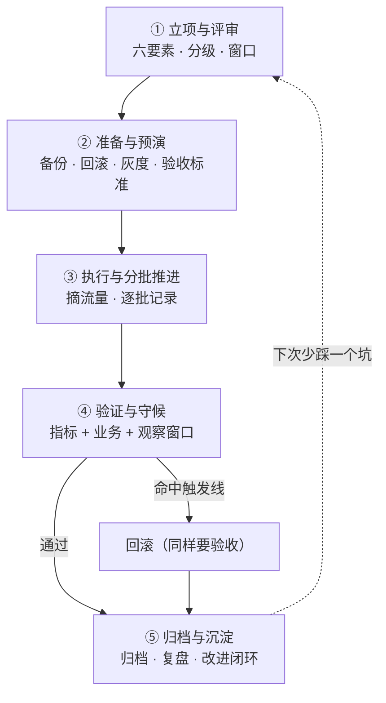
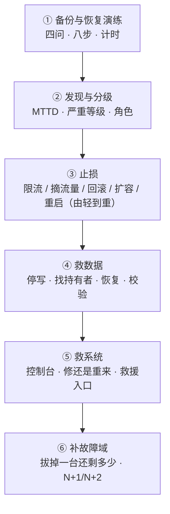

---
tags:
  - Linux
  - 生产运维
  - 变更管理
  - 高可用
  - 学习地图
created: 2026-09-21
---

# 生产运维与高可用

## 知识地图

### 一次生产变更的一生：五个阶段

时间主线跟着**一次变更**走：它先被提出（要不要做、谁批准），然后进入准备（备份、回滚、灰度），接着被执行（分批推进），再被验收（指标 + 业务 + 观察窗口），最后到归档（归档记录、复盘、改进闭环）。

| # | 阶段 | 这一阶段要回答的问题 | 到这里要能说清 |
| --- | --- | --- | --- |
| 1 | 立项与评审 | 这一阶段要回答的问题是：要改什么、影响面多大、谁批准、什么时间做？ | 六要素已经齐全；范围里写了"不改什么"；回滚已经写成"指标 + 阈值 + 持续时间" |
| 2 | 准备与预演 | 这一阶段要回答的问题是：备份在哪、回滚命令是什么、怎么分批、怎么验收？ | 回滚命令已经在实验机上跑过并记下了耗时；同时批次大小来自容量算式，而不是拍出来的"每批 10 台" |
| 3 | 执行与分批推进 | 这一阶段要回答的问题是：现在到第几批、这一步的预期与实际分别是什么？ | 单机验证的内部顺序固定为状态、日志与请求；同时每个批次的决策点都要从四种选择里选一个并写进记录 |
| 4 | 验证与守候 | 这一阶段要回答的问题是：改对了吗、业务正常吗、什么时候宣布成功或回滚？ | 三层验收都已经通过；四种假成功都已经被排除；同时观察窗口覆盖了一个完整的业务周期 |
| 5 | 归档与沉淀 | 这一阶段要回答的问题是：记录归档了吗、台账更新了吗、Runbook 改了吗？ | 归档里含改前状态、改后状态与窗口日志；同时改进项有 owner、期限与验收方式 |

**这条线与前面几章的区别在于核对对象的类别不同：前几章的对象是机器上的东西，而这一章的对象是你自己要做的事。** 因此贯穿始终的是同一组三个问题：

1. **这一步可逆吗？**——可逆的可以放手做，因为不可逆的必须先有退路；
2. **我怎么知道它成功了？**——判据必须在动手之前写出来，否则事后只能凭印象；
3. **如果失败，下一步是谁做什么？**——要写清回滚动作、执行人、回滚后的验收，以及何时向上通报。

### 一次中断与恢复的一生：六个阶段

第二条线跟着**一次中断**走：它从"备份被验证"开始，到"故障域被补齐"结束。因此前两个阶段在中断之前，中间三个阶段在中断之中，最后一个阶段在中断之后。

| # | 阶段 | 这一阶段要回答的问题 | 到这里要能说清 |
| --- | --- | --- | --- |
| 1 | 备份与恢复演练 | 这一阶段要回答的问题是：备什么、备到哪、多久一次、怎么验证？ | 唯一的验收方式是"能恢复且计时"；同时快照会占用容量、容量满即失效，而合并是破坏性的 |
| 2 | 发现与分级 | 这一阶段要回答的问题是：谁受影响、有多严重、该叫醒谁？ | 总损失近似等于 `MTTD + MTTR`；四个角色（指挥、执行、取证、通报）里"谁做决定"只能有一个人 |
| 3 | 止损 | 这一阶段要回答的问题是：怎样用代价最小的手段把业务拉回来？ | 止损的顺序是固定的，依次是限流、摘流量、回滚、扩容与重启；同时一次只改一个变量 |
| 4 | 救数据 | 这一阶段要回答的问题是：数据还能不能回来？ | 误删之后要走四步：停写、用 `lsof +L1` 找持有者、必要时从 `/proc/<pid>/fd` 抢救、从备份恢复并校验 |
| 5 | 救系统 | 这一阶段要回答的问题是：修还是重来？ | 第一件要判断的事是"我修错了还能重来吗"；若系统起不来，则先拿控制台，**不是重启** |
| 6 | 补故障域 | 这一阶段要回答的问题是：拔掉一台之后还剩多少？ | 冗余必须跨故障域放置；同时批次大小不能超过余量允许的台数 |

两条线的交界在"止损"这一刻：**前面是判断与交付，后面是恢复与重建。**

### 跨阶段的核对对象

两条主线是时间线，但有几件事各自横穿其中多个阶段。新人常"每一步都照做了却还是出事"，就是因为没有抓住下面这十个核对对象。

| 核对对象 | 所属主线 | 它贯穿哪几个阶段 | 每一处读什么字段 |
| --- | --- | --- | --- |
| 可逆性与退路 | 变更线 | 它贯穿全部五个阶段，因为从立项与评审到归档与沉淀，每一个阶段都要先确认自己退得回去 | 在立项与评审阶段，它读变更单的「回滚」要素，判据是这一项写成了「指标 + 阈值 + 持续时间」；在准备与预演阶段，它读回滚命令在实验机上实测出的耗时（单位毫秒），本机是 apply 3 ms / rollback 4 ms；在执行与分批推进阶段，它读命令的退出码（124、1 或 137）与 `systemctl show <unit> -p NRestarts`；在验证与守候阶段，它读运行时值（`sysctl -n vm.swappiness`）与业务探活结果，用来判断要不要执行回滚；在归档与沉淀阶段，它读 `systemctl --failed` 与 `systemctl show <unit> -p FragmentPath`，确认退路没有留下未清理的残留 |
| 时间预算 | 变更线 | 它贯穿立项与评审、准备与预演、执行与分批推进、验证与守候这四个阶段，因为 RTO 与 RPO 是约束，而 MTTR 与 MTTD 是度量 | 在立项与评审阶段，它读窗口算式，也就是业务低峰时段减去其它已排期变更、周期任务时段与留给回滚和验收的时间；在准备与预演阶段，它读回滚命令的实测耗时，并用 `systemctl list-timers --all` 的 `NEXT` 与 `LEFT` 核对窗口里有没有撞车；在执行与分批推进阶段，它读执行记录里「实际耗时对计划耗时」的比值，例如 serial_ms = 5100 与 parallel_ms = 2058；在验证与守候阶段，它读窗口长度 `max(一个业务周期, 2~3 个采样间隔, 一次关键定时任务的执行周期)`，并用 `sar -f` 的采集间隔（默认 10 分钟）核对历史口径 |
| 幂等与批量执行 | 变更线 | 它贯穿准备与预演、执行与分批推进、验证与守候这三个阶段，因为批量执行的每一步都要能重跑，而非幂等的脚本禁止「再跑一遍」 | 在准备与预演阶段，它读配置备份的文件名是否带时间戳（例如 `2026-09-19-080734`）而不是会互相覆盖的固定名 `xxx.bak`，并读脚本是否带 `set -euo pipefail` 与 `trap`；在执行与分批推进阶段，它读每一台机器返回的退出码，其中 124 表示 `timeout` 到期，要单独归类而不是直接判失败，同时把 `xargs -P 4` 的并行耗时与串行耗时对比，因为并发买的是时间、卖的是可定位性；在验证与守候阶段，它读 `systemctl show <unit> -p ExecMainStartTimestamp`，用它区分「重读配置」与「重启进程」 |
| 故障域与容量余量 | 变更线 | 它贯穿立项与评审、准备与预演、执行与分批推进、验证与守候这四个阶段，因为分批大小由剩余容量决定，而不由台数决定 | 在立项与评审阶段，它读窗口与冻结期，判据是同一时段没有别的变更、否则必须改期；在准备与预演阶段，它读灰度计划所用的故障域维度与 `systemctl list-dependencies <unit> --reverse` 列出的反向依赖，并用「批次大小 ≤ 总容量 − 最小可接受容量」算出每批台数；在执行与分批推进阶段，它读 `ss -s` 的状态分布、`systemctl --failed` 与 `ss -lnt` 的 `Recv-Q`；在验证与守候阶段，它读 `nstat` 的 `TcpExtListenOverflows`（本机实测从 0 涨到 10）与探活结果 |
| 台账与到期 | 变更线 | 它贯穿立项与评审、准备与预演、归档与沉淀这三个阶段，因为对象清单要从台账生成，而台账不更新则下一次变更的输入就是旧的 | 在立项与评审阶段，它读从台账生成的对象清单与依赖段，而不是凭记忆写出来的清单；在准备与预演阶段，它读检查清单的 13 项是否逐条落实，其中第 2 项要求对象清单从台账生成，并读备份路径、备份保留期与证书的 `notAfter`；在归档与沉淀阶段，它读 `systemctl --failed`、`systemctl show <unit> -p FragmentPath` 与 `journalctl -u` 的时间戳，把结果回写台账，并核对改进项的 owner 与期限 |
| 可恢复性与数据独立性 | 中断线 | 它贯穿备份与恢复演练、救数据、救系统这三个阶段，因为备份与快照要在演练阶段被验证过、恢复时才用得上，而备份是否与生产分开存放又决定了一次故障会不会把数据与恢复路径一起毁掉 | 在备份与恢复演练阶段，它读快照的 `data_percent` 与 `Attr`，并读演练记录里的实测 RTO 与 `sha256sum -c` 的输出；在救数据阶段，它读备份清单里的条数与校验和，并读 `lsof +L1` 的输出，确认还有没有进程持有待恢复的文件；在救系统阶段，它读 `by-id`、`by-uuid` 这类设备标识，以及救援介质清单里记下的版本与校验和 |
| 数据一致性 | 中断线 | 它贯穿备份与恢复演练、救数据、救系统这三个阶段，因为备份时怎么取得一致的数据决定了恢复出来能不能用，而恢复之后的一致性还要在抢救与重建两处被重新校验 | 在备份与恢复演练阶段，它读备份工具与它的一致性参数（`mysqldump --single-transaction`、`pg_dump`、`pg_basebackup`），并读快照的 `Attr` 判断这份备份是崩溃一致性还是应用级一致性；在救数据阶段，它读恢复后的条数与 `sha256sum -c` 的校验结果，并让业务读一次；在救系统阶段，它读整机重建之后的校验结果与业务探活是否通过 |
| 检测时延 | 中断线 | 它贯穿发现与分级、止损、补故障域这三个阶段，因为发现得越晚总损失越大，而切换时间的下限由探活间隔与失败阈值决定 | 在发现与分级阶段，它读业务指标的探活返回码与 `TcpExtListenOverflows` 这类计数，并读告警的误报情况；在止损阶段，它读变更单上写好的触发条件，也就是「指标 + 阈值 + 持续时间」；在补故障域阶段，它读探活间隔与失败阈值、VIP 是否同时在两台应答，以及 DNS 记录的 TTL |
| 取证与证据介质 | 中断线 | 它贯穿止损、救数据、救系统这三个阶段，因为止损与取证必须并行，而重启、杀进程与 `reset-failed` 都会毁掉现场 | 在止损阶段，它读通报里按事实、推测与待确认三态分开写的记录；在救数据阶段，它读 `lsof +L1` 的输出，以及 `/proc/<pid>/fd/<n>` 里还能不能拷出内容；在救系统阶段，它读 `journalctl --list-boots` 保留了几次开机、`/run/systemd/generator/` 下缺了哪个挂载单元，以及 `grub.cfg` 里的 `menuentry`。取证顺序固定为先看状态、再看日志、最后看请求，而且日志必须限定单元（本机实测同等窗口内，限定 `ssh` 是 0 条、不限定是 93 条） |
| 到期与容量 | 中断线 | 它贯穿备份与恢复演练、发现与分级、救系统、补故障域这四个阶段，因为有到期日的东西与会满的东西各自都会在这些阶段里先出问题 | 在备份与恢复演练阶段，它读快照的 `data_percent` 与 `Attr`，并读备份保留期的台账；在发现与分级阶段，它读 `journalctl --disk-usage` 与 `openssl s_client` 输出里的 `notAfter`，并读补丁、固件与支持合同的到期日；在救系统阶段，它读 `journalctl --list-boots` 里保留的开机次数；在补故障域阶段，它读 `df -h`、`df -i` 与容量余量（`最小可接受容量` 取峰值的一倍多，经验区间 1.2~1.5 倍），判据是批次大小不超过余量允许的台数 |

以上十条都是机制层面的核对对象；而**"一次只改一个变量"是一条纪律，不是核对对象**——它不贯穿某几个特定阶段，而是每一处动手时都要遵守。若回滚与调参同时做，或限流与扩容同时做，则事后永远无法归因。

## 术语速查

| 名词 | 一句话解释 | 在哪一篇展开 |
| --- | --- | --- |
| 变更（change） | 它指对生产环境的任何有意识的修改，例如改配置、发版、扩容与重启。 | 原理：不可逆性与影响面 · 体系：一次生产变更的一生 |
| 爆炸半径 / 影响面 | 它指这次动作影响多少用户、哪些服务、多大范围。 | 原理：不可逆性与影响面 |
| 变更分级 | 它把变更分成标准、重大与紧急三类，因此决定了审批层级、通知范围与执行时间。 | 原理：不可逆性与影响面 · 治理：生产运维与变更治理 |
| 冻结期（freeze） | 它指特定时段禁止非紧急变更，通常只放行止损与安全修复。 | 治理：生产运维与变更治理 |
| 变更窗口 | 它指允许执行变更的时间段，等于业务低峰减去其它占用。 | 体系：一次生产变更的一生 |
| 六要素 | 它指目标、范围、备份、回滚、验证与窗口，是变更单的最小集合。 | 体系：一次生产变更的一生 |
| 灰度 / 分批 | 它指先在一小部分实例上做，确认无异常再扩大。 | 体系：一次生产变更的一生 |
| 故障域（failure domain） | 它指会一起失效的一组东西，因此冗余必须跨故障域放置。 | 原理：故障域与检测的赌注 |
| 共享依赖 | 它指数据库、缓存、DNS、统一认证这类"大家都要用"的东西，因此它的故障域是所有依赖它的服务。 | 原理：故障域与检测的赌注 |
| 幂等（idempotent） | 它指一个操作的**性质**：执行一次与执行多次的结果相同。 | 原理：幂等与可重入的批量执行 |
| 可重入（re-entrant） | 它指一个脚本的**设计**：中断后再跑一遍不会破坏已改好的部分。 | 原理：幂等与可重入的批量执行 |
| `set -euo pipefail` | 它让脚本出错即停、对**未设置**的变量报错（但不拦空值）、管道中任一环失败即整体失败。 | 原理：幂等与可重入的批量执行 |
| 退出码 124 | 它表示 `timeout` 到期杀掉了命令，因此要单独归类，而不是直接判失败。 | 原理：幂等与可重入的批量执行 |
| 退出码 123 | 它表示 `xargs` 的子任务失败，因此只知道"有失败"，不知道是哪一台。 | 原理：幂等与可重入的批量执行 |
| `flock` | 它是文件锁，用来防止同一台机器被两批变更同时改。 | 原理：幂等与可重入的批量执行 |
| RTO | 它是恢复时间目标，即业务能容忍中断多久。 | 原理：可恢复性的语言 |
| RPO | 它是恢复点目标，即能容忍丢多少数据，单位是时间。 | 原理：可恢复性的语言 |
| MTTR / MTTD | 它们分别是平均修复时间与平均**发现**时间，因此总损失近似两者之和。 | 原理：可恢复性的语言 |
| 备份 / 快照 / 副本 / 归档 | 它们分别是独立可恢复的数据集、同一套存储的时点视图、实时复制与长期留存。 | 原理：可恢复性的语言 |
| 写时复制（COW） | 它是快照保存原块的机制，因此改动量超过快照容量时快照即失效。 | 体系：一次中断与恢复的一生 |
| 崩溃一致性（crash-consistent） | 它是块级快照的默认语义，相当于拔电源那一刻的磁盘状态。 | 体系：一次中断与恢复的一生 |
| 3-2-1 原则 | 它要求 3 份数据、2 种介质、1 份异地，再加 1 份离线或不可变。 | 原理：可恢复性的语言 |
| WORM | 它是 Write Once Read Many 的缩写，指写入后不可改、不可删，用来防勒索加密。 | 原理：可恢复性的语言 |
| 保留策略（retention） | 它规定保留多久、多少份，常见起点是 7 / 4 / 12（日 / 周 / 月）。 | 治理：生产运维与变更治理 |
| 恢复演练 | 它指真的从备份里恢复出来并计时，是备份的唯一验收方式。 | 体系：一次中断与恢复的一生 |
| 时间点恢复（PITR） | 它指用全量备份加日志重放，恢复到某个具体时刻。 | 原理：可恢复性的语言 |
| 灾难恢复（DR） | 它指系统已无法正常运行时的恢复，涵盖起不来、根分区坏、文件误删与整机不可用。 | 体系：一次中断与恢复的一生 |
| 带外管理 | 它指不依赖操作系统的通道，例如 IPMI、iDRAC、iLO、串口与云控制台。 | 体系：一次中断与恢复的一生 |
| 救援介质 | 它指 Live ISO、救援模式启动盘与厂商恢复镜像。 | 体系：一次中断与恢复的一生 |
| TTL | 它是 DNS 记录的缓存有效期，因此**未过期前的变更既无法完全生效、也无法回滚**。 | 原理：不可逆性与影响面 |
| VIP | 它是虚拟 IP，指可以在两台机器之间漂移的地址，客户端只认它。 | 体系：一次中断与恢复的一生 |
| VRRP | 它是 Virtual Router Redundancy Protocol 的缩写，是 VIP 漂移最常用的选举协议。 | 原理：故障域与检测的赌注 |
| 脑裂（split brain） | 它指两边都以为自己该持有资源，因此同时持有、同时服务。 | 原理：故障域与检测的赌注 |
| 仲裁（quorum） | 它指用第三节点或多数派判定谁该持有资源。 | 原理：故障域与检测的赌注 |
| fencing | 它指用带外管理或云 API 强制把旧持有者下线，以防脑裂写坏数据。 | 原理：故障域与检测的赌注 |
| CAP | 它指一致性、可用性与分区容忍三者不能同时完全满足，因此分区时按它取舍。 | 原理：故障域与检测的赌注 |
| 健康检查 | 它是判定后端能不能接流量的探针；判得松会把流量转发到坏后端，判得严则会误踢健康实例。 | 原理：故障域与检测的赌注 |
| 连接排空 | 它指摘流量后等存量连接结束，再对实例动手。 | 原理：故障域与检测的赌注 |
| N+1 / N+2 | N+1 容忍 1 个故障，N+2 在 1 个故障之外还能容忍 1 次维护。 | 原理：故障域与检测的赌注 |
| `ExecMainStartTimestamp` | 它是主进程开始运行的时刻，用来区分"重启进程"与"只重读配置"。 | 体系：一次生产变更的一生 |
| `NRestarts` | 它是本次启动以来的重启次数，用来判断服务是不是在崩溃重启循环里。 | 体系：一次生产变更的一生 |
| `lsof +L1` | 它列出已删除但仍被进程打开的文件。 | 体系：一次中断与恢复的一生 |
| `findmnt --verify` | 它校验 `fstab` 的可解析性与挂载点有效性。 | 体系：一次中断与恢复的一生 |
| `by-uuid` / `by-id` | 它们是 `fstab` 里推荐使用的设备标识，因为 `/dev/sdX` 的编号会变。 | 体系：一次中断与恢复的一生 |
| Runbook / SOP | Runbook 写遇到某现象怎么做（判据、动作与验收），SOP 写必须怎么做（流程、角色与时限）。 | 治理：生产运维与变更治理 |
| 复盘（postmortem） | 它是事后对时间线、影响面、证据、根因、止损与改进项的总结。 | 治理：生产运维与变更治理 |
| ACME | 它是 Automated Certificate Management Environment 的缩写，即自动签发与续期证书的协议。 | 治理：生产运维与变更治理 |
| CRL / OCSP | 它们分别是证书吊销列表与在线证书状态协议，是判断证书是否已被吊销的两条路径。 | 治理：生产运维与变更治理 |
| AIA | 它是证书里指出中间证书下载地址的字段；部分客户端据此补链，部分客户端不会。 | 治理：生产运维与变更治理 |

## 故障现场定位表

遇到问题时，第一问不是"怎么修"，而是"**我现在处在两条线的哪个阶段**"。下表先把现象定位到一个阶段，再进对应篇目。

| 你看到的现象 | 属于哪个阶段 | 现场在哪 | 第一反应不要做 | 去哪一篇 |
| --- | --- | --- | --- | --- |
| 明早要变更，但没人说得清影响面 | 立项与评审 | 先读变更单的"范围"段与"依赖"段 | 不要抱着"做完再说，反正能回滚"的想法动手 | 01、05、09 |
| 变更做了一半，才发现没备份 | 准备与预演 | 先读变更单的"备份"段与"回滚"段 | 不要继续往下做，而要停下来评估 | 02、05、09 |
| 改了一台，100 台里有 7 台漏了 | 执行与分批推进 | 先读批次清单与幂等检查结果 | 不要靠记忆对齐，而要改成从台账生成清单 | 03、05、07 |
| 变更后业务指标变差，但服务还活着 | 验证与守候 | 先读指标、业务与观察窗口这三样 | 不要用"再看看"拖过观察窗口 | 05、06、09 |
| 回滚之后现象没消失 | 验证与守候 | 先确认回滚是否真的生效，依次核对配置、进程与连接三层 | 不要连续改多个变量 | 05、06、09 |
| 凌晨被告警叫醒，业务还在恶化 | 发现与分级 | 先读分级判据、通报模板与止损选项 | **不要一上来就查根因，而要先把业务拉回来** | 06、09 |
| 服务所在的一台机器挂了，业务全断 | 补故障域 | 先读 VIP 与负载均衡的健康检查配置和后端列表 | 不要只重启那一台 | 04、06、09 |
| 发布后错误率上升，但资源全正常 | 验证与守候 | 先读变更时间线与版本差异 | 不要先扩容 | 05、06、09 |
| 证书过期导致所有入口的 TLS 报错 | 台账与到期 | 先读 `openssl s_client` 输出里的 `notAfter` | 不要只修一台边缘节点 | 07、09、10 |
| 部分客户端连不上，浏览器却正常 | 台账与到期 | 先检查证书链是否完整，用 `openssl verify -untrusted` 核对 | 不要只看本地证书文件 | 07、09、10 |
| 根分区 100% | 台账与容量 | 依次读 `df -h`、`df -i`、`du -xsh` 与 `lsof +L1` | 不要只删日志了事，也不要动备份与数据目录 | 07、09、10 |
| 参数改了不生效 | 台账与参数 | 先读 `sysctl -n` 的运行时值，再找全部写入点 | 不要重复改同一个文件 | 07、09、10 |
| 内核起不来 / 根分区损坏 | 救系统 | 先找控制台、救援介质与带外管理通道 | 不要重启，也不要重装系统 | 06 |
| 关键文件被误删 | 救数据 | 先看备份与快照，并**先停止对该文件系统的写入** | 不要重启，也不要在原盘上继续写 | 06 |
| 备份任务每天成功，恢复时却对不上 | 备份与恢复演练 | 先读最近一次恢复演练的记录与实测 RTO | 不要把"备份成功"当成验收 | 02、06、09 |
| 脚本跑一半失败，留下半成品 | 幂等与批量执行 | 先读脚本的严格模式、`trap` 与幂等设计 | 不要想着"再跑一遍就好了" | 03、07、09 |
| 一批里有的成了有的没成 | 执行与分批推进 | 先读混合状态的清单与对照 | 不要接着往下推，而要先把已改的退回旧状态 | 03、06、09 |
| 只有你一个人知道这台机器怎么救 | 归档与沉淀 | 先读 Runbook 与演练记录 | 不要让知识留在个人手里 | 05、10 |

三个容易被忽略的边界：

- **"能回滚"和"回滚过"是两件事。** 回滚命令写在变更单上只算合格了一半，因为真正的验收是在实验机上跑过一次并记下耗时。若回滚比变更本身还慢，则这次变更等于没有回滚方案；
- **"备份成功"和"能恢复"是两个问题。** 前者看任务的退出码与日志，后者看你从备份里取出的数据是否可用、耗时多少。这两件事之间的差距，通常只有一次演练才能暴露；
- **"服务 active"和"业务可用"是两个问题。** 本机实测在 `TcpExtListenOverflows` 从 0 涨到 10 的那段时间里，探活一直返回 200。

## 篇目

| # | 篇目 | 一句话 |
| --- | --- | --- |
| 01 | [[Linux/11_生产运维与高可用/01_原理_不可逆性与影响面\|原理：不可逆性与影响面]] | 它讲只读、可回滚与不可逆三档，影响面的四个维度，以及预发为什么替代不了生产 |
| 02 | [[Linux/11_生产运维与高可用/02_原理_可恢复性的语言\|原理：可恢复性的语言]] | 它讲 RTO 与 RPO、MTTR 与 MTTD，以及备份、快照、副本与归档的区别，还有 3-2-1 原则、幂等与可重入 |
| 03 | [[Linux/11_生产运维与高可用/03_原理_幂等与可重入的批量执行\|原理：幂等与可重入的批量执行]] | 它讲连接层与环境的坑、脚本四件套、退出码的语言，以及并发与分批各自的代价 |
| 04 | [[Linux/11_生产运维与高可用/04_原理_故障域与检测的赌注\|原理：故障域与检测的赌注]] | 它讲六层故障域、脑裂与 fencing、健康检查判得松与判得严的后果，以及 N+1 与 N+2 的余量 |
| 05 | [[Linux/11_生产运维与高可用/05_体系_一次生产变更的一生\|体系：一次生产变更的一生]] | 它用五个阶段与五条跨阶段的核对对象把整条链讲完，并逐字段说明"是什么 / 单位 / 判据 / 与谁同看 / 转向哪一步" |
| 06 | [[Linux/11_生产运维与高可用/06_体系_一次中断与恢复的一生\|体系：一次中断与恢复的一生]] | 它用六个阶段与五条跨阶段的核对对象把整条链讲完，并写出备份验收八步、四个失败分支、四类灾难的最短路径与高可用恢复动作 |
| 07 | [[Linux/11_生产运维与高可用/07_实操_巡检取证与处置顺序\|实操：巡检取证与处置顺序]] | 它讲一个问题一把工具、读数字的固定动作，以及五个具象场景的排查顺序 |
| 08 | [[Linux/11_生产运维与高可用/08_判例_高频误判\|判例：高频误判]] | 它按四段式判例展开，依次写现象、误判、判据与出处 |
| 09 | [[Linux/11_生产运维与高可用/09_治理_生产运维与变更治理\|治理：生产运维与变更治理]] | 它讲六件产物模板、台账与到期日历、复盘与 Runbook，以及六个治理场景 |

## 参考文档

- `man 1 systemctl`、`man 5 systemd.unit`、`man 1 journalctl`、`man 5 journald.conf`、`man 1 systemd-analyze`、`man 1 systemd-detect-virt`、`man 8 systemd-sysctl`、`man 5 sysctl.d`、`man 8 sysctl`、`man 5 proc/sys`。
- `man 8 ss`、`man 8 ip`、`man 1 lsof`、`man 8 nstat`、`man 1 rsync`、`man 1 tar`、`man 1 sha256sum`、`man 1 df` / `du`、`man 8 findmnt`、`man 8 lsblk`、`man 8 blkid`、`man 8 tune2fs`、`man 8 logrotate`、`man 5 logrotate.conf`、`man 8 systemd-tmpfiles`、`man 5 tmpfiles.d`。
- `man 5 fstab`、`man 8 mount`、`man 8 fsck`、`man 8 e2fsck`、`man 8 xfs_repair`、`man 8 grub-install`、`man 8 dracut`、`man 8 chroot`、`man 1 debugfs`；`man 8 lvcreate` / `lvconvert` / `lvs` / `lvextend` / `pvresize` / `resize2fs` / `xfs_growfs`。
- `man 1 openssl` / `openssl-s_client` / `openssl-x509` / `openssl-verify`、`man 1 certbot`、`man 1 timedatectl`、`man 1 needrestart`、`man 8 apt-get`、`man 1 dnf`、`man 1 crontab`、`man 5 keepalived.conf`、`man 1 ssh` / `man 5 ssh_config` / `man 8 sshd_config`、`man 1 bash`（`set -euo pipefail`、`trap`）、`man 1 timeout`、`man 1 xargs`、`man 1 flock`、`man 1 smartctl`、`man 1 dmidecode` / `lscpu` / `lspci` / `ethtool`。
- 内核文档（按与目标机器同一主版本取，当前基线 6.x）：`Documentation/admin-guide/sysctl/`、`Documentation/admin-guide/cgroup-v2.rst`、`Documentation/accounting/psi.rst`、`Documentation/admin-guide/iostats.rst`。
- restic 官方文档（repositories / integrity / forget-prune）与 BorgBackup 官方文档（Pruning / Checking / Encryption）；RFC 8555（ACME）；发行版官方文档中的 System Administrator's Guide、Package management、救援模式（RHEL rescue/emergency、Ubuntu recovery）与 Live 介质几节。
- Google SRE 手册中的「Embracing Risk」「Release Engineering」「Monitoring Distributed Systems」「Postmortem Culture」「Managing Incidents」「Addressing Cascading Failures」「Handling Overload」七章；《The Practice of System and Network Administration》中关于变更管理与文档维护的章节；ITIL 的变更分类、授权层级、变更日历与冻结期；Ansible 官方文档的 Inventory / Playbooks / Idempotency / `serial` 与 `forks` / Check mode 五节；CAP 的原始表述（Brewer 2000；Gilbert & Lynch 2002）。
