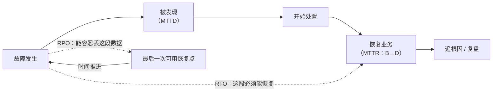

---
tags:
  - Linux
  - 生产运维
  - 备份
  - RTO
  - 前置
created: 2026-09-19
---

# 前置：可恢复性的语言

> [!cite] 参考资料
> `man 1 rsync`（`--link-dest` 与硬链接快照）、`man 8 restic`、`man 1 borg`、`man 8 lvm`（快照）、`man 5 fstab`、`man 1 tar`、`man 1 zstd`；Google SRE 手册中的「Embracing Risk」与「Managing Incidents」两章关于 RTO/RPO 与错误预算的讨论；restic 与 BorgBackup 官方文档中关于 deduplication、`check`、`prune` 的章节。
>
> **实测状态**：本篇的 `rsync --link-dest` 硬链接快照做法在本机（Ubuntu 24.04.4 LTS / WSL2 / 非 root `uid=1000` / `rsync` 版本见 `rsync --version`）**真实跑过**，卷数与 `du`/`df` 口径的实测数字见子笔记 10。**未实测**：restic/borg（本机未安装）、LVM 快照（需要 root 与 LVM 环境）、数据库一致性备份——只给方法与验收标准。

> **这篇讲什么**：把「恢复」这件事的常用词汇统一起来。这一章后面所有的判断——「要不要备份」「备份够不够」「什么时候必须回滚」——都建立在这一篇的五个词上：**RTO、RPO、备份/快照/副本、幂等、验收标准**。
>
> **必须先读什么**：[[Linux/11_生产运维与高可用/01_前置_生产影响面与变更分级|01 前置：生产、影响面与变更分级]]（可逆性三档）。
>
> **读完能回答**：
> 1. RTO 与 RPO 分别约束什么？为什么它们决定了备份方案而不是反过来？
> 2. 备份、快照、副本、归档，四种东西各解决什么问题？为什么快照不能当备份？
> 3. 什么叫「幂等」？为什么它是批量运维与脚本的前提？
> 4. 「做完了」和「验收通过」差在哪？
>
> **所属**：[[Linux/11_生产运维与高可用/00_导读与知识地图|11 生产运维与高可用]] 的 1.3 前置地基 · 主要练 **P1 变更设计与分级**、**P2 备份与恢复验证**

## 0. 30 秒速览

> [!abstract] 这一篇只要记住五句话
> - **RTO 管「停多久」，RPO 管「丢多少」，两个数字先定，备份方案后定。**
>   - 怎么验证：写下业务能接受的两个数字（例如「RTO 30 分钟、RPO 5 分钟」），再看现有方案能不能达标；答不上来就说明方案是拍脑袋定的。
> - **备份、快照、副本是三件事，不能互相替代。**
>   - 证据：快照与源数据通常在同一套存储上，**存储坏了两者一起没**；副本是实时的，**误删会同步过去**；只有独立放置的、能被恢复出来的数据集才是备份。
> - **备份的唯一验收标准是「能恢复」，而且要计时。**
>   - 怎么验证：从备份里恢复一次真实数据，记录耗时与数据完整性；**没做过恢复演练的备份只能算「可能是备份」**（子笔记 10）。
> - **幂等是自动化安全的前提：同一份脚本跑第二遍，系统还是同一个状态。**
>   - 证据：同样一个动作，重复执行的后果可能完全不同——`mkdir`（不带 `-p`）第二次报 `File exists`、`useradd` 第二次报「用户已存在」、`echo ... >> 配置文件` 跑十次就追加十行；而 `mkdir -p`、`systemctl enable`、`rsync`（不带 `--delete`）重复执行不改变结果。声明式工具（Ansible、systemd 单元）把这件事内建成了默认行为。
> - **「做完了」是执行状态，「验收通过」是有证据的结论。**
>   - 怎么验证：验收永远包含三件事——**指标回到基线、业务探活通过、观察窗口内无复发**（子笔记 07）。

## 1. RTO、RPO 与它们决定什么

### 1.1 四个时间数字

| 术语 | 中文 | 定义 | 约束的对象 |
| --- | --- | --- | --- |
| **RTO** | 恢复时间目标 | 业务能容忍中断多久 | 恢复**速度** → 决定要不要热备、要不要自动化恢复 |
| **RPO** | 恢复点目标 | 能容忍丢多少数据（以时间为单位） | 备份/复制的**频率** → 决定备份间隔与是否用实时复制 |
| **MTTR** | 平均修复时间 | 从故障发生到恢复的平均耗时 | 复盘与改进的**度量** |
| **MTTD** | 平均发现时间 | 从故障发生到**被发现**的平均耗时 | 监控与告警的**度量** |



图的时间轴从左到右、**恢复点（F）在故障（A）之前**：F 到 A 之间那一段数据就是 RPO 允许丢掉的；从 A 到「恢复业务」（D）那一段时长就是 RTO 要覆盖的。读图的两个要点：

- **RPO 是往回的**：它决定你最多能丢多少「最近发生的事」。RPO 5 分钟意味着备份/复制间隔必须小于 5 分钟。
- **MTTD 常常被忽略**：最好的止损不是修得快，而是**发现得早**。本机这类单机场景里，一个「磁盘水位」「证书到期日」「备份任务退出码」的告警，比一套复杂的自动修复更有价值。

### 1.2 先定数字，再选方案

| 业务要求 | 推论 | 常见方案 |
| --- | --- | --- |
| RTO 数小时、RPO 24 小时 | 备份 + 人工恢复足够 | 每日全量/增量备份到独立存储 |
| RTO 30 分钟、RPO 5 分钟 | 需要快速恢复能力 | 高频增量 + 预置环境 + 演练过的恢复脚本 |
| RTO 秒级、RPO 0 | 备份不够用 | 多副本实时复制 + 自动故障切换（高可用，子笔记 12） |

> [!important] 常见误区：先买了工具，再倒推需求
> 「上了备份软件」不等于「满足了 RPO」。**顺序必须是：业务定数字 → 数字定方案 → 演练验方案**。倒过来的结果通常是「备份每天跑，恢复要 8 小时」，而业务只给了 1 小时。

## 2. 备份、快照、副本、归档

### 2.1 四种东西的边界

| 名称 | 本质 | 位置 | 能防什么 | 不能防什么 |
| --- | --- | --- | --- | --- |
| **备份（backup）** | 一份**独立存放**、可恢复到过去某个时间点的数据副本 | 独立存储/介质，通常异机异地 | 误删、误改、系统损坏、勒索加密 | 恢复慢；RPO 取决于频率 |
| **快照（snapshot）** | 存储系统提供的**时点视图**（写时复制） | 与源数据同属一套存储 | 短时间内的误操作、变更前的「后悔药」 | **存储本体损坏、双活写入、跨机房故障** |
| **副本（replica）** | 实时或准实时的**第二份可读写数据** | 另一台机器/另一个可用区 | 单机硬件故障、计划内维护 | **逻辑错误会同步过去**（`rm`、坏数据、中毒） |
| **归档（archive）** | 为**长期留存**而保存的历史数据 | 低成本介质/对象存储 | 合规、审计、追溯 | 通常恢复很慢，不适合当应急恢复源 |

### 2.2 一句话判据

> **存储挂了它还在吗？误删会同步过去吗？能恢复出来吗？** —— 三问都过了，才叫备份。

本机可实测的「硬链接快照」是最便宜的一种本机版备份（**注意：它与源数据在同一台机器上，仍然不是完整意义上的备份**）：

```bash
rsync -a --delete --link-dest=/backup/base /data/ /backup/inc-$(date +%F-%H%M)/
                                          # 验证：未变化的文件用硬链接共享，只有变化的文件占新空间
du -sh /backup/base /backup/inc-*         # 验证：增量目录的实际占用远小于全量
df -h /backup                             # 验证：文件系统层面的占用（与 du 口径不同）
```

它的优点与代价必须同时记住：**优点是快且省空间**（未变的文件不重新复制，本机实测改动一个文件、删除一个文件之后，第二份快照只占 8.0 KiB）；**代价是它与源数据在同一台机器、同一块盘上**——盘坏了、被加密了，两者一起丢。所以它只是「本机版时点副本」，不是完整意义上的备份。

## 3. 幂等与可重入

### 3.1 两个词的区别

| 词 | 定义 | 例子 |
| --- | --- | --- |
| **幂等（idempotent）** | 执行一次和执行多次，**结果相同** | `mkdir -p`、`systemctl enable x`、`rsync`（不带 `--delete` 时）、Ansible 的 `copy`/`service` 模块 |
| **可重入（re-entrant）** | 中途失败后**再跑一遍**不会破坏已改好的部分 | 脚本分成「检查 → 变更 → 校验」三段，每段都能单独重跑 |

幂等是一个性质，可重入是一种设计。**批量运维里两者都要**：100 台机器执行到第 37 台失败，你要能修好后**重跑**，而不是「从第 1 台再来一遍」——后者在第 1 台上可能是灾难（例如重复追加配置）。

### 3.2 幂等的三种常见做法

```bash
mkdir -p /data/app                         # 验证：目录存在时不报错（幂等）
grep -qxF 'vm.swappiness = 10' /etc/sysctl.d/99-app.conf 2>/dev/null \
  || echo 'vm.swappiness = 10' >> /etc/sysctl.d/99-app.conf
                                           # 验证：先判断再写入，避免重复追加
systemctl enable --now nginx                # 验证：已启用的单元重复执行不报错
```

反例（不幂等）：

```bash
echo 'vm.swappiness = 10' >> /etc/sysctl.d/99-app.conf
                                           # 验证：跑两次就有两行；跑一百次就有 $((100)) 行
```

> [!warning] 「重跑一遍」在非幂等脚本上是危险动作
> 出故障时人最容易做的事就是「再跑一遍试试」。如果脚本会把输出追加到配置、会给数据库插入一行、会创建一个新的云盘，重跑的代价可能大于失败本身。**在把它自动化之前，先证明它是幂等的**（子笔记 09）。

## 4. 验收标准：把「做完了」变成「有证据的结论」

### 4.1 三件套

| 件 | 内容 | 例子 |
| --- | --- | --- |
| **指标** | 与基线可比的量化判据 | `p99` 回到 120 ms 以内、`df` 使用率回落到 70% 以下 |
| **业务** | 从业务侧确认服务可用 | 下单接口返回 200、定时任务跑完并产出文件 |
| **观察窗口** | 明确长度的等待期 | 观察 15 分钟不复发（间歇性故障要覆盖 2~3 个周期） |

### 4.2 反例对照

| 常见说法 | 为什么不算验收 |
| --- | --- |
| 「配置已修改」 | 配置文件改了不等于生效；要用 `sysctl -n`、`cat /proc/cmdline`、`systemctl show` 这类**运行时口径**复验 |
| 「服务已重启」 | 重启是动作，不是结论；要看进程是否真的 running、端口是否在听、请求是否通 |
| 「业务恢复了」 | 没有量化，无法对比；也无法判断是修好了还是只是故障过去了 |
| 「监控没告警」 | 告警没响可能是因为阈值不对、可能是因为没有采集到数据 |

### 4.3 这一章要交的六份东西

把交付物写在前面，是因为它们决定了你读每一篇时要「带着什么任务」：

| # | 交付物 | 在哪一篇产生 |
| --- | --- | --- |
| 1 | 一份完整的变更单（六要素） | 04 |
| 2 | 一份备份与回滚方案（含验证过的回滚命令） | 05 |
| 3 | 一份批量执行记录（含幂等检查结果） | 06、09 |
| 4 | 一份验收记录（指标 + 业务 + 观察窗口） | 07 |
| 5 | 一份复盘 + 更新后的 Runbook 片段 | 08、16 |
| 6 | 一份带 RTO 计时的恢复演练记录 | 10、17 |

## 常见坑

| 常见做法或说法 | 后果或事实 |
| --- | --- |
| 「我们有备份，不用怕」 | 备份存在 ≠ 备份可用；没演练过的备份只能算「可能是备份」 |
| 把快照当备份 | 快照与源数据通常在同一套存储上；存储坏了、双活写坏了两者一起没 |
| 把副本当备份 | 副本是实时的，逻辑错误（`rm`、坏数据、加密）会同步过去 |
| 「先上工具，需求以后再说」 | 顺序错了：业务定 RTO/RPO → 数字定方案 → 演练验方案 |
| 只关心 MTTR 不关心 MTTD | 发现得晚，修得再快也救不回来；监控与告警优先于自动化修复 |
| 「脚本再跑一遍就好了」 | 非幂等脚本重跑可能造成重复追加、重复插入、重复创建 |
| 用「配置已修改」作为验收 | 改了不等于生效；必须用运行时口径复验 |
| 用「重启后业务恢复」作为验收 | 缺量化与观察窗口；间歇性故障会再次出现 |
| 认为 RTO 是运维单方面决定的 | RTO/RPO 由业务容忍度决定，运维负责把它翻译成技术方案 |

## 决策练习

> [!question]- 场景：业务方说「这个服务很重要，不能停」。你问他们能接受停多久，他们说「越短越好」。现在你要设计备份与恢复方案。
> A. 上最贵的方案：实时双副本 + 每 5 分钟全量备份，反正「越短越好」
> B. 帮业务把「越短越好」变成两个具体数字：停多久算不能接受（RTO）、丢多少数据算不能接受（RPO）；然后按数字选方案，并用一次恢复演练证明它达标
> C. 先按现状做每日备份，等真出事了再看
>
> **答案：B。**
> A 错在把「最贵」当成「最合适」：RTO 秒级方案需要多副本与自动切换（子笔记 12），复杂度和成本都上一个数量级；而如果业务其实能忍 30 分钟，这笔钱花得不值。
> C 错在没有量化：每日备份意味着 RPO 是 24 小时。如果业务的容忍度是 5 分钟，这个方案从一开始就不达标，而这一点往往要到真出事时才被发现。
> B 是正解：**把模糊的「越短越好」翻译成两个数字，再用演练证明**。翻译的过程本身就是在帮业务做决策。

## 要点自测

> [!question]- RTO 与 RPO 分别约束什么？
> - RTO 约束「业务能停多久」，决定恢复速度（要不要热备、要不要自动切换）。
> - RPO 约束「能丢多少数据」，决定备份/复制的频率。
> - **第一反应不要是什么**：不要先选工具再倒推需求；顺序是业务定数字 → 数字定方案 → 演练验方案。

> [!question]- 备份、快照、副本各不能防什么？
> - 快照不能防存储本体故障与跨机房故障（与源数据同属一套存储）。
> - 副本不能防逻辑错误（`rm`、坏数据、勒索加密会同步过去）。
> - 备份的短板是恢复速度，所以它必须与 RTO 一起评估。
> - **第一反应不要是什么**：不要把任何「有第二份数据」当成备份。

> [!question]- 幂等与可重入的区别是什么？
> - 幂等：跑一次和跑多次结果相同（性质）。
> - 可重入：中途失败后再跑不会破坏已改好的部分（设计）。
> - **第一反应不要是什么**：不要在非幂等脚本上「再跑一遍试试」。

> [!question]- 验收的三件套是什么？为什么「配置已修改」不算验收？
> - 指标回到基线 + 业务探活通过 + 观察窗口内无复发。
> - 因为配置改了不等于生效，必须用运行时口径复验（`sysctl -n`、`systemctl show`、`cat /proc/*`）。
> - **第一反应不要是什么**：不要把「动作做完了」当成「结果达成了」。

> [!question]- 为什么 MTTD 比 MTTR 更值得先优化？
> - 故障发现得晚，业务已经受影响很久，修得再快也只能缩短后半段。
> - 单机场景里性价比最高的 MTTD 手段是几条关键告警：磁盘水位、证书到期日、备份任务退出码。
> - **第一反应不要是什么**：不要在 MTTD 还没做好之前就投入自动修复。

> 上一篇：[[Linux/11_生产运维与高可用/02_前置_资产依赖与台账|02 前置：资产、依赖与台账]] ｜ 下一篇：[[Linux/11_生产运维与高可用/04_第1站_立项与评审|04 第 1 站：立项与评审]]
