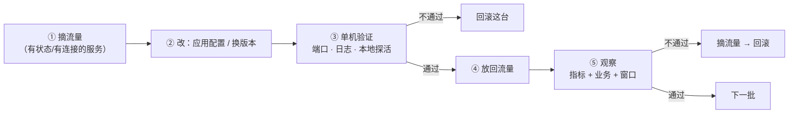

---
tags:
  - Linux
  - 生产运维
  - 变更执行
  - 灰度
  - 并发控制
created: 2026-09-19
---

# 第 3 站：执行与分批推进

> [!cite] 参考资料
> `man 1 ssh`（`-o ConnectTimeout`、`-n`、`ControlMaster`）、`man 5 ssh_config`、`man 1 systemctl`（`reload-or-restart`、`is-active`）、`man 8 ss`、`man 1 journalctl`、`man 1 timeout`、`man 1 xargs`（`-P` 并发）、`man 1 date`；Ansible 官方文档中「Controlling where tasks run: delegation and local actions」「Rolling update batch size」与 `serial` 关键字两节。
>
> **实测状态**：本篇的单机命令（`systemctl`、`ss`、`journalctl`、`timeout`、`xargs -P` 的基本用法）在本机（Ubuntu 24.04.4 LTS / WSL2 / 非 root）跑过；**多机批量执行与摘流量没有环境（本机没有第二台机器、没有负载均衡）**，按方法给出，未实测；Ansible 部分本机未安装，命令写法来自官方文档。

> **这篇讲什么**：执行阶段唯一的目标是**让每一步的后果都可观察、可停止、可回退**。这一篇讲三件事：执行的顺序（改之前要不要摘流量）、执行的节奏（一批多大、什么时候决定停下）、执行的记录（怎么证明「改的是你以为的那个东西」）。
>
> **必须先读什么**：[[Linux/11_生产运维与高可用/05_第2站_准备与预演|05 第 2 站：准备与预演]]。
>
> **读完能回答**：
> 1. 单台实例的执行顺序是什么？为什么「摘流量」不是所有场景都需要？
> 2. 一批做完之后，用什么证据决定「继续」还是「停下」？
> 3. 执行中出现「没见过但好像不严重」的报错，应该怎么办？
>
> **所属**：主线第 3 站；练技能 **P3 批量执行与幂等**、**P7 故障域与高可用判断**

## 0. 30 秒速览

> [!abstract] 这一篇只要记住五句话
> - **执行顺序固定为：摘流量（如需要）→ 改 → 单机验证 → 放回流量 → 观察。**
>   - 怎么验证：改完之后**先验证这台实例自己**（端口在听、日志无新增报错、本地探活成功），再让它接流量；顺序颠倒会让坏实例先吃到真实请求。
> - **一次只改一个变量，一批只动一部分。**
>   - 证据：同时改配置与版本、或同时动 100 台，出问题时无法归因，也无法判断回滚哪一项。
> - **「没报错」不是证据，「输出符合预期」才是。**
>   - 怎么验证：每一步都把实际输出（`systemctl show` 的状态、`sysctl -n` 的值、探活响应码）记进执行记录。
> - **批次之间要有明确的决策点：继续、扩批、暂停、回滚。**
>   - 怎么验证：决策点由第 5 站定的「回滚触发条件」判定，不由心情判定。
> - **执行中看到「没见过但不严重」的报错，先停下来查。**
>   - 证据：变更中新增的任何一条 ERROR/WARN 都可能是级联失败的第一个信号；停下来查的成本是几分钟，忽略的成本可能是整批回滚。

## 1. 单台实例的执行顺序



### 1.1 摘流量：不是所有场景都需要

| 场景 | 要不要摘流量 | 原因 |
| --- | --- | --- |
| 无状态实例，且 LB 有健康检查 | 通常不用 | reload 期间实例短暂不可用，健康检查会把它暂时踢出 |
| 有状态服务（数据库、消息队列） | 要 | 摘流量前先做数据同步检查，避免切换时丢数据 |
| 会断开已有连接的操作（重启进程、换监听端口） | 要 | 不摘的话，存量连接会被打断 |
| 纯只读操作 | 不需要 | 不改变状态 |

摘流量本身也要有验收：

```bash
ss -tn state established '( sport = :8443 )' | head
                                          # 验证：还有多少存量连接（决定是等待还是强摘）
curl -sS -o /dev/null -w '%{http_code}\n' http://127.0.0.1:8443/healthz
                                          # 验证：本机探活（摘流量后仍要能通过，说明问题在流量入口而非服务）
```

> [!important] 摘流量之后要确认「真的摘掉了」
> 摘流量的常见失败方式是「以为摘了，其实没有」：LB 的健康检查还在放流量、服务发现里还有这条记录、客户端有长连接缓存。**验收方式是「从外部探它，应当失败；从本机探它，应当成功」**。

### 1.2 单机验证：三件事

```bash
systemctl show <unit> -p ActiveState -p SubState -p MainPID -p NRestarts
                                          # 验证：服务是否真的在跑、有没有反复重启
ss -lnt | grep -E ':(80|443|8443)\b'      # 验证：监听端口在不在
journalctl -u <unit> --since "5 min ago" --no-pager | grep -iE 'error|fail|panic'
                                          # 验证：变更后有没有新增错误
curl -sS -o /dev/null -w '%{http_code} %{time_total}\n' http://127.0.0.1:8443/healthz
                                          # 验证：本机探活（响应码 + 耗时）
```

三件事的顺序不变：**先看状态，再看日志，最后打请求**。反过来（先打请求）会有两种误导：服务没起来时的连接拒绝看起来像网络问题；服务起来了但配置没生效时的成功响应会让人误判。

## 2. 执行的节奏

### 2.1 批次决策点

每一批结束后，用同一组证据回答一个问题：**继续、扩批、暂停，还是回滚？**

| 观察结果 | 决策 | 依据 |
| --- | --- | --- |
| 指标与基线一致，业务探活通过，无新增报错 | 继续/扩批 | 触发条件未命中 |
| 指标轻微劣化但在阈值内 | 暂停并观察一个完整周期 | 可能是噪声，也可能是趋势的开头 |
| 命中回滚触发条件 | 回滚 | 按第 2 站定的判据执行，不再讨论 |
| 出现「现象无法解释但服务还活着」 | **暂停**，保留现场后排查 | 不允许在未知状态上继续扩大范围 |

### 2.2 并发控制

并发是效率与风险的交换。**变更过程里的并发应当保守**。下面是串行版（最保守，适合有状态服务）与有限并发版（适合无状态服务，先小批量试）的写法对比：

```bash
while read -r host; do
  ssh -o ConnectTimeout=5 -n "$host" 'systemctl reload nginx && systemctl is-active nginx'
done < hosts.txt
                                          # 验证：逐台执行，任一台失败可以立刻停手

xargs -P 4 -I{} ssh -o ConnectTimeout=5 -n {} 'systemctl reload nginx' < hosts.txt
                                          # 验证：最多 4 台同时执行，避免瞬间打满
```

三种并发控制手段在批量运维里常配合使用：**并发度限制**（`-P` / Ansible 的 `forks`）、**串行批次**（Ansible 的 `serial`）、**失败即停**（`set -e` / `max_fail_percentage`）。细节在子笔记 09。

### 2.3 超时与中止

```bash
timeout 30 ssh -o ConnectTimeout=5 -n <host> 'systemctl reload nginx'
                                          # 验证：单台操作设上限，避免卡住整批
```

**没有超时的批量脚本在生产上是危险的**：一台机器网络卡住，脚本会一直等，窗口时间被吃掉，后面的批次做不完。默认给每个远程动作设一个上限（例如 30 秒），并规定「超时的机器单独处理，不阻塞其余批次」。

## 3. 执行中的取证

### 3.1 每一步都留下「改前 / 改后」

```bash
before=$(sysctl -n vm.swappiness)
                                          # 验证：改前的值
printf 'vm.swappiness = 10\n' > /etc/sysctl.d/99-lab.conf
sysctl --system >/dev/null 2>&1
after=$(sysctl -n vm.swappiness)
                                          # 验证：改后的值
echo "swappiness: $before -> $after"
                                          # 验证：把这对值抄进执行记录
```

执行记录的最小格式（每批一行）：

| 批次 | 对象 | 开始 | 结束 | 改前值 | 改后值 | 命令输出摘要 | 结论 |
| --- | --- | --- | --- | --- | --- | --- | --- |
| 1 | `web-01` | 22:03 | 22:05 | 60 | 10 | `is-active: active` | 通过 |
| 2 | `web-02..05` | 22:07 | 22:11 | 60 | 10 | 4/4 active | 通过 |

### 3.2 变更中新增的日志才是重点

```bash
journalctl -u <unit> --since "22:00" --no-pager | grep -icE 'error|fail'
                                          # 验证：变更后错误条数（与变更前日志对比）
```

不要用「服务起来了就行」放过日志。**变更引入的问题，通常先在日志里出现，然后才在业务指标里出现**——日志是你唯一能提前看到它的地方。

## 4. 三种执行方式与它们的取舍

| 方式 | 适合 | 优点 | 风险 |
| --- | --- | --- | --- |
| **手工逐台** | 有状态服务、首次变更、样例验证 | 每一步都在眼里，最容易发现异常 | 慢、容易漏、无法保证一致性 |
| **批量脚本** | 无状态、动作简单的重复操作 | 快、可复用 | 脚本本身可能不幂等、失败处理弱（子笔记 09） |
| **配置管理工具**（Ansible 等） | 常规化、标准化、需要台账与审计的场景 | 幂等、可审计、批次可控 | 学习成本；写错 playbook 会「一批全错」 |

推荐路径：**第一次用「手工 1 台」摸清细节，第二次把它写成脚本，第三次把它写成幂等任务**。跳过第一步的团队，往往在第一次批量执行时才发现某个细节只有手工做过才知道。

## 5. 生产动作：执行记录的模板

```text
变更单 #<编号>  执行记录
执行人：<姓名>          开始：<YYYY-MM-DD HH:MM>      结束：<HH:MM>

批次 1（<对象，X/Y 台>）
  摘流量：<是/否，怎么验的>
  动作：<逐条命令>
  改前/改后：<值或状态>
  验证：<命令 + 输出摘要；本机探活响应码>
  决策：继续 / 暂停 / 回滚

批次 2 …

异常记录
  时间 | 现象 | 原始输出 | 判断 | 动作

结论
  结果：成功 / 部分成功 / 已回滚
  实际耗时 vs 计划耗时：<对比>
  未完成项与原因：
```

> [!example]- 实验 3：在实验机上做一次分批重载（实验机，需要 root 或用户级服务）
> **怎么做**：准备一个能在本机跑起来的服务（例如 `nginx`，或用 `systemd-run --user` 起一个临时服务）；写一个 5 行的「主机清单」（全是本机或几个容器）；分别用**串行**与 `xargs -P 4` 两种方式执行一次 reload，并记录每台的 `is-active` 与耗时。
> **预期**：串行版耗时明显长于并发版；并发版会更快，但**失败时更难定位是哪一台出的问题**——这个对比正是「并发度是风险交换」的直接证据。
> **风险**：低（reload 无状态服务）。**不要在生产机上做**；不要在实验机上有真实业务流量时做。
> **耗时**：约 20 分钟。
> **怎么退回去**：服务仍在运行，无需回滚；清理临时清单与日志文件即可。

## 常见坑

| 常见做法或说法 | 后果或事实 |
| --- | --- |
| 不摘流量就重启有连接的服务 | 存量连接被打断；有状态服务可能丢数据 |
| 以为摘了流量，其实没有 | LB 健康检查、服务发现有缓存；验收方式是从外部探失败、从本机探成功 |
| 先打请求再看状态 | 连接拒绝会被误判成网络问题；顺序应是状态 → 日志 → 请求 |
| 全量并发执行 | 出问题无法定位哪一台；上游依赖也可能被瞬时打挂 |
| 批量脚本不设超时 | 一台机器卡住会吃掉整个窗口时间 |
| 用「没报错」当验收 | 命令成功不等于生效；要用运行时口径复验 |
| 忽略变更后新增的 WARN | 级联失败往往从一条不起眼的告警开始 |
| 「服务活着，现象暂时解释不了，先继续下一批」 | 在未知状态上扩大范围是事故放大器的标准写法 |
| 手工执行不记录 | 事后无法复盘、无法交接、无法证明改了什么 |
| 第一次就跳过手工、直接批量 | 细节只有手工做过才会暴露；第一次批量就是第一次出错 |

## 决策练习

> [!question]- 场景：你在给 20 台 Web 服务器改限流参数，第 1 批 2 台已完成并验证通过。第 2 批 4 台执行后，其中 1 台的 `ss -lnt` 显示端口在听、`systemctl is-active` 是 `active`，但 `journalctl` 里出现了 3 条你没见过的新警告，业务探活全部正常。
> A. 继续执行第 3 批——服务活着、探活正常，警告可能一直都有
> B. 暂停扩批：先确认这 3 条警告是不是本次变更引入的（与改动前日志对比），判断它会不会在负载上来后才变成错误；同时评估是否回滚这 4 台
> C. 立刻回滚全部 6 台，宁可重来也不要冒险
>
> **答案：B。**
> A 错在把「还活着」当成「没问题」：变更中新增的警告常常是后续级联失败的第一个信号，等它在压力下变成错误时，影响面已经扩大到后面几批。
> C 反应过大：回滚本身也是一次变更（会带来抖动），而且还没确认警告是不是自己引起的——如果它是环境本来就有的噪声，这次回滚就是一次无意义的扰动。
> B 是正解：**先判断「是不是变更引入的」（用改动前日志对比），再决定继续还是回滚**。这一步的答案必须记录在执行记录里，因为它决定了后续所有批次的处置方式。

## 要点自测

> [!question]- 单台实例的执行顺序是什么？哪一步最容易被跳过？
> - 摘流量（如需要）→ 改 → 单机验证 → 放回流量 → 观察。
> - 最容易跳过的是「单机验证」：很多人改完就直接放回流量，等于让坏实例先吃真实请求。
> - **第一反应不要是什么**：不要在没验证这台实例之前就让它接流量。

> [!question]- 摘流量之后怎么验证「真的摘掉了」？
> - 从外部探它应当失败，从本机探它应当成功。
> - 常见失败方式：LB 健康检查还在放流量、服务发现里还有记录、客户端长连接缓存。
> - **第一反应不要是什么**：不要凭「我在控制台上点了一下」就认为流量已经摘干净。

> [!question]- 批次决策点有哪些选项？「解释不了但服务还活着」属于哪一种？
> - 继续、扩批、暂停、回滚。
> - 属于**暂停**：保留现场、查清楚再动；在未知状态上扩大范围是事故放大器。
> - **第一反应不要是什么**：不要用「看起来还行」替代回滚触发条件的判定。

> [!question]- 为什么批量脚本必须设超时？
> - 单台卡住会阻塞整批，吃掉窗口时间，后面的批次做不完。
> - 默认给每个远程动作设上限（例如 30 秒），并规定超时的机器单独处理、不阻塞其余批次。
> - **第一反应不要是什么**：不要写没有超时、没有失败处理、没有日志的「一行 for 循环」就直接上生产。

> [!question]- 三种执行方式该怎么选？
> - 手工逐台：有状态服务、首次变更、样例验证。
> - 批量脚本：无状态、动作简单、可复用。
> - 配置管理工具：常规化、需要幂等与审计。
> - **第一反应不要是什么**：不要跳过「手工做一遍」直接批量。

> 上一篇：[[Linux/11_生产运维与高可用/05_第2站_准备与预演|05 第 2 站：准备与预演]] ｜ 下一篇：[[Linux/11_生产运维与高可用/07_第4站_验证与守候|07 第 4 站：验证与守候]]
