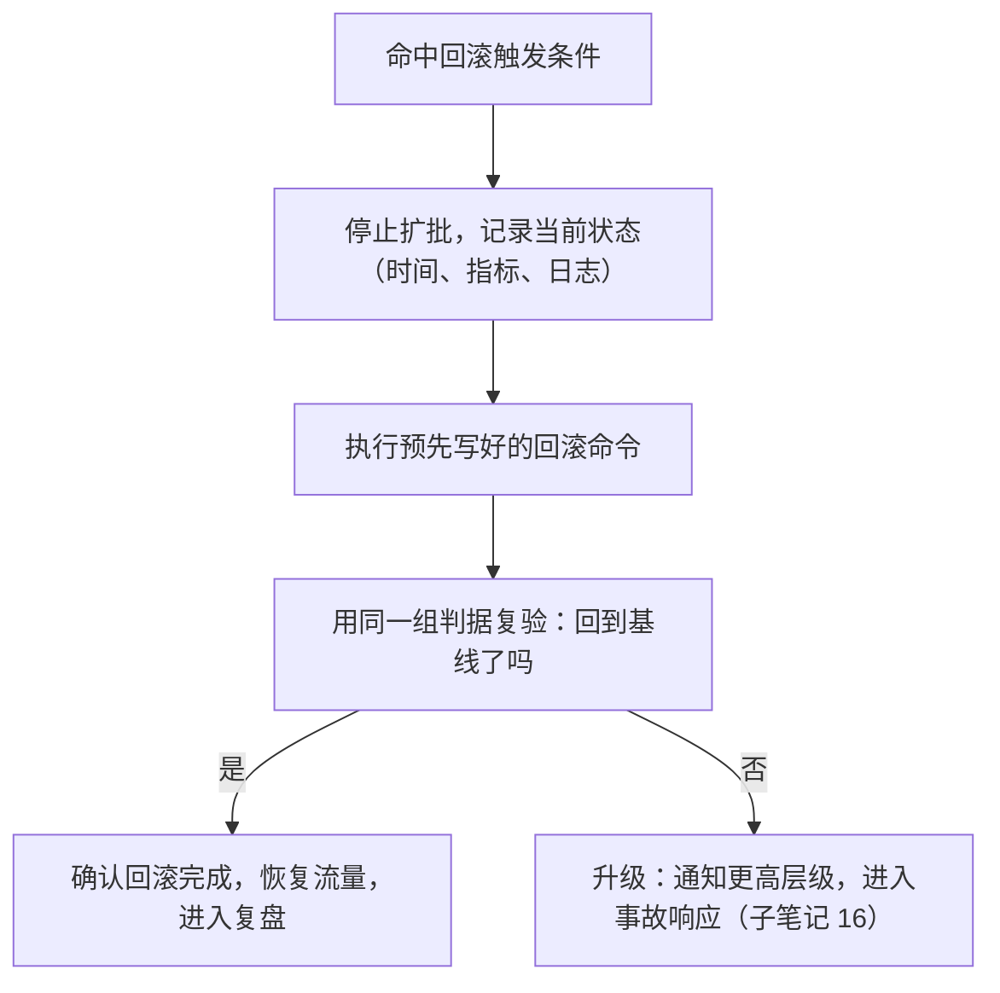

---
tags:
  - Linux
  - 生产运维
  - 变更验收
  - 观察窗口
  - 回滚
created: 2026-09-19
---

# 第 4 站：验证与守候

> [!cite] 参考资料
> `man 1 systemctl`（`is-active`、`show`、`status`、`NRestarts`）、`man 1 journalctl`、`man 1 curl`（`-w` 输出格式与 `--max-time`）、`man 8 ss`、`man 1 uptime`、`man 5 proc_loadavg`、`man 1 vmstat`、`man 1 iostat`、`man 1 sar`（历史对比）、`man 1 date`；Google SRE 手册中「Monitoring Distributed Systems」一章关于分位数与告警判据的讨论，以及「Release Engineering」中关于发布后验证的说明。
>
> **实测状态**：实测环境 **Ubuntu 24.04.5 LTS（VMware 虚拟机）/ 内核 `6.8.0-139-generic` / systemd 255 / 4 vCPU / root 可用**。**已实测**：① 单机与集群验收命令（`systemctl show`、`journalctl --since`、`ss -lnt`、`ss -s`、`systemctl --failed`、`uptime`、`nproc`、`df -h`、`sysctl -n`），输出见 1.2、1.3；② 本机探活（`curl -w`，用一个临时 HTTP 服务起在**端口 21081**，本章区间 21000–21199）与「404 也是可用证据」的对照，见 1.4；③ **历史基线对比**——本机 `sysstat` **已安装且 `sysstat-collect.timer` 处于 active**，`/var/log/sysstat/sa19` 存在，`sar -u`/`sar -r -f` 能读出真实历史采样，见 2.3；④ 监听队列溢出计数器（`TcpExtListenOverflows`）的读法——实测它从安静时的 `0` 涨到 `10`，说明它是**开机以来的累计值**，判据是「窗口内有没有增长」。
>
> **未实测**：**业务侧指标（p99、错误率、QPS）没有数据源**——本机没有业务流量、没有业务监控，这部分只给方法与判据。**「历史对比」只做到了「系统层用 `sar` 回看」这一层**，业务层的同比/环比仍然没有数据。

> **这篇讲什么**：变更做完之后的守候阶段——**怎么证明它真的成功了**，以及**在什么条件下承认失败并回滚**。这一篇的核心不是命令，而是判据：三层验收（单机 → 集群 → 业务）、三种证据（指标、业务、日志）、一条回滚触发线。
>
> **必须先读什么**：[[Linux/11_生产运维与高可用/05_第2站_准备与预演|05 第 2 站：准备与预演]]（改动前基线与回滚触发条件）。
>
> **读完能回答**：
> 1. 验收为什么要分三层？每一层各看什么？
> 2. 「探活成功」为什么不能代表「业务可用」？
> 3. 观察窗口要开多久？间歇性问题怎么覆盖？
> 4. 什么情况下必须回滚，而不是「再等等看」？
>
> **所属**：主线第 4 站；练技能 **P4 验收与回滚判断**

## 0. 30 秒速览

> [!abstract] 这一篇只要记住五句话
> - **验收分三层：单机（这台对不对）→ 集群（整体容量够不够）→ 业务（真实用户路径通不通）。**
>   - 怎么验证：三层各有自己的判据；只做第一层的变更，会在「服务都活着但业务不可用」时误判成功。
> - **「服务在听端口」和「业务能用」是两件事。**
>   - 证据：端口在听但监听队列溢出（`TcpExtListenOverflows` 增长）时，探活可能通过而真实请求被丢——本机实测这个**累计**计数器安静时是 `0`、8 分钟后（同期有别的实验并发连它）涨到 `10`，**所以判据只能是「变更窗口内有没有增长」，不能看绝对值**；另外实测 `curl` 打「存在的路径」返回 `200 0.003150`、打「不存在的路径」返回 `404 0.000763`，**探活必须打真实业务路径，而不是只 `curl /healthz`**。
> - **观察窗口的长度由「问题出现的最慢速度」决定。**
>   - 怎么验证：间歇性问题要覆盖 2~3 个周期；周期性任务（定时报表、批量同步）要跨过它的一次完整执行。
> - **回滚触发条件必须在动手前写死，执行时不再讨论。**
>   - 怎么验证：条件写成「错误率 > 1% 持续 5 分钟」这类可判定句子；命中即回滚，不需要开会。
> - **「重启之后就好了」不是验收结论，是一句待解释的现象。**
>   - 证据：重启清掉了现场，也清掉了证据；如果问题是间歇性的，它会再来一次，而你这次什么也没学到。

## 1. 三层验收

### 1.1 三层与各自的判据

| 层 | 问的问题 | 判据 | 命令/来源 |
| --- | --- | --- | --- |
| **单机** | 这台机器上的改对了吗？服务在跑吗？ | 运行时值符合预期、服务 active、无新增报错 | `sysctl -n`、`systemctl show`、`journalctl --since`、`ss -lnt` |
| **集群** | 整体容量与冗余还够吗？ | 可用实例数达标、负载与容量水位在阈值内、没有单点 | `ss -s`、`systemctl --failed`、实例数统计、LB 后端列表 |
| **业务** | 真实用户路径通吗？ | 关键接口成功、错误率与延迟在阈值内、业务动作能完成 | 业务指标、端到端探活、真实的读写动作 |

三层是递进的：单机不过，后面两层不用看；单机全过，仍然要往下看两层——**因为变更常常在「单机都正常」的前提下把整体搞坏**（例如少了一批实例导致容量不足、或配置不一致导致部分请求失败）。

### 1.2 单机验收

```bash
sysctl -n vm.swappiness                   # 验证：运行时值（不是文件内容）
systemctl show <unit> -p ActiveState -p SubState -p MainPID -p NRestarts
                                          # 验证：服务是否在跑、是否反复重启（NRestarts > 0 要查）
ss -lnt | grep -E ':(80|443|8443)\b'      # 验证：监听端口
journalctl -u <unit> --since "10 min ago" --no-pager | grep -icE 'error|fail'
                                          # 验证：变更后错误条数（与改动前对比）
curl -sS --max-time 3 -o /dev/null -w '%{http_code} %{time_total}\n' http://127.0.0.1:8443/healthz
                                          # 验证：本机探活（响应码 + 耗时）
```

实验机实测（`<unit>` 取 `ssh`，探活用端口 21081 上的临时服务）：

```text
$ sysctl -n vm.swappiness
60

$ systemctl show ssh -p ActiveState -p SubState -p MainPID -p NRestarts -p ExecMainStartTimestamp
MainPID=1348
NRestarts=0
ExecMainStartTimestamp=Sat 2026-09-19 07:20:10 UTC
ActiveState=active
SubState=running

$ journalctl -u ssh --since "10 min ago" --no-pager | grep -icE 'error|fail'
0

$ curl -sS --max-time 3 -o /dev/null -w '%{http_code} %{time_total}\n' http://127.0.0.1:21081/healthz
200 0.003150
```

`ExecMainStartTimestamp=Sat 2026-09-19 07:20:10 UTC` 这一项值得单独看：**它是「这个进程从什么时候开始跑的」**。变更前记一次，变更后应当是**新的时间戳**；如果时间戳没变，说明 **`reload` 只是让进程重读了配置、主进程根本没换**——这正是 1.2 里那条警告的具体判据。**只看 `ActiveState=active` 是分不出「reload 生效了」和「reload 什么也没做」的。**

> [!warning] 「文件写了」与「运行时生效」是两套口径
> 配置文件中写对了，不等于进程已经读到：`sysctl` 要 `sysctl --system` 或重启相关服务才生效；`nginx.conf` 要 `reload`；内核参数要重启。**验收一律用运行时口径**（`sysctl -n`、`systemctl show`、`cat /proc/*`），不要用 `cat` 配置文件答案。

### 1.3 集群验收

```bash
systemctl --failed --no-pager             # 验证：有没有失败的单元
ss -s                                     # 验证：连接总体分布（estab / timewait / orphan）
uptime; nproc                             # 验证：负载与核数（负载要除以核数才有意义）
df -h                                     # 验证：容量水位（日志类变更必看）
```

实验机实测（2026-09-19 08:08 UTC）：

```text
$ systemctl --failed --no-pager
  UNIT                    LOAD   ACTIVE SUB    DESCRIPTION
● lab08b-stubborn.service loaded failed failed lab08b ignores SIGTERM

1 loaded units listed.

$ ss -s
Total: 191
TCP:   23 (estab 5, closed 12, orphaned 0, timewait 12)

Transport Total     IP        IPv6
RAW       1         0         1
UDP       4         4         0
TCP      11        10         1
INET     16        14         2
FRAG      0         0         0

$ uptime; nproc
 08:08:18 up 59 min,  4 users,  load average: 0.15, 0.13, 0.06
4

$ df -h
Filesystem                         Size  Used Avail Use% Mounted on
tmpfs                              790M  1.6M  788M   1% /run
/dev/mapper/ubuntu--vg-ubuntu--lv   47G  8.7G   36G  20% /
tmpfs                              3.9G     0  3.9G   0% /dev/shm
tmpfs                              5.0M     0  5.0M   0% /run/lock
/dev/sda2                          2.0G  104M  1.7G   6% /boot
tmpfs                              790M   12K  790M   1% /run/user/0
```

三个读法：

1. **`systemctl --failed` 报出的那个失败单元不是本机的「固有状态」**：`lab08b-stubborn.service` 是同期另一个实验（演示「unit 忽略 `SIGTERM`」时故意留下的失败单元）残留的，**该实验收尾后它就被清理掉了**——也就是说，这一行是「某一刻的现场」，不是「这台机器的属性」。**这条正好演示了收口时要做的动作**：失败单元列表是「有人遗留了东西」的第一现场，收口时（子笔记 08）必须把它清掉或找到它的主人，否则下一个人会把别人的残留当成自己的问题去查。
2. **`load average: 0.15, 0.13, 0.06` 要除以 `nproc=4` 才有意义**：0.15 / 4 ≈ 3.75% 的负载水位。**报「负载 0.15」而不说几核，等于什么也没说**。
3. **`ss -s` 的 `timewait 12` 才是这台机器的正常基线**：只有 12 条，说明它没有真实的短连接压力。本篇决策练习里那个「`timewait` 从 200 涨到 12000」的场景，之所以是异常信号，**正是因为有「平时是多少」这个基线**——没有基线的数字无法判断异常。

集群层要专门确认三件事：**可用实例数**（变更后有没有少）、**容量水位**（有没有因为变更而上升）、**冗余**（有没有出现新的单点）。

### 1.4 业务验收

业务验收的关键是**打真实路径**，而不是只打健康检查端点：

| 层次 | 例子 | 能证明什么 | 不能证明什么 |
| --- | --- | --- | --- |
| 端口连通 | `nc -z host port` | 网络可达 | 应用是否正常 |
| 健康检查 | `curl /healthz` | 进程活着、能响应 | 依赖是否可用、真实路径是否通 |
| 业务动作 | 下单/查询/写入一条测试数据 | 端到端可用 | 性能是否达标 |
| 端到端指标 | p99、错误率、QPS | 整体质量 | 单个用户的具体路径 |

> [!tip] 第一反应不要是「探活通了就收工」
> 探活只回答「进程还在」，不回答「依赖还能连上」「真实请求能不能过」。**变更涉及依赖（数据库、缓存、下游服务）时，业务验收必须打一条真实路径。**

实验机上把「探活的层次」实测了一遍（一个临时 HTTP 服务，端口 21081）：

```text
$ curl -sS --max-time 3 -o /dev/null -w '%{http_code} %{time_total}\n' http://127.0.0.1:21081/healthz
200 0.003150

$ curl -sS --max-time 3 -o /dev/null -w '%{http_code} %{time_total}\n' http://127.0.0.1:21081/nope
404 0.000763
```

**两个结果都是「服务可用」的证据，但含义完全不同**：`200` 说明「这个路径存在且能正常处理」，`404` 说明「服务活着、能解析请求、能返回结构化响应，只是这个路径不存在」。**能把 404 与「连接被拒绝 / 超时」区分开，才说明你打到了应用层**——如果变更后原本返回 200 的健康检查路径变成 404，那是「路由挂了」；如果变成 `000`（`curl` 连不上），那是「进程没起来或端口没听」。验收记录里要写清楚**你打的是哪个路径、期望哪个码**，只写「探活通过」是不合格判据。

同样的道理，**监听队列溢出**要单独看一个计数器：

```bash
nstat -az TcpExtListenOverflows | tail -1  # 验证：listen 队列溢出累计次数（绝对值 + 每秒速率）
```

实测输出的原文（两次相隔约 8 分钟，同一台机器）：

```text
$ date -Is; nstat -az TcpExtListenOverflows | tail -1
2026-09-19T08:08:19+00:00
TcpExtListenOverflows           0                  0.0

$ date -Is; nstat -az TcpExtListenOverflows | tail -1
2026-09-19T08:16:32+00:00
TcpExtListenOverflows           10                 0.0
```

**这个例子把「累计计数器」的读法演示得很干净**：`TcpExtListenOverflows` 是**开机以来的累计值**，安静时是 `0`，8 分钟后变成 `10`——这 10 次溢出不是业务流量造成的（这台机器没有业务），而是同期在它上面并行跑的几个实验短时间堆了太多连接。所以判据有三条：**① 看绝对值没意义，要看它在你的变更窗口内有没有增长**（变更前后各读一次相减）；**② 基线必须先采**——这台机器安静时的基线就是 `0`，所以「非 0」对它是异常，而在一个本来就有大量短连接的生产机上，非 0 是常态；**③ 只要它在长，就说明「端口在听」但真实请求已经被内核丢掉过**——这正是「服务在听端口 ≠ 业务能用」的机器可读证据，也是「重启服务后队列溢出归零」这种假成功的反面。

## 2. 观察窗口怎么定

### 2.1 三种问题形态与窗口长度

| 问题形态 | 特征 | 窗口怎么定 |
| --- | --- | --- |
| 立即暴露 | 配置写错、服务起不来 | 几分钟即可（单机验证已经覆盖） |
| 压力相关 | 并发上来才出现（连接池、限流、超时） | 覆盖一个业务高峰或一次压测 |
| 周期相关 | 定时任务、缓存失效、连接老化 | 覆盖 2~3 个完整周期 |

```text
观察窗口 ≥ max(一个业务周期, 2~3 个采样间隔, 一次关键定时任务的执行)
```

### 2.2 窗口内的动作

窗口不是「等着」，而是**有明确检查点**：

| 时间点 | 做什么 | 证据 |
| --- | --- | --- |
| T+1 分钟 | 单机验收 | `systemctl show`、`journalctl`、本机探活 |
| T+5 分钟 | 集群与业务验收 | 可用实例数、错误率、p99、容量水位 |
| T+15 分钟 | 复查是否有新增告警与日志异常 | 告警列表、`journalctl --since` |
| 窗口结束 | 宣布成功或回滚 | 验收记录 |

### 2.3 历史基线：`sar` 回答「以前是多少」

上面那些命令回答的都是「**现在**是多少」。要判断「现在这个数字算不算异常」，你还需要「**以前**是多少」——这就是 `sysstat` 这套采集的作用：它由 `sysstat-collect.timer` 周期性把系统指标落盘到 `/var/log/sysstat/sa<日>`，`sar -f` 可以把历史读回来。

> [!warning] 「本机没有 `/var/log/sysstat`」这个说法只在没装 `sysstat` 的机器上成立
> 本实验机 `sysstat` **已安装**，`sysstat-collect.timer` 处于 `active`，`/var/log/sysstat/sa19` 存在（23096 字节，当天 19 号）。所以这一节是**实测**、不是文档值；但在没装 `sysstat` 的机器上（例如容器、精简镜像、某些 WSL2 环境）这条路径确实不存在，那时「历史对比」只能靠外部监控系统。

```bash
systemctl is-active sysstat-collect.timer  # 验证：采集定时器在不在跑
ls -l /var/log/sysstat/                    # 验证：历史数据文件在不在、是不是今天更新的
sar -u -f /var/log/sysstat/sa19            # 验证：回看当天的 CPU 使用率历史
sar -r -f /var/log/sysstat/sa19            # 验证：回看当天的内存使用历史
sar -u 1 3                                 # 验证：实时采样 3 次（间隔 1 秒），与历史同口径
```

实测输出：

```text
$ systemctl is-active sysstat-collect.timer
active

$ ls -l /var/log/sysstat/
total 28
-rw-r--r-- 1 root root 23096 Sep 19 08:00 sa19

$ sar -u -f /var/log/sysstat/sa19 | tail -3
07:50:16 AM     all      1.51      0.00      0.74      0.01      0.00     97.74
08:00:12 AM     all      0.17      0.00      0.10      0.00      0.00     99.72
Average:        all      0.37      0.00      0.19      0.00      0.00     99.44

$ sar -r -f /var/log/sysstat/sa19 | tail -3
07:50:16 AM   6909124   7540588    175276      2.17     56592    754456    296624      2.42    275196    576916         0
08:00:12 AM   6551604   7535356    175144      2.17     57424   1102296    335608      2.73    302792    902960        52
Average:      7258730   7579757    162342      2.01     34006    487590    282382    2.30    225819    330107        10

$ sar -u 1 3 | tail -4
08:08:20 AM     all      0.75      0.00      1.00      0.00      0.00     98.25
08:08:21 AM     all      0.00      0.00      0.25      0.00      0.00     99.75
08:08:22 AM     all      0.00      0.00      0.00      0.00      0.00    100.00
Average:        all      0.25      0.00      0.42      0.00      0.00     99.33
```

**这一节真正要交的能力是「把历史口径和实时口径对齐」**：

- **`sar -f` 的每条记录是「该时间点所在的采集间隔内的平均值」，不是瞬时值**。默认采集间隔是 10 分钟（本机就是 `08:00:12` 这条），所以 `%idle 99.72` 说的是「07:50–08:00 这 10 分钟内 CPU 平均 99.72% 空闲」。**拿 10 分钟的平均值去比一次 1 秒的采样，两者不可比**——要比就把 `sar -u 1 3` 也换成同样的 10 分钟窗口。
- **历史数据是「按天一个文件」**：`sa19` 是 19 号的，跨天要比就得同时给 `-f` 两个文件或用 `sadf` 导出。**变更窗口跨零点时，历史对比最容易在这里断**，这也是「变更尽量别跨零点」的一个技术理由。
- **`/var/log/sysstat/sa19` 里可能有多次启动的痕迹**：实测输出里能看到 `LINUX RESTART` 之类的行，说明这个文件记录了不止一次开机以来的数据。**读历史前先确认时间范围**，别把上一次开机前的采样当成这次变更前。
- **判断「变更后是不是变差了」的正确写法**：`sar -u -f ...` 取变更前同一时段的均值 → 与变更后的均值比 → 差异超过阈值才叫劣化。**「凭感觉这次 CPU 好像高了」不是判据**。

## 3. 回滚触发线

### 3.1 触发条件的写法

| 差 | 好 |
| --- | --- |
| 「如果有问题就回滚」 | 「错误率 > 1% 持续 5 分钟」 |
| 「感觉变慢了就回滚」 | 「业务 p99 > 基线的 1.5 倍且持续 10 分钟」 |
| 「客户投诉就回滚」 | 「业务探活连续 3 次失败，或关键接口成功率 < 99%」 |

好条件的三个特征：**有指标、有阈值、有持续时间**。三个都要有——只有阈值没有持续时间会被瞬时抖动误触发，只有持续时间没有阈值则无法判定。

### 3.2 命中之后



两个纪律：

1. **命中即回滚，不再讨论**。触发条件在动手前定，就是为了避免在压力下反复犹豫。
2. **回滚也要验收**。回滚是另一个变更，同样需要判据；「我执行了回滚命令」不是回滚成功的证据。

## 4. 四种「假成功」

| 假成功 | 为什么不是成功 | 怎么识破 |
| --- | --- | --- |
| **服务重启后恢复正常** | 重启清掉了现场，问题可能只是被推迟 | 追问「为什么重启就好了」；看日志里有没有启动期的异常 |
| **没有告警** | 可能是阈值不对、也可能根本没有采集到数据 | 主动查指标有没有数据，而不是等告警 |
| **单机探活全通过** | 探活不覆盖依赖与真实路径 | 打一条真实业务路径 |
| **「跟以前一样」** | 没有量化，无对照 | 与改动前基线逐项比 |

## 5. 生产动作：验收记录模板

```text
变更单 #<编号>  验收记录
验收人：<姓名>（建议不是执行人）        验收时间：<YYYY-MM-DD HH:MM>

一、单机验收
  对象与数量：<X 台>
  运行时值：<命令 + 值>
  服务状态：<is-active / NRestarts>
  新增报错：<0 条 / 列出>
  探活：<响应码 + 耗时>

二、集群验收
  可用实例数：<变更前 → 变更后>
  容量水位：<df / 负载 / 连接数，与基线对比>
  冗余检查：<有没有新增单点>

三、业务验收
  关键路径：<做了什么业务动作，结果如何>
  p99 / 错误率 / QPS：<数值与基线对比>
  观察窗口：<开始 → 结束；窗口内是否复发>

四、结论
  成功 / 部分成功 / 已回滚
  若无异常：记录本次的「正常态基线」，供下次对比
  遗留问题：<现象 / owner / 期限>
```

> [!example]- 实验 4：为一次变更设计完整的验收方案（纸面 + 实验机，不接触生产）
> **怎么做**：选一个你在实验机上做过的变更（例如实验 2 的参数变更），写出三层验收的判据：单机用哪个命令看什么值、集群看哪几个数字、业务打哪条路径；然后**故意制造一次失败**（把参数改成明显不合理的值），看这套判据能不能把它抓住。
> **预期**：一套能区分「成功」与「失败」的判据。如果改坏之后判据仍然说「通过」，说明判据太松——这是本篇最重要的产出。
> **风险**：低（实验机、单参数）。
> **耗时**：约 30 分钟。
> **怎么退回去**：把参数改回原值并复验运行时口径。

## 常见坑

| 常见做法或说法 | 后果或事实 |
| --- | --- |
| 「配置文件改好了，验收通过」 | 文件内容 ≠ 运行时生效；必须用 `sysctl -n`/`systemctl show`/`cat /proc/*` 复验 |
| 「服务重启后正常了，收工」 | 重启清掉现场，问题可能只是被推迟；这是一句待解释的现象，不是结论 |
| 只做单机验收 | 会漏掉容量与冗余问题（变更后可用实例变少、水位异常上升） |
| 只打健康检查端点 | 探活不覆盖依赖与真实路径；要打一条真实业务动作 |
| 观察窗口不写或写成 0 | 压力相关与周期相关的问题根本来不及出现 |
| 回滚触发条件写成「有问题就回滚」 | 不可判定；现场只能靠争论与情绪决定 |
| 命中触发条件后还「再等 5 分钟看看」 | 触发条件写在动手前就是为了避免这种犹豫；等待的每分钟都在扩大影响面 |
| 回滚之后不复验 | 回滚也是变更；要确认「回到基线了」，而不是「命令执行了」 |
| 没有告警就当没问题 | 可能是阈值不对或没采到数据；验收要主动查指标 |
| 变更后不更新基线 | 下次变更没有可比对象；成功态应当成为新的基线 |

## 决策练习

> [!question]- 场景：你完成了一批缓存参数变更，单机验收全部通过，业务探活也正常。观察窗口到 10 分钟时，你注意到集群里有一台实例的 `ss -s` 显示 `timewait` 从 200 涨到 12000，其它指标正常，业务无报错。回滚触发条件里写的是「错误率 > 1% 持续 5 分钟」，没有命中。
> A. 触发条件没命中，属于正常范围，按计划宣布成功并收工
> B. 记录这个异常，暂停扩批；先确认这是变更引入的还是本来就有（与改动前基线对比），并评估 TIME_WAIT 继续增长会不会耗尽临时端口；在结论里明确写「未命中触发条件，但存在待观察项」
> C. 直接回滚——宁可错杀
>
> **答案：B。**
> A 错在「没命中触发条件」被当成了「一切正常」。触发条件只覆盖了**已知的失败模式**（错误率），它抓不到未被预期的信号——该实例 TIME_WAIT 从 200 涨到 12000 正是这种信号，而临时端口耗尽的后果是偶发连接失败（阶段 10 的处置手册里有这个指纹）。
> C 反应过大：还没确认这个变化是否由本次变更引起，回滚本身也要付出扰动代价。
> B 是正解：**触发条件用来快速止损，异常信号用来发现未知风险**；两者并行。把未命中但存疑的信号写进结论，是让下一次变更更安全的最低成本做法。

## 要点自测

> [!question]- 验收的哪三层？各看什么？
> - 单机（运行时值、服务状态、新增报错、本机探活）、集群（可用实例数、容量水位、冗余）、业务（真实路径、p99/错误率/QPS）。
> - 三层递进：单机不过就不用往后看；单机全过仍然要看后两层。
> - **第一反应不要是什么**：不要用单机探活通过来代表整体可用。

> [!question]- 为什么「服务在听端口」不等于「业务能用」？
> - 端口在听但接受队列溢出时，真实请求会被丢；探活只是一次连接尝试。
> - 依赖（数据库、缓存、下游）不可用时，健康检查照样可能返回 200。
> - **第一反应不要是什么**：不要只打 `/healthz` 就宣布业务验收通过。

> [!question]- 观察窗口该开多久？
> - 至少覆盖：一个业务周期、2~3 个采样间隔、一次关键定时任务的执行。
> - 压力相关的问题要覆盖一个业务高峰；周期相关的问题要覆盖 2~3 个完整周期。
> - **第一反应不要是什么**：不要把「等了 1 分钟没出事」当成观察窗口。

> [!question]- 好的回滚触发条件有什么特征？
> - 有指标、有阈值、有持续时间，三者齐全。
> - 命中即回滚、不再讨论；回滚之后要用同一组判据复验。
> - **第一反应不要是什么**：不要把回滚决策留到现场再定。

> 上一篇：[[Linux/11_生产运维与高可用/06_第3站_执行与分批推进|06 第 3 站：执行与分批推进]] ｜ 下一篇：[[Linux/11_生产运维与高可用/08_第5站_收口与沉淀|08 第 5 站：收口与沉淀]]
