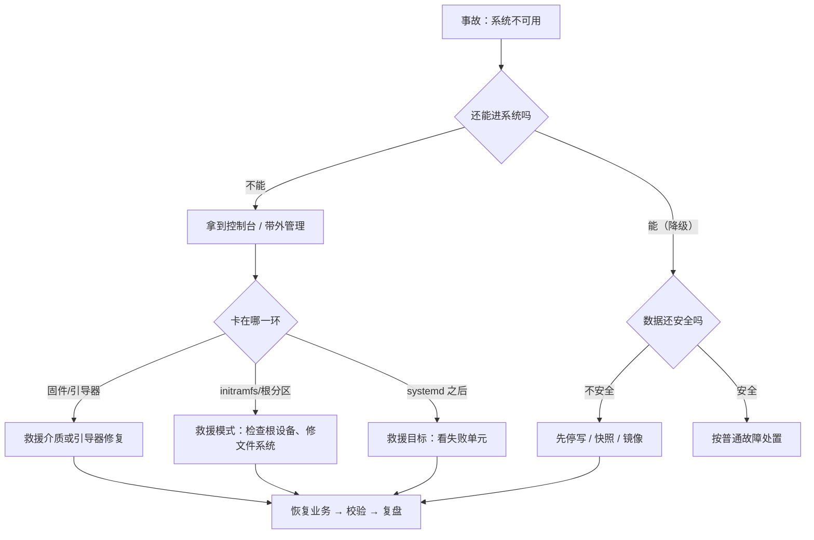

---
tags:
  - Linux
  - 生产运维
  - 灾难恢复
  - 救援
  - 带外管理
created: 2026-09-19
---

# 横切：灾难恢复与救援入口

> [!cite] 参考资料
> `man 8 mount`、`man 8 fstab`、`man 8 fsck`、`man 8 e2fsck`、`man 8 xfs_repair`、`man 8 grub-install`、`man 8 dracut`、`man 8 chroot`、`man 8 lsblk`、`man 8 blkid`、`man 1 lsof`（`+L1` 与已删除但被持有的文件）、`man 1 debugfs`（恢复被删文件）、`man 1 rsync`、`man 8 smartctl`、`man 1 systemd-nspawn`、`man 1 journalctl`；发行版官方文档中的救援模式（RHEL 系 `rescue`/`emergency` 与 Ubuntu 的 recovery mode）、Live 介质与带外管理（IPMI/iDRAC/iLO）三部分。
>
> **实测状态**：本篇的**只读检查命令**（`lsblk`、`blkid`、`findmnt`、`journalctl -k`、`lsof +L1`、`ls /sys/firmware/efi`）在本机（Ubuntu 24.04.4 LTS / WSL2 / 非 root）跑过；`lsof +L1` 的语义（已删除但被进程持有的文件）在子笔记 13 的容量场景里实测。**未实测**：救援模式启动、Live 介质修复、重建引导、`chroot` 修复、IPMI/iDRAC/iLO——**这些都必须在一台可快照、且有控制台的实验机上做**，WSL2 既没有控制台也没有独立引导，本机测不了。

> **这篇讲什么**：系统已经**无法正常运行时**的最短恢复路径。它不处理「服务慢」「磁盘满」这类仍能登录的问题，只处理四种最坏情况：**系统起不来、根分区坏了、关键文件丢了、整机不可用**。核心方法是「**先判断是修还是重来**」，以及**把救援通道当成基础设施来准备**。
>
> **必须先读什么**：[[Linux/11_生产运维与高可用/10_横切_备份恢复与恢复演练|10 横切：备份、恢复与恢复演练]]。
>
> **读完能回答**：
> 1. 四类灾难各自的最短恢复路径是什么？
> 2. 什么时候应该直接重建，而不是修？
> 3. 文件误删后的「黄金几分钟」要做什么、不要做什么？
> 4. 救援通道要怎么提前准备？为什么它必须在故障之前验证过？
>
> **所属**：横切篇（可恢复性线）；练技能 **P2 备份与恢复验证**、**P8 灾难恢复**

## 0. 30 秒速览

> [!abstract] 这一篇只要记住六句话
> - **救援通道是基础设施，不是应急手段。**
>   - 怎么验证：带外管理（IPMI/iDRAC/iLO/云控制台）**在故障之前**登录过一次、救援介质**在故障之前**启动过一次；没验证过的救援通道等于没有。
> - **先判断「修」还是「重来」，两分钟之内决定。**
>   - 证据：无状态服务 + 有自动化重建能力时，重建通常比修复更快更可靠；有状态机器则以「先保住数据」为第一优先。
> - **系统起不来时，第一件事是拿到控制台，而不是重启。**
>   - 怎么验证：重启可能把唯一的错误信息刷掉；有控制台才能看到卡在固件、引导器、initramfs 还是 systemd 哪一环。
> - **文件误删后的黄金几分钟：立即停止对该文件系统的写入。**
>   - 证据：被删文件的数据块会被后续写入覆盖；继续在同一文件系统上写日志、跑任务、装软件，会让恢复成功率快速下降。
> - **先看「谁还持有这个已删除的文件」，比找恢复工具更快。**
>   - 证据：`lsof +L1` 能列出被进程持有的已删除文件；只要进程还活着，就能从 `/proc/<pid>/fd/` 把内容原样拷回来（子笔记 13 的容量场景用过同一手法）。
> - **任何恢复动作都要在「数据保住了」之后才谈系统能不能起来。**
>   - 怎么验证：把「先备份/先镜像」写在恢复步骤的第一步；修复类命令（`fsck -y`、`xfs_repair -L`）都可能改变数据，属于不可逆动作。

## 1. 四类灾难与各自的最短路径

| 类别 | 典型现象 | 第一优先 | 最短路径 |
| --- | --- | --- | --- |
| **系统起不来** | 卡在引导器、initramfs、`emergency mode` | 拿到控制台、留住现场 | 控制台 → 判断卡在哪一环 → 用救援入口（旧内核/救援目标/救援介质）→ 修好那一环 |
| **根分区或数据盘损坏** | 内核报 I/O 错误、文件系统只读、挂载失败 | **保住数据** | 卸载/只读 → 从快照或备份恢复数据 → 再修文件系统或重建 |
| **关键文件误删** | 配置没了、数据文件没了 | **立即停止写入** | 停止写入 → `lsof +L1` 找持有者 → 从备份/快照恢复 → 校验 |
| **整机不可用** | 主板/磁盘/电源故障，机器上不了电 | 恢复服务能力 | 换硬件或换机器 → 用镜像/自动化重建 → 恢复数据 → 校验业务 |



## 2. 修还是重来：两分钟决定

| 判断项 | 倾向「修」 | 倾向「重来」 |
| --- | --- | --- |
| 服务性质 | 有状态、数据不能丢、重建成本高 | 无状态、可由镜像/配置管理重建 |
| 数据状态 | 数据完好，问题在系统层 | 数据已损坏或不可用 |
| 修复把握 | 知道根因、有验证过的步骤 | 根因不明、故障现象反复出现 |
| 时间成本 | 修复明显更快 | 重建路径已经演练过，比你现场摸索更快 |
| 风险 | 修复动作可逆或已有备份 | 修复动作不可逆（`fsck -y`、`repair -L`）且没有备份 |

一句话判据：**「如果我修错了，还能重来吗？」** 答案是「不能」，就先做镜像或快照，再动手。

## 3. 系统起不来：怎么拿到控制台

### 3.1 三种救援入口

| 入口 | 到达方式 | 适合 | 限制 |
| --- | --- | --- | --- |
| **引导器命令行** | 在引导菜单里编辑启动项（临时改内核参数） | 参数写错、需要进单用户/救援目标 | 需要物理控制台或带外管理 |
| **救援目标 / 救援模式** | 内核参数指定救援单元（`systemd` 系） | 服务起不来、`fstab` 写错 | 需要能进到引导器 |
| **救援介质（Live ISO）** | 从 U 盘/虚拟光驱启动 | 根分区损坏、引导器丢失、需要 `chroot` 修系统 | 需要提前准备介质与访问路径 |

### 3.2 现场判断顺序

```bash
ls /sys/firmware/efi 2>/dev/null && echo "UEFI 启动" || echo "可能是 BIOS/legacy 或虚拟化"
                                          # 验证：本次是 UEFI 还是传统引导（WSL2 下为空属正常）
lsblk -o NAME,SIZE,FSTYPE,PARTTYPENAME,MOUNTPOINT
                                          # 验证：分区表与文件系统在不在（根设备还认得出来吗）
blkid                                     # 验证：UUID 与文件系统类型（fstab 靠它定位设备）
journalctl -k -b -1 --no-pager | tail -50  # 验证：上一次启动的内核日志（需要日志持久化）
```

> [!warning] `journalctl -b -1` 有个前提
> 它要求日志已持久化（`/var/log/journal` 存在）。如果日志只在内存里（默认可能是 `volatile`），上次启动的日志在重启后就没了——**这个前提必须在故障之前确认过**，否则「起不来 + 没日志」会同时发生。

### 3.3 救援介质与带外管理：提前准备清单

```text
[ ] 带外管理（IPMI/iDRAC/iLO/云控制台）可用，且账号密码**在故障之外的地方**保存
[ ] 控制台登录在最近 90 天验证过一次（不是「据说能用」）
[ ] 救援 ISO 已下载并校验（记录版本与校验和），放在可访问的位置
[ ] 虚拟化平台的管理入口与权限（能挂载 ISO、能改启动顺序）
[ ] 引导器修复所需的资料：分区布局、UUID、引导器版本
[ ] 系统盘的分区布局图与 `/etc/fstab` 的副本（离线保存）
[ ] 关键配置的离线副本与恢复方法
[ ] 加密盘/TPM 的解锁材料（没有它，救援介质也读不到盘）
```

**最后两条最容易被漏掉**：分区布局和 `/etc/fstab` 的副本如果没有离线保存，根分区坏了之后你连「原来是什么样」都不知道；全盘加密的机器如果没有解锁材料，任何救援介质都进不去数据。

## 4. 关键文件误删：黄金几分钟

### 4.1 立即做与不要做

| 立即做 | 不要做 |
| --- | --- |
| 停止对该文件系统的一切写入（停服务、停定时任务） | 不要继续在同一分区上装软件、解压、写日志 |
| 记录时间与操作人（复盘要用） | 不要用「一键恢复软件」反复扫描写盘 |
| `lsof +L1` 找还在持有该文件的进程 | 不要先重启——重启会释放句柄，最后的抢救机会就没了 |
| 从最近的备份/快照恢复 | 不要在没备份的情况下对分区跑修复工具 |

```bash
lsof +L1 2>/dev/null | head -20           # 验证：已删除但被进程持有的文件（有进程就能拷回来）
ls -l /proc/<pid>/fd | grep deleted       # 验证：定位那个句柄
cp /proc/<pid>/fd/<n> /var/tmp/recovered-file
                                          # 验证：直接把内容拷回来（对进程还活着的场景最有效）
debugfs -R 'lsdel' /dev/<dev>             # 验证：ext4 上列出已删 inode（成功率取决于后续写入量）
```

### 4.2 从备份恢复一个文件（而不是整机）

大多数备份工具都能做细粒度恢复，**恢复一个文件通常比恢复整机快两个数量级**——这也是「文件级备份」不能省的原因：

```bash
rsync -a --checksum "/backup/base/<路径>" /var/tmp/restore-check/
                                          # 验证：从硬链接快照里取一个文件
restic restore latest --target /var/tmp/restore-check --include "/etc/app/config.yaml"
                                          # 验证：restic 支持按路径包含（未安装则跳过）
borg extract /backup/repo::snap-2026-09-19-0200 path/to/file
                                          # 验证：Borg 按路径提取
sha256sum /var/tmp/restore-check/<文件>    # 验证：与源端校验和对比
```

## 5. 整机不可用：重建才是常态

### 5.1 重建路径的三个前提

1. **配置在版本管理或配置管理里**：机器上的改动都能从代码仓库/Ansible 重放出来。
2. **数据在独立存储或可从备份恢复**：数据不在系统盘上，或系统盘坏了也能从备份回来。
3. **重建步骤演练过**：从裸机到业务可用，有人走过一次并计过时。

三个前提缺一个，重建就会变成「现场摸索」，而现场摸索在有压力的情况下必然出错。

### 5.2 无状态与有状态的区别

| 类型 | 重建策略 | 关键动作 |
| --- | --- | --- |
| 无状态服务 | 直接用镜像/自动化重建，重新加入集群 | 先确认「新实例能不能被集群接纳」 |
| 有状态服务 | **先保住数据**，再谈重建 | 数据盘先送修/挂到新机的只读位置评估，不到万不得已不要格式化 |

> [!example]- 实验 8：演练一次「关键文件误删」的恢复（实验机，无需 root）
> **怎么做**：① 建一个目录 `/var/tmp/drill/` 放几个文件，记录 `sha256sum`；② 用 `rsync -a` 做一份快照到 `/var/tmp/drill-backup/`；③ 删除源目录里的一个文件（模拟误删）；④ 按本篇第 4 节的动作顺序做一遍：`lsof +L1`（观察没有持有者时它为空）→ 从快照恢复 → `sha256sum` 校验；⑤ 记录耗时，并写下「如果这是生产，哪一步需要额外授权」。
> **预期**：恢复出的文件校验和与原文件一致；同时会直观看到「没有进程持有 → `lsof +L1` 抓不到 → 只能靠备份」这条分叉。
> **风险**：低（自建目录）。**不要在系统盘上做「误删」演练**；不要用 `rm` 删真实数据。
> **耗时**：约 20 分钟。
> **怎么退回去**：删除 `/var/tmp/drill*` 两个目录即可。

## 常见坑

| 常见做法或说法 | 后果或事实 |
| --- | --- |
| 出事第一反应是重启 | 重启会刷掉唯一的错误信息；系统起不来时先拿控制台 |
| 救援通道「应该能用」 | 没验证过的带外管理/救援介质，在需要它的那天大概率不能用 |
| 把分区布局与 `/etc/fstab` 只存在系统盘上 | 系统盘坏了之后，连「原来是什么样」都不知道 |
| 全盘加密但没保存解锁材料 | 救援介质也进不去数据；这类材料的保存位置要写进 Runbook |
| 误删文件后继续跑任务 | 后续写入会覆盖被删数据块，恢复成功率快速下降 |
| 误删后先重启释放句柄 | 重启会丢掉 `lsof +L1` 里最后的抢救机会 |
| 有状态机器直接重建 | 数据没保住就重建，等于把唯一的现场也丢了 |
| 在没备份时跑 `fsck -y` / `xfs_repair -L` | 修复工具可能改变数据结构；不可逆动作必须在有备份之后 |
| 认为「重建就是重装系统」 | 重建的验收标准是「业务可用」，包含数据恢复、配置重放、加入集群三步 |
| 只有在出事那天才找人问恢复步骤 | 恢复知识留在个人手里，等于没有恢复能力 |

## 决策练习

> [!question]- 场景：凌晨系统告警「某数据库主机的根分区只读，业务写入失败」。你登不上去（SSH 拒绝），但带外控制台能进。进到控制台后你看到文件系统报错，同时这台机器上有一块独立的数据盘挂着数据库数据。
> A. 在控制台里对根分区跑 `fsck -y` 修复，修好就重启
> B. 先确认三件事：①数据盘有没有受影响（`dmesg` 里错误落在哪个设备）；②最近的备份/快照时间点与恢复耗时；③控制台里能否先让数据盘以只读方式挂上并核对数据。**先保住数据**，再决定根分区是修还是重建
> C. 直接重建这台机器——反正数据在独立盘上
>
> **答案：B。**
> A 跳过了最关键的一步：**在没确认数据盘状态之前就对根分区做不可逆修复**。`fsck -y` 会自动回答所有问题，在元数据自相矛盾时可能删掉「有数据的那一边」；而且根分区只读往往意味着底层有 I/O 错误，这类根因（介质故障）必须先查清楚。
> C 也跳过了「先保住数据」：数据虽然在独立盘上，但**盘本身是否健康、数据是否一致**都还没确认；直接重建可能把还能救的数据变成救不回来的。
> B 是正解：**先判断影响范围（哪个设备报错）→ 先保证数据安全 → 再在两分钟内决定修还是重建**。这也正是本篇第 1、2 节要建立的顺序感。

## 要点自测

> [!question]- 四类灾难各自的第一优先是什么？
> - 系统起不来：拿到控制台、留住现场（先不要重启）。
> - 根分区/数据盘损坏：保住数据，再谈修复。
> - 关键文件误删：立即停止对该文件系统的写入。
> - 整机不可用：恢复服务能力（换机/重建），但要先确认数据安全。
> - **第一反应不要是什么**：不要在所有情况下都先「重启试试」。

> [!question]- 「修还是重来」怎么在两分钟内判断？
> - 四个角度：服务有无状态、数据是否完好、修复是否有把握、重建路径是否演练过。
> - 关键一问：**「如果我修错了，还能重来吗？」** 答「不能」就先做镜像/快照。
> - **第一反应不要是什么**：不要在根因不明时对有数据的机器做不可逆修复。

> [!question]- 文件误删后的黄金几分钟要做什么、不要做什么？
> - 做：停止写入、停止定时任务、`lsof +L1` 找持有者、从备份/快照恢复。
> - 不要：继续写盘、先重启、用恢复工具反复扫描写盘。
> - **第一反应不要是什么**：不要在同一个文件系统上继续制造写入。

> [!question]- 救援通道要提前准备什么？为什么必须提前验证？
> - 带外管理账号与权限、救援 ISO（含版本与校验和）、分区布局与 `/etc/fstab` 副本、加密解锁材料。
> - 因为这些东西在需要它的那一刻往往已经拿不到了（网络不通、控制台没权限、材料在坏掉的机器上）。
> - **第一反应不要是什么**：不要把「理论上可以进控制台」当成方案。

> 上一篇：[[Linux/11_生产运维与高可用/10_横切_备份恢复与恢复演练|10 横切：备份、恢复与恢复演练]] ｜ 下一篇：[[Linux/11_生产运维与高可用/12_横切_高可用与故障域|12 横切：高可用与故障域]]
