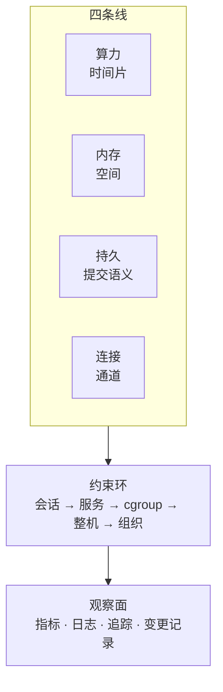

---
tags:
  - Linux
  - 知识体系
  - 自检
  - 学习地图
created: 2026-10-05
---

# 复习与自测

前十一章分别讲一条线、一类对象；本章因此不引入新机制，只做一件事：**把十一条线纳入同一个模型**，并给出检验掌握程度的方法——闭卷答题、真机演练、能力自检。

## 知识地图

### 统一模型：四条线、约束环与观察面

机器上同时有四种资源在被消耗（算力、内存、持久、连接），它们各受五层上限约束（会话、服务、cgroup、整机四层技术上限，以及决定动作能否执行的组织层）；而这些活动只能通过四类证据观察，即指标、日志、追踪与变更记录。

这个模型对应三个问题，也是本章十篇的目的：

1. **能否把十一章讲成一台机器**——总纲给出模型，连接点矩阵展开 24 处接缝；
2. **能否在现场识别它**——压力与排队把四条线归到同一类判据，端到端处置链要求在真机上完整执行一次；
3. **能否把它讲给别人听**——追问链演示同一道题在四层追问下的表达差异，能力自检清单用 26 项可观察行为验收。

**本章不产生新知识**：所有结论与数字都能在阶段 1–11 找到出处；因此若此处说法与对应阶段冲突，应以对应阶段为准，并把冲突记入错题清单。

### 十一条线在模型中的位置

| # | 线 | 负责范围 | 瓶颈所在 | 证据字段 |
| --- | --- | --- | --- | --- |
| 1 | 操作纪律与证据 | 它是其余各线的共同前提，因为观测有代价、证据会易失 | 它本身不产生瓶颈，但它决定数据是否可信 | 读版本四件套、原始输出与带时间戳的存档 |
| 2 | 启动与内核 | 它负责从固件到可用服务这段时间里的控制权移交，判据是 `journalctl -b` 读到的各阶段记录 | 瓶颈来自串行的依赖关系：若 `initramfs` 缺少模块，或引导与内核版本错配，启动就会停在对应阶段 | 读 `journalctl -b`、`/proc/cmdline` 与 `systemctl --failed` |
| 3 | 进程与信号 | 它负责进程的创建、调度、退出与回收 | 瓶颈是调度延迟、不可中断睡眠，以及句柄与 PID 上限 | 读 `ps -eo stat,wchan`、`/proc/<pid>/limits` 与退出码 |
| 4 | 内存与 OOM | 它管理地址空间、承诺与物理占用这三套计量口径 | 瓶颈产生于回收跟不上、匿名页依赖 swap，以及 cgroup 上限先被触及 | 读 `MemAvailable`、`/proc/pressure/memory` 与 `memory.events` |
| 5 | 存储与文件系统 | 它回答写入何时真正持久，以及容量如何耗尽 | 瓶颈来自回写落后、队列排长、元数据集中，以及保留块与 inode 的占用 | 读 `df`/`df -i`、`await`/`aqu-sz` 与 `Dirty`/`Writeback` |
| 6 | 网络协议栈 | 它覆盖一次通信从名字解析到断开的全过程 | 瓶颈落在一系列排队点上，即解析、半连接、全连接、源端口与软中断 | 读 `ss -lnt` 的 `Recv-Q`/`Send-Q`、`ss -ti` 与 `nstat` |
| 7 | 权限与安全 | 它判定一次访问的主体身份，以及这次访问受阻于哪一层判定 | 瓶颈出在判定链的某一环，即路径、ACL、挂载选项或 MAC | 读 `namei -l`、`getfacl`、`findmnt -T` 与 AVC 记录 |
| 8 | systemd 与服务 | 它回答一条命令如何成为受管服务 | 瓶颈是生效链的断点、`Type=` 判定错误、沙箱限制自身，以及启动节流 | 读 `systemctl show`、`journalctl -u` 与 `Result` |
| 9 | 日志与监控 | 它本身就是观察面 | 瓶颈是落点选择错误、限流丢消息，以及轮转后未重开文件 | 读 `journalctl --disk-usage`、`logrotate -d` 与 `ALERTS` |
| 10 | 性能分析与排障 | 它处理四条线的共同表现：资源有余量而任务无法完成 | 瓶颈来自排队而非容量，也来自观测代价本身与视角缩放 | 读逐核 `mpstat`、`vmstat` 的 `r`/`b` 与 PSI |
| 11 | 生产运维与高可用 | 它讲前十条线在真实约束下的应用 | 这里的瓶颈不是技术瓶颈，而是「这一步是否可逆」的判断 | 读变更单、恢复演练记录与回滚实测耗时 |

## 故障现场定位表

排障的起点不是「怎么修」，而是判断「**属于哪条线、受阻于哪个连接点**」。用这张表把现象定位到模型上的位置，再进入对应篇目。

**定位顺序固定为四步，不要合并**：

| 步 | 做什么 | 依据 | 顺序错误的后果 |
| --- | --- | --- | --- |
| 1 | **量化影响面**：先查清谁受影响、多严重、从几点开始、是否仍在恶化，以及与什么比较 | 依据是指标与业务信号，此时尚未进入分层 | 若影响面仍在扩大却先查根因，就会错过止损窗口 |
| 2 | **判断是否需要先止损**：影响面继续扩大时，先执行可逆动作 | 只要影响面继续扩大，就按限流、摘流量、回滚、扩容、重启的顺序执行这些可逆动作 | 于是现场保住了，业务却没有恢复 |
| 3 | **按四条线分层排除**：依次排除算力、内存、持久与连接四条线 | 它给每层配一个判据字段，具体字段见下表 | 于是只能从命令清单中逐条尝试，反复更换方向 |
| 4 | **在落点那一层查上限配在哪一层、生效值是多少** | 依据是约束环的五层上限与生效值的取法 | 因此会改错层级，配置表面已改而实际未生效 |

第 3 步的线顺序不是技术上的必然，而是**按排查成本排序**：算力与内存在本机即可看清，代价最低；持久与连接需要读取的字段更多。真正的判据仍然是「哪条线有信号」，顺序只决定先看哪一个。

| 观察到的现象 | 属于哪条线 | 受阻于哪个连接点 | 主要读取项 | 第一反应不要做 | 去哪一篇 |
| --- | --- | --- | --- | --- | --- |
| 负载高但 CPU 不高 | 它属于算力线，具体落在等待这一类 | 它受阻于内核态时间与软中断，以及回收与 IO 等待这两处连接点 | 需要读的是 `vmstat` 的 `r`/`b` 与 `ps -o stat,wchan` | 不要先加 CPU，也不要先重启 | 03、05 |
| 整机 CPU 不高但延迟翻倍 | 它属于算力线，具体落在单核这一类 | 它受阻于中断与网卡队列这两处连接点 | 需要读的是 `mpstat -P ALL` 的最热核与 `/proc/net/softnet_stat` | 不要用整机平均值排除 CPU | 03、05 |
| `free` 变少，业务正常 | 它属于内存线，这一项是缓存属正常占用 | 它受阻于 Page Cache 这一处连接点 | 需要读的是 `MemAvailable` 与内存 PSI | 不要加内存，也不要清缓存 | 03、06 |
| 内存持续增长直至被终止 | 它属于内存线，具体落在上限这一类 | 它受阻于 cgroup，以及内核日志与用户态日志这两处连接点 | 需要读的是 `memory.current`/`max`/`events` 与内核 OOM 记录 | 不要只看退出码 137 | 01、03、06 |
| `df` 满但 `du` 很少 | 它属于持久线，具体落在容量这一类 | 它受阻于 inode 与 fd 这两处连接点 | 需要读的是 `df -hT` 与 `df -i`、`du -xsh` 以及 `lsof +L1` | 不要 `rm -rf` 日志目录 | 01、03、06 |
| 写入慢、`%util` 不高 | 它属于持久线，具体落在排队这一类 | 它受阻于 Page Cache 这一处连接点 | 需要读的是 `await`/`aqu-sz` 与 `Dirty`/`Writeback` | 不要因为 `%util` 低就排除 IO | 03、06 |
| 偶发连接失败、服务端无日志 | 它属于连接线，具体落在队列溢出这一类 | 它受阻于句柄、端口与队列这三处连接点 | 需要读的是 `ss -lnt` 的 `Recv-Q` 与 `Send-Q`，以及 `ListenOverflows` 的差值 | 不要先抓包，也不要先重启服务 | 03、05、06 |
| 带宽充足但吞吐上不去 | 它属于连接线，具体落在传输这一类 | 它受阻于口径与对象差异这一处连接点 | 需要读的是 `ss -ti` 的 `rtt`/`minrtt`/`retrans`/`app_limited` | 不要先扩带宽 | 03、06 |
| 机器无法启动，停在启动链的某一个阶段 | 它属于启动链路，因此不属于四条线中的任何一条 | 它受阻于 PID 1，以及版本与默认值这两处连接点 | 先确认当前由哪个阶段输出，再读 `journalctl -xb` 与 `/proc/cmdline` | 不要先重装，也不要盲目重启 | 02、07 |
| 内核 panic / 上一轮引导异常 | 它属于启动链路，这一现象无法回答「崩溃现场为什么不保留在机器上」 | 它受阻于版本与默认值，以及快照与实验边界这两处连接点 | 需要读的是 `journalctl -b -1 -k`、`/var/crash/` 与带外日志 | 不要"再重启一次看看" | 07 |
| 文件权限看似正确，仍 `Permission denied` | 它属于约束环，具体落在判定链上 | 它受阻于 inode 与 fd，也就是名字与对象这两处连接点 | 需要读的是 `namei -l`、`getfacl`、`findmnt -T` 与 AVC 记录 | 不要 `chmod -R 777`，也不要 `setenforce 0` | 02、06 |
| 改配置后未生效 | 它属于约束环，具体落在生效链上 | 它受阻于版本与默认值这一处连接点 | 需要读的是 `sysctl -n`、`systemctl show -p` 与 `sshd -T` | 不要"再改一次"或直接重启 | 05、06 |
| 服务 `active` 但业务不可用 | 它属于约束环，具体落在第 2 层 | 它受阻于 PID 1、监听队列与 socket 激活这三处连接点 | 需要读的是端口、依赖、健康检查与 cgroup 段 | 不要把 `start` 返回 0 当验收 | 05、06 |
| 容器被 OOMKilled，宿主内存充足 | 它属于约束环，具体落在第 3 层 | 它受阻于 cgroup 这一处连接点 | 需要读的是 `memory.events`、`memory.peak` 与内核 OOM 记录 | 不要拿宿主 `free` 当判据 | 01、02、06 |
| 时钟漂移、跨机日志无法对齐 | 它属于观察面，具体落在时间这一类 | 它受阻于时间基线这一处连接点 | 需要读的是 `timedatectl timesync-status` 与报文中的时间质量字段 | 不要在时钟未同步时下"谁先谁后"的结论 | 02、06 |
| 日志查不到、查不全 | 它属于观察面，具体落在落点这一类 | 它受阻于内核日志与用户态日志这两处连接点 | 需要读的是 `StandardOutput`、`--disk-usage` 与限流计数 | 不要先关闭限流 | 06 |
| 指标正常但用户反馈慢 | 它属于观察面，具体落在口径这一类 | 它受阻于证据链对齐这一处连接点 | 需要读的是延迟分位数（连算法一起报）、PSI 与一次请求的 span | 不要只看平均值 | 03、05、06 |
| 证书到期 / 从外部不可用 | 它属于组织层，具体落在到期这一类 | 它受阻于时间基线这一处连接点 | 需要读的是 `openssl s_client` 的 `notAfter` 与探测指标 | 不要只修一台边缘节点 | 06、09 |
| 备份任务成功但无法恢复 | 它属于组织层，具体落在可恢复性这一类 | 它受阻于脏页与提交语义，以及快照与 COW 这两处连接点 | 需要读的是最近的恢复演练记录与实测耗时 | 不要把任务退出码当验收 | 06、09 |
| 变更执行到一半才发现没有备份 | 它属于组织层，具体落在可逆性这一类 | 它受阻于不可逆性与流程这一处连接点 | 需要读的是变更单里的备份与回滚段 | 不要继续执行 | 06、09 |
| 疑似入侵（账号、提权面、外连异常） | 它属于组织层，具体落在安全事件这一类 | 它受阻于提权面与持久化点这两处连接点 | 需要读的是 `last`、`ss -tunap`、`getcap -r /`、`systemctl list-timers` 与 `crontab -l` | 不要先 `kill` 与删文件；先隔离、先留证 | 07、08 |

**三处容易被忽略的边界**：

- **"指标正常"不等于"用户侧正常"**。由于指标是聚合视角，而用户感知的是单次请求，因此资源空闲而用户反馈变慢时，原因通常在分位数、队列或下游。
- **"服务在运行"不等于"业务可用"**。`start` 返回 0 只说明 `Type=` 的判定条件已满足；同时容器场景下还须区分宿主侧与 cgroup 侧。
- **"文件里写了"不等于"已生效"**。生效值有专门的取法（`sysctl -n`、`systemctl show -p`、`systemd-analyze cat-config`、`sshd -T`、`findmnt -o OPTIONS`），而前四层上限中只有最紧的那一层起作用。

## 篇目

| #   | 篇目           | 内容概要                                                   |
| --- | ------------ | ------------------------------------------------------ |
| 01  | 总纲：十一条线如何衔接  | 它给出四条线提供的资源类型、约束环的五层（四层技术上限加组织层）、观察面的三条纪律，以及十一条线各自的瓶颈与证据  |
| 02  | 体系：连接点矩阵     | 它逐处写出 24 处跨章接缝，说明两侧分别观察到什么、依据什么对齐，以及最容易答错哪一句                     |
| 03  | 体系：压力与排队的一条线 | 它讲四条线各自的排队点、队列容量配在哪一层、三条传导链，以及容量估算的方法                         |
| 04  | 实战：端到端处置链    | 它给出故障注入与恢复的顺序、观测指纹的读法，以及演练记录的必填项                            |
| 05  | 实战：追问链       | 它用三道题演示四层演进，即从仅给出结论，到给出边界、反例与代价                             |
| 06  | 附录：高频误判对照表   | 它按线分组列出「说法 / 事实 / 出处」，因此遮住右列即可自测                           |
| 07  | 附录：闭卷题库      | 它把六十九道题按线分组（含前提组与启动链路组），并给出答案要点、四档评分与组内定档                  |
| 08  | 附录：盲区定位表     | 它给出按现象索引的补法、六类缺口的处置，以及五件交付物与五张随身卡（值班、通报、交接、应答与四句边界） |
| 09  | 自检：能力自检清单    | 它列出 26 项可观察行为，把它们分成值班、实战、案例与变更四组，并要求分三次勾选                   |

## 术语速查

| 名词 | 说明 | 在哪一篇展开 |
| --- | --- | --- |
| 四条线 | 它把机器的资源分成算力（时间）、内存（空间）、持久（提交语义）与连接（通道）四类，分线的依据是提供的资源类型不同 | 总纲 · 压力与排队 |
| 约束环 | 它指决定"可用量多少、动作能否执行"的五层：会话 `RLIMIT_*`、unit 属性、cgroup 与内核全局这前四层（实际生效的是最紧的那一层），再加上第 5 层的组织层（审批、窗口、冻结期） | 总纲 · 连接点矩阵 · 压力与排队 |
| 观察面 | 它指指标、日志、追踪与变更记录这四类证据，以及观测有代价、采样有盲区、证据会消失这三条纪律 | 总纲 |
| 连接点 | 它指两章之间的接缝：一旦去掉任何一侧，另一侧的结论都会出错 | 连接点矩阵 |
| 对齐口径 | 它指接缝上的四种对齐方式，即同一对象、单位与时钟、层次与范围、因果与传导 | 连接点矩阵 |
| 排队点 | 它指资源之外使任务变慢的等待区，包括运行队列、回收路径、设备队列与连接队列 | 压力与排队 |
| PSI | 它是 Pressure Stall Information，即 `/proc/pressure/*` 下的压力信号；其中 `avg*` 的单位是百分比，`total` 的单位是微秒 | 压力与排队 · 闭卷题库 |
| Page Cache | 它是内核用空闲内存缓存的文件内容；这些页可回收，因此占用高不等于内存不足 | 总纲 · 连接点矩阵 |
| 提交语义 | 它回答一次写操作在何时才真正持久，即写进入缓存、进入设备缓存，还是直到 `fsync()` 返回 | 连接点矩阵 · 压力与排队 |
| 生效值 | 它指系统当前实际使用的配置值，与文件里写的内容不是同一件事 | 连接点矩阵 · 追问链 |
| 观测指纹 | 它指某类故障在字段上留下的固定形态，因此它是可迁移的部分 | 端到端处置链 |
| 未实测 | 它指标注某结论未在手上环境验证过；这样的结论必须显式标注，并给出补做方式 | 端到端处置链 · 盲区定位表 |
| 传导链 | 它指一条线的排队引起另一条线的连锁变化，即配额用尽后堆积、堆积造成内存放大，最后触发 OOM | 压力与排队 |
| 六段骨架 | 它指现象与影响面、分层、证据、结论、止损、改进这六段 | 追问链 · 盲区定位表 |
| 复盘六段 | 它指时间线、影响面、证据、根因、止损动作、改进项这六段，与六段骨架不是同一套 | 闭卷题库 |
| 追问四步 | 它指证据、边界、反例、代价这四步 | 追问链 |
| 交付物 | 它指体系图、错题清单、一页纸、限时推演记录与端到端演练记录；能力由这些交付物验收 | 盲区定位表 |
| 定位顺序 | 它指量化影响面、判断是否先止损、按四条线分层、查上限层级与生效值这四步 | 导读 · 压力与排队 · 追问链 |
| 容量估算 | 它的做法是先测当前值与 p99，再按"峰值 × 安全系数 + 余量"确定上限，最后用同一口径复验 | 压力与排队 · 盲区定位表 |
| 基线 | 它是同一口径、带时间戳、至少两次读数、跨一个业务周期采集的对照值；缺少基线就无法判定"变慢" | 压力与排队 · 盲区定位表 |
| 通报四要素 | 它指影响面、当前状态、已执行动作与下次更新时间这四项 | 盲区定位表 |
| SLO / 错误预算 | SLO 是服务水平目标；错误预算是由 `1−SLO` 换算出的允许失败量，用来区分"立即处理"与"排期" | 高频误判对照表 · 闭卷题库 |
| RTO / RPO | RTO 是可容忍的中断时长，RPO 是可容忍的数据丢失量（以时间为单位）；备份的唯一验收方式是恢复演练计时 | 闭卷题库 · 盲区定位表 |
| 第一反应不要做 | 它用一句话指出该场景下最容易出现的错误动作，例如"不要先重启" | 全章 |

## 参考文档

- 各阶段导读的「知识地图」「术语速查」与「故障现场定位表」，是本篇模型与定位表的逐章展开：`01_实验环境与操作纪律/` 到 `11_生产运维与高可用/`。
- `man 5 proc`（`/proc/meminfo`、`/proc/vmstat`、`/proc/pressure/*`、`/proc/loadavg`、`/proc/diskstats`、`/proc/<pid>/limits`、`/proc/<pid>/wchan`）、`man 1 free`、`man 8 vmstat`、`man 1 mpstat` / `pidstat` / `iostat` / `sar`、`man 8 ss`、`man 8 nstat`、`man 1 lsof` / `stat` / `df` / `du`、`man 8 findmnt` / `tune2fs` / `sysctl` / `sshd`、`man 5 limits.conf`、`man 5 nsswitch.conf`、`man 5 resolv.conf`、`man 1 timedatectl`。
- `man 1 systemctl` / `journalctl` / `systemd-analyze`、`man 5 systemd.unit` / `systemd.exec` / `systemd.resource-control` / `systemd.kill`、`man 5 journald.conf`、`man 8 logrotate`。
- 内核文档（按与目标机器同一主版本取，当前基线 6.x）：`Documentation/admin-guide/cgroup-v2.rst`、`Documentation/accounting/psi.rst`、`Documentation/admin-guide/sysctl/`、`Documentation/admin-guide/iostats.rst`、`Documentation/networking/ip-sysctl.rst`、`Documentation/networking/snmp_counter.rst`。
- Google SRE Book 与 Workbook：值班、事故处置、复盘文化、SLO 与错误预算；《Systems Performance》（Brendan Gregg）的 USE 方法与各资源章节。
