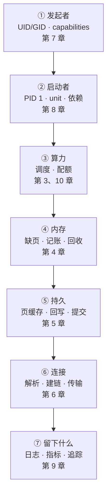

---
tags:
  - Linux
  - 知识体系
  - 模型
created: 2026-10-05
---

# 总纲：十一条线如何衔接

一台机器上同时有四种资源在被消耗，而每种资源都各自受一层层上限约束，同时能够观察到的只有四类证据。由于第 1 至 3 章讲机制、第 4 至 8 章讲资源、第 9 至 11 章讲处置，所以它们全部落在同一个结构里。本篇给出这个结构，后续各篇在它之上展开。

## 1. 统一模型

### 1.1 四条资源线

"资源"一词在排障现场用法过于宽泛，因此必须先把它拆开。四条线之所以必须分开，是因为它们**提供的资源类型不同**：

| 线 | 提供的资源 | 计量单位 | 释放之后能否复用 | 不足时最先出现的现象 |
| --- | --- | --- | --- | --- |
| **算力** | 时间片 | 核 × 秒 | 能，时间片按周期重新分配 | 队列变长（`r` 上升、延迟上升） |
| **内存** | 空间 | 页（x86_64 常见 4 KiB） | 能，但回收需要时间，且不是所有页都可回收 | 回收变慢（PSI 上升、`si`/`so` 出现） |
| **持久** | 写入的持久性 | 字节 + **提交语义**（`fsync()` 这类"把数据真正落盘"的调用） | 不能，写入一旦发生即不可撤回 | 延迟上升（脏页堆积、`await` 上升） |
| **连接** | 通道 | 端口 + 句柄 + 表项 | 能，但须等待协议规定的状态走完 | 排队点溢出（`ListenOverflows`、`TIME_WAIT`（主动关闭方的等待状态）堆积） |

这张表解释了一个常见现象：内存仍有一半空闲，系统却已经变慢。原因是四条线变慢的机理不同：内存线变慢来自回收过程，算力线变慢来自排队，持久线变慢来自回写，连接线变慢来自表项耗尽。**因此四条线的不足对应四种不同的物理过程，不能以"资源不足"一并概括。**

四条线的计量口径与瓶颈位置如下：

```mermaid
flowchart TB
  subgraph CL["算力线"]
    C1["可运行队列<br/>r / load"] --> C2["单核与整机<br/>判据为最热核"] --> C3["配额<br/>cpu.max / cpu.stat"]
  end
  subgraph ML["内存线"]
    M1["申请与承诺<br/>VSZ / Committed_AS"] --> M2["落地与计量<br/>RSS / PSS / AnonPages"] --> M3["回收与压力<br/>水位 / PSI / swap"] --> M4["上限与终止<br/>memory.max / OOM"]
  end
  subgraph SL["持久线"]
    S1["页缓存与脏页<br/>Dirty / Writeback"] --> S2["排队与提交<br/>await / fsync"] --> S3["容量与 inode<br/>df / df -i / 保留块"]
  end
  subgraph NL["连接线"]
    N1["名字 → 地址<br/>NSS / DNS"] --> N2["地址与出口<br/>路由 / 源地址 / 邻居"] --> N3["排队点<br/>半连接 / 全连接 / conntrack"] --> N4["状态与复用<br/>TIME_WAIT / 端口范围"]
  end
```

**由于四条线的判据都落在队列上，而不是落在资源的用量上，所以只看用量会得出错误的结论。** 这一点在第 3 篇展开：CPU 要看运行队列而不是看使用率，内存要看 PSI（pressure stall information，压力失速信息）而不是看 `free`，持久要看 `await` 与脏页数而不是看 `%util`，连接要看队列深度与溢出计数而不是看带宽。若用量很高而队列不长，则该现象不构成瓶颈。

### 1.2 约束环：五层上限

四条线本身不设边界，因此真正决定"谁能用多少"的是一组上限。这组上限共五层，由内向外排列：前四层为技术层，第五层为组织层（它不限制用量，只限制动作能否执行）：

| 层 | 作用对象 | 载体 | 生效时机 | 取值方式 |
| --- | --- | --- | --- | --- |
| 1 | 一个会话 | `ulimit`（`RLIMIT_*`，即进程资源限制） | 登录/`execve` 时继承 | `ulimit -a`、`/proc/<pid>/limits` |
| 2 | 一个服务 | unit 的 `LimitXXX=`、`TasksMax=`、`MemoryMax=`、`CPUQuota=` | `daemon-reload` 后新启动的进程 | `systemctl show -p ...`，再与 `/proc/<pid>/limits` 对照 |
| 3 | 一组进程 | cgroup v2 的 `memory.max`/`cpu.max`/`pids.max`/`io.max` | 写入即时生效，对组内所有进程 | `cat /sys/fs/cgroup/.../<file>` |
| 4 | 整机 | `sysctl` 与内核全局表（`somaxconn`、`pid_max`、`file-max`、`nf_conntrack_max`） | `sysctl -w` 即时，重启看落盘位置 | `sysctl -n`、`/proc/sys/...` |
| 5 | 一次操作 | 组织层：审批、变更窗口、冻结期、值班授权 | 由人决定，写在变更单与值班制度里 | 变更单、值班表、冻结期公告 |

这一环需要记住的是**顺序**：由于一个进程的实际上限是前四层里**最紧的那一层**，所以只看其中一层会得出错误答案；而第 5 层决定这一层现在能否修改。"已经调大了"与"实际仍然不够"因此可以同时成立，因为被调大的那一层并不是生效的那一层。

五层之间有三处错位最常出现：

- **`ulimit` 与会话**：由于它随登录会话与 PAM 走，所以 `su`/`sudo`/SSH 三种进入方式取得的限制可能不同；
- **unit 与进程**：由于改动 unit 只影响**此后**由 systemd 启动的进程，所以已在运行的进程须经 `restart` 才带上新值；同时，unit 中写的值与进程实际取得的值之间还隔着编译期默认值；
- **cgroup 与容器**：由于容器是另一个 cgroup 子树，所以改宿主上的 unit 与改容器不是同一件事。

第 5 层与前四层的区别在于：**前四层回答"上限是多少"，第 5 层回答"这个动作现在是否被允许"**。它不产生资源瓶颈，但它决定是否有权修改前四层。

### 1.3 观察面：四类证据与三条纪律

四条线的活动只能通过四类证据得知，而这四类证据回答的问题各不相同：

| 证据 | 回答什么 | 典型载体 | 局限在哪里 |
| --- | --- | --- | --- |
| 指标 | 多严重、什么时候开始、是否仍在恶化 | `/proc`、`sysstat`、Prometheus | 采样窗口会漏掉亚窗口脉冲；平均值掩盖长尾 |
| 日志 | 具体发生了什么、由谁触发 | journald、`/var/log`、内核环形缓冲 | 可能被限流、被轮转掉、未持久化 |
| 追踪 | 耗时分布在哪个段落、经过哪些组件 | span 树、`ss -ti` 的连接细节 | 采样率与上下文传递决定它只能覆盖一部分 |
| 变更记录 | 是否由人为改动引起 | 变更单、`/var/log/apt`、`git log` | 不存在于系统内，只能靠制度留存 |

有三条纪律决定这四类证据是否可用，以下逐条给出：

1. **观测本身有代价**。由于插桩的代价大致与拦截次数成正比，所以用 `strace` 之类工具跟踪一个高频系统调用的进程，会把被测对象拖慢到失去参考意义。因此观测之前先判断"这个动作是否会改变结论"。
2. **采样存在盲区**。亚窗口的脉冲、只看首行的口径、不在 CPU 上的时间（off-CPU）、被聚合掉的长尾，都可能不存在于数据里。因此"数据里没有"不等于"没有发生"。
3. **证据会消失**。进程退出会带走进程内状态，重启会覆盖内核环形缓冲，日志轮转删除旧文件，`drop_caches`（主动丢弃页缓存的测量动作）会抹掉缓存构成；容器被 OOM 终止后 `memory.events` 仍在，但进程现场已经不存在。因此取证必须排在处置之前。

## 2. 横向与纵向两条观察路径

### 2.1 横向：一个动作经过哪些层

若把 11 章的机制按"一次动作从产生到完成"的顺序排列，就得到如下链路：

这条链上有三个位置属于纯粹的接口，因此它们不属于任何一章：**①到②之间是"权限与身份"如何落到服务上**（unit 的 `User=` 与 capabilities），**④到⑤之间是"内存与存储共用同一份页缓存"**，**⑥到⑦之间是"内核协议栈的计数与用户态日志的口径差"**。由于跨章出错的场景绝大多数落在这三个接口上，所以它们值得单独核对。全库共有 24 处这样的接缝，逐一展开见下一篇《体系：连接点矩阵》。

### 2.2 纵向：同一个词在不同层的含义

跨章混乱的第二个原因是**同一个词在不同章指向不同对象**，因此同一个词出现在两份报告里时不必然是同一件事：

| 名字 | 在第 4 章 | 在第 5 章 | 在第 6 章 | 在第 9 章 |
| --- | --- | --- | --- | --- |
| cache | 它指 Page Cache，即可回收的文件页 | 它指设备写缓存，因此掉电就会丢 | 它指 DNS 缓存，其新鲜度由 TTL 决定 | 它指查询缓存，因此它换来的是延迟下降 |
| queue | 它指回收队列与 LRU 链表 | 它指 IO 调度队列，用 `aqu-sz` 衡量 | 它指半连接/全连接队列，以及 `softnet` 积压 | 它指采集器队列与丢弃计数 |
| limit | 它指 cgroup 的 `memory.max` | 它指文件系统保留块与配额 | 它指 `somaxconn` 与 `nf_conntrack_max` | 它指保留天数与 cardinality |
| state | 它指匿名页、文件页、脏页三类页状态 | 它指挂载状态与 `ro`/`rw` 标志 | 它指连接状态机 | 它指 `ALERTS` 的 `pending`/`firing` |
| 时间 | 它指缺页耗时 | 它指回写与 `fsync` 延迟 | 它指 `rtt`/`minrtt`/2MSL | 它指时间戳格式与对时状态 |

因此处理跨章问题时，第一步应确认当前所处的视角，而不是先判断"这属于哪一章"。

## 3. 十一条线的落点

每条线在这个结构中都占一个确定位置。以下逐条给出五项：负责范围、瓶颈所在、证据字段、所属约束环层级、以及最容易违反的观察纪律。

### 3.1 第 1 章 操作纪律与证据

- **负责范围**：其余各线的**前提**。观测有代价、证据会易失、快照状态须一致、发行版之间存在差异。
- **瓶颈**：无。它不产生资源瓶颈，只决定数据是否可信。
- **证据**：版本四件套（`/etc/os-release`、`uname -r`、`systemctl --version`、`stat -fc %T /sys/fs/cgroup`）、命令的原始输出、带时间戳的存档。
- **约束环位置**：不属于任何一层，它是观察面的前提。
- **最容易违反**：把一次观察当作普遍结论。由于同一个数字换内核、换发行版、换容器环境即可能不成立，所以它只能作为该环境下的观察结果。

### 3.2 第 2 章 启动与内核

- **负责范围**：从固件到可用服务的控制权移交过程，以及回答"崩溃现场为什么不保留在机器上"。
- **瓶颈**：启动阶段的串行依赖；`initramfs` 缺少存储或文件系统模块；引导器与内核的版本错配。
- **证据**：`journalctl -b`、`/proc/cmdline`、`systemctl --failed`、`systemd-analyze critical-chain`。
- **约束环位置**：第 4 层（内核启动参数、`sysctl`）与第 2 层（早期 unit 的顺序）。
- **最容易违反**：把"重启后能起来"当作修复，因为重启会同时抹掉上一轮引导的全部现场。

### 3.3 第 3 章 进程与信号

- **负责范围**：它覆盖进程的创建、调度、退出通知与回收。
- **瓶颈**：它来自调度延迟、不可中断睡眠（`D` 状态）、句柄与 PID 上限，以及僵尸进程堆积。
- **证据**：`ps -eo pid,stat,wchan,cmd`、`/proc/<pid>/status`、`/proc/<pid>/limits`、`systemctl show -p ExecMainCode,ExecMainStatus`。
- **约束环位置**：第 1 层（`RLIMIT_*`）。
- **最容易违反**：退出码 137 即判定为 OOM。由于 137 是 `128+9`，所以它仅证明进程收到 `SIGKILL`；是否 OOM 须查第 4 章的计量口径。

### 3.4 第 4 章 内存与 OOM

- **负责范围**：内存的三套计量口径，即地址空间（`VSZ`，虚拟地址空间大小）、承诺（`Committed_AS`，已承诺但可能尚未落地的额度）、物理占用（`RSS` 常驻集 / `PSS` 均摊后的常驻集），以及内存不足时终止哪个进程。由于这三套口径计量的不是同一个对象，所以任何"占了多少内存"的说法都要先指明用的是哪一套。
- **瓶颈**：回收跟不上分配的速度，于是转为直接回收；匿名页的回收只能依赖 swap；cgroup 的上限先于整机水位被触及。
- **证据**：`/proc/meminfo` 的 `MemAvailable`、`/proc/pressure/memory`、`/proc/vmstat`、`memory.current`/`memory.max`/`memory.events`，这四项证据共同决定上述不足属于哪一种。
- **约束环位置**：以第 3 层为主（cgroup），第 1、4 层为辅（`RLIMIT_AS`、`vm.*`）。
- **最容易违反**：用 `free` 的 `used` 判断内存是否充足。由于 `used` 包含可回收的 Page Cache，所以判据是 `MemAvailable` 与压力指标。

### 3.5 第 5 章 存储与文件系统

- **负责范围**：写入在何时才真正持久，以及容量的三种耗尽方式（数据块、inode、保留块）。
- **瓶颈**：它来自回写落后、队列排长、元数据操作集中，以及设备本身的服务时间。
- **证据**：`df -h`/`df -i`、`iostat -x` 的 `await`/`aqu-sz`、`/proc/meminfo` 的 `Dirty`/`Writeback`、`/proc/diskstats`。
- **约束环位置**：第 4 层（文件系统与内核 IO 参数）与第 3 层（`io.max` 的带宽/IOPS 上限）。
- **最容易违反**：以 `%util` 判断磁盘是否到达瓶颈。由于它只表示有请求发往设备的时间占比，所以单请求慢的设备在 `%util` 很低时即可能已经排队。

### 3.6 第 6 章 网络协议栈

- **负责范围**：它覆盖一次通信从名字解析到地址选择、建立连接、传输与断开的全过程。
- **瓶颈**：一系列**排队点**，即解析查询、半连接队列、全连接队列、源端口、发送队列、收包软中断与 `conntrack` 表，它们共同决定一次通信在哪一步开始等待。
- **证据**：`ss -lnt` 的 `Recv-Q`/`Send-Q`、`ss -ti`、`nstat` 的累计计数、`/proc/net/softnet_stat`、`ethtool -S`。
- **约束环位置**：第 4 层（`somaxconn`、端口范围、`nf_conntrack_max`）与第 3 层（v2 中组级网络与 IO 限制已并入统一层级）。
- **最容易违反**：把偶发失败归因于网络抖动。由于主机侧计数器（`ListenOverflows`）通常早于抓包给出证据，所以应先读计数器。

### 3.7 第 7 章 权限与安全

- **负责范围**：它覆盖一次访问的主体身份、判定受阻于哪一层、以及留下哪些痕迹。
- **瓶颈**：判定链的某一环（路径逐级 `x`、ACL `mask`、挂载选项、MAC 策略），而非"文件权限"单点。
- **证据**：`namei -l`、`getfacl -cp`、`findmnt -T`、审计日志里的 `avc: denied`/`apparmor="DENIED"`。
- **约束环位置**：它贯穿约束环的前四层，因为前四层的上限都建立在身份之上；capabilities 决定可超出哪一层，组织层则决定这些授权能否被改动。
- **最容易违反**：`chmod -R 777`。它跳过整条判定链，同时违背最小特权原则。

### 3.8 第 8 章 systemd

- **负责范围**：它回答一条命令如何成为受管服务，其过程包括装载、编队列、就绪判定、进入约束、留痕与重启决策。
- **瓶颈**：装载生效链的断点（`daemon-reload` 与 `restart` 的边界）、`Type=` 判定错误、沙箱限制自身、启动节流后不再重试。
- **证据**：`systemctl cat`/`show -p FragmentPath -p DropInPaths`、`show -p Result -p NRestarts`、`journalctl -u`。
- **约束环位置**：它是第 2 层（unit 属性）的**来源**，同时负责把服务放入第 3 层（cgroup/slice）。
- **最容易违反**：以 `systemctl start` 返回 0 作为验收通过。由于 `start` 成功仅说明 `Type=` 的判定条件已满足，所以它不证明服务已经可用。

### 3.9 第 9 章 日志与监控

- **负责范围**：观察面本身，即四类证据的生成、落点、轮转、集中、退役，以及告警从计量到问责的过程。
- **瓶颈**：落点选择错误、未开启持久化、限流丢消息、轮转后应用未重开文件、容量写满根分区。
- **证据**：`journalctl --disk-usage`、`systemctl show -p StandardOutput`、`logrotate -d`、`up`、`ALERTS`。
- **约束环位置**：它主要落在第 4 层（`journald.conf` 的容量与限流），另有采集能力这一类非资源上限（cardinality、保留天数）。
- **最容易违反**：把"日志中没有"等同于"没有发生"。由于日志可能未被写入、被限流、被裁剪，或写到了另一个落点，所以"没有"只是观察结果而不是事实。

### 3.10 第 10 章 性能分析与排障

- **负责范围**：它覆盖四条线的共同表现，即资源有余量与任务能够完成之间的差距。
- **瓶颈**：它来自排队而非容量、观测代价本身，以及视角缩放（整机与单核的结论可能相反）。
- **证据**：`mpstat -P ALL`、`pidstat`、`iostat -x`、`/proc/pressure/*`、`ss -ti`、`perf`（在有 PMU，即性能监控单元 Performance Monitoring Unit 的机器上）。
- **约束环位置**：它贯穿约束环的前四层，回答的是"应当查看哪一层"，而不是"上限是多少"。
- **最容易违反**：整机使用率不高即排除 CPU。由于整机平均会掩盖单核的满负荷，所以判据是**最热核**的剩余余量。

### 3.11 第 11 章 生产运维与高可用

- **负责范围**：它覆盖前十条线**在真实约束下的应用**，即不可逆性、可恢复性、批量执行的幂等与故障域。
- **瓶颈**：不是技术瓶颈，而是"这一步是否可逆"的判断。
- **证据**：变更单、备份的恢复演练记录、回滚实测耗时、`lsof +L1`、`findmnt --verify`、`openssl s_client` 的 `notAfter`。
- **约束环位置**：它落在约束环**第 5 层**（组织层），因此它不决定可用量，只决定动作当前是否被允许。
- **最容易违反**：把"可以回滚"当作"回滚过"。由于回滚命令写在变更单上只是合格的一半，所以"可以回滚"不构成回滚能力的证据。

## 4. 四条线同时变化的场景

单独分析一条线都能给出答案，因此单线分析是起点；然而由于四条线同时变化才是现场常态，所以以下三个场景把模型各用一次，并展示四条线如何联合给出结论。

### 4.1 一次请求进入系统

以一次 HTTP 请求为例，按顺序经过：

1. **连接线**：名字解析依次经过 `getaddrinfo`、NSS 与 DNS，随后出口选择读 `ip route get` 的 `src`，最后握手进入全连接队列并等待 `accept()`。
2. **约束环第 3 层**：请求由某个 cgroup 中的进程处理，因此要确认该组是否设有 `cpu.max`、`memory.max`、`pids.max`。由于容器场景下这一层与宿主看到的不是同一个数值，所以两层必须分别读。
3. **算力线**：处理线程被调度到哪一颗核，因此要读该核的剩余余量是多少。
4. **内存线**：请求所需的缓冲区来源；由于首次写入触发缺页，所以回收压力大时此步转为直接回收，表现为延迟尖刺。
5. **持久线**：若请求需要写入磁盘，则数据先写入 Page Cache，此时"写成功"只是一句不完整的表述，因为提交语义由 `fsync` 或 `O_SYNC` 决定。
6. **连接线**：响应写回 socket，因此若发送缓冲区满则阻塞，若对端窗口为零则等待。
7. **观察面**：上述每一步都有计数，包括 `nstat` 的累计值、`memory.events`、`cpu.stat`、IO 统计以及应用自身日志。

由于同一个"接口变慢"在这七步中可以有七个不同的原因，且分属四套不同的判据体系，所以先分层再动手能够节省时间。

### 4.2 一个容器被终止

这是四条线在同一次事件中同时给出信息的典型场景：

1. **内存线提供计量**：`memory.events` 的 `oom_kill` 非 0，同时 `memory.peak` 接近 `memory.max`。
2. **约束环提供位置**：上限位于第 3 层（cgroup），而不是宿主水位；因此宿主的 `free` 可能仍较空闲。
3. **观察面提供证据**：内核日志中有 `CONSTRAINT_MEMCG` 记录，退出码为 137，而该退出码仅说明收到 `SIGKILL`，不说明原因。
4. **持久线提供后果**：进程被终止时带走了未提交的写入，Page Cache 中的脏页由内核继续回写，但应用侧的事务状态已丢失。
5. **算力线提供旁证**：若终止前 `CPUQuota` 过低，则进程处理不及时，因此请求堆积并导致内存放大；此时内存是症状，配额是原因。

四条线均已核对，才可能回答"为什么被终止的是它、为什么不是整机 OOM、如何修改才不会再次发生"。

### 4.3 一次变更失败

1. **约束环第 5 层**（组织层）决定这次变更的形态，即有无审批、有无窗口、有无回滚方案。
2. **观察面**决定能否发现它已经失败：变更记录与指标、日志的时间轴必须对齐；由于时钟未同步时"谁先谁后"这一结论直接失效，所以对时必须先核对。
3. **持久线**决定它是否可逆：改参数可逆，删数据不可逆，格式化也不可逆。
4. **连接线**决定影响面，即改动是否影响解析、路由、监听，以及是否会被负载均衡的健康检查摘除。
5. **算力与内存线**决定它是否升级：一次改动使服务变慢，慢到请求堆积，堆积到内存放大，最终整机 OOM，因此故障沿资源线传导。

## 常见误解

| 说法 | 事实 |
| --- | --- |
| "四条线就是 CPU、内存、磁盘、网络四个资源" | 由于分线的依据不是硬件分类，而是提供的资源类型不同（时间、空间、提交语义、通道），所以四条线与四类硬件不对应。磁盘慢通常不是容量问题，而常常是提交语义问题，因为页缓存使写入看似成功；网络慢通常不是带宽问题，而常常是队列问题 |
| "资源不够就加资源" | 四条线的"不足"分别是排队、回收、回写、溢出四种过程，因此先确定它属于哪一种，扩容通常不是第一步 |
| "上限只有一个，调大就行了" | 实际生效的是前四层里最紧的那一层（会话 / unit / cgroup / 整机），而第 5 层（组织层）决定这一层当前能否修改。由于改错一层等于未改，所以表面上"已经改了"而实际未改 |
| "整机 CPU 不高，所以不是 CPU 问题" | 由于整机平均会掩盖单核满负荷，所以判据是最热核的剩余余量，而不是整机使用率 |
| "`free` 少说明内存不够" | 由于 `free` 少可能全部由可回收缓存构成，所以判据是 `MemAvailable` 与压力指标；而缓存占用高本身是正常状态 |
| "退出码 137 就是被 OOM 杀了" | 由于 137 = 128 + 9，所以它仅证明进程收到 `SIGKILL`；是否 OOM 须查内核日志与 cgroup 的 `memory.events` |
| "日志里没有就是没发生" | 由于它可能未写入、被限流、被轮转删除、未持久化，或写到了另一个落点，所以"没有"只是观察结果 |
| "指标正常就说明这一层没问题" | 由于指标是聚合视角，亚窗口脉冲、off-CPU 时间与长尾都会被聚合掩盖，所以指标正常不构成这一层无问题的证据 |
| "改了配置重启一下就好了" | 由于重启同时毁掉现场，所以应先取证再决定是否重启；而重启可恢复不等于问题已解释 |
| "系统盘 IO 高就是磁盘不够快" | 应先区分是设备饱和还是单请求慢、是顺序写还是随机写、是回写落后还是元数据操作集中，因为四者的处置方向不同 |

## 要点自测

- 四条线分别提供什么资源？为什么不能用"资源不足"一句概括四条线的现象？
- 约束环的五层分别是什么？举一个"调大了但未生效"的例子，说明是哪两层之间错位。
- 四类证据各回答什么问题？为什么"数据里没有"不等于"没有发生"？
- 一个进程收到 `SIGKILL`，需要哪些证据才能将其定性为 OOM？缺少哪一条会变成推测？
- 为什么"整机 CPU 不高"不能排除 CPU 问题？判据应当换成什么？
- 页缓存使"写成功"成为一句不完整的表述，缺少的是哪一部分？
- 同一个 `cache` 在内存、存储、网络三处分别指什么？混用会导致哪些错误结论？
- 一次变更失败后，为什么"时钟未同步"会使复盘结论失效？
- 第 11 章为什么算作约束环的第 5 层？它约束的对象是什么？
- 用一句话说明"先分层再动手"节省的是哪一步的时间。

## 参考文档

- 各章导读的「知识地图」与「术语速查」，是本篇模型的逐章展开：启动与内核见 `02_启动流程与内核/00_导读与知识地图.md`，进程见 `03_进程与信号/`，内存见 `04_内存管理与OOM/`，存储见 `05_存储与文件系统/`，网络见 `06_网络协议栈与排障/`，权限见 `07_权限与安全加固/`，服务见 `08_systemd与服务管理/`，可观测性见 `09_日志与监控/`，性能见 `10_性能分析与排障/`，生产见 `11_生产运维与高可用/`。
- `man 7 cgroups`、`man 5 systemd.resource-control`、`man 5 limits.conf`、`man 2 getrlimit`、`man 5 proc`（`/proc/<pid>/limits`、`/proc/meminfo`、`/proc/pressure/*`、`/proc/diskstats`、`/proc/net/softnet_stat`）。
- 内核文档（按与目标机器同一主版本取，当前基线 6.x）：`Documentation/admin-guide/cgroup-v2.rst`、`Documentation/accounting/psi.rst`、`Documentation/admin-guide/sysctl/vm.rst`、`Documentation/networking/ip-sysctl.rst`、`Documentation/admin-guide/iostats.rst`。
- 《Systems Performance》（Brendan Gregg）第 1~2 章关于资源分类与 USE 方法的论述；Google SRE 手册的「Monitoring Distributed Systems」与「Effective Troubleshooting」。

