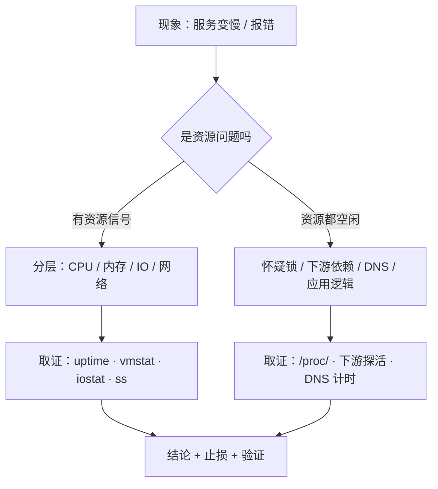

---
tags:
  - Linux
  - 复习方法
  - 知识体系
  - 学习地图
created: 2026-09-19
---

# 前置：知识体系怎么搭

> [!cite] 参考资料
> Ahrens《How to Take Smart Notes》中关于「卡片之间的连接比卡片本身更重要」的论述；Novak & Gowin 关于概念图（concept map）的教学方法；《Systems Performance》（Brendan Gregg）第 2 章「Methodologies」中把「现象、资源、工具」三者对齐的做法；Google SRE 手册「Effective Troubleshooting」的分层排障模型。
>
> 本篇的五个「根」与五条时间线，是对本套笔记阶段 1–11 的组织方式的一次抽象总结；每一条线的具体内容与判据都在对应阶段里，本篇只负责给出**拼接方法**与**拼接示例**。
>
> **实测状态**：本篇是方法篇，**不产生新的系统实测数据**。文中示例引用的数字（PSI 的 `avg` 全 0、`%util` 4.21%→80.10% 与 `w_await` 0.17→6.59 ms、`TIME_WAIT` 62.06 秒仍在 / 63.07 秒消失、`Size` 等）均**转引自前十一章在本实验机的实测记录**，**转引条件以对应阶段为准**。本实验机为 **Ubuntu 24.04.5 LTS（VMware 虚拟机）/ 内核 `6.8.0-139-generic` / systemd 255 / 4 vCPU / `MemTotal` 7894 MiB / root 可用**。

> **这篇讲什么**：怎么把十一章的知识拼成一个体系——一棵树、五条时间线、九个连接点，以及「是什么 / 边界在哪 / 生产上怎么用」三问。
>
> **必须先读什么**：[[Linux/12_复习与自测/01_前置_复习的科学|01 前置：复习的科学]]、[[Linux/12_复习与自测/02_前置_证据与口径|02 前置：证据与口径]]。
>
> **读完能回答**：为什么学了很多章还是串不起来？一张合格的体系图长什么样？两个章节之间的「接口」在哪里？
>
> **所属**：前置篇（第 3 节「前置地基」）；练习技能 **R1 建图**

## 0. 30 秒速览

> [!abstract] 这一篇只要记住六句话
> - **知识的最小可复用单位是「连接」，不是「条目」。**
>   - 怎么验证：随机抽两个章节，说出它们共享的机制或易混词；说不出，说明你手里是 11 份清单而不是一个体系。
> - **一棵树先立起来：四个资源根 + 一个约束根 + 一个组织层。**
>   - 四个资源根是 CPU、内存、IO/存储、网络；约束根是权限与安全；组织层是 systemd 与交付方式。所有章节都能挂到这六个位置。
> - **五条时间线是最省力的骨架：启动五环、进程一生、内存旅程、盘的一生、连接六站。**
>   - 怎么验证：合上书，在白板上默画这五条线，每条至少写三个站点与一个失败现象。
> - **连接点通常长这样：同一个词，在不同章指不同的层。**
>   - 证据：`cgroup` 在阶段 3、4、8、10、11 都出现；`cache` 在内存章指页缓存、在存储章指设备缓存、在 DNS 里指解析缓存——**名字一样，处置完全不同**。
> - **每个知识点必须能回答三问：是什么、边界在哪、生产上怎么用。**
>   - 怎么验证：只答得出第一问的人，能在笔试拿分、在现场帮不上忙；三问都能答，才叫掌握。
> - **画图有三条纪律：一张图只回答一个问题、必须有箭头方向、每个框都要能说出证据命令。**
>   - 怎么验证：把图给同事看 30 秒，他能说出这张图在回答什么问题，就算合格。

## 1. 从「章节」到「体系」

### 1.1 为什么会串不起来

学习时按章节推进（这是必须的），但每章的目录是**按主题切**的，而生产问题是**按现象发生**的。两个切法不一致，于是出现三种典型症状：

1. **能答题，不能分类**：每章问题都会，混在一起就不知道从哪下手。
2. **记得结论，记不住接口**：知道 Page Cache 是缓存，但说不清它为什么会让「内存看起来少、IO 却不动」。
3. **跨章重复踩坑**：在内存章学过「`free` 少不代表不够」，到了容器章又只看 `free` 判断 Pod 内存。

体系化复习要修的正是这三处：**给现象一个分类入口、给章节之间补上接口、把跨章结论合并成一条**。

### 1.2 一棵树：六个位置

不管哪一章的内容，都可以先挂到这六个位置之一：

| 位置 | 覆盖内容 | 对应阶段（纯文本） |
| --- | --- | --- |
| **CPU 与调度** | 进程、线程、负载、上下文切换、cgroup CPU 配额、单核饱和 | 阶段 3、8、10 |
| **内存** | 地址空间、Page Cache、回收与 swap、OOM、cgroup 内存 | 阶段 3、4、10、11 |
| **IO 与存储** | 块设备、分区、LVM、文件系统、IO 栈、容量与 inode | 阶段 5、10、11 |
| **网络** | 分层、地址与路由、TCP 状态机、队列、抓包、防火墙 | 阶段 6、9、10 |
| **约束（权限与安全）** | 身份、DAC/ACL、capabilities、sudo/SSH、MAC、审计 | 阶段 7、11 |
| **组织层（交付与运维）** | 启动与 init、systemd 与 unit、日志与监控、变更与高可用 | 阶段 1、2、8、9、11 |

> [!tip] 用这棵树做自检
> 随便挑一个线上现象挂在树上，然后问：**这件事影响的是哪个根？约束是什么？谁在组织它？** 例如「服务被 OOM kill」——根是内存，约束是 cgroup 的 `memory.max` 与 systemd 的 `OOMPolicy`，组织层是那个 unit。

### 1.3 五条时间线

时间线是把「机制」串成「过程」的最短路径。这五条覆盖了本套笔记的主干，也是子笔记 09 的对照表来源：

| 时间线 | 站点 | 收口于 |
| --- | --- | --- |
| 启动五环（阶段 2） | 固件 → 引导加载器 → 内核与 initramfs → systemd → 登录/服务 | 「现在是谁在输出」 |
| 一个进程的一生（阶段 3） | 诞生 → 状态与调度 → 信号 → 退出与回收 | 进程悄悄消失时证据在哪 |
| 一次内存分配的旅程（阶段 4） | 申请与承诺 → 落地与计量 → 缓存与回写 → 回收与 swap → OOM | 谁杀了它、为什么 |
| 一块盘的服役一生（阶段 5） | 接管与分区 → 成型（文件系统）→ 上岗（挂载）→ 扩容 → 冗余与退役 | 容量与健康 |
| 一次连接的六站（阶段 6） | 名字 → 地址 → 建链 → 传输 → 断开 → 链路（→ 出门之后） | 分层定位 |

### 1.4 九个连接点

这是本套笔记里最容易被忽略、也最容易被追问的部分。每个连接点都值得单独写一张卡：

| # | 连接点 | 在哪几章出现 | 最容易答错的地方 |
| --- | --- | --- | --- |
| 1 | **Page Cache** | 内存章（缓存与回写）、存储章（读写路径）、可观测性章（`wa` 与 `await`） | 把「缓存占用」当成「内存不够」；把「脏页积压」当成「磁盘坏」 |
| 2 | **cgroup** | 进程章（隔离）、内存章（内存治理）、systemd 章（资源上限）、性能章（容器视角）、生产章（容器 OOM） | 把 cgroup 限制与整机资源混为一谈；容器内看到的是整机 |
| 3 | **时间同步** | 可观测性章（日志比对）、生产章（证书与令牌）、启动章（时间基线） | 认为时钟漂移只影响日志好看，忽略证书校验与跨机时间线 |
| 4 | **PID 1** | 启动章（systemd 接管）、服务章（unit 生命周期）、进程章（容器里的 PID 1） | 把容器的 PID 1 当成普通进程；忘了它不会处理未显式转发的信号 |
| 5 | **容器三件套** | 进程章（namespace / cgroup）、存储章（联合文件系统与层）、网络章（网络命名空间与转发） | 只记住「容器 = 镜像 + 运行时」，丢掉了宿主侧约束 |
| 6 | **句柄与端口** | 进程章（资源耗尽）、网络章（连接与队列）、存储章（`inotify` 上限） | 把「连接数打满」与「句柄打满」混为一谈 |
| 7 | **内核参数** | 网络章（`somaxconn`、`tcp_*`）、内存章（脏页与 swappiness）、存储章（队列深度）、生产章（`sysctl.d` 加载顺序） | 「改了不生效」时重复改同一文件，而不是查加载顺序 |
| 8 | **登录与权限** | 权限章（PAM / SSH / sudo）、启动章（`getty` / 目标）、systemd 章（服务身份） | 把「服务跑不起来」当成权限问题，忽略 unit 的沙箱与 `User=` |
| 9 | **日志落点** | systemd 章（journald）、可观测性章（轮转与采集）、存储章（容量与 inode）、生产章（留存期） | 只盯 `/var/log`，忘了 journald 的磁盘用量与容器 stdout |

### 1.5 三问：是什么 / 边界在哪 / 生产上怎么用

每个知识点都要能过这三问，三问的答案形态不同：

| 问题 | 答案形态 | 例子（以 `TIME_WAIT` 为例） |
| --- | --- | --- |
| 是什么 | 定义 + 一句话机制 | 主动关闭方在四次挥手后进入的状态，Linux 固定 60 秒 |
| 边界在哪 | 什么情况下结论会变 | 由主动关闭侧产生；能被复用的只有出向连接（`tcp_tw_reuse`）；`tcp_fin_timeout` 管的是别的状态 |
| 生产上怎么用 | 一条判据 + 一条命令 + 一个不要做 | 看 `ss -s` 的 `timewait` 与端口范围；**不要用调 `tcp_fin_timeout` 来「解决」它** |

## 2. 怎么画自己的体系图

### 2.1 三种图，各回答一个问题

| 图 | 回答的问题 | 画法 |
| --- | --- | --- |
| **资源全景图** | 一台机器上有什么、谁管谁 | 六个位置（四个根 + 约束 + 组织层）画成框，用箭头标出依赖 |
| **时间线图** | 一个过程从哪到哪、在哪一步会断 | 五条线各画一条，站点写框，失败现象写在箭头旁 |
| **排障入口图** | 遇到现象先看哪一层 | 现象在左，分层在中间，命令与章节在右 |

### 2.2 一个排障入口图的例子

三条画图纪律：

1. **一张图只回答一个问题**：把「资源全景」和「排障入口」画在同一张图上，两个问题都会答不清。
2. **箭头必须有方向**：谁依赖谁、谁先谁后，方向错了整张图的语义就错了。
3. **每个框都要能说出证据命令**：说不出命令的框，说明它还是一个模糊印象。

## 3. 生产动作：搭一次自己的体系图

> [!example]- 生产动作 1：用「现象 → 根 → 证据」三列整理一章（生产机也可以做，只读）
> **怎么做**：选你最近读过的一章，列出这一章能解释的 5 个现象；每个现象写出它挂在哪个根、最小证据命令是什么、最容易误判的地方在哪。
> **预期**：你会发现有些「现象」其实需要两章才能解释——那些位置就是连接点。
> **风险**：无。**耗时**：约 30 分钟。**回滚**：不需要。

> [!example]- 生产动作 2：合并两个章节的重复结论
> **怎么做**：挑一组相邻章节（例如内存与存储），把两边重复出现的结论（Page Cache、脏页、容量口径）合成一条，写清「在哪个视角下用它」。
> **预期**：合并后的条目比原来两条都短——**合并的过程就是体系化的过程**。
> **风险**：无。**耗时**：约 20 分钟。**回滚**：不需要。

## 常见坑

| 常见做法或说法 | 后果或事实 |
| --- | --- |
| 把 11 章笔记按顺序再读一遍 | 仍然是 11 份清单；没有连接点，串起来的动作没有被练习 |
| 画一张「大而全」的图 | 一张图回答不了两个问题；应当拆成资源图 / 时间线图 / 排障图 |
| 只记结论不记接口 | 遇到跨章问题（容器内存、Page Cache、cgroup 限制）时无法归位 |
| 图上的框没有对应命令 | 这张图只是印象画，无法在值班时使用 |
| 认为「两个章讲的是同一件事」 | 同名不同物（cache / queue / limit / state）是最高频的误答来源 |
| 用别人的思维导图代替自己的图 | 画图的价值在过程，不在产物；照抄一遍不产生连接 |

## 决策练习

> 你已经读完了内存与存储两章，笔记里都有「Page Cache」。同事问你：「日志文件写得慢，是内存不够还是磁盘慢？」你打算怎么组织这个回答？
>
> - **A. 直接回答「内存不够」，因为 Page Cache 占用了很多内存。**
> - **B. 先分层：这是「写路径」问题，涉及内存侧（脏页与回写）、存储侧（设备延迟与队列）、应用侧（写入方式与 `fsync`）；再给两层证据：`/proc/meminfo` 的脏页与 `iostat -x` 的 `w_await`，最后说明两者的因果关系。**
> - **C. 先让他去把内存加到 64 GiB，再看日志还慢不慢。**

**为什么选 B**：这个问题恰好落在内存与存储的连接点上，第一步必须是分层与判据（脏页回写 vs 设备延迟），而不是结论。

**为什么 A 不对**：Page Cache 占用高是正常现象；日志写得慢更常见的原因是同步落盘与设备延迟，答错方向会让人去加内存。

**为什么 C 不对**：先动手再加验证，既不是排障也不是变更——违反「先取证再动手」，而且改变了变量，事后无法归因。

## 要点自测

> [!question]- 六个位置分别是什么？为什么「约束」和「组织层」也要算进去？
> - **判定**：CPU、内存、IO/存储、网络四个资源根 + 权限与安全约束 + systemd 与交付组织层。
> - **影响什么**：决定一个现象先挂在哪，再决定看哪一层的证据。
> - **不影响什么**：这不是唯一分法——阶段 5 用「一块盘的一生」、阶段 9 用「两条链路」也可以；重要的是能覆盖全部内容且互不重叠。
> - **落点**：用「服务被 OOM kill」自查一遍：根是内存，约束是 cgroup 与 `OOMPolicy`，组织层是那个 unit。
>
> [!question]- 什么是连接点？举三个并说出最容易答错的地方。
> - **判定**：两章共享的机制或同名不同层的概念。
> - **例子**：Page Cache（内存 / 存储 / 可观测性）、cgroup（进程 / 内存 / systemd / 性能 / 生产）、时间同步（可观测性 / 生产 / 启动）。
> - **影响什么**：决定你在跨章问题上是「归位」还是「各说一半」。
> - **第一反应不要是什么**：不要把「同名」当成「同物」，先问它出现在哪一层。
>
> [!question]- 三条画图纪律是什么？为什么一张图只能回答一个问题？
> - **判定**：一图一问、箭头有方向、每框有命令。
> - **影响什么**：图是给你在值班和答辩时用的，「能看懂」比「好看」重要。
> - **不影响什么**：图可以很丑；只要三问能答，丑图也比漂亮导图有用。
> - **落点**：画完给同事看 30 秒，让他说出这张图在回答什么。

> 上一篇：[[Linux/12_复习与自测/02_前置_证据与口径|02 前置：证据与口径]] ｜ 下一篇：[[Linux/12_复习与自测/04_第1站_建图|04 第 1 站：建图]]
