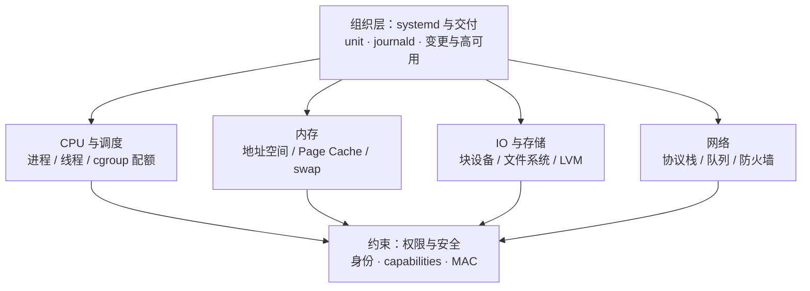
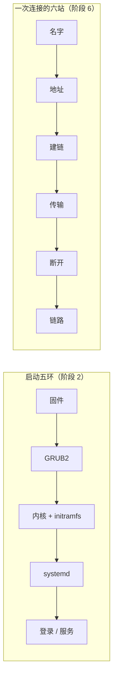
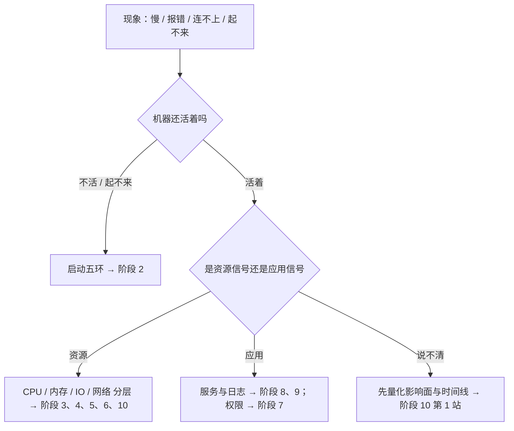

---
tags:
  - Linux
  - 复习方法
  - 建图
  - 学习地图
created: 2026-09-19
---

# 第 1 站：建图——把十一个阶段收敛成三张图

> [!cite] 参考资料
> 本套笔记阶段 1–11 的 00 号主笔记（每章的知识地图、技能地图与故障现场定位表）；[[Linux/12_复习与自测/03_前置_知识体系怎么搭|03 前置：知识体系怎么搭]] 给出的六个位置、五条时间线与九个连接点。
>
> **实测状态**：本篇不引入新的机制结论；表中「一个可复述的数字」全部**转引自对应阶段在本实验机上的实测记录**（转引条件以该阶段笔记为准）。本实验机为 **Ubuntu 24.04.5 LTS（VMware 虚拟机）/ 内核 `6.8.0-139-generic` / systemd 255（`255.4-1ubuntu8.17`）/ 4 vCPU / `MemTotal` 7894 MiB / root 可用**。**阶段 2 尚未逐条实测**，该行的数字按发行版官方文档给出（表中已标注）；阶段 7 的 SUID/SGID 计数则是本实验机真跑。

> **这篇讲什么**：怎么在半天之内，把十一章收敛成一张资源全景图、一张时间线图、一张排障入口图，并顺带得到一张「阶段 → 一句话 → 证据命令」的表。
>
> **必须先读什么**：[[Linux/12_复习与自测/03_前置_知识体系怎么搭|03 前置：知识体系怎么搭]]。
>
> **读完能交付**：一张（最多三张）自己画的体系图 + 一张覆盖十一个阶段的证据命令表。
>
> **所属**：主线第 1 站「一次复习闭环」；练习技能 **R1 建图**

## 0. 30 秒速览

> [!abstract] 这一篇只要记住五句话
> - **建图的顺序是「先现象、后章节」，不是「照着目录画」。**
>   - 怎么验证：从「服务变慢」「磁盘满」「连不上」这类现象出发，把章节挂上去；如果某章挂不上去，说明你对它的用途还不清楚。
> - **三张图分别回答三个问题：机器上有什么、过程怎么走、出事先看哪一层。**
>   - 怎么验证：每张图只允许有一个中心问题；把两张图并成一张，就说明还没收敛。
> - **每个阶段都要能说出一句话 + 一条命令 + 一个数字。**
>   - 证据：本章第 2 节的表里，阶段 10 的三个要素是「分层排除 → `mpstat -P ALL 1 3` → 单核 100% 时整机 `%usr` 仅 25.00%（4 vCPU 的 1/4）」（**转引**阶段 10 实测）。
> - **建图只允许翻术语表，不允许翻正文。**
>   - 理由：翻正文得到的是抄写，不是回忆；卡住的位置正是薄弱点，要原样记下来（第 3 站去补）。
> - **图的合格线是「能讲给同事听」。**
>   - 怎么验证：指着一个框，说出「它是什么、证据命令是什么、最容易误判什么」——三个都答不出就还没建完。

## 1. 三张图是什么

### 1.1 图一：资源全景图（机器上有什么）

在一张纸上画六个位置，用箭头标依赖关系。它回答的是「**这台机器上有哪些资源、由谁管**」：

画完后给每个框补三样东西：**证据命令、最常见故障现象、第一反应不要做什么**。这张图的价值在补充过程里，不在图形本身。

### 1.2 图二：时间线图（过程怎么走）

五条线各画一条，站点写框，**失败现象写在箭头旁**：

另外三条线（进程一生、内存旅程、盘的一生）用同样的方式各画一条。**每条线都要能说出：在哪一站失败、现场在哪、第一反应不要做什么。**

### 1.3 图三：排障入口图（出事先看哪一层）

这张图最接近值班时真正会用到的东西：左边是现象，中间是分层，右边是命令与对应阶段。

## 2. 阶段 → 一句话 → 证据命令 → 一个可复述的数字

这张表是建图的**最小交付物**。请自己重写一遍，不要照抄；写不出来的时候再回原篇。

| 阶段 | 一句话 | 最小证据命令 | 一个可复述的数字（含条件） |
| --- | --- | --- | --- |
| 1 实验环境与操作纪律 | 变更有备份、有回滚、有窗口 | `uname -r; stat -fc %T /sys/fs/cgroup` | 本实验机：Ubuntu 24.04.5 / 内核 6.8.0-139-generic / `cgroup2fs`（**转引**阶段 1） |
| 2 启动流程与内核 | 五环接力，先问「现在是谁在输出」 | `cat /proc/cmdline; systemctl get-default; journalctl -b -1` | 内核命令行是本次启动的验收标准（`/proc/cmdline`，文档值） |
| 3 进程与信号 | 一个进程的一生：诞生 → 调度 → 信号 → 退出 | `ps -eo stat,wchan,cmd --sort=-%cpu \| head`、`systemctl show -p ExecMainCode,ExecMainStatus` | socket ping-pong 实测自愿切换 **40,343.67** 次/秒、非自愿 **16.67** 次/秒（**转引**阶段 10） |
| 4 内存与 OOM | 申请 ≠ 占用；`free` 少 ≠ 内存不够 | `free -m; grep -E 'MemAvailable\|Dirty' /proc/meminfo; cat /proc/pressure/memory` | 触碰 3 GiB 后 `MemAvailable` **7224 → 4145** MiB，PSI 的 `avg10/60/300` 全程为 0（**转引**阶段 10） |
| 5 存储与文件系统 | 四层：块设备 → 分区 / LVM → 文件系统 → 挂载 | `lsblk -f; df -h; df -i; lsof +L1` | 删除仍被进程持有的 **10 MiB** 文件后 `df` 已用从 24K 涨到 10 MiB、`du -sh` 只有 20K（**转引**阶段 9） |
| 6 网络协议栈 | 一次连接六站；分层是唯一可靠方法 | `ss -lnt; ss -s; nstat -az \| grep -iE 'listen\|Retrans'` | `TIME_WAIT` 由 `TCP_TIMEWAIT_LEN` 固定 **60 秒**：**转引**阶段 6 实测 **62.06 秒仍在、63.07 秒消失**（0.5 秒采样） |
| 7 权限与安全 | 先问卡在哪一层：DAC / ACL / capabilities / 挂载 / MAC | `namei -l /path; getfacl; getcap -r / 2>/dev/null; ls -Z` | 本实验机 SUID 文件 13 个、SGID 文件 7 个、带 file capabilities 的文件 4 个（**转引**阶段 7） |
| 8 systemd 与服务 | 一个服务 = unit + cgroup + journald 证据 | `systemctl status X; systemctl show -p LimitNOFILE,MemoryMax X; journalctl -u X` | `Type=notify` 在 `NotifyAccess=all` 修复后 **0.0396 秒**启动成功（**转引**阶段 8） |
| 9 日志与监控 | 一条日志的一生 + 一次告警的一生 | `journalctl --disk-usage; ls -l /var/log; logrotate -d /etc/logrotate.conf` | 同一组 1000 个样本的 p95 按四种算法为 20 / 24 / 96 / 100 ms（**转引**阶段 9） |
| 10 性能分析与排障 | 先量化影响面，再分层排除，最后动手 | `uptime; vmstat 1 3; mpstat -P ALL 1 3; pidstat 1 3` | 单核 100%（4 vCPU 的 1/4）时整机 `%usr` 只有 **25.00%**、`load` 只有 **0.34**（**转引**阶段 10） |
| 11 生产运维与高可用 | 一次变更的一生：可逆、可验证、可交接 | `ss -lnt; systemctl list-units --state=running; sysctl --system` | **阶段 11 子笔记 03 的 `rsync --link-dest` 演示**（25 MiB 数据集，**转引**）：`base` 24.02 MiB（25,182,208 字节）、增量 `inc-2` 12 KiB（12,288 字节）、未变文件 `stat` 报 2 links、`du -sh --total` 两份合计仍是 25M |

> [!tip] 这张表的用法
> 面试或值班前，把它当作**提纲**：遮住右边两列，只看阶段名，自己说出命令与数字。说不出来的地方，进第 2 站的自测流程。

## 3. 生产动作：把图建出来

> [!example]- 生产动作 1：半天建图（生产机也可以做，全程只读）
> **怎么做**：准备一张 A3 或三张 A4。第一步画资源全景图（六个位置 + 三样补充）；第二步画时间线图（至少两条线，能画完五条更好）；第三步画排障入口图。全程**只允许翻术语表与命令清单，不允许翻正文**；卡住的位置在纸边标一个「？」。
> **预期**：得到三张图与一排「？」；这些问号比图更值钱，它们是下一站的输入。
> **风险**：无。**耗时**：约 3 小时（可拆成 3 段 × 60 分钟）。**回滚**：不需要。

> [!example]- 生产动作 2：用自己的话重写第 2 节的表（生产机也可以做）
> **怎么做**：把第 2 节的表清空右侧两列，自己填；填完后用只读命令在你的机器上复跑其中 5 条，把本机输出贴进去。
> **预期**：本机数字与笔记里的数字会有差异（如 `MemTotal`、磁盘型号）——这正是「证据要带条件」的现场教学。
> **风险**：无（只读）。**耗时**：约 40 分钟。**回滚**：不需要。

## 常见坑

| 常见做法或说法 | 后果或事实 |
| --- | --- |
| 照着目录画思维导图 | 得到的还是章节树，不会产生连接点；要从现象出发挂章节 |
| 一张图塞下全部内容 | 一张图只能回答一个问题；拆成三张，各自的验收更清楚 |
| 建图时翻正文抄结论 | 得到的是抄写劳动，不是提取练习；薄弱点会被掩盖 |
| 图里只有名词没有命令 | 值班时用不上；每个框必须有证据命令 |
| 把「记住数字」当成建图 | 数字是附产品；能说出「这个数字在什么条件下成立」才算掌握 |
| 只建一次图就收工 | 图要跟着错题更新；每次补缺后在图上补一笔，才是活的体系 |

## 决策练习

> 你花了两小时画出一张很大的图，把十一章内容都塞了进去。拿给同事看，他看完问：「所以遇到『服务变慢』我看哪一层？」你答不上来。下一步怎么做？
>
> - **A. 在图里再加一页目录，标出每一章在第几行，方便查找。**
> - **B. 把这张图拆成三张：资源全景、时间线、排障入口；在排障入口图上按「现象 → 分层 → 证据」补齐，并给每个框写上命令。**
> - **C. 换一个更漂亮的模板重新画一遍，配色和排版会更清楚。**

**为什么选 B**：同事的问题暴露的是「图回答不了使用问题」，而不是「图不够全」。拆成三张并补上证据，图才从资料变成工具。

**为什么 A 不对**：加目录只是让索引更清楚，仍然没有回答「先看哪一层」。

**为什么 C 不对**：排版不改变信息结构；重画一遍还是一次抄写。

## 要点自测

> [!question]- 三张图分别回答什么问题？只画一张行不行？
> - **判定**：资源全景图回答「有什么、谁管谁」；时间线图回答「过程怎么走、在哪断」；排障入口图回答「出事先看哪层」。
> - **影响什么**：决定你的体系能不能在值班与面试时被使用。
> - **不影响什么**：内容少的章节可以合并；但三张图的功能不能相互替代。
> - **落点**：给每张图写一句「这张图回答的问题是……」，写不出来就重画。
>
> [!question]- 为什么建图时要「先现象、后章节」？
> - **判定**：现象是生产与面试的入口，章节是学习时的组织方式；两者顺序相反。
> - **影响什么**：决定你能否把知识挂到「问题」上，而不是挂到「目录」上。
> - **不影响什么**：第一遍学新知识时仍然按章节；建图是复习阶段的动作。
> - **落点**：列出 10 个现象，逐个写「挂哪个根、看什么命令、去哪一章」。
>
> [!question]- 一个阶段要能说出哪三样东西？
> - **判定**：一句话（它解决什么问题）、一条最小证据命令、一个带条件的数字或判据。
> - **影响什么**：这三样是面试「你有体系吗」这一问的最小答案单元。
> - **不影响什么**：不要求背精确数字；本机数字与笔记不同是正常的，条件是关键。
> - **第一反应不要是什么**：不要用「这一章讲了……（目录复述）」当答案。

> 上一篇：[[Linux/12_复习与自测/03_前置_知识体系怎么搭|03 前置：知识体系怎么搭]] ｜ 下一篇：[[Linux/12_复习与自测/05_第2站_自测定位|05 第 2 站：自测定位]]
