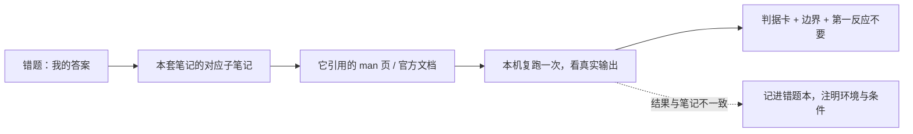

---
tags:
  - Linux
  - 复习方法
  - 补缺
  - 溯源
created: 2026-09-19
---

# 第 3 站：补缺深挖——带着问题回原篇

> [!cite] 参考资料
> 本套笔记各阶段子笔记的「参考资料」块与其中的 `man` 页清单；`man 1 man`、`man 7 man-pages` 关于章节分工的说明；发行版官方文档中对应的子系统章节（RHEL 的 System Administrator's Guide、Ubuntu Server Guide）；Ahrens《How to Take Smart Notes》关于「带着问题阅读」与「用自己的话重写」的部分。
>
> **实测状态**：本篇是流程篇，不新增实测；示例中出现的判据与数字**转引自前十一章在本实验机的实测记录**，补缺时应当**在你自己的机器上复跑一次**并把本机结果写回错题本。本实验机为 **Ubuntu 24.04.5 LTS（VMware 虚拟机）/ 内核 `6.8.0-139-generic` / systemd 255 / 4 vCPU / `MemTotal` 7894 MiB / root 可用**。

> **这篇讲什么**：怎么把一条错题变成一次有效补缺——缺的到底是结论、判据、证据、边界还是代价，以及怎么只补那一层。
>
> **必须先读什么**：[[Linux/12_复习与自测/05_第2站_自测定位|05 第 2 站：自测定位]]（先有排序后的薄弱清单）。
>
> **读完能交付**：一份补缺记录（含「我原来错在哪」）+ 一张判据卡。
>
> **所属**：主线第 3 站「一次复习闭环」；练习技能 **R4 补缺溯源**

## 0. 30 秒速览

> [!abstract] 这一篇只要记住五句话
> - **补缺的对象是「一层」，不是「一章」。**
>   - 理由：五种缺口（结论 / 判据 / 证据 / 边界 / 代价）各有各的补法；分不清就一定会退化成重读全章。
> - **补缺的正确形态是「带着问题回原篇，只读 1~2 篇」。**
>   - 怎么验证：读之前先写出你要回答的那个问题；读完之后，这个问题必须能用三句话回答。
> - **补缺的产出不是笔记，是一张判据卡加一句「第一反应不要」。**
>   - 怎么验证：判据卡上必须有命令与阈值；「第一反应不要」必须写成一个具体动作（如「不要 `mount -o remount,rw`」）。
> - **补缺要按依赖顺序：地基篇先补，横切篇后补。**
>   - 证据：容器内存问题同时依赖进程章（cgroup）与内存章（cgroup 内存治理）；先补进程章，第二篇只需 10 分钟。
> - **补缺必须记录「我原来错在哪」。**
>   - 理由：错误方向会重复出现；只记正确结论的人，下次会在同一个岔路口拐错。

## 1. 五种缺口与各自的补法

自测的四档评分只告诉你「不会」，不能告诉你「缺什么」。第 2 站的错题本里已经有一列「缺的那一层」，按它分五种补法：

| 缺口 | 症状 | 补法 | 产出 |
| --- | --- | --- | --- |
| **结论** | 完全没有方向，或方向错了 | 回原篇读概念部分，用自己的话重写一句话 | 一句定义 + 一个反例 |
| **判据** | 知道要判断什么，但不知道该看哪个量/阈值 | 找原篇的判据表；自己做一次对比实验 | 一张判据卡（条件 → 阈值 → 动作） |
| **证据** | 会判断，但说不出命令与输出形态 | 复跑命令、把本机输出贴进证据卡 | 一张证据卡 |
| **边界** | 结论对，但换个条件就不成立 | 找原篇的「常见坑」与「版本差异」，列反例 | 三条边界句（什么情况下不成立） |
| **代价** | 知道怎么做，不知道做的代价与风险 | 找原篇的「观测代价」「风险」「回滚」段落 | 一行「代价 + 回滚方式」 |

> [!tip] 一个快速判断法
> 把你的答案讲给同事听，记录他第一次追问的位置：**追问「为什么」→ 缺判据；追问「你怎么知道」→ 缺证据；追问「那如果……呢」→ 缺边界；追问「那代价是什么」→ 缺代价。**

## 2. 溯源：从结论一路查到底层

补缺不能停在「笔记上这么写」。完整的一条链是：



四步纪律：

1. **先定位到篇**：错题必须落到具体一篇子笔记；写不出篇名就先补「我连这属于哪一章都不知道」这条元错题。
2. **再定位到节**：只读那一两节，不从头读到尾。
3. **然后查原始资料**：`man` 页优先于二手转述；发行版官方文档优先于博客。查资料时**记录版本**（`man` 页的版本、发行版版本）。
4. **最后本机复跑**：命令能跑就跑一遍，把本机输出写进错题本；跑不了的（需要第二台机器、需要独立控制台或快照）显式标「未实测 + 补做方式」。

## 3. 补缺的顺序：先地基，后横切

同一个薄弱点常常需要两篇才能解释，先补哪一篇效率完全不同：

| 顺序 | 先补 | 后补 | 为什么 |
| --- | --- | --- | --- |
| 1 | 各阶段的前置篇（01–03） | 该阶段的主线篇 | 前置篇是主线篇的词汇表；跳过前置，主线篇会读得很慢 |
| 2 | 进程与资源限制 | 容器与 cgroup 治理 | 容器问题的宿主侧解释在 cgroup，不在编排层 |
| 3 | 内存基础（承诺 / 计量） | Page Cache 与内存去哪了 | 不先分清「申请」与「占用」，后面的三类答案无法归位 |
| 4 | 存储四层（设备 / 分区 / 文件系统 / 挂载） | 容量账与 IO 栈 | 不先分层，`df`/`du` 的差异会被误判 |
| 5 | 网络分层与地址 | 队列、抓包与调优 | 分层是六站的骨架，调参是最后一步 |
| 6 | systemd 的 unit 与依赖 | 沙箱、资源上限与 timer | 后者是 unit 的属性，先有对象再谈属性 |

> [!important] 一条经验
> **补缺时如果发现「越读越多」，说明你缺的是前置篇，不是当前篇。** 立刻停下来，回到地基篇；把它读完再回来，通常 10 分钟就能解决原来卡住的地方。

## 4. 生产动作：一次完整的补缺

> [!example]- 生产动作：把一条错题补成一张判据卡（生产机也可以做，只读）
> **怎么做**：挑薄弱清单的第 1 项。写清「我原来的答案」，定位到篇，读该篇的目标小节，查一条 `man` 页，跑一次对应命令，然后填下面这张卡：
>
> ```text
> 判据卡
> 现象：服务所在机器 free 显示可用内存很少
> 判据：MemAvailable + /proc/pressure/memory 的 some/full
> 命令：free -m; grep MemAvailable /proc/meminfo; cat /proc/pressure/memory
> 阈值：PSI 的 some/full 长期非 0 才算压力；仅 available 下降属于缓存
> 结论：有缓存、无压力的机器不需要处置
> 边界：cgroup 场景要看 memory.events / memory.max，整机口径不适用
> 代价：只读观测无代价；iostat 采样不要低于 1 秒
> 第一反应不要：不要因为 free 少就重启服务或加内存
> 出处：阶段 4（提供判据）；数字**转引**阶段 10 实测：available 7224 → 4145 MiB 且 PSI 的 avg 全 0
> ```
>
> **预期**：得到一张能在值班时直接用的卡；填写过程中你会发现自己原来缺的是「判据」而不是「结论」。
> **风险**：无（只读）。**耗时**：约 40 分钟。**回滚**：不需要。
> **验收**：第二天不看笔记，能凭这张卡说出命令与阈值（这就是 D+1 复查）。

## 5. 补缺的三个陷阱

> [!warning] 陷阱一：把补缺做成重读
> 症状：每次都从篇首读到篇尾。**对策**：先写问题，再只读回答问题的 1~2 节；读别的节时用书签标「与本问题无关」。

> [!warning] 陷阱二：只记结论，不记错误方向
> 症状：错题本上只有正确答案。**对策**：「当时的答案」这一列必须如实填写，哪怕是「空白」。

> [!warning] 陷阱三：补完不复跑
> 症状：补缺记录里有命令，但从来没有在本机跑过。**对策**：能跑的当场跑；跑不了的显式标「未实测」并写补做方式。

## 常见坑

| 常见做法或说法 | 后果或事实 |
| --- | --- |
| 「这章不熟，从头再读一遍」 | 大部分内容是已掌握的，稀释了补缺效率；应当只补缺失的那一层 |
| 补缺只找结论，不查 `man` 页 | 二手转述常常丢条件；答案会在换版本后失效 |
| 补缺记录里没有本机输出 | 无法判断结论是否适用于自己的环境 |
| 只补当前篇，不补前置篇 | 卡点会在下一次换章节时重复出现 |
| 错题本里只有正确口径 | 丢失「错误方向」这一最有价值的信息 |
| 补缺时间过长（一坐三小时） | 后段效率急剧下降；应拆成 40 分钟一段，每段一条错题 |

## 决策练习

> 你的错题是：「容器被 OOMKilled，怎么判断是容器的内存限制还是整机内存不足？」你打开容器相关那一章，发现里面讲的都是编排概念，读起来很吃力。下一步怎么做？
>
> - **A. 硬读下去**，把编排概念也一起补了，反正迟早要用。
> - **B. 停下来判断：这个问题在宿主侧的机制属于 cgroup 与内存治理，应当先补「进程与资源限制」和「内存治理」两篇；编排概念留到以后。**
> - **C. 直接记住结论：「容器 OOM 都是限制问题」，不再深究。**

**为什么选 B**：本套笔记里，容器 OOM 的宿主侧解释在 cgroup 与内存章；先补这两篇，回头再看编排就很快。这正是第 3 节「先地基、后横切」的应用。

**为什么 A 不对**：读得吃力说明前置缺失；硬读会消耗大量时间，而且补的不是这一条错题缺的那一层。

**为什么 C 不对**：把结论绝对化会丢边界——整机内存不足同样能导致容器被杀，而且那种情况处置方式完全不同。

## 要点自测

> [!question]- 五种缺口分别怎么补？举一个「缺判据」的例子。
> - **判定**：结论 → 用自己的话重写；判据 → 找判据表或做对比实验；证据 → 复跑命令；边界 → 列反例；代价 → 找风险与回滚段。
> - **例子**：「服务变慢是不是磁盘问题」缺的是判据——需要「进程是否在 D 状态 / `w_await` 与业务延迟是否同步上升」这样的判定链。
> - **影响什么**：决定补缺是 20 分钟还是一下午。
> - **落点**：错题本「缺的那一层」这一列必须从五个词里选一个，不许写「不够熟」。
>
> [!question]- 补缺为什么必须按「先地基、后横切」的顺序？
> - **判定**：横切篇的结论依赖地基篇的词汇与机制。
> - **影响什么**：决定你读横切篇的速度与理解深度。
> - **不影响什么**：已经掌握的地基可以跳过；判断标准是「能否用它解释一个现象」。
> - **第一反应不要是什么**：不要用「越读越多」硬扛，那通常是在补前置。
>
> [!question]- 补缺的产出为什么是判据卡而不是笔记？
> - **判定**：判据卡包含条件、命令、阈值、动作与边界，能直接在值班时使用。
> - **影响什么**：决定这次补缺能不能转化成处置能力。
> - **不影响什么**：笔记不必删；判据卡是从笔记里提炼的、可携带的那一部分。
> - **落点**：一张卡只放一个结论；卡片数量不必多，能覆盖你的高频错题即可。

> 上一篇：[[Linux/12_复习与自测/05_第2站_自测定位|05 第 2 站：自测定位]] ｜ 下一篇：[[Linux/12_复习与自测/07_第4站_输出固化|07 第 4 站：输出固化]]
