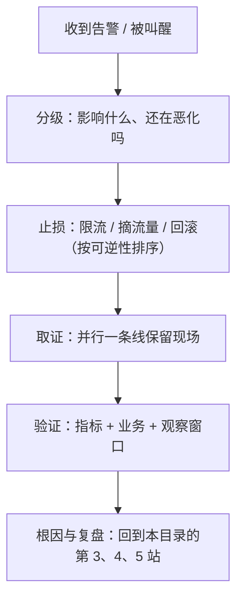

---
tags:
  - Linux
  - 复习方法
  - 面试
  - 限时答辩
created: 2026-09-19
---

# 第 5 站：迁移应用——场景题、限时答辩与追问

> [!cite] 参考资料
> Google SRE 手册「Being On-Call」与「Managing Incidents」（压力下的判断顺序）、「Effective Troubleshooting」（假设—验证循环）；《Systems Performance》第 1 章关于「先量化影响面」的论述；本套笔记阶段 10 的处置六站与阶段 11 的变更与事故处理手册。
>
> **实测状态**：本篇是演练流程篇，不新增系统实测。题目中引用的数字来自前十一章在本机（Ubuntu 24.04.4 LTS / WSL2 / 非 root）的实测记录；需要 root 或第二台机器的场景在子笔记 12 里明确标注为未实测。

> **这篇讲什么**：把已经固化的知识用出来——换现象、换条件、换角色，限时给出完整答案，并接住追问。
>
> **必须先读什么**：[[Linux/12_复习与自测/07_第4站_输出固化|07 第 4 站：输出固化]]、[[Linux/12_复习与自测/10_横切_场景题答题骨架|10 横切：场景题答题骨架]]。
>
> **读完能交付**：一份限时答辩记录（含追问与自评）。
>
> **所属**：主线第 5 站「一次复习闭环」；练习技能 **R6 限时答辩**

## 0. 30 秒速览

> [!abstract] 这一篇只要记住五句话
> - **迁移有三个维度：换现象、换条件、换角色。**
>   - 怎么验证：同一个根因，至少能讲出两种不同表现；同一现象，能说出两种以上成因。
> - **限时答辩的规则是：读题 3 分钟、答题 20 分钟、追问 7 分钟。**
>   - 理由：值班与面试都是限时环境；不限时的练习无法暴露「想太久」这个真实问题。
> - **追问链固定四步：证据 → 边界 → 反例 → 代价。**
>   - 怎么验证：把这四问写下来，自己先答一遍；答不出的就是下一轮的错题。
> - **值班视角与面试视角的差别只有一个：先止损还是先讲清楚。**
>   - 证据：事故中先做可逆动作（限流、摘流量、回滚），根因留给复盘；面试则要求你把顺序讲出来。
> - **答不上来时，正确动作是「缩小范围 + 说明下一步」。**
>   - 怎么验证：用「我会先确认 X，再根据 Y 决定 Z」把不确定变成下一步动作，而不是硬猜。

## 1. 迁移的三个维度

| 维度 | 做法 | 例子 |
| --- | --- | --- |
| **换现象** | 同一个根因，换一种表现 | 脏页回写跟不上：可以表现为 `wa` 高，也可以表现为应用写日志变慢、`D` 状态进程增多 |
| **换条件** | 换版本、换规模、换环境 | 同一个 `somaxconn` 结论，在容器里还叠加网络命名空间与宿主侧转发 |
| **换角色** | 从「我会做」变成「我建议别人做」 | 值班时你要告诉同事「先做这三步、不要做那两步」，而不是自己敲命令 |

练习方法：给你的每条判据卡补两行——**「还可能表现成什么」**与**「换个环境会怎样」**。

## 2. 限时答辩：30 分钟一轮

> [!example]- 生产动作：限时答辩（不需要机器，可反复做）
> **怎么做**：从子笔记 14 的题库或子笔记 10 的十五道场景题中随机抽一道。计时：**3 分钟读题并写下分层假设 → 20 分钟写出六段答案 → 7 分钟自问四步追问链并写下答案**。全程闭卷，写完后对答案。
> **预期**：20 分钟内通常写不完六段——这暴露的是「组织答案的速度」，而不是知识量。
> **风险**：无。**耗时**：30 分钟一轮。**回滚**：不需要。
> **验收**：答案里同时出现「判据、命令、边界、止损、回滚」五样，并且能说清「第一反应不要做什么」。

**评分表（每项 0~2 分，满分 10 分）**：

| 项 | 0 分 | 2 分 |
| --- | --- | --- |
| 影响面 | 没提 | 说清谁受影响、范围、起始时间 |
| 分层 | 直接给命令 | 先定位到层，再给命令 |
| 证据 | 只有结论 | 有命令、有数字、有条件 |
| 边界 | 没有 | 说出两种以上不适用的情况 |
| 止损与回滚 | 没有 | 有动作、有验收、有回滚方式 |

总分 ≤ 6 分，说明这道题进入下一轮错题本；≥ 8 分可以进入 D+21 复查。

## 3. 追问链四步

面试官与同事的追问基本落在四个位置。把它们写成固定动作，就不会临场慌：

| 步 | 追问 | 你要给的 | 典型反面答案 |
| --- | --- | --- | --- |
| 1 | 「你怎么知道的？」 | 命令 + 输出形态 + 条件 | 「我记得是这样」 |
| 2 | 「那换个环境呢？」 | 三条边界（版本 / 规模 / 容器或云上） | 「应该差不多」 |
| 3 | 「有没有反例？」 | 一个能推翻你结论的观察 | 「没想过」 |
| 4 | 「代价是什么？」 | 动作的风险、影响面、回滚方式 | 「重启一下就好」 |

> [!tip] 一个实用的自问公式
> **「如果我错了，最先会看到什么？」** —— 这个问题的答案就是你下一步要看的指标；它同时覆盖了第 3 步（反例）与第 1 步（证据）。

## 4. 值班视角：顺序比知识更重要

面试与值班的差别只有一条：**值班时「先止损」优先于「先讲清」**。把这句话翻译成动作顺序：

三个必须能背下来的判断：

1. **先分级再动手**：不知道影响面就动手，很容易把一个小故障变成一次事故。
2. **止损动作必须可逆**：限流、摘流量、回滚优先；删数据、重建、重启全量都属于后手。
3. **根因留给复盘**：带着「必须当场查清」的心态处置，通常会把故障拖长。

## 5. 面试中的三类危险回答

| 类型 | 症状 | 改法 |
| --- | --- | --- |
| **菜单型** | 一上来报 8 条命令 | 先给结论与分层，命令随证据出现 |
| **绝对型** | 「一定是 OOM」「肯定是磁盘」 | 给结论 + 置信度 + 验证方式 |
| **免责型** | 每句都加「可能」「一般来说」 | 明确区分「已验证 / 未验证」，其余照直说 |

## 常见坑

| 常见做法或说法 | 后果或事实 |
| --- | --- |
| 不限时练习 | 掩盖「组织答案慢」这个真实短板；值班没有无限时间 |
| 只练自己熟的场景 | 面试与故障恰好挑你薄弱的那一类 |
| 追问时重新组织语言 | 会说散；四步追问链固定后，回答变成填空 |
| 把「我做过」当证据 | 要给出命令、数字与条件，经历本身不是证据 |
| 值班时边止损边查根因 | 两条线互相干扰；应当分工，探索留给复盘 |
| 答不出来就沉默或硬猜 | 改成「先缩小范围 + 下一步验证什么」，反而加分 |

## 决策练习

> 限时答辩中你被问到：「一台机器 `load average` 是 16，但 CPU 使用率只有 10%，为什么？」你在 20 分钟里写出的答案是「因为有 IO 等待」。自评时你会给这道题打几分？
>
> - **A. 8 分以上**：结论是对的，方向也把握住了。
> - **B. 6 分以下**：缺影响面、缺分层、缺证据（没有 `vmstat` 的 `b` 列与 `wa`）、缺边界（也可能是 `D` 状态、内存回收、锁等待）、缺止损；补完再重做。**
> - **C. 不用打分**，反正结论对就行。

**为什么选 B**：评分表看的是五要素是否齐全。「load 含 D 状态」只是第一步判断，后面还要证据、边界与止损；这正是限时答辩要训练的东西。

**为什么 A 不对**：结论对但无证据，属于第 2 站里的 B 档——最容易被误判成「会了」的那一档。

**为什么 C 不对**：不打分就没有反馈；没有反馈的练习不会带来进步。

## 要点自测

> [!question]- 迁移的三个维度是什么？各举一个例子。
> - **判定**：换现象、换条件、换角色。
> - **例子**：脏页回写（换现象）、容器内的 `somaxconn`（换条件）、值班时给同事的指令（换角色）。
> - **影响什么**：决定你是「会做这道题」还是「掌握这一类问题」。
> - **落点**：每张判据卡补两行：还可能表现成什么、换个环境会怎样。
>
> [!question]- 追问链四步是什么？为什么要固定成四步？
> - **判定**：证据 → 边界 → 反例 → 代价。
> - **影响什么**：把「临场组织语言」变成「填空」，降低压力下的失误。
> - **不影响什么**：顺序可以调整；四步的内容不能缺。
> - **第一反应不要是什么**：不要在追问时重新从头讲一遍自己的排查过程。
>
> [!question]- 值班时为什么不先查根因？
> - **判定**：止损与业务恢复优先；根因需要时间与稳定环境。
> - **影响什么**：决定故障是 5 分钟结束还是 2 小时结束。
> - **不影响什么**：现场必须保留——取证与止损并行，不是二选一。
> - **落点**：把「限流 → 摘流量 → 回滚」写在值班卡片最上面，并标注每个动作的回滚方式。

> 上一篇：[[Linux/12_复习与自测/07_第4站_输出固化|07 第 4 站：输出固化]] ｜ 下一篇：[[Linux/12_复习与自测/09_横切_跨章大图|09 横切：跨章大图]]
