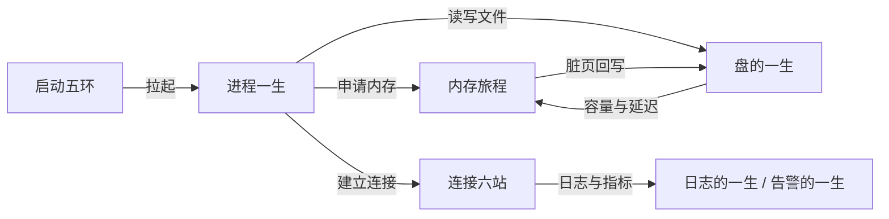
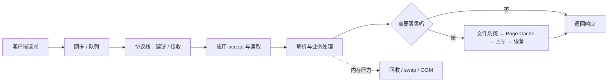
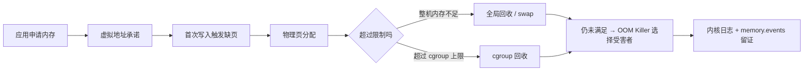
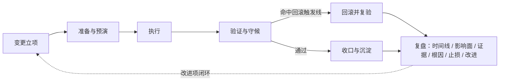

---
tags:
  - Linux
  - 复习方法
  - 知识体系
  - 跨章
created: 2026-09-19
---

# 横切：跨章大图——五条时间线与九个连接点

> [!cite] 参考资料
> 本套笔记各阶段 00 号主笔记里的知识地图与故障现场定位表；阶段 2 的启动五环、阶段 3 的进程一生、阶段 4 的内存旅程、阶段 5 的盘的一生、阶段 6 的连接六站；阶段 9 的两条链路（日志的一生、告警的一生）；阶段 10 的处置六站。
>
> **实测状态**：本篇是综合篇，不新增实验。表中所有数字均**转引自前十一章在本实验机的实测记录**（转引条件以对应阶段为准），条件随表给出；文档值另行标注。本实验机为 **Ubuntu 24.04.5 LTS（VMware 虚拟机）/ 内核 `6.8.0-139-generic` / systemd 255（`255.4-1ubuntu8.17`）/ cgroup2fs（v2）/ 4 vCPU / `MemTotal` 7894 MiB / root 可用**。

> **这篇讲什么**：把五条时间线并排放在一起看，并逐个拆开九个连接点——它们才是「串起来」发生的地方。
>
> **必须先读什么**：[[Linux/12_复习与自测/03_前置_知识体系怎么搭|03 前置：知识体系怎么搭]]、[[Linux/12_复习与自测/04_第1站_建图|04 第 1 站：建图]]。
>
> **读完能回答**：同一个现象为什么能牵出两三个章节？哪一条线断了会连带影响哪些线？三张「跨域流程图」各自在哪一层收口？
>
> **所属**：横切篇；练习技能 **R1 建图、R3 证据与口径**

## 0. 30 秒速览

> [!abstract] 这一篇只要记住六句话
> - **五条时间线并排看，才能看出「同一台机器」的完整生命周期。**
>   - 五条线：启动五环（阶段 2）、进程一生（阶段 3）、内存旅程（阶段 4）、盘的一生（阶段 5）、连接六站（阶段 6）。
> - **连接点是「同名不同物」与「同物不同层」两类。**
>   - 证据：`cache` 在内存章是 Page Cache、在存储章是设备缓存、在解析器里是 DNS 缓存——**名字一样，验证命令与处置完全不同**。
> - **资源限制五层是最容易跨章出错的地方。**
>   - 证据：`ulimit`（当前会话）→ `limits.conf`（PAM 会话）→ unit 的 `LimitXXX=`（服务）→ cgroup（整组）→ 内核全局；改错一层等于没改。
> - **每个连接点都要能给出「同一现象的两个视角」。**
>   - 怎么验证：任选一个连接点，说出「从视角 A 看到什么、从视角 B 看到什么、两边如何对齐」。
> - **三张跨域图分别收口在：连接层、内存层、变更层。**
>   - 理由：一次请求主要在连接层收口，一次 OOM 在内存层收口，一次故障在变更层收口。
> - **连接点不是知识点，是「换视角的入口」。**
>   - 怎么验证：遇到跨章问题时，你的第一问应当是「我现在站在哪个视角」，而不是「这属于哪一章」。

## 1. 五条时间线并排

| # | 时间线 | 站点 | 关键失败现象 | 最小证据 |
| --- | --- | --- | --- | --- |
| 1 | **启动五环**（阶段 2） | 固件 → 引导加载器 → 内核 + initramfs → systemd → 登录 / 服务 | 黑屏 / `grub>` / `dracut:/#` / `emergency mode` | `journalctl -b`、`cat /proc/cmdline`、`systemctl --failed` |
| 2 | **一个进程的一生**（阶段 3） | 诞生 → 状态与调度 → 信号 → 退出与回收 | 卡死 / 杀不掉 / 悄悄消失 / 僵尸堆积 | `ps -eo stat,wchan,cmd`、`systemctl show -p ExecMainCode,ExecMainStatus` |
| 3 | **一次内存分配的旅程**（阶段 4） | 申请与承诺 → 落地与计量 → 缓存与回写 → 回收与 swap → OOM | `OOMKilled` / `wa` 高 / 内存涨不停 | `free -m`、`/proc/pressure/memory`、`memory.events` |
| 4 | **一块盘的服役一生**（阶段 5） | 接管与分区 → 成型（文件系统）→ 上岗（挂载）→ 扩容 → 冗余与退役 | 空间耗尽 / inode 耗尽 / 只读 / IO 慢 | `lsblk -f`、`df -h`、`df -i`、`iostat -x` |
| 5 | **一次连接的六站**（阶段 6） | 名字 → 地址 → 建链 → 传输 → 断开 → 链路（→ 出门之后） | 解析失败 / 连接超时 / 抖动 / 大量 `TIME_WAIT` | `ss -lnt`、`ss -s`、`ss -ti`、`nstat -az` |

补充两条同样按时间组织的链路（来自阶段 9，用于回答「为什么日志和告警也算体系的一部分」）：

| # | 链路 | 站点 | 收口于 |
| --- | --- | --- | --- |
| 6 | **一条日志的一生** | 诞生 → 落点 → 轮转 → 集中 → 退役 | 同一条日志在 journald 与 `/var/log` 两边都有，口径要对齐 |
| 7 | **一次告警的一生** | 计量 → 判定 → 降噪 → 问责 | 告警必须落到一个具体动作上，否则就是噪音 |

### 1.1 五条线的交叉点在哪

图中每一条箭头都值得写一句「它在哪里会断」：进程被拉起时会因依赖失败而卡住；申请内存时会在缺页落地上失败；建立连接时会因队列溢出被静默丢弃。**把箭头写清，体系就立起来了。**

## 2. 九个连接点

每个连接点都用统一结构描述：**两个视角 → 如何对齐 → 最容易答错的地方**。

### 2.1 Page Cache：内存 / 存储 / IO 观测

- **视角 A（内存）**：Page Cache 是可回收资产；缓存占用高是正常现象。
- **视角 B（存储与 IO）**：脏页要回写，回写跟不上会把写进程按在 `balance_dirty_pages` 里。
- **如何对齐**：内存侧看 `Dirty`、`Writeback` 与 PSI；存储侧看 `iostat -x` 的 `w_await`、`aqu-sz`；两边用「写速率是否同步」对齐。
- **最容易答错**：把缓存占用量当成内存不足；把脏页积压当成磁盘故障。

### 2.2 cgroup：进程 / 内存 / systemd / 性能 / 生产

- **视角 A（进程与隔离）**：cgroup 限定「能用多少」，namespace 决定「看得见什么」。
- **视角 B（服务与容器）**：unit 的 `MemoryMax=`、`CPUQuota=` 最终写进 cgroup 接口文件。
- **如何对齐**：用 `systemctl show -p MemoryMax,CPUQuota` 与 `systemd-cgtop` / `systemd-cgls` 对照；容器内看同名文件，宿主侧看完整路径。
- **最容易答错**：容器内看 `free`/`top` 判断容器受限情况；忘了 `OOMPolicy` 会让整个 unit 被停掉。

### 2.3 时间同步：日志 / 证书 / 告警

- **视角 A（可观测性）**：跨机日志比对、告警时序、超时判定都依赖时钟。
- **视角 B（安全与生产）**：证书有效期、令牌、审计时间线同样依赖时钟。
- **如何对齐**：`timedatectl` 看同步状态；比时间线时先确认两台机器在同一时区且都同步。
- **最容易答错**：认为时钟漂移只影响日志「好不好看」；漂移会让整个复盘时间线失去意义。

### 2.4 PID 1：启动 / 服务 / 容器

- **视角 A（启动与服务）**：PID 1 是 systemd，负责按 unit 拉起一切；它不会被普通信号杀死。
- **视角 B（容器）**：容器里的 PID 1 是应用自己，必须负责回收子进程与转发信号。
- **如何对齐**：宿主侧看 `systemctl status`，容器侧看该进程的 `SIGCHLD` 处理与退出码。
- **最容易答错**：把容器里的 PID 1 当普通进程；忘了它默认不转发信号、不回收孤儿。

### 2.5 容器三件套：namespace / cgroup / 联合文件系统

- **视角 A（进程与资源）**：namespace 隔离视图，cgroup 限制用量。
- **视角 B（存储与网络）**：镜像分层、可写层、网络命名空间与转发共同决定「容器里的世界」。
- **如何对齐**：宿主侧用 `lsns`、`systemd-cgls`、`findmnt` 观察容器对应的 namespace、cgroup 与挂载。
- **最容易答错**：把容器理解成「轻量虚拟机」；共享内核意味着内核参数、Page Cache、OOM 行为都是共用的。

### 2.6 句柄与端口：进程 / 网络 / 存储

- **视角 A（进程）**：`RLIMIT_NOFILE`、`fs.file-max` 决定能开多少文件描述符。
- **视角 B（网络与存储）**：连接占用 fd，`inotify` 实例占用 fd，端口耗尽则是另一类资源。
- **如何对齐**：`lsof -p <pid>` 分类统计；`ss -s` 看连接口径；`/proc/sys/fs/inotify/max_user_instances` 看 inotify。
- **最容易答错**：把「连接数打满」与「句柄打满」混为一谈；两者的处置动作完全不同。

### 2.7 内核参数：网络 / 内存 / 存储 / 安全

- **视角 A（子系统）**：每个参数属于一个子系统，有自己的语义与副作用。
- **视角 B（治理）**：`sysctl.d` 的加载顺序决定最终值——目录合并按文件名排序、同名文件 `/etc` 优先、最后应用 `/etc/sysctl.conf`，**后加载覆盖先加载**。
- **如何对齐**：`sysctl -n <key>` 看运行时值；`sysctl --system 2>&1 | head -20` 看加载顺序；`grep -rn <key> /etc/sysctl.d /usr/lib/sysctl.d` 找写入点。
- **最容易答错**：改了不生效就重复改同一个文件，而不去查加载顺序。

### 2.8 登录与权限：PAM / SSH / sudo / 审计

- **视角 A（认证）**：PAM 决定「能不能登录」，SSH 决定「从哪登录、用什么方式」。
- **视角 B（授权与留痕）**：sudo 决定「登录后能做什么」，审计决定「做过什么」。
- **如何对齐**：`sshd -T -C user=...,addr=...` 看最终生效配置；`journalctl -u ssh`、`sudo` 日志、`auditd` 三处对照。
- **最容易答错**：只看配置文件写没写，不看 Match 之后的最终生效值。

### 2.9 日志落点：systemd / 可观测性 / 存储 / 生产

- **视角 A（服务）**：unit 的 `StandardOutput=` 决定日志去哪；journald 有独立容量上限。
- **视角 B（存储与合规）**：日志占用磁盘、`inode` 与留存期；轮转方式决定是否会丢日志。
- **如何对齐**：`journalctl --disk-usage` 与 `du -sh /var/log` 两个口径一起看；轮转后用 inode 变化验证「谁还在写」。
- **最容易答错**：只清理 `/var/log`，忘了 journald 自己占用的空间；只切换文件不看持有 fd 的进程。

## 3. 三张跨域流程图

### 3.1 一次请求：从网卡到磁盘（或到 OOM）

**这条图收口在连接层**：任何一段慢，都要回到「它属于六站的哪一站」。

### 3.2 一次 OOM：从申请到被杀

**这条图收口在内存层**：证据是内核日志与 cgroup 计数，**不是退出码 137**。

### 3.3 一次故障：从变更到复盘

**这条图收口在变更层**：它的价值在于提醒你——**生产事故的多数根因不在内核，而在某一次没有被约束好的变更**。

## 4. 生产动作：把连接点写进卡片

> [!example]- 生产动作：给一个连接点写两张视角卡（生产机也可以做，只读）
> **怎么做**：从九个连接点里选一个（推荐 Page Cache 或 cgroup）。写两张卡：「视角 A 我能看到什么、用什么命令」「视角 B 我能看到什么、用什么命令」，再写一行「两边如何对齐」。
> **预期**：写的过程中你会发现自己只熟悉一个视角——这正是跨章问题答不上来的原因。
> **风险**：无（只读）。**耗时**：约 30 分钟。**回滚**：不需要。
> **验收**：拿一个真实现象（例如容器被 OOMKilled），能用两张卡各说一遍，并说出宿主侧与容器侧的证据差异。

## 常见坑

| 常见做法或说法 | 后果或事实 |
| --- | --- |
| 把五条时间线当成五个互不相干的章节 | 遇到跨章问题时无法归位；连接点正是被考的地方 |
| 只从自己熟悉的一个视角取证 | 容器问题只看容器内、存储问题只看 `df`，都会漏掉一半证据 |
| 认为「名字一样就是同一件事」 | `cache` / `queue` / `limit` / `state` 都是同名不同物的重灾区 |
| 忽略箭头上的失败点 | 时间线图变成名词列表，无法用于排障 |
| 只在纸面上记连接点 | 不实际跑一遍命令，两个视角的对齐永远停在想象里 |
| 把「其他章节」当成以后再学 | 体系的价值恰恰在章节之间；连接点是复习章最该补的部分 |

## 决策练习

> 一个容器里的应用被打上 `OOMKilled`。同事问你：「是不是宿主机内存不够了？」你怎么回答？
>
> - **A. 应该是，看一下宿主机的 `free` 就行。**
> - **B. 先分两个视角：容器侧看该 cgroup 的 `memory.events`（`oom_kill` 计数）与 `memory.max`；宿主侧看整机 `MemAvailable` 与 PSI；如果宿主侧压力指标正常而 cgroup 计数增长，就是容器级 OOM。**
> - **C. 直接把容器的内存限制调大，问题就解决了。**

**为什么选 B**：这正是连接点 2.2 的用法——先分视角、再对齐证据。cgroup 级 OOM 与整机 OOM 的处置完全不同。

**为什么 A 不对**：宿主 `free` 少在正常情况下是缓存；容器 OOM 多数是 cgroup 级，很多情况下整机还有空闲内存。

**为什么 C 不对**：没查清是限制问题还是泄漏、是整机压力还是容器配额，调大限额只是把问题推后或换一个受害者。

## 要点自测

> [!question]- 五条时间线分别是什么？哪一条最容易与其他线交叉？
> - **判定**：启动五环、进程一生、内存旅程、盘的一生、连接六站。
> - **交叉最多的**：进程一生——它既是内存的申请者、文件的使用者，也是连接的所有者。
> - **影响什么**：决定你在排障时从哪里切入。
> - **落点**：画一张「进程在中心、四条线在四周」的图，标出每条箭头可能的失败点。
>
> [!question]- 连接点分哪两类？各举一个例子。
> - **判定**：同名不同物（cache / queue / limit / state）与同物不同层（cgroup、Page Cache、日志落点）。
> - **影响什么**：决定你会不会用错命令、看错证据。
> - **不影响什么**：分类不是目的；目的是养成「先问视角」的习惯。
> - **第一反应不要是什么**：不要直接回答「这属于某一章」，先问「我现在站在哪个视角」。
>
> [!question]- 三张跨域图分别在哪一层收口？为什么这样分？
> - **判定**：请求 → 连接层；OOM → 内存层；故障 → 变更层。
> - **影响什么**：决定你去找哪一层的证据。
> - **不影响什么**：三张图会互相引用（OOM 也可能是某次变更引入的），但收口点不同。
> - **落点**：每张图写一句「这条链断在哪里最常见」。

> 上一篇：[[Linux/12_复习与自测/08_第5站_迁移应用|08 第 5 站：迁移应用]] ｜ 下一篇：[[Linux/12_复习与自测/10_横切_场景题答题骨架|10 横切：场景题答题骨架]]
