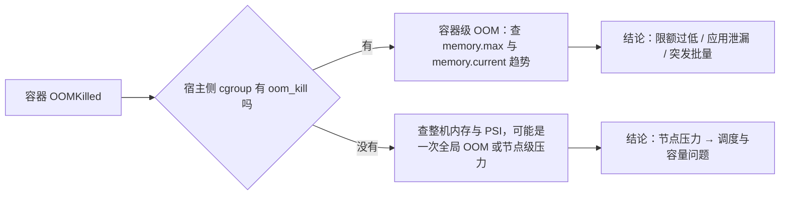

---
tags:
  - Linux
  - 复习方法
  - 容器
  - 云上Linux
created: 2026-09-19
---

# 横切：向外连接——容器、Kubernetes 与云上 Linux

> [!cite] 参考资料
> `man 7 namespaces`、`man 7 cgroups`、`man 1 unshare`、`man 1 nsenter`、`man 8 systemd-cgls`、`man 1 systemd-cgtop`、`man 5 systemd.resource-control`、`man 8 systemd-detect-virt`、`man 5 machine-id`；`man 8 mount`（overlayfs 相关）与内核文档 `Documentation/filesystems/overlayfs.rst`。编排层的完整概念不在本套笔记范围内，只在「宿主侧怎么解释容器现象」这一点上做衔接。
>
> **实测状态**：本篇不新增实测；引用的数字来自前十一章在本机（Ubuntu 24.04.4 LTS / WSL2 / 非 root）的实测记录，其中 cgroup 实验用 `systemd-run --user` 完成。**未实测**：真实 Kubernetes 集群、CNI/CSI 插件、云盘在线扩容、云上 CPU 积分——本机不具备这些环境，相关段落只给「宿主侧该看什么」与验收标准。

> **这篇讲什么**：把 Linux 侧的机制与容器/编排/云上的概念对上号——哪些 Linux 知识会直接被用到，宿主侧该看哪些证据。
>
> **必须先读什么**：[[Linux/12_复习与自测/09_横切_跨章大图|09 横切：跨章大图]]（连接点 2.5：容器三件套）。
>
> **读完能回答**：容器为什么不等于虚拟机？容器被 OOMKilled / CPU 被限流 / 网络不通时，宿主侧该看什么？云上的 Linux 与物理机差在哪？
>
> **所属**：横切篇；练习技能 **R1 建图、R6 限时答辩**

## 0. 30 秒速览

> [!abstract] 这一篇只要记住五句话
> - **容器 = namespace + cgroup + 根文件系统 + 权限约束；少任何一层都不成其为容器。**
>   - 怎么验证：`lsns`、`systemd-cgls`、`findmnt` 三条命令能分别在宿主侧看到这三样。
> - **容器与虚拟机最本质的差别是共享同一个内核。**
>   - 证据：容器里看到的内核版本与宿主一致；因此内核参数、Page Cache、OOM 行为都是共用的。
> - **容器里的现象，一半要在宿主侧取证。**
>   - 证据：容器内 `top` / `free` 显示的是整机口径；限流看 `cpu.stat`、OOM 看 `memory.events`、IO 限速看 `io.max`。
> - **编排层的问题，绝大多数最后都落在「这一层的资源与网络怎么被约束」。**
>   - 怎么验证：Pod 起不来、被杀、连不通，先把问题翻译成宿主侧的 cgroup / namespace / 网络转发问题。
> - **云上 Linux 多了三层变量：虚拟化、云盘与平台配额。**
>   - 证据：`systemd-detect-virt` 报虚拟化类型；`/sys/class/dmi/id/` 在虚拟机上常为空；云盘扩容要「卷 → 分区 → 文件系统」三跳。

## 1. 三个宿主侧机制

| 机制 | 它决定什么 | 宿主侧观察命令 | 在容器/编排里的对应物 |
| --- | --- | --- | --- |
| **namespace** | 进程「看得见什么」（PID、网络、挂载、UTS、IPC、用户、cgroup） | `lsns -p <pid>`、`nsenter -t <pid> -n ip -brief addr` | Pod / 容器的隔离视图；容器的 PID 1 |
| **cgroup** | 进程组「能用多少」（CPU、内存、IO、PIDs） | `systemd-cgls`、`systemd-cgtop`、直接读 cgroup 文件 | 容器的 limit / request；QoS 分档的物理落点 |
| **根文件系统与联合挂载** | 进程「看到什么文件」（镜像层 + 可写层） | `findmnt -T <path>`、`findmnt -t overlay` | 镜像与容器可写层；数据落点与容量 |

> [!important] 一句话说死
> **容器不是一个「东西」，而是四层约束凑出来的一个进程组。** 排障时问「哪一层没对上」，比问「容器是什么」有用得多。

## 2. 概念对照表

| Linux 侧概念 | 容器 / 编排侧概念 | 宿主侧证据 |
| --- | --- | --- |
| cgroup v2 的 `memory.max` / `memory.current` / `memory.events` | 容器的内存 limit、OOMKilled | 宿主 `cat /sys/fs/cgroup/<path>/memory.events`；关注 `oom_kill` |
| cgroup 的 `cpu.max` / `cpu.stat` 的 `nr_throttled` | CPU limit 与「被限流」 | 宿主读 `cpu.stat`；被限流时 `nr_throttled` 持续增长 |
| `LimitNOFILE` / `pids.max` | 进程数与句柄上限 | `systemctl show -p LimitNOFILE`、cgroup 的 `pids.current` / `pids.max` |
| namespace（网络） | Pod 网络命名空间与 veth 对 | `ip link`、`nsenter -t <pid> -n ip -brief addr` |
| iptables / nftables 与转发 | Service、NodePort、NAT | `nft list ruleset`、`conntrack -L`、`sysctl net.ipv4.ip_forward` |
| overlayfs / Page Cache / 脏页回写 | 镜像层与容器写、日志落盘 | `findmnt`、`/proc/meminfo` 的 `Dirty`、`iostat -x` |
| 内核参数（`sysctl`） | 宿主机层面的共用地基 | `sysctl -n <key>`；注意容器通常不能改宿主共享键 |
| PID 1 与信号转发 | 容器的 1 号进程 | `docker`/`containerd` 侧看进程，宿主侧看该进程的 `SIGCHLD` 行为 |

## 3. 三个高频追问与宿主侧答法

### 3.1 「容器被 OOMKilled，怎么查？」



回答时给出两句话：**「先分容器级与节点级」+「容器级的证据是 `memory.events` 的 `oom_kill`，不是退出码 137」。**

### 3.2 「CPU 被限流了，怎么确认？」

- 宿主侧看 cgroup 的 `cpu.stat`：`nr_throttled`、`throttled_usec` 是否持续增长。
- 实测参照：`CPUQuota=20%` 对应 `cpu.max=20000 100000`，`nr_throttled` 从 21 涨到 51，吞吐只剩 18.65%（阶段 10 实测）。
- 不要做：不要在容器里用 `top` 的 CPU% 判断「有没有被限流」；它看到的是整机。

### 3.3 「容器网络不通，怎么分层？」

按阶段 6 的分层顺序，但每层都要**同时看宿主侧与容器侧**：

```text
1 接口与地址：宿主侧 ip link 看 veth 与网桥；容器侧 nsenter -t <pid> -n ip -brief addr
2 转发与 NAT：宿主 nft list ruleset、sysctl net.ipv4.ip_forward、conntrack -L
3 监听与队列：容器内 ss -lnt、宿主侧 nstat 看丢弃计数
4 名字解析：容器内的 resolv 配置来自哪里（编排层注入）
5 策略：网络策略 / 安全组 / 防火墙三层都要看
```

## 4. 云上 Linux 的三层变量

| 层 | 与物理机的差异 | 怎么确认 | 影响什么 |
| --- | --- | --- | --- |
| **虚拟化层** | 硬件信息是伪造或缺失的；时钟可能受宿主影响 | `systemd-detect-virt`；`ls /sys/class/dmi/id/`（本机为空即虚拟化的一个信号） | 固件、`smartctl`、NUMA 信息不可靠 |
| **云盘与网络** | 卷、分区、文件系统是三跳；扩容先在控制台做 | `lsblk -f`、`df -h`、云控制台的卷状态 | 「扩容了但 `df` 没变」是高频现场 |
| **平台配额** | CPU 积分、突发能力、带宽上限、IOPS/吞吐上限 | 平台监控与实例规格文档 | 「资源都不忙但吞吐上不去」 |

> [!warning] 云上最容易误判的一件事
> **共享型实例的 CPU 会被「积分」限制**：整机看起来不忙，但你的实例被限速。判断方式是看平台侧的积分与限速指标，而不是反复查 Linux 侧计数器。

## 5. 生产动作：把容器现象翻译成宿主侧证据

> [!example]- 生产动作：给三个容器现象各写一条宿主侧取证路径（纸面，或本机用 `systemd-run --user` 模拟）
> **怎么做**：选 OOM、CPU 限流、网络不通三个现象，各写「宿主侧看什么文件/命令 → 期望形态是什么 → 判定是什么」。能本机模拟的（OOM、限流）用 `systemd-run --user --scope -p MemoryMax=` / `CPUQuota=` 做一遍。
> **预期**：你会发现自己原来只会从容器里看，遗漏了宿主侧一半证据。
> **风险**：低（`--user` scope + 明确上限）。**耗时**：约 40 分钟。**回滚**：结束 scope、清理自建目录。
> **验收**：三个现象各能在 60 秒内说出「宿主侧看什么、看到什么算哪种结论」。

## 常见坑

| 常见做法或说法 | 事实 |
| --- | --- |
| 把容器当成轻量虚拟机 | 共享内核；内核参数、Page Cache、OOM 都是共用的 |
| 在容器里用 `free`/`top` 判断容器限制 | 看到的是整机口径；要看 cgroup 文件 |
| 容器 OOM 一定是宿主机内存不足 | 多数是 cgroup 级；两者证据位置完全不同 |
| CPU 被限流却去查整机 CPU | 限流证据在 `cpu.stat` 的 `nr_throttled` |
| 认为容器网络问题是「K8s 的事」 | 每一层都要宿主侧证据：veth、转发、NAT、策略 |
| 云上磁盘扩容后只做卷扩容 | 还要分区与文件系统两跳，验收标准是 `df` |
| 把缺硬件信息当成系统故障 | 虚拟化环境下 `/sys/class/dmi/id/` 为空是正常现象 |

## 决策练习

> 一个 Pod 反复重启，事件里写着 `OOMKilled`。同事说：「节点内存 128 GiB，只用了 40 GiB，肯定不是内存问题。」你怎么接？
>
> - **A. 同意，去查应用代码里的死循环。**
> - **B. 先看该容器对应 cgroup 的 `memory.max` 与 `memory.events`：容器级 OOM 与节点内存充足并不矛盾；确认是限额过低、泄漏还是突发，再决定处置。**
> - **C. 直接把节点内存加到 256 GiB。**

**为什么选 B**：`OOMKilled` 的判据是 cgroup 计数，不是节点内存使用率；「节点不忙」和「容器被杀」完全可以同时成立。

**为什么 A 不对**：应用问题只是一种可能；先取证能避免把限额问题当成代码问题。

**为什么 C 不对**：加内存既不解决限额配置，也不解决泄漏，还会掩盖真实原因。

## 要点自测

> [!question]- 容器由哪几层构成？为什么说「共享内核」是最本质的差别？
> - **判定**：namespace + cgroup + 根文件系统 + 权限约束；共享内核意味着资源与内核行为是共用的。
> - **影响什么**：决定你在读容器里的 `/proc`、`free`、`sysctl` 时的解释方式。
> - **不影响什么**：不否定隔离的有效性；隔离的是视图与用量，不是内核本身。
> - **落点**：宿主侧用 `lsns`、`systemd-cgls`、`findmnt` 各看一遍。
>
> [!question]- 容器 OOM 与整机 OOM 的证据分别在哪？
> - **判定**：容器级看 cgroup 的 `memory.events`（`oom_kill`）与 `memory.max`；整机级看 `MemAvailable`、PSI 与内核日志。
> - **影响什么**：决定处置是「调限额 / 修应用」还是「加容量 / 减负载」。
> - **不影响什么**：两者可以同时发生，需要按时间线对齐。
> - **第一反应不要是什么**：不要用退出码 137 或容器内 `free` 当证据。
>
> [!question]- 云上 Linux 多了哪三层变量？各给一个确认方式。
> - **判定**：虚拟化层（`systemd-detect-virt`）、云盘与网络（`lsblk -f` + 控制台卷状态）、平台配额（云监控指标）。
> - **影响什么**：决定哪些「物理机经验」在云上不成立。
> - **不影响什么**：Linux 侧的分层方法不变，只是要补一层平台证据。
> - **落点**：遇到「资源都不忙但上不去」时，先看平台侧限速与积分。

> 上一篇：[[Linux/12_复习与自测/12_横切_端到端演练|12 横切：端到端演练]] ｜ 下一篇：[[Linux/12_复习与自测/14_综合自测题库|14 综合自测题库]]
