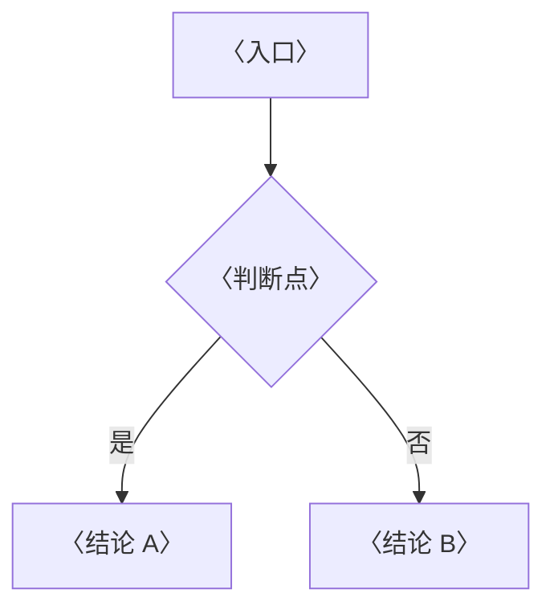

---
tags:
  - Linux
  - 笔记模板
created: 2026-09-16
---

# 笔记模板

> [!info] 使用说明（复制成新笔记后删掉本节）
> 1. 复制本文件，重命名为 `NN_主题.md`，`NN` 与 [[00_学习大纲|00_学习大纲]] 里的阶段编号保持一致。
> 2. 在 [[00_学习大纲|00_学习大纲]] 对应阶段下补上「对应笔记」链接和 checklist 条目。
> 3. 按下面的骨架填写。`<!-- -->` 里的提示只在编辑视图可见，写完可以整段删掉。
> 4. 定稿前对照文末的「自检清单」逐条过一遍。

> 本笔记对应 [[00_学习大纲|Linux 大纲]] 的「阶段 N」。目标：〈用一句话说清学完能讲明白什么〉。
>
> 关联复习：[[00_学习大纲|00_学习大纲]]
>
> 说明：本笔记的命令、默认值与行为均以 man 页和发行版官方文档为准；**凡涉及默认值、内核版本差异与发行版差异（RHEL 系 / Debian 系）的地方，都标注适用版本与发行版**，并写明是在哪台实验机上验证过。

## 0. 30 秒速览

<!-- 全篇最重要的一块。3~6 条，只写结论和关键数字，不写推导过程。复习时只看这里。
     每条的写法：结论 + 一个可复现的证据。示例：「负载高不等于 CPU 忙，Linux 的 load 把 D 状态进程也算进去；判据是 vmstat 的 b 列和 wa 是否同步上升。」 -->

> [!abstract] 这一页只要记住 N 句话
> - **〈一句话结论〉**：〈补一条命令或一个数字〉。
> - **〈边界或反直觉点〉**：〈什么情况下直觉会出错〉。
> - **〈生产默认值〉**：〈绝大多数场景该怎么配〉。

## 1. 概念

<!-- 三层结构的第一层：讲清「是什么、为什么这样设计」。
     凡是流程、时序、判定分支，优先画图而不是写长段落：
       启动链与数据流用 flowchart；两侧按时间交互用 sequenceDiagram；二选一分流用决策树。
     一篇 1~2 张图，每张只回答一个问题。 -->

### 1.1 〈小节标题〉

| 〈维度〉 | 〈说明〉 |
| --- | --- |
| 〈A〉 | 〈B〉 |



### 1.2 〈小节标题〉

> [!important] 〈最容易被追问倒的一句话〉
> 〈一句话把结论说死，再补一句为什么〉。

## 2. 生产实践

<!-- 三层结构的第二层：从「知道」落到「能选、能配、能防坑」。 -->

### 2.1 环境与版本基线

- 发行版与版本、内核版本（`uname -r`）、systemd 版本、cgroup 版本（v1/v2）
- 〈本主题还需要固定哪些配置、默认值与硬件信息〉

### 2.2 常见坑

<!-- 用「误解 / 只做一半 → 事实或后果」的对照，比并列 bullet 好记。 -->

| 常见做法或说法 | 后果或事实 |
| --- | --- |
| 〈只做了一半的操作〉 | 〈会出现什么后果〉 |
| 〈常见误解〉 | 〈事实是什么〉 |

## 3. 排障速查

<!-- 排障类内容统一走「现象 → 分层 → 证据 → 根因 → 处理方向」。
     先给一句「第一反应不要是什么」，再给排查顺序，最后附上关键命令与输出长什么样。 -->

### 3.1 〈现象，例如：服务起不来但没有任何报错〉

> [!tip] 第一反应不要是〈错误的第一反应〉
> 〈一句话解释这个现象真正的含义〉。

按下面顺序排除：

1. **〈原因一〉**：〈判断依据与命令〉。
2. **〈原因二〉**：〈判断依据与命令〉。

```text
〈命令〉        # 〈这一步在验证什么〉
```

## 4. 动手验证（可选）

<!-- 可运行示例优先就近放在相关小节里；需要把多个实验串成一套端到端演练时，才单独用这一节。
     每条命令都要给出「验证什么」和「预期输出」，否则半年后自己看不懂。 -->

> [!example]- 动手验证：〈这个实验证明什么〉
> ```text
> 〈命令〉
> # 预期输出 〈期望值〉
> ```
> 环境：〈发行版 / 内核版本 / cgroup 版本〉；动手前先给实验机打快照，破坏性步骤只在这里做

## 5. 要点自测

<!-- 三层结构的第三层：一张卡一个问题，答案分点写。
     能盖住答案在 3~5 分钟内脱稿讲完才算过关；这些卡片也可以直接拿去做间隔重复。 -->

> [!question]- 〈这一篇最核心的问题是什么〉
> - **判定 / 定义**：〈把规则说死〉
> - **影响什么**：〈列出实际作用面〉
> - **不影响什么**：〈纠正最常见的误解〉
> - **落点**：〈生产上怎么用〉
> - **第一反应不要是什么**：〈最容易犯错的那个动作〉

> [!question]- 〈第二个问题〉
> 〈分点回答〉。

## 6. 回到路线图

完成本笔记后，回到 [[00_学习大纲|00_学习大纲]]：

- [ ] 〈能讲清……〉
- [ ] 〈能区分……〉
- [ ] 〈能在这台实验机上复现并定位……〉

> 推荐扩展阅读：〈发行版官方文档或 man 页中的页面标题〉

## 自检清单

<!-- 本模板自带的检查项，正式笔记定稿后可以删掉本节。 -->

- [ ] frontmatter 有 `tags` 和 `created`，全篇只有一个 `#` 标题
- [ ] 速览卡不超过 6 条，每条都是结论 + 可复现的证据
- [ ] 每条命令都附了「验证什么」与预期输出，并在真实实验机上跑过
- [ ] 涉及默认值、内核行为或版本差异的地方都标注了适用版本与发行版
- [ ] 数字都带单位（毫秒、MB/s、次/秒），并注明测试环境与压力条件
- [ ] 破坏性实验（打满磁盘、触发 panic、改坏 fstab）只在实验机做，且动手前有快照
- [ ] 涉及时间的地方写明了时区与时间同步前提
- [ ] 每张 Mermaid 图都在 Obsidian 里预览过，能正常渲染
- [ ] 所有跨笔记引用都用 wikilink 写法；跨目录引用用路径写法，且都指向存在的笔记
- [ ] [[00_学习大纲|00_学习大纲]] 里已补上对应阶段的 checklist 与链接
